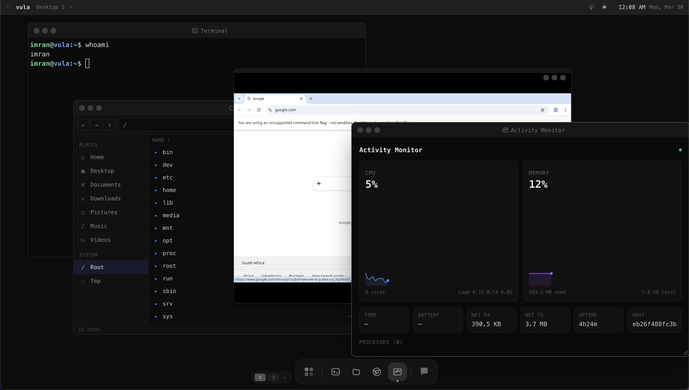
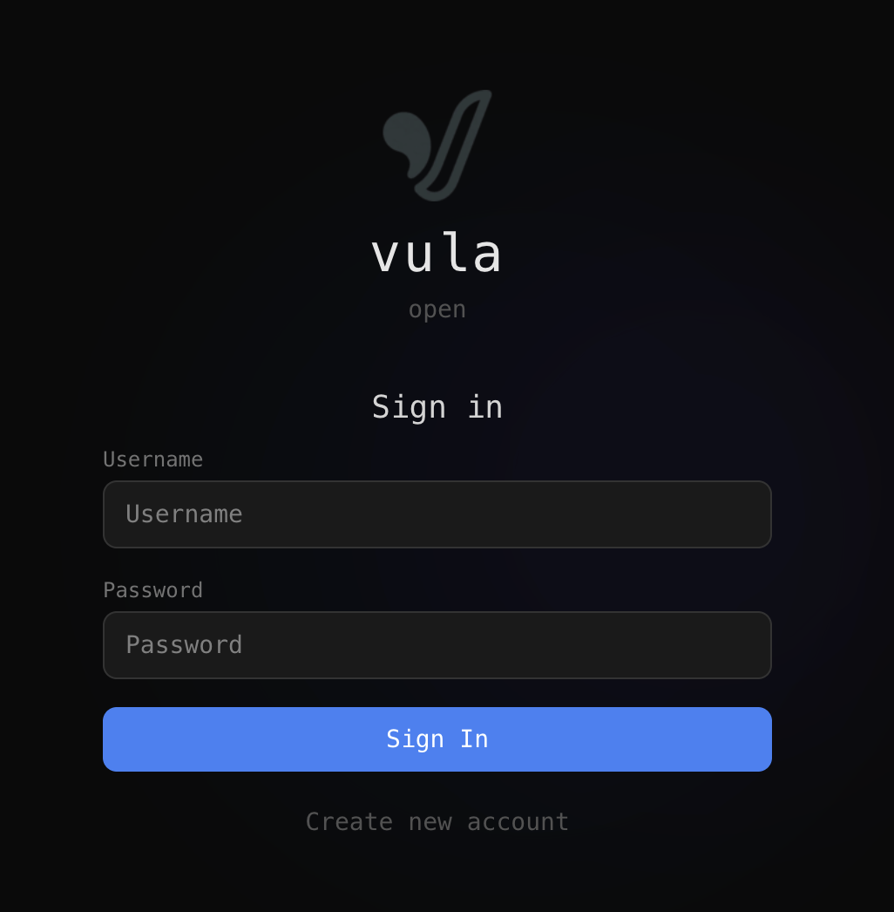
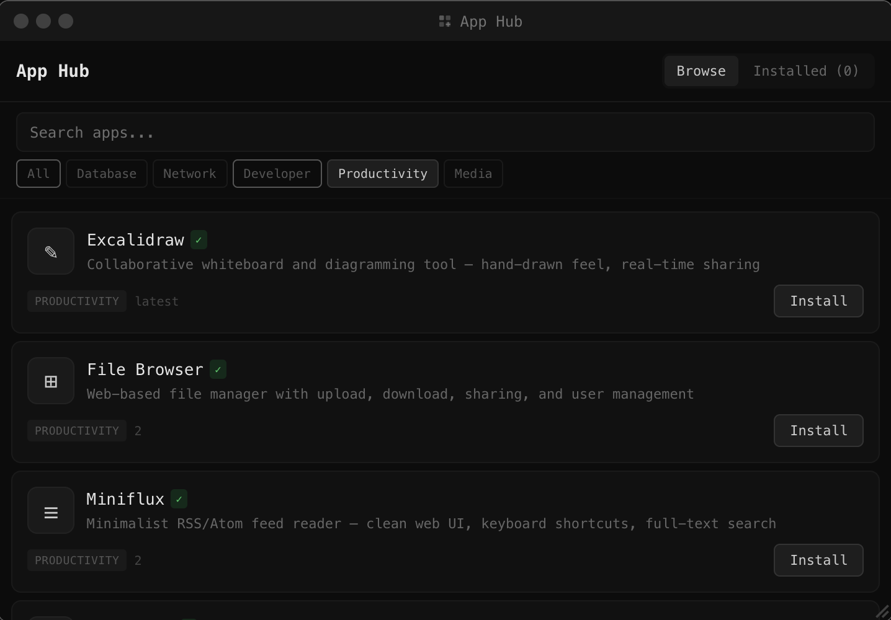

<p align="center">
  
</p>

<h1 align="center">Vula OS</h1>

<p align="center">
  <strong>An open-source web desktop environment and operating system built on Debian Linux — a modern alternative to OS.js.</strong><br/>
  <em>"Vula" is isiZulu for "open".</em>
</p>

<p align="center">
  <a href="https://github.com/vul-os/vulos/actions/workflows/ci.yml"></a>
  <a href="https://github.com/vul-os/vulos/actions/workflows/release.yml"></a>
  <a href="https://github.com/vul-os/vulos/releases"></a>
  <a href="https://github.com/vul-os/vulos/blob/main/LICENSE"></a>
</p>

<p align="center">
  <a href="#install">Install</a> &middot;
  <a href="#features">Features</a> &middot;
  <a href="#development">Development</a> &middot;
  <a href="#contributing">Contributing</a> &middot;
  <a href="#license">License</a>
</p>

> **Alpha Software** — Under active development. Not recommended for production use yet.

<p align="center">
  
</p>

---

## Install

### Bare metal

Download, flash, boot — like Ubuntu.

| Platform | File | Devices |
|----------|------|---------|
| **x86_64** | `vulos-vX.X.X-x86_64.img.gz` | PC, laptop, server |
| **ARM64** | `vulos-vX.X.X-arm64.img.gz` | Raspberry Pi, Pine64, Rock64 |

```bash
gunzip -c vulos-vX.X.X-x86_64.img.gz | sudo dd of=/dev/sdX bs=4M status=progress
```

Or use [Balena Etcher](https://etcher.balena.io/) — drag and drop the `.img.gz` file.

### Docker

Try without installing:

```bash
docker run -p 8080:8080 --shm-size=1g -v vulos-data:/root/.vulos ghcr.io/vul-os/vulos:latest
```

Open **http://localhost:8080**.

#### GPU-accelerated streaming

Vula OS auto-detects GPU hardware at startup and selects the best video encoder for remote browser and app streaming.

**Tier 0 — No GPU (always works):**

```bash
docker run -p 8080:8080 --shm-size=1g vulos
```

Software VP8 encode, ~30fps. Good for VPS/containers without GPU passthrough.

**Tier 1 — Intel/AMD (VA-API):**

```bash
docker run --device /dev/dri -p 8080:8080 --shm-size=1g vulos
```

Hardware H.264/AV1 encode via VA-API, 60fps, <2ms latency. Works with any Intel iGPU (2012+) or AMD GPU with Mesa drivers. Zero setup — just pass `/dev/dri`.

**Tier 2 — NVIDIA (NVENC):**

```bash
docker run --gpus all -p 8080:8080 --shm-size=1g vulos
```

Hardware H.264/AV1 encode via NVENC, 60-120fps, <1ms latency. Requires [NVIDIA Container Toolkit](#nvidia-container-toolkit) on the host.

---

### NVIDIA Container Toolkit

Required for `--gpus all` to work with Docker.

**Ubuntu/Debian:**

```bash
# Add NVIDIA package repository
curl -fsSL https://nvidia.github.io/libnvidia-container/gpgkey | sudo gpg --dearmor -o /usr/share/keyrings/nvidia-container-toolkit-keyring.gpg
curl -s -L https://nvidia.github.io/libnvidia-container/stable/deb/nvidia-container-toolkit.list | \
  sed 's#deb https://#deb [signed-by=/usr/share/keyrings/nvidia-container-toolkit-keyring.gpg] https://#g' | \
  sudo tee /etc/apt/sources.list.d/nvidia-container-toolkit.list

# Install
sudo apt-get update && sudo apt-get install -y nvidia-container-toolkit

# Configure Docker runtime
sudo nvidia-ctk runtime configure --runtime=docker
sudo systemctl restart docker

# Verify
docker run --rm --gpus all nvidia/cuda:12.6.0-base-ubuntu24.04 nvidia-smi
```

**Fedora/RHEL:**

```bash
curl -s -L https://nvidia.github.io/libnvidia-container/stable/rpm/nvidia-container-toolkit.repo | \
  sudo tee /etc/yum.repos.d/nvidia-container-toolkit.repo
sudo dnf install -y nvidia-container-toolkit
sudo nvidia-ctk runtime configure --runtime=docker
sudo systemctl restart docker
```

**Arch Linux:**

```bash
sudo pacman -S nvidia-container-toolkit
sudo nvidia-ctk runtime configure --runtime=docker
sudo systemctl restart docker
```

Once installed, `docker run --gpus all` passes the GPU into the container and Vula OS auto-detects NVENC at startup.

---

## Features

- **Desktop Shell** — Full browser-based desktop with window manager, dock, launchpad, multi-desktop, and screensaver
- **Terminal** — Persistent PTY sessions with detach/reattach — a web shell you can use from anywhere
- **Chromium Browser** — Remote browser streamed via WebRTC
- **File Manager** — Browse, upload, download, manage files
- **AI Assistant** — Pluggable backend (Ollama, OpenAI, Anthropic) with sandboxed code execution
- **App Hub** — Install apps from the registry
- **Auth & Security** — Multi-user, OAuth, sessions, rate limiting
- **Remote Desktop** — Built-in tunneling for self-hosted cloud desktop access from any device
- **Mobile Ready** — Responsive design works on phones and tablets

<p align="center">
  
</p>

### Tech Stack

| Layer | Technology |
|-------|-----------|
| Frontend | React 19, Tailwind CSS 4, Vite 8, xterm.js |
| Backend | Go (24 services, 110+ API endpoints) |
| Apps | Python/HTML apps with JSON manifests |
| Infrastructure | Debian Linux, Docker, Chromium, GStreamer |

<p align="center">
  
</p>

---

## Development

```bash
git clone https://github.com/vul-os/vulos.git
cd vulos

./dev.sh                # Local dev — Go + Vite HMR (localhost:5173)
./dev.sh deploy         # Full Docker build (localhost:8080)
./dev.sh deploy quick   # Quick rebuild into running container
```

### Configuration

All config lives in `.env` at the repo root:

```
PORT=8080
APP_URL=http://localhost:8080
LANDING_PORT=3000
LANDING_URL=http://localhost:3000
```

### Project Structure

```
vulos/
├── src/                  # React frontend
│   ├── auth/             #   Login, setup, lock screen
│   ├── builtin/          #   Terminal, files, browser, activity monitor, etc.
│   ├── core/             #   Settings, app registry, telemetry
│   ├── layouts/          #   Desktop and mobile layouts
│   └── shell/            #   Window manager, dock, launchpad
├── backend/              # Go backend (24 services)
├── apps/                 # Plugin apps with JSON manifests
├── landing/              # Landing page & docs (separate server)
├── dev.sh                # Dev and deploy script
└── build.sh              # Bare-metal image builder
```

---

## Releases

Each release produces:

- **System images** — `vulos-vX.X.X-x86_64.img.gz` and `vulos-vX.X.X-arm64.img.gz` for bare metal
- **Docker images** — `ghcr.io/vul-os/vulos:latest` for `linux/amd64` and `linux/arm64`

```bash
git tag v0.1.0 && git push origin v0.1.0
```

Download from the [Releases](https://github.com/vul-os/vulos/releases) page.

---

## Contributing

1. Fork and clone
2. `./dev.sh` to run locally
3. Create a branch (`feat/`, `fix/`, `docs/`, `refactor/`)
4. Open a PR

See [DEVELOPMENT.md](DEVELOPMENT.md) for detailed setup.

---

## License

MIT

---

**See also:** [OS.js](https://www.os-js.org/) — a pioneering web desktop project that helped define the space. Vula OS is an independent, self-hosted, open-source online operating system — but we respect the groundwork OS.js laid for the browser desktop environment.

<p align="center">
  <br/>
  <br/>
  <em>Built with purpose. Open by design.</em>
</p>
