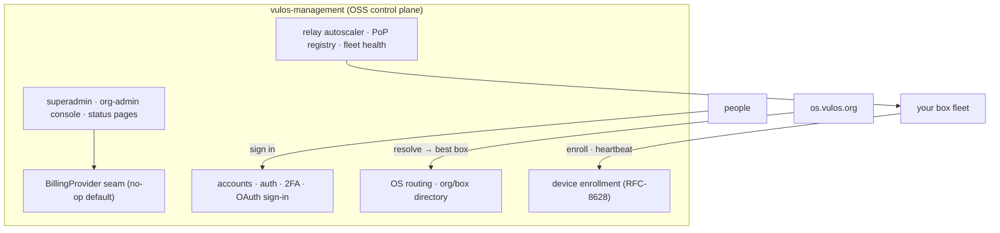

<div align="center">

# Vulos Management

### The open-source control plane for a sovereign compute fleet.

Run your own Vulos: accounts, OS routing, relay autoscaling, and a hardened
superadmin console — all in one self-hostable control plane. **Billing is a
pluggable seam with a no-op default, so self-hosting is fully functional and
free.**

[](LICENSE)
[](https://golang.org)
[](docs/)

[**Quickstart**](#quickstart-self-host) · [**Architecture**](docs/ARCHITECTURE.md) · [**Self-host**](docs/SELF-HOST.md) · [**Deploy the CP**](docs/DEPLOY-CP.md) · [**Deploy a relay**](docs/DEPLOY-RELAY.md) · [**Superadmin**](docs/SUPERADMIN-CONSOLE.md)

</div>

---

## What it is

**Vulos Management is the complete operational control plane and admin console
for a Vulos deployment — everything you need to run a sovereign compute fleet,
with no billing and no phone-home.**

It is the brain that sits in front of your boxes: it authenticates people,
enrolls devices, points `os.vulos.org` at the best box in your cluster, keeps
the relay point-of-presence (PoP) fleet healthy and autoscaled, and gives an
operator a hardened console to see and steer all of it. Self-host it and you own
your entire deployment — the same code we run in production, minus the parts that
exist only because we charge money.

Billing is deliberately **not** in this repo. Instead there is a
`BillingProvider` seam with a **no-op default**: every metered event is still
recorded, but nothing is ever charged and nothing is sent off your box. If you
want commercial billing you wire a provider into that seam — see
[the two-repo model](#the-two-repo-model) below.

## The two-repo model

Vulos is split into two repositories along a single, honest line — **if a
self-hoster needs it to run their deployment, it lives here (OSS); if it exists
only because we charge money, it lives in the private cloud repo.**

| | **vulos-management** (this repo) | **vulos-cloud** (private) |
|---|---|---|
| **License** | MIT, open source | Proprietary |
| **Purpose** | The complete operational control plane anyone can self-host | The commercial layer only |
| **Contains** | Accounts, auth, 2FA, OAuth sign-in, device enrollment (RFC-8628), OS routing + org/box directory, relay autoscaler + PoP registry/heartbeats + fleet health, superadmin + org-admin console, status pages | The real billing provider (Paystack), commercial pricing, billing-only superadmin panels, the hosted marketing site |
| **Billing** | `BillingProvider` seam with a **no-op default** (metered but free, no phone-home) | Injects a Paystack-backed `BillingProvider` into that seam at wire-time |
| **Relationship** | Stands alone, fully functional | `require`s and `replace`s this repo as a library, then adds billing |

vulos-cloud imports vulos-management as a Go library and injects billing at the
composition root. There is no forked control plane — the OSS control plane *is*
the production control plane; cloud only adds a billing provider and commercial
panels on top. See [`docs/ARCHITECTURE.md`](docs/ARCHITECTURE.md).

## Features

| | |
|---|---|
| 🔐 **Accounts & auth** | Registration, sign-in, sessions, TOTP 2FA, WebAuthn hardware keys, and linked OAuth sign-in (Google / Microsoft → one Vulos account). Password auth via OPAQUE; login tokens kept separate from data tokens. |
| 📱 **Device enrollment** | RFC-8628 device-authorization flow so a box or a headless device can enroll against your control plane and mint short-lived, audience-bound tokens. |
| 🧭 **OS routing & directory** | `os.vulos.org` resolves to the best box in your cluster; the org/box directory tracks who owns what and where it runs. Region-aware placement preview. |
| 📡 **Relay autoscaler & PoP fleet** | A PoP registry with 15s heartbeats and health flags, RELAY-07 failover routing that excludes unhealthy PoPs, and an autoscaler + serving pool that grows/shrinks the fleet against a provider registry. |
| 🖥️ **Superadmin console** | Server-rendered, no-JS-framework, triple-gated (IP allowlist + session + WebAuthn admin session), CSRF-protected, audit-logged operator surface for accounts, orgs, fleet, relay, incidents, and reserved handles. |
| 👥 **Org-admin console** | Per-organization administration for org owners — members, boxes, and settings scoped to their org. |
| 🟢 **Status pages** | A public status/incidents surface plus per-user status, authored from the superadmin incidents page over the same store. |
| 💳 **BillingProvider seam** | A pluggable seam with a **no-op default** — metered but free. Self-hosting never phones home; commercial billing is injected only in the private cloud build. |

## Quickstart (self-host)

> **Prerequisites:** Go 1.26+, and (optionally) Postgres. Self-host runs on
> SQLite out of the box; the cloud pricing tables that Postgres carries are
> simply absent, so every metered path is free.

The fastest way to see the whole suite — Workspace front door, the OS as your
local control plane, mail, office, board, talk, meet, and a private-AI gateway —
is the sovereign `docker compose` stack documented in
[**docs/SELF-HOST.md**](docs/SELF-HOST.md):

```sh
docker compose -f docker-compose.sovereign.yml up --build
# then open http://localhost:8088
```

To run the control plane itself:

```sh
# build
make build            # produces ./bin/cp (or: go build ./cmd/server)

# run — leave VULOS_CP_URL unset for a fully sovereign, billing-free deployment
./bin/cp --env=dev
```

The single most important decision for a sovereign deployment: **leave
`VULOS_CP_URL` unset.** That one absence makes the box its own identity
authority, uses BYO-OAuth, and mints tokens locally — no managed layer, nothing
to pay. See [docs/SELF-HOST.md](docs/SELF-HOST.md) for the full env surface, and
[docs/DEPLOY-CP.md](docs/DEPLOY-CP.md) / [docs/DEPLOY-RELAY.md](docs/DEPLOY-RELAY.md)
for a production, internet-reachable deployment.

## Architecture

Vulos Management is a Go control plane (single module) with a hardened,
server-rendered admin console and a small SPA console surface. The domain is
organized as independent packages behind a composition root:


```mermaid
flowchart TD
    subgraph mgmt["vulos-management (OSS control plane)"]
        auth["accounts · auth · 2FA · OAuth sign-in"]
        enroll["device enrollment (RFC-8628)"]
        routing["OS routing · org/box directory"]
        relay["relay autoscaler · PoP registry · fleet health"]
        admin["superadmin · org-admin console · status pages"]
        seam["BillingProvider seam (no-op default)"]
    end
    boxes["your box fleet"] -->|enroll · heartbeat| enroll
    users["people"] -->|sign in| auth
    dns["os.vulos.org"] -->|resolve → best box| routing
    admin --> seam
    relay --> boxes
```

The `BillingProvider` seam is the one intentional hole: the OSS build fills it
with a no-op (metered-but-free) provider; the private cloud build fills it with
a Paystack-backed provider. Everything else is identical. Full detail —
including the Go module strategy that lets cloud consume this repo — is in
[**docs/ARCHITECTURE.md**](docs/ARCHITECTURE.md).

## The BillingProvider seam (free by default)

Self-hosting is **metered but free**. The control plane still records every
billable event (storage sampled, relay GB, mailboxes, box-hours) so operators
can see usage — but the default provider is a **no-op**: it charges nothing,
verifies nothing, and never makes a network call off your box.

- **Self-host (default):** no billing provider wired → usage is recorded and
  visible, but nobody is ever charged and there is no phone-home.
- **Commercial (private cloud build only):** a Paystack-backed provider is
  injected into the same seam at the composition root, adding real recurring +
  overage charging and commercial pricing.

The seam is the same interface in both builds; only the injected implementation
differs. See [docs/ARCHITECTURE.md](docs/ARCHITECTURE.md#the-billingprovider-seam).

## Documentation

| | |
|---|---|
| [Architecture](docs/ARCHITECTURE.md) | The two-repo split, the BillingProvider seam, and how vulos-cloud consumes this repo |
| [Self-host](docs/SELF-HOST.md) | Run the whole suite on your own box with `docker compose`, sovereign mode |
| [Deploy the control plane](docs/DEPLOY-CP.md) | Production, internet-reachable control-plane deployment checklist |
| [Deploy a relay PoP](docs/DEPLOY-RELAY.md) | Multi-region relay point-of-presence deployment |
| [Superadmin console](docs/SUPERADMIN-CONSOLE.md) | The hardened operator surface — gates, pages, provider registry, audit |

## Contributing

Issues and pull requests are welcome. Keep the two-repo line honest: anything a
self-hoster needs to run their deployment belongs here; anything that exists only
because we charge money belongs in the private cloud repo. Please don't add a
hard dependency on a payment processor to any package in this module — route it
through the `BillingProvider` seam instead.

## License

[MIT](LICENSE) — free to use, modify, and distribute.

---

<sub><strong>Vula OS</strong> · Built with purpose. Open by design.</sub>
