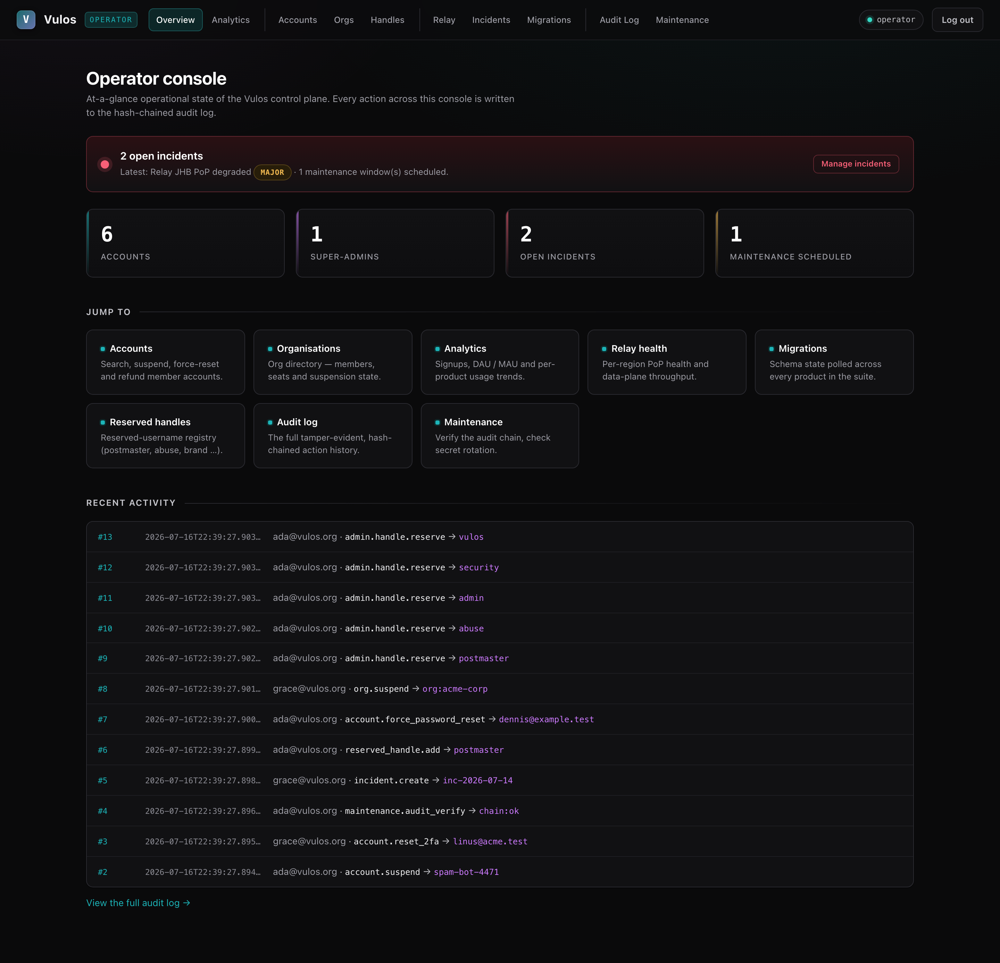
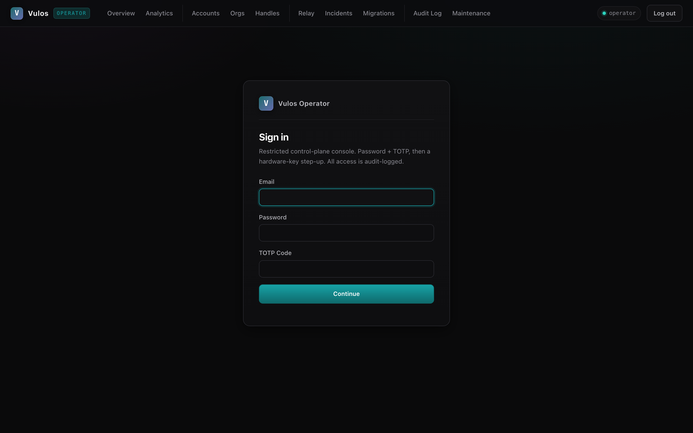
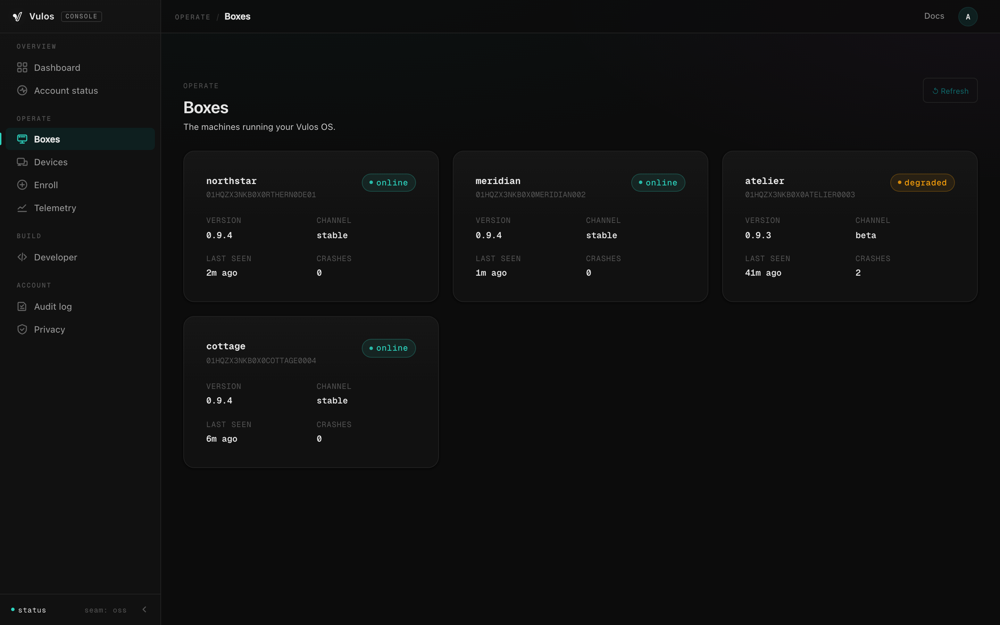
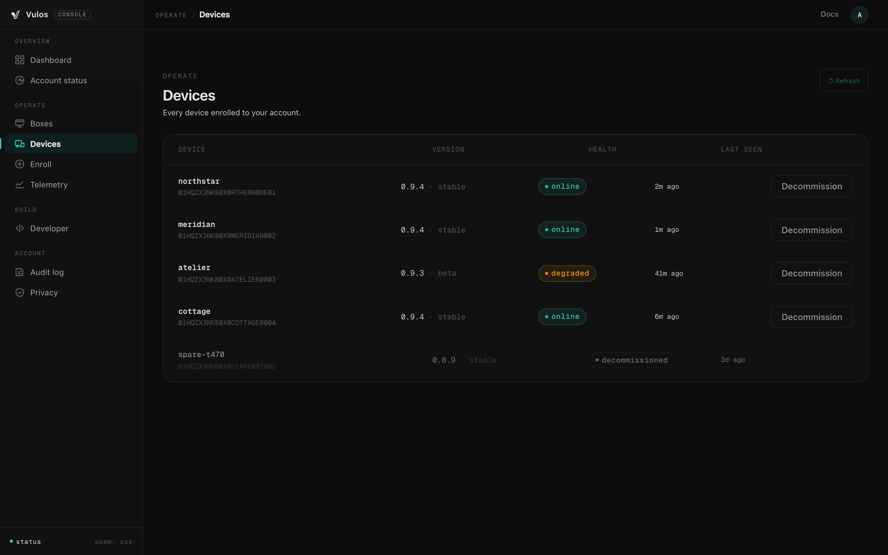
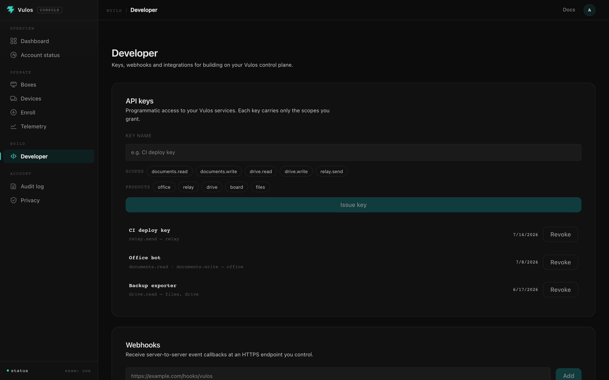
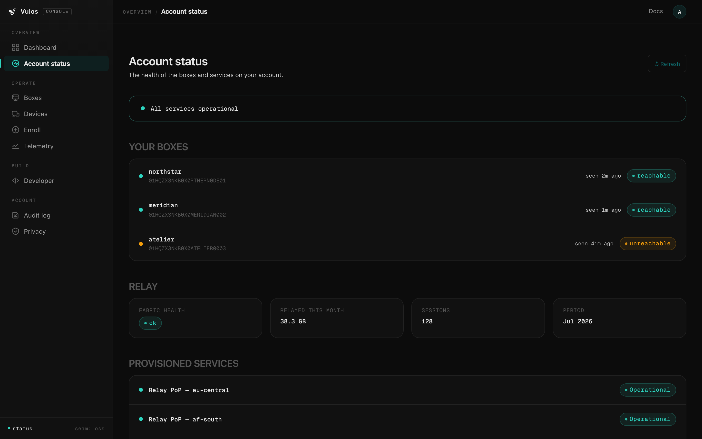
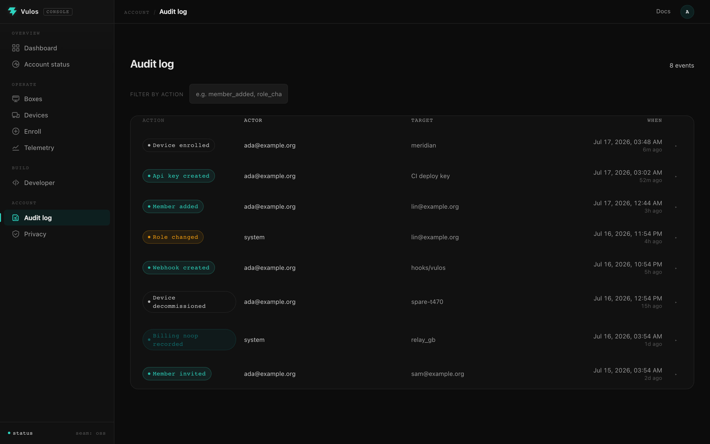
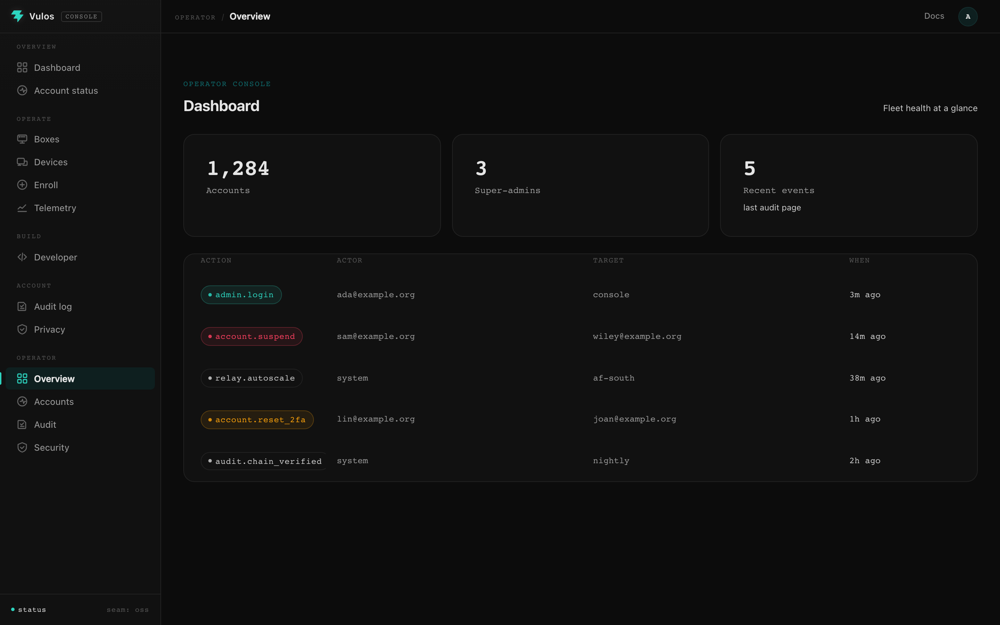
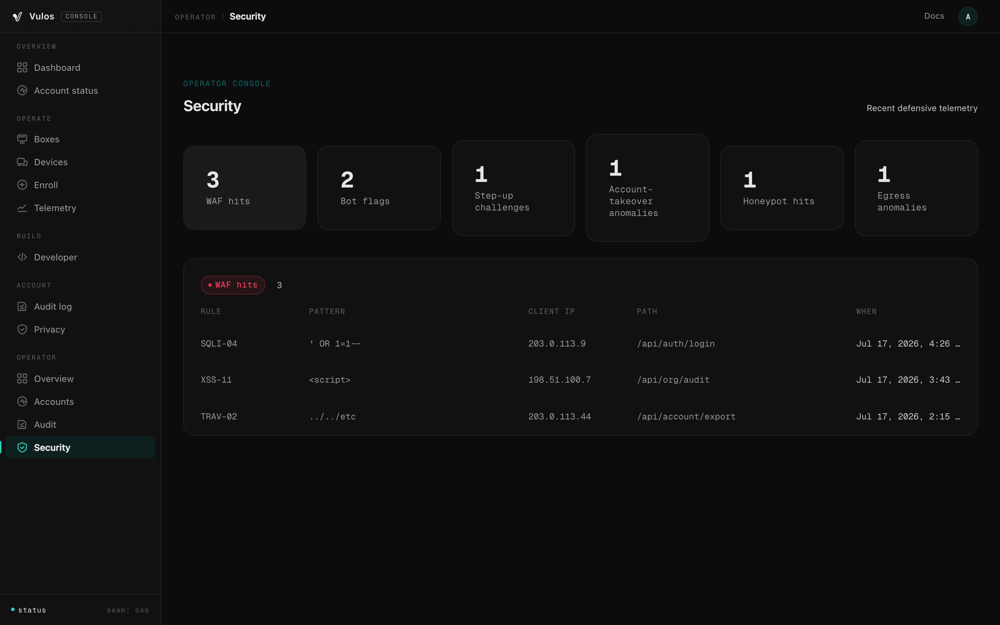
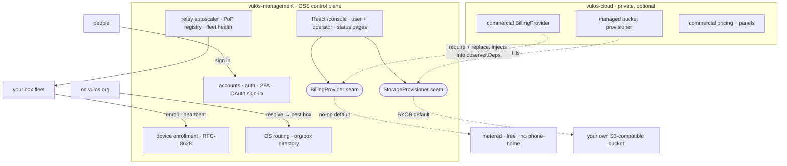

<div align="center">

<picture>
  <source media="(prefers-color-scheme: dark)" srcset="assets/vulos-logo-dark.svg">
  
</picture>

# Vulos Management

### The open-source control plane for a sovereign compute fleet.

Run your own Vulos: **accounts, OS routing, relay autoscaling, and a hardened
admin console** — one self-hostable control plane. Billing is a pluggable
seam with a no-op default, so **self-hosting is fully functional and free.**

[](LICENSE-MIT)
[](https://golang.org)
[](docs/SELF-HOST.md)
[](docs/)
[](CHANGELOG.md)

[**Quickstart**](#quickstart-self-host) · [**Architecture**](docs/ARCHITECTURE.md) · [**Self-host**](docs/SELF-HOST.md) · [**Admin console**](docs/ADMIN-CONSOLE.md)

</div>

---

## What it is

**Vulos Management is the complete operational control plane and admin console
for a Vulos deployment — everything you need to run a sovereign compute fleet,
with no billing and no phone-home.**

It's the brain in front of your boxes: it authenticates people, enrolls devices,
points `os.vulos.org` at the best box in your cluster, keeps the relay
point-of-presence (PoP) fleet healthy and autoscaled, and gives an operator a
hardened console to see and steer all of it. Self-host it and you own your entire
deployment — the same control-plane code we run in production, minus the parts
that exist only because we charge money.

> **Self-hosting is free. The cloud is optional.**
> Billing lives behind a seam with a **no-op default**: every metered event is
> still recorded and visible, but nothing is ever charged and nothing leaves your
> box. Want commercial billing? The private `vulos-cloud` layer injects a real
> provider into that same seam — see [the two-repo model](#the-two-repo-model).

## The console

Vulos Management ships its own **React console SPA** — the *Vulos Workspace*: one
app that carries **sign-in + onboarding**, the **user console** (your fleet,
devices, telemetry, developer keys, audit trail and privacy tools) and the gated
**operator (admin) console**. The Go binary embeds the built bundle and
serves it at **`/console`**; it talks to the same `pkg/cproutes` JSON APIs the
control plane exposes. Billing lives behind a build-time seam — in this OSS build
`@vulos/commercial-seam` resolves to a **NoOp**, so **a self-hoster never sees a
Pay button** (the private cloud build injects the real billing UI into the same
slots). Every image below is that real SPA, driven headlessly with a bank of
**fabricated** demo data — no backend is run and no real data is touched.
Regenerate with **`make screenshots`** (see [below](#regenerating-the-screenshots)).

<div align="center">



<em>The console cockpit — fleet + relay stat tiles, quick actions and the recent-activity feed. No billing surfaces: the OSS build runs the NoOp commercial seam.</em>

</div>

| | |
|:---:|:---:|
| <br/><sub><b>Sign in</b> — one Vulos account for the OS, apps and console: password, optional passkey, and social sign-in when configured</sub> | <br/><sub><b>Boxes</b> — the machines running your Vulos OS: version, channel, health and last-seen as a card grid</sub> |
| <br/><sub><b>Devices</b> — every enrolled device as a table, with health pills and a decommission action</sub> | <br/><sub><b>Developer</b> — issue scoped API keys, register webhooks and (soon) MCP servers</sub> |
| <br/><sub><b>Account status</b> — box reachability, relay usage/health, provisioned services and recent events</sub> | <br/><sub><b>Audit log</b> — who did what in your org: expandable, tamper-evident, actor/action filters</sub> |
| <br/><sub><b>Operator — Dashboard</b> — account / admin counts over the most recent platform audit rows</sub> | <br/><sub><b>Operator — Security</b> — WAF hits, bot flags, step-up, ATO, honeypot and egress telemetry</sub> |

<sub>The full gallery (enroll, telemetry, privacy, operator accounts & audit) lives in
[`docs/assets/screenshots/`](docs/assets/screenshots/). The console ships a single deliberate dark
"instrument-panel" theme — sans for UI prose, mono strictly for data.</sub>

## Features

Everything below ships as Go packages in this repo. The self-host binary
(`cmd/server`) wires a growing subset of it by default today — see
[**What's wired in today**](docs/SELF-HOST.md#whats-wired-in-today) for the
exact split, or build your own thin `main` against `pkg/cpserver` (the same way
`vulos-cloud` does) to mount whichever route groups you need right now.

| | |
|---|---|
| 🔐 **Accounts & auth** | Registration, sessions, TOTP 2FA, WebAuthn hardware keys, and linked OAuth sign-in (Google / Microsoft → one Vulos account). Password auth via OPAQUE; login tokens kept separate from data tokens. |
| 📱 **Device enrollment** | RFC-8628 device-authorization flow so a box or headless device enrolls against your control plane and mints short-lived, audience-bound tokens. |
| 🧭 **OS routing & directory** | `os.vulos.org` resolves to the best box in your cluster; the org/box directory tracks who owns what and where it runs, with region-aware placement preview. |
| 📡 **Relay autoscaler & PoP fleet** | A PoP registry with 15s heartbeats and health flags, failover routing that excludes unhealthy PoPs, and an autoscaler + serving pool that grows and shrinks the fleet against a provider registry. |
| 🖥️ **React console (`/console`)** | One embedded React SPA — the *Vulos Workspace*: sign-in + onboarding, the **user console** (fleet, devices, telemetry, developer keys, audit trail, privacy), and the **operator (admin) console** (accounts, admin team, platform audit, security telemetry), each page self-gating on the JSON admin API. Instrument-panel dark theme, fully responsive, AA-contrast, focus-visible throughout. |
| 🛡️ **Hardened operator gate** | The operator console is triple-gated (session + admin row + a separate WebAuthn-backed admin session) and CSRF-protected; every action is audit-logged into the tamper-evident, hash-chained trail. Admins can grant/revoke admin access to other accounts from the console (last-admin-protected). |
| 🟢 **Status pages** | A public status/incidents surface plus per-user status, authored over the same store. |
| 🧩 **Pluggable seams** | `BillingProvider` and `StorageProvisioner` (Go) and `@vulos/commercial-seam` (the console SPA) are interfaces/slots with free, no-op / bring-your-own defaults — **a self-hoster never sees a Pay button**. The cloud build injects the commercial implementations at wire-time; the app code is byte-for-byte identical. |

## The two-repo model

Vulos is split into two repositories along one honest line:

> **If a self-hoster needs it to run their deployment → it lives in
> vulos-management (OSS, MIT OR Apache-2.0). If it exists only because we charge money → it
> lives in vulos-cloud (private).**

| | **vulos-management** (this repo) | **vulos-cloud** (private) |
|---|---|---|
| **License** | MIT OR Apache-2.0, open source | Proprietary |
| **Role** | The complete operational control plane anyone can self-host | The commercial layer only |
| **Contains** | Accounts, auth, 2FA, OAuth sign-in, device enrollment, OS routing + org/box directory, relay autoscaler + PoP fleet, the React `/console` (auth + user console + operator admin) with a NoOp billing seam, status pages, the seam interfaces + no-op defaults | A commercial billing provider, commercial pricing/catalog, managed bucket provisioning, the injected billing/usage/invoice console UI, the hosted marketing site |
| **Billing** | `BillingProvider` seam, **no-op default** — metered but free, no phone-home | Injects a commercial `BillingProvider` |
| **Storage** | `StorageProvisioner` seam, **BYOB** — bring your own S3-compatible bucket | Injects a managed bucket auto-provisioner |
| **Relationship** | Stands alone, fully functional | `require`s + `replace`s this repo as a library, then injects the commercial impls |

There is **no forked control plane** — the OSS control plane *is* the production
control plane. vulos-cloud imports it and fills the seams. See
[`docs/ARCHITECTURE.md`](docs/ARCHITECTURE.md).

## Architecture


```mermaid
flowchart TD
    users["people"] -->|sign in| auth
    boxes["your box fleet"] -->|enroll · heartbeat| enroll
    dns["os.vulos.org"] -->|resolve → best box| routing

    subgraph mgmt["vulos-management · OSS control plane"]
        direction TB
        auth["accounts · auth · 2FA · OAuth sign-in"]
        enroll["device enrollment · RFC-8628"]
        routing["OS routing · org/box directory"]
        relay["relay autoscaler · PoP registry · fleet health"]
        admin["React /console · user + operator · status pages"]
        billseam(["BillingProvider seam"])
        storeseam(["StorageProvisioner seam"])
    end

    admin --> billseam
    admin --> storeseam
    relay --> boxes

    billseam -. no-op default .-> free["metered · free · no phone-home"]
    storeseam -. BYOB default .-> byob["your own S3-compatible bucket"]

    subgraph cloud["vulos-cloud · private, optional"]
        direction TB
        billprovider["commercial BillingProvider"]
        bucketprov["managed bucket provisioner"]
        pricing["commercial pricing + panels"]
    end

    cloud -->|require + replace, injects into cpserver.Deps| mgmt
    billprovider -.fills.-> billseam
    bucketprov -.fills.-> storeseam
```

The seams are the only intentional holes. The OSS build fills them with the
no-op billing provider (metered-but-free) and the BYOB storage provisioner (you
supply a bucket). The private cloud build fills the *same* interfaces with a
commercial billing provider and a managed bucket auto-provisioner. **Management
never provisions buckets** — that's a cloud-only concern. Everything else is
identical. Full detail, including the Go module strategy that lets cloud consume
this repo, is in [**docs/ARCHITECTURE.md**](docs/ARCHITECTURE.md).

## Quickstart (self-host)

> **Prerequisites:** Go 1.26+, and (optionally) Postgres. Self-host runs on
> SQLite out of the box; the commercial pricing tables Postgres carries are
> simply absent, so every metered path is free.

Build and run the control plane for local evaluation:

```sh
make dev               # = make build && VULOS_ENV=local ./bin/cp, serves on :8080
```

> **Why not just `./bin/cp`?** The control plane **fails safe to production
> posture** whenever `VULOS_ENV` is unset — that's deliberate (an unconfigured
> box must never silently run with weak secrets), but it means a bare `./bin/cp`
> refuses to start with `SESSION_SECRET is unset in prod`. `make dev` sets
> `VULOS_ENV=local`, which is the one env var that tells it "this is a local
> evaluation, use the dev fallback secret instead of refusing to boot." Use
> `make run` (or set real secrets and `VULOS_ENV=prod`) for anything you'd
> actually deploy — see [**docs/SELF-HOST.md**](docs/SELF-HOST.md#a-note-on-vulos_env).

Then probe it:

```sh
curl -s localhost:8080/healthz   # {"status":"ok"}
curl -s localhost:8080/version   # {"billing_rail":"noop", ...} — self-host never charges
curl -s localhost:8080/readyz    # {"status":"ready"}
```

With no `DATABASE_URL` set, the control plane opens a local SQLite database — a
fully sovereign, billing-free deployment. Point `DATABASE_URL` at Postgres for a
durable production database. The full configuration surface (address, domain,
database, environment) is in [**docs/SELF-HOST.md**](docs/SELF-HOST.md).

> **What's wired in today:** `cmd/server` mounts accounts/auth (sessions, TOTP
> 2FA, WebAuthn, OAuth sign-in), account recovery, developer & LLM API keys,
> mobile push, the DDoS/abuse/security layer, legal pages, the public product
> catalogue, boot endpoints, your own fleet/devices/account/support/compliance
> status, the org-admin console, and the relay-scaling demand API out of the
> box — plus the operator (admin) console, opt-in via
> `VULOS_ENABLE_SUPERADMIN=1`. The rest of the operational surface — **device
> enrollment (RFC-8628), OS routing/DNS/relay/CDN/edge, integrations, the mail
> key directory, cloud-home peering, and storage/files/selection/resolver** — is
> now mounted too, fail-closed, via `registerNetworkOperational`. The only things
> the default binary does NOT mount are the commercial box-billing surface and a
> few library packages with no route handler (`pkg/status`, `pkg/osrouter`,
> `pkg/residency`). See
> [docs/SELF-HOST.md#whats-wired-in-today](docs/SELF-HOST.md#whats-wired-in-today)
> for the exact route-by-route breakdown.

## The seams (free by default)

Self-hosting is **metered but free**, and **bring-your-own-bucket**. The control
plane records every billable event (storage sampled, relay GB, box-hours)
so operators see usage — but the defaults never charge and never
provision anything off your box.

| Seam | Self-host default (OSS) | Cloud build (private) |
|---|---|---|
| `BillingProvider` | **No-op** — records usage, charges nothing, no network call | A commercial billing provider — real recurring + overage charging |
| `StorageProvisioner` | **BYOB** — you point it at your own S3-compatible bucket | A managed provisioner — auto-provisions per-account buckets |

Both builds compile against the same interfaces; only the injected implementation
differs. No package in this repo imports a payment processor or a bucket
provider directly. See [docs/ARCHITECTURE.md](docs/ARCHITECTURE.md#the-billingprovider-seam).

## Documentation

| | |
|---|---|
| [Architecture](docs/ARCHITECTURE.md) | The two-repo split, the `cpserver` builder, the seams, and how vulos-cloud consumes this repo |
| [Self-host](docs/SELF-HOST.md) | Build, configure, and run the control-plane binary on your own host |
| [Admin console](docs/ADMIN-CONSOLE.md) | The hardened operator surface — gates, pages, provider registry, audit |
| [Relay scaling](docs/RELAY-SCALING.md) | The `RelayProvisioner` seam and its OSS providers |
| [Roadmap](ROADMAP.md) | What's shipped, what's next, and what's later for this repo |

### Regenerating the screenshots

The screenshotter lives in [`scripts/screenshots/`](scripts/screenshots/) — an
isolated Node tool (its own `package.json`; not part of the Go module). It serves
the **built React console** (`web/dist`) over a throwaway localhost server and
drives headless Chromium against it, with **every `/api/**` request intercepted
and answered from a bank of fabricated demo data** (a small account, fleet, audit
trail and an operator). The management binary is never run and **no real data is
ever touched**; billing surfaces stay empty because the OSS build resolves the
commercial seam to its NoOp.

```sh
make screenshots           # builds web/dist, then captures → docs/assets/screenshots/*.png
# or, manually (after `npm --prefix web run build`):
cd scripts/screenshots && npm install && npx playwright install chromium
node capture.mjs
```

Requires a built `web/dist` (`npm --prefix web run build`) and Chromium (via Playwright).

### Linting the console

```sh
cd web && npm install && npm run lint
```

`web/eslint.config.js` is a flat config matched to the same tooling used in
`vulos-cloud`/`vulos` (`eslint` + `eslint-plugin-react-hooks` +
`eslint-plugin-react-refresh`). This repo runs **no CI** by design (see
`docs/SELF-HOST.md` / the two-repo model above), so lint is not enforced
automatically anywhere — it's a local/manual check. Current baseline: **0
errors, 4 warnings** (see CHANGELOG "Added" for what those warnings are and
why they're deliberately left as warnings rather than fixed or silenced).

## Contributing

Issues and pull requests are welcome. Keep the two-repo line honest: anything a
self-hoster needs to run their deployment belongs here; anything that exists only
because we charge money belongs in the private cloud repo. Please don't add a
hard dependency on a payment processor or a bucket provider to any package in
this module — route it through the `BillingProvider` / `StorageProvisioner`
seams instead.

## Versioning

This repo follows [Semantic Versioning](https://semver.org) and
[Keep a Changelog](https://keepachangelog.com). The current version is in
[`VERSION`](VERSION); notable changes are in [`CHANGELOG.md`](CHANGELOG.md);
what's next is in [`ROADMAP.md`](ROADMAP.md).

## License

[MIT](LICENSE-MIT) OR [Apache-2.0](LICENSE-APACHE) — © VulOS. Vulos Management
is a VulOS project; source and issues at
[github.com/vul-os/vulos-management](https://github.com/vul-os/vulos-management).

---

<p align="center">
  <a href="https://vulos.org"></a><br>
  <sub><a href="https://vulos.org"><b>vulos</b></a> — open by design</sub>
</p>
