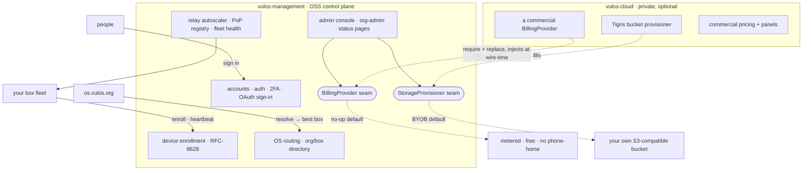

<div align="center">

<picture>
  <source media="(prefers-color-scheme: dark)" srcset="assets/vulos-logo-dark.svg">
  
</picture>

# Vulos Management

### The open-source control plane for a sovereign compute fleet.

Run your own Vulos: **accounts, OS routing, relay autoscaling, and a hardened
admin console** — one self-hostable control plane. Billing is a pluggable
seam with a no-op default, so **self-hosting is fully functional and free.**

[](LICENSE)
[](https://golang.org)
[](docs/SELF-HOST.md)
[](docs/)
[](CHANGELOG.md)

[**Quickstart**](#quickstart-self-host) · [**Architecture**](docs/ARCHITECTURE.md) · [**Self-host**](docs/SELF-HOST.md) · [**Admin console**](docs/ADMIN-CONSOLE.md)

</div>

---

## What it is

**Vulos Management is the complete operational control plane and admin console
for a Vulos deployment — everything you need to run a sovereign compute fleet,
with no billing and no phone-home.**

It's the brain in front of your boxes: it authenticates people, enrolls devices,
points `os.vulos.org` at the best box in your cluster, keeps the relay
point-of-presence (PoP) fleet healthy and autoscaled, and gives an operator a
hardened console to see and steer all of it. Self-host it and you own your entire
deployment — the same control-plane code we run in production, minus the parts
that exist only because we charge money.

> **Self-hosting is free. The cloud is optional.**
> Billing lives behind a seam with a **no-op default**: every metered event is
> still recorded and visible, but nothing is ever charged and nothing leaves your
> box. Want commercial billing? The private `vulos-cloud` layer injects a real
> provider into that same seam — see [the two-repo model](#the-two-repo-model).

## Features

| | |
|---|---|
| 🔐 **Accounts & auth** | Registration, sessions, TOTP 2FA, WebAuthn hardware keys, and linked OAuth sign-in (Google / Microsoft → one Vulos account). Password auth via OPAQUE; login tokens kept separate from data tokens. |
| 📱 **Device enrollment** | RFC-8628 device-authorization flow so a box or headless device enrolls against your control plane and mints short-lived, audience-bound tokens. |
| 🧭 **OS routing & directory** | `os.vulos.org` resolves to the best box in your cluster; the org/box directory tracks who owns what and where it runs, with region-aware placement preview. |
| 📡 **Relay autoscaler & PoP fleet** | A PoP registry with 15s heartbeats and health flags, failover routing that excludes unhealthy PoPs, and an autoscaler + serving pool that grows and shrinks the fleet against a provider registry. |
| 🖥️ **Admin console** | Server-rendered, no-JS-framework, triple-gated (IP allowlist + session + WebAuthn admin session), CSRF-protected, audit-logged operator surface for accounts, orgs, fleet, relay, incidents, and reserved handles. |
| 👥 **Org-admin console** | Per-organization administration for org owners — members, boxes, and settings scoped to a single org. |
| 🟢 **Status pages** | A public status/incidents surface plus per-user status, authored from the admin incidents page over the same store. |
| 🧩 **Pluggable seams** | `BillingProvider` and `StorageProvisioner` are interfaces with free, no-op / bring-your-own defaults. Self-host stays sovereign; the cloud build injects the commercial implementations at wire-time. |

## The two-repo model

Vulos is split into two repositories along one honest line:

> **If a self-hoster needs it to run their deployment → it lives in
> vulos-management (OSS, MIT). If it exists only because we charge money → it
> lives in vulos-cloud (private).**

| | **vulos-management** (this repo) | **vulos-cloud** (private) |
|---|---|---|
| **License** | MIT, open source | Proprietary |
| **Role** | The complete operational control plane anyone can self-host | The commercial layer only |
| **Contains** | Accounts, auth, 2FA, OAuth sign-in, device enrollment, OS routing + org/box directory, relay autoscaler + PoP fleet, admin + org-admin console, status pages, the seam interfaces + no-op defaults | The real billing provider (a commercial provider), commercial pricing, **Tigris bucket provisioning**, billing-only admin panels, the hosted marketing site |
| **Billing** | `BillingProvider` seam, **no-op default** — metered but free, no phone-home | Injects a commercial `BillingProvider` |
| **Storage** | `StorageProvisioner` seam, **BYOB** — bring your own S3-compatible bucket | Injects a Tigris auto-provisioner |
| **Relationship** | Stands alone, fully functional | `require`s + `replace`s this repo as a library, then injects the commercial impls |

There is **no forked control plane** — the OSS control plane *is* the production
control plane. vulos-cloud imports it and fills the seams. See
[`docs/ARCHITECTURE.md`](docs/ARCHITECTURE.md).

## Architecture


```mermaid
flowchart TD
    users["people"] -->|sign in| auth
    boxes["your box fleet"] -->|enroll · heartbeat| enroll
    dns["os.vulos.org"] -->|resolve → best box| routing

    subgraph mgmt["vulos-management · OSS control plane"]
        direction TB
        auth["accounts · auth · 2FA · OAuth sign-in"]
        enroll["device enrollment · RFC-8628"]
        routing["OS routing · org/box directory"]
        relay["relay autoscaler · PoP registry · fleet health"]
        admin["admin console · org-admin · status pages"]
        billseam(["BillingProvider seam"])
        storeseam(["StorageProvisioner seam"])
    end

    admin --> billseam
    admin --> storeseam
    relay --> boxes

    billseam -. no-op default .-> free["metered · free · no phone-home"]
    storeseam -. BYOB default .-> byob["your own S3-compatible bucket"]

    subgraph cloud["vulos-cloud · private, optional"]
        direction TB
        billprovider["a commercial BillingProvider"]
        tigris["Tigris bucket provisioner"]
        pricing["commercial pricing + panels"]
    end

    cloud -->|require + replace, injects at wire-time| mgmt
    billprovider -.fills.-> billseam
    tigris -.fills.-> storeseam
```

The seams are the only intentional holes. The OSS build fills them with the
no-op billing provider (metered-but-free) and the BYOB storage provisioner (you
supply a bucket). The private cloud build fills the *same* interfaces with the
the commercial billing provider and the Tigris auto-provisioner. **Management never provisions
buckets** — that's a Cloud-only concern. Everything else is identical. Full
detail, including the Go module strategy that lets cloud consume this repo, is in
[**docs/ARCHITECTURE.md**](docs/ARCHITECTURE.md).

## Quickstart (self-host)

> **Prerequisites:** Go 1.26+, and (optionally) Postgres. Self-host runs on
> SQLite out of the box; the cloud pricing tables Postgres carries are simply
> absent, so every metered path is free.

The fastest way to see the whole suite — Workspace front door, the OS as your
local control plane, mail, office, board, talk, meet, and a private-AI gateway —
is the sovereign `docker compose` stack in [**docs/SELF-HOST.md**](docs/SELF-HOST.md):

```sh
docker compose -f docker-compose.sovereign.yml up --build
# then open http://localhost:8088
```

To run the control plane itself:

```sh
# build
make build            # produces ./bin/cp  (or: go build ./cmd/server)

# run — leave VULOS_CP_URL unset for a fully sovereign, billing-free deployment
./bin/cp --env=dev
```

The single most important decision for a sovereign deployment: **leave
`VULOS_CP_URL` unset.** That one absence makes the box its own identity
authority, uses BYO-OAuth, and mints tokens locally — no managed layer, nothing
to pay. See [docs/SELF-HOST.md](docs/SELF-HOST.md) for the full env surface, and
[docs/SELF-HOST.md](docs/SELF-HOST.md)
for a production, internet-reachable deployment.

## The seams (free by default)

Self-hosting is **metered but free**, and **bring-your-own-bucket**. The control
plane records every billable event (storage sampled, relay GB, mailboxes,
box-hours) so operators see usage — but the defaults never charge and never
provision anything off your box.

| Seam | Self-host default (OSS) | Cloud build (private) |
|---|---|---|
| `BillingProvider` | **No-op** — records usage, charges nothing, no network call | a commercial billing provider — real recurring + overage charging |
| `StorageProvisioner` | **BYOB** — you point it at your own S3-compatible bucket | Tigris — auto-provisions per-account buckets |

Both builds compile against the same interfaces; only the injected implementation
differs. No package in this repo imports a payment processor or a bucket
provider directly. See [docs/ARCHITECTURE.md](docs/ARCHITECTURE.md#the-billingprovider-seam).

## Screenshots

The admin console is a hardened, server-rendered operator surface (see
[docs/ADMIN-CONSOLE.md](docs/ADMIN-CONSOLE.md) for its pages and access
model). **Console captures will land here once the control-plane code is
extracted into this repo** — until the extracted binary runs standalone we won't
publish placeholder or mocked UI. Until then, the
[architecture diagram](#architecture) above and the docs are the visual tour.

## Documentation

| | |
|---|---|
| [Architecture](docs/ARCHITECTURE.md) | The two-repo split, the seams, and how vulos-cloud consumes this repo |
| [Self-host](docs/SELF-HOST.md) | Run the whole suite on your own box with `docker compose`, sovereign mode |
| [Deploy the control plane](docs/DEPLOY-CP.md) | Production, internet-reachable control-plane deploy checklist |
| [Deploy a relay PoP](docs/DEPLOY-RELAY.md) | Multi-region relay point-of-presence deployment |
| [Admin console](docs/ADMIN-CONSOLE.md) | The hardened operator surface — gates, pages, provider registry, audit |
| [Extraction plan](docs/EXTRACTION-PLAN.md) | How the Go control-plane code moves out of vulos-cloud into this repo |

## Contributing

Issues and pull requests are welcome. Keep the two-repo line honest: anything a
self-hoster needs to run their deployment belongs here; anything that exists only
because we charge money belongs in the private cloud repo. Please don't add a
hard dependency on a payment processor or a bucket provider to any package in
this module — route it through the `BillingProvider` / `StorageProvisioner`
seams instead.

## Versioning

This repo follows [Semantic Versioning](https://semver.org) and
[Keep a Changelog](https://keepachangelog.com). The current version is in
[`VERSION`](VERSION); notable changes are in [`CHANGELOG.md`](CHANGELOG.md).

## License

[MIT](LICENSE) — free to use, modify, and distribute.

---

<div align="center">
<sub><picture><source media="(prefers-color-scheme: dark)" srcset="assets/vulos-logo-dark.svg"></picture> · <strong>Vula OS</strong> — Built with purpose. Open by design.</sub>
</div>
