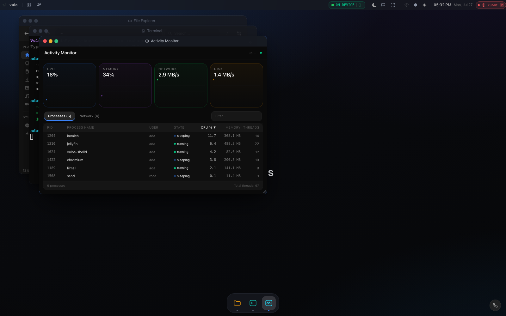
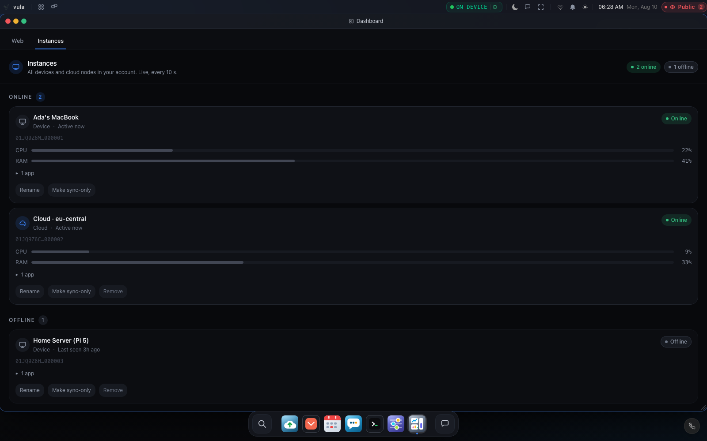
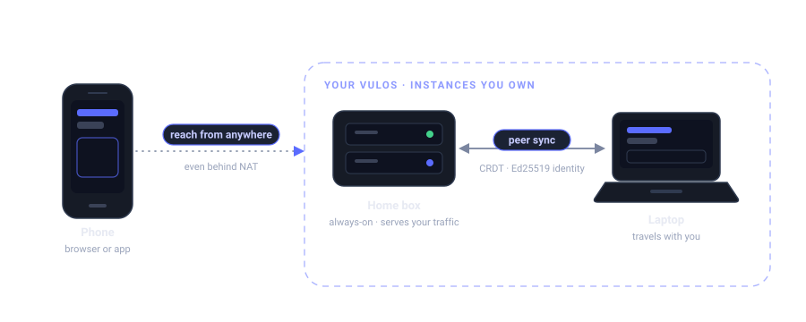
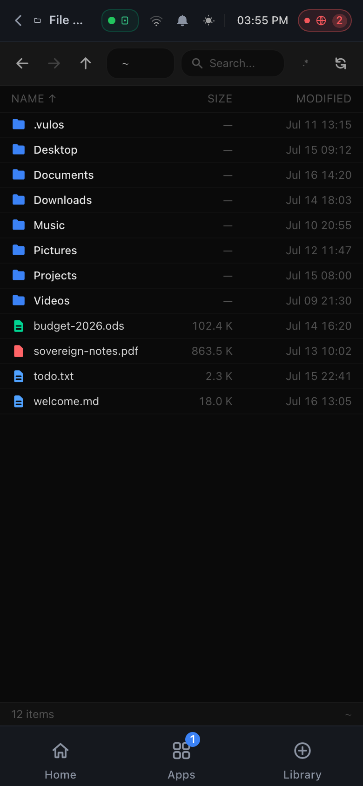
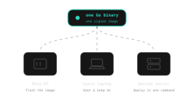

<div align="center">


# Vulos

**Your own personal server, on hardware you own — a full desktop, your files, and private AI, all in one place.**

Your server. Your AI. Your rules.

<p>
  <a href="LICENSE-MIT"></a>
  
  
  
</p>

<picture>
  <source media="(prefers-color-scheme: light)" srcset="docs/screenshots/hero-light.png" />
  
</picture>

</div>

---

## What is Vulos?

Vulos is a **sovereign personal server** — your own computer in the cloud (or in your closet) that you actually own. Open it in any browser and you land on a real desktop: windows, a dock, your files, a calendar, notes, a terminal, apps you install yourself, and an AI assistant that lives on *your* machine.

Nothing here runs on someone else's servers by default. Your data sits on hardware you control, your AI runs through a gateway you own, and there's no third party you have to sign in through to use any of it. The idea isn't secrecy for its own sake — it's **agency**: keeping your inbox, calendar, files, and AI on a machine that answers to you.

It runs the same whether you flash it to a mini-PC, boot it on a spare laptop, or deploy it to a cloud server. One clone, one build, and it's yours.

> *"Vula" is isiZulu for "open."*

---

## A look inside

<table>
  <tr>
    <td width="50%"><br /><sub><b>App hub</b> — install what you want, remove what you don't.</sub></td>
    <td width="50%">
      <picture>
        <source media="(prefers-color-scheme: light)" srcset="docs/screenshots/tiled-light.png" />
        
      </picture>
      <br /><sub><b>Real windowing</b> — drag, snap, and tile just like a native desktop.</sub>
    </td>
  </tr>
  <tr>
    <td width="50%"><br /><sub><b>Terminal</b> — a real shell into the machine you own.</sub></td>
    <td width="50%">
      <picture>
        <source media="(prefers-color-scheme: light)" srcset="docs/screenshots/settings-light.png" />
        
      </picture>
      <br /><sub><b>Settings</b> — appearance, accounts, and system controls in one place.</sub>
    </td>
  </tr>
  <tr>
    <td width="50%">
      <picture>
        <source media="(prefers-color-scheme: light)" srcset="docs/screenshots/files-light.png" />
        
      </picture>
      <br /><sub><b>Files</b> — your storage, with real permissions and sealed sharing.</sub>
    </td>
    <td width="50%"><br /><sub><b>Instances</b> — see and manage every box you own from one view.</sub></td>
  </tr>
</table>

<sub>More screens and a full walkthrough live in the <a href="docs/USER-GUIDE.md">User Guide</a>.</sub>

---

## One person, many instances

Vulos isn't locked to a single machine. Run it on your always-on home box **and** your laptop, and they sync — your apps, settings, and workspace follow you. One instance serves your traffic; the others stay in step. Reach any of them from your phone, whether you're on the couch or across the world.

<div align="center">
<picture>
  <source media="(prefers-color-scheme: light)" srcset="docs/assets/peer-sync-light.svg" />
  
</picture>
</div>

<sub>You own every instance and hold the keys. Instances peer over their own Ed25519 identities and keep state in sync — the app registry syncs across same-LAN nodes today, with broader structured-data sync on the roadmap (see <a href="roadmap/SYNC.md">roadmap/SYNC.md</a>).</sub>

---

## Quickstart

### Run with Docker

The fastest way to try Vulos:

```bash
docker run -d \
  --name vulos \
  -p 8080:8080 \
  --shm-size=1g \
  -v vulos-data:/root/.vulos \
  ghcr.io/vul-os/vulos:latest
```

Open **http://localhost:8080** and complete first-boot setup.

<sub>Building the image yourself? <code>docker compose up --build</code> works out of the box. For GPU-accelerated app streaming, see <a href="docs/GETTING-STARTED.md">Getting Started</a>.</sub>

### Run locally for development

Prerequisites: **Node.js 22+** and **Go 1.25+**. No sibling repos, no cloud account — a clean clone builds and runs on its own.

```bash
git clone https://github.com/vul-os/vulos.git
cd vulos
npm install

# Terminal 1 — frontend (hot reload on http://localhost:5173)
npm run dev

# Terminal 2 — backend (on :8080; Vite proxies /api to it)
cd backend && go run ./cmd/server --env=local
```

Or run both together with **`./dev.sh`** (equivalently `make dev`). Open **http://localhost:5173**.

Full setup, first-boot walkthrough, and hardware requirements: **[docs/GETTING-STARTED.md](docs/GETTING-STARTED.md)**.

---

## Features

- **A real desktop, in the browser** — drag, resize, snap, and tile windows; virtual desktops; a dock with running-app indicators; Mission Control; persisted sessions. No Electron, no VNC.
- **A sovereign AI assistant** — an on-box agent that knows your calendar, contacts, files, and reminders and can act for you. It reads freely but *proposes* anything with side effects, so it can never act against you without your confirmation.
- **Proactive home + ⌘K** — the desktop opens as a home (agenda, focus, pending items, proposals), and one command palette drives the whole shell.
- **Your files, your rules** — a Files service with proper viewer/editor/owner permissions, sealed sharing, share-by-email, and resumable chunked uploads that pick up where they left off.
- **Bundled apps** — the essentials, built in: Files, Notes, a Text Editor, Calculator, Clock, Calendar, Contacts, Terminal, Camera, Gallery, an Image Editor, Music, Voice Recorder, Weather, a Browser, plus an app hub, activity monitor, and settings. Install more from the hub whenever you want.
- **Passwordless sign-in, no third parties** — WebAuthn/FIDO2 passkeys as the primary factor, plus QR/phone-approval login, device PIN, and TOTP fallback. No Google login, no OAuth middleman.
- **Sovereign notifications** — a real notification center plus opt-in Web Push where *your box* sends directly to your device, end-to-end encrypted (RFC 8291), working behind NAT with no central middleman.
- **On-demand app streaming** — native Linux apps stream into desktop windows over WebRTC with GPU acceleration; a dedicated low-latency mode auto-engages for games. Close the window and the stream stops.
- **Reach it from anywhere** — connect to your box even when it's behind NAT, without exposing it to the public internet.
- **One binary, immutable image** — a single Go server serves the whole shell. Ship it as a signed, immutable image with A/B slots and rollback, or just run the binary.

---

## On your phone

<table>
  <tr>
    <td width="62%">
Vulos has a <b>native Android app</b> that acts as a thin client to your box — your box stays the authority, the phone renders it. It can also serve as your <b>home-screen launcher</b>, making Vulos the front door of your phone.
<br /><br />
An installable PWA is the everyday path (offline support and Web Push already work); the native app adds locally bundled assets and box-attached SMS and calling.
<br /><br />
See <b><a href="mobile/README.md">mobile/README.md</a></b> for the model and build path.
    </td>
    <td width="38%" align="center"></td>
  </tr>
</table>

---

## Sovereign AI, honestly

Vulos runs AI **through your own box**. Two honest modes: **bring your own key** to any provider (your keys, your box in the middle, no Vulos account or middleman), or run **local models** where your hardware allows so nothing leaves the box at all.

This is agency, not a magic promise: "sovereign AI" means *your gateway, your keys, your box deciding where data goes* — not that every box ships a free frontier model. The assistant is bound by a hard security contract: every side-effecting action is a confirmation-gated proposal, off-box egress passes a tier-aware Guard, and untrusted content (email bodies, file text) is framed as data so prompt-injection can't turn a helper into an attacker.

Details: **[docs/ASSISTANT.md](docs/ASSISTANT.md)** and the threat model in **[docs/THREAT-MODEL.md](docs/THREAT-MODEL.md)**.

---

## One binary, three ways to run

<div align="center">
<picture>
  <source media="(prefers-color-scheme: light)" srcset="docs/assets/run-light.svg" />
  
</picture>
</div>

Vulos is built to be owned end to end. Deploy it to your own server:

```bash
./build.sh --deploy YOUR_SERVER_IP --domain os.yourdomain.com
```

Or flash a signed image to bare metal:

```bash
gunzip -c vulos-vX.X.X-x86_64.img.gz | sudo dd of=/dev/sdX bs=4M status=progress
```

The image is forkable — supply your own trust-anchor key for a fully independent build. See **[docs/DEPLOY.md](docs/DEPLOY.md)** and **[docs/SELF-HOST-BUNDLE.md](docs/SELF-HOST-BUNDLE.md)**.

---

## How it's built

A single Go binary serves the embedded React shell and exposes the system over HTTP, WebSocket, and WebRTC. The backend is organized into focused services (assistant, auth, files, notifications, peering, streaming) with local-first SQLite storage and optional encrypted S3/Restic backup.

Read the full component map and design decisions in **[docs/ARCHITECTURE.md](docs/ARCHITECTURE.md)**.

---

## Documentation

| Guide | What's inside |
|---|---|
| [Getting Started](docs/GETTING-STARTED.md) | Install, first boot, requirements, upgrading |
| [User Guide](docs/USER-GUIDE.md) | Living in the desktop day to day |
| [Architecture](docs/ARCHITECTURE.md) | Component map and design decisions |
| [Development](docs/DEVELOPMENT.md) | Building, testing, and the dev workflow |
| [Configuration](docs/CONFIGURATION.md) | Environment variables, config files, flags |
| [Deploy](docs/DEPLOY.md) · [Self-Host Bundle](docs/SELF-HOST-BUNDLE.md) | Ship it to your own server or bare metal |
| [Security](docs/SECURITY.md) · [Threat Model](docs/THREAT-MODEL.md) | The security posture, top to bottom |

---

## Security

We take security seriously and welcome good-faith research under a documented safe-harbor policy. Report vulnerabilities via GitHub Security Advisories or `security@vulos.org`. See **[SECURITY.md](SECURITY.md)** and the **[threat model](docs/THREAT-MODEL.md)**.

---

## Contributing

Contributions are welcome. Branch as `feat/`, `fix/`, or `docs/`, and run `make build` and `make test-local` (or `cd backend && go build ./... && go test ./...` plus `npm run build`) before opening a PR. The full guide is in **[CONTRIBUTING.md](CONTRIBUTING.md)**.

---

## License

[MIT](LICENSE-MIT) OR [Apache-2.0](LICENSE-APACHE) — © VulOS.

<div align="center">
<sub><a href="https://vulos.org"><b>vulos</b></a> — open by design</sub>
</div>
