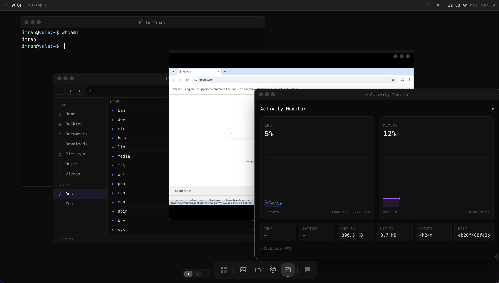

<p align="center">
  
</p>

<h1 align="center">Vula OS</h1>

<p align="center">
  <strong>A web-native operating system built on Debian Linux.</strong><br/>
  <em>"Vula" is isiZulu for "open".</em>
</p>

<p align="center">
  <a href="https://github.com/vul-os/vulos/actions/workflows/ci.yml"></a>
  <a href="https://github.com/vul-os/vulos/actions/workflows/release.yml"></a>
  <a href="https://github.com/vul-os/vulos/releases"></a>
  <a href="https://github.com/vul-os/vulos/blob/main/LICENSE"></a>
</p>

<p align="center">
  <a href="#install">Install</a> &middot;
  <a href="#features">Features</a> &middot;
  <a href="#development">Development</a> &middot;
  <a href="#contributing">Contributing</a> &middot;
  <a href="#license">License</a>
</p>

> **Alpha Software** — Under active development.

<p align="center">
  
</p>

---

## What is Vula OS?

Vula OS is a **web-native window manager and operating system** built on Debian Linux. Instead of streaming an entire remote desktop, Vula streams individual application windows on demand — web apps run as first-class citizens in the browser, and native Linux GUI apps (GIMP, LibreOffice, Blender, games via Wine/Lutris) stream via WebRTC only when you open them.

### The five ideas

1. **Web-native OS.** The shell is a real OS shell — windows, dock, file manager, terminal, settings — but it lives in a browser tab. Open it from your laptop, phone, or a TV at someone else's house and you get the same desktop.
2. **Web-app sovereignty.** Self-host the apps you'd normally rent from a SaaS company. The bundled app store installs things like Memos, Navidrome, Uptime Kuma, and Vaultwarden as proper OS apps with their own subdomain and isolated network namespace — not embedded iframes, not browser bookmarks.
3. **Peering, not federation.** Every Vula instance is a server with a stable identity (Ed25519 keypair, `vula:<id>` URI). Instances message, share files, place WebRTC calls, and collaborate on documents directly — no middleman, no account on someone else's server. See [`roadmap/PEERING.md`](roadmap/PEERING.md).
4. **Real bare metal.** Flash the same image to a USB stick and it boots into `cage` running a fullscreen browser — and that browser **is** the Vulos shell. The OS *is* the React app. Native Linux apps stream into windows of that desktop on demand via the same WebRTC pipeline used for remote access. See [`roadmap/BAREMETAL-INIT.md`](roadmap/BAREMETAL-INIT.md).
5. **Image-based OS distribution.** The OS ships as a **signed, immutable squashfs** pulled from a public bucket. A/B slots and boot-counter auto-rollback mean updates are atomic and reversible. The trust anchor is baked into the seed at flash time — security is enforced by the signing key, not by access control. See [`roadmap/OS-DISTRIBUTION.md`](roadmap/OS-DISTRIBUTION.md).

### How the pieces fit

- **Web apps are first-class** — install from apt or Flatpak, they run in isolated network namespaces and load in their own subdomain. No streaming overhead, just proxied HTTP.
- **Desktop apps stream on demand** — open Audacity and it launches in its own virtual display, streams via WebRTC. Close the window, the stream stops. No always-on VNC session.
- **Cloud gaming built in** — Wine/Lutris games stream with GPU-accelerated encoding (NVENC, VA-API, AV1). Gamepad, keyboard, and mouse input injected via uinput at kernel level.
- **Full OS underneath** — real Debian Linux with terminal, file manager, package management. Multi-user with per-user isolation.
- **Runs anywhere** — flash to bare metal (boots into a WebKit kiosk), deploy to a cloud server, or run in Docker for development.

### How to read this project

The repo carries its own project-management docs. If you want to follow along or contribute:

| You want to… | Read |
|---|---|
| Understand the design of a specific area (peering, gaming, init, OS distribution, …) | `roadmap/` — start at [`roadmap/README.md`](roadmap/README.md) |
| See what's done, what's open, and pick something to work on | [`tasks.md`](tasks.md) — start at the "At-a-glance" table |
| Understand *why* the project was built a certain way | [`decisions.md`](decisions.md) — the running design-decision log |
| Submit a change | [`CONTRIBUTING.md`](CONTRIBUTING.md) |
| Build / run / deploy | [`DEVELOPMENT.md`](DEVELOPMENT.md) |

---

## Install

### Bare Metal (flash to USB)

Download, flash, boot — like Ubuntu. On bare metal, Vulos boots a fullscreen browser via `cage`; the React shell is the desktop. Native Linux apps stream into windows of that desktop on demand — the same WebRTC pipeline used for remote access, so everything works out of the box on any hardware.

| Platform | File | Devices |
|----------|------|---------|
| **x86_64** | `vulos-vX.X.X-x86_64.img.gz` | PC, laptop, server |
| **ARM64** | `vulos-vX.X.X-arm64.img.gz` | Raspberry Pi, Pine64, Rock64 |

```bash
# Flash to USB drive
gunzip -c vulos-vX.X.X-x86_64.img.gz | sudo dd of=/dev/sdX bs=4M status=progress
```

Or use [Balena Etcher](https://etcher.balena.io/) — drag and drop the `.img.gz` file.

Alternatively, **netboot from a URL**: modern UEFI firmware can chainload `boot.vulos.org` directly (UEFI HTTP Boot), or use the ~1 MB one-time iPXE stick for older hardware. Either path runs a live-RAM "Try Vulos" session; **Install** writes the seed to disk only when you choose it. See [`roadmap/NETBOOT.md`](roadmap/NETBOOT.md).

### Cloud Server

Deploy to any Debian server with one command:

```bash
./build.sh --deploy YOUR_SERVER_IP --domain os.yourdomain.com
```

Web apps available at `https://{app}.os.yourdomain.com`. Wildcard TLS via Caddy + Namecheap/Cloudflare DNS.

### Docker (development)

```bash
docker run -p 8080:8080 --shm-size=1g --privileged -v vulos-data:/root/.vulos ghcr.io/vul-os/vulos:latest
```

Open **https://lvh.me:8080** (requires [mkcert](https://github.com/FiloSottile/mkcert) for local TLS).

---

### GPU-Accelerated Streaming

Vula OS auto-detects GPU hardware and selects the best encoder for streaming desktop apps and games.

| Tier | GPU | Encoder | FPS | Latency | Setup |
|------|-----|---------|-----|---------|-------|
| 0 | None | VP8 (CPU) | 30 | ~15ms | Default |
| 1 | Intel/AMD | H.264/AV1 (VA-API) | 60 | <2ms | `--device /dev/dri` |
| 2 | NVIDIA | H.264/AV1 (NVENC) | 120 | <1ms | `--gpus all` + [NVIDIA Container Toolkit](DEVELOPMENT.md#nvidia-container-toolkit-setup-host) |

---

## Features

### Window Manager
- Multiple windows with drag, resize, snap (half/quarter screen like Ubuntu)
- Mission Control (F3) — overview of all windows and desktops
- Multiple desktops with drag-to-move between them
- Dock with running app indicators

### Applications
- **Terminal** — persistent PTY sessions with bash, accessible from anywhere
- **Browser** — Chromium instances streamed via WebRTC, multiple independent windows
- **File Manager** — browse, upload, download, manage files
- **App Store** — install web apps and desktop apps from apt/Flatpak
- **Activity Monitor** — processes, CPU, memory, network connections
- **Settings** — theme, display, WiFi, Bluetooth, audio, energy, backups

### Peering

Every Vula instance has an Ed25519 identity (`vula:ed25519:<base58>`). Instances communicate directly, no relay required. See [`roadmap/PEERING.md`](roadmap/PEERING.md).

- **Messaging** — server-to-server signed message delivery; offline queue with exponential backoff
- **Media** — image, video, and file transfer server-to-server over HTTPS; thumbnails auto-generated
- **Voice and video calls** — WebRTC browser-to-browser; servers handle signaling only, not media
- **Groups and rooms** — leaderless group fan-out; SFU (Pion) for 5+ participants with simulcast, Last-N video, dominant-speaker audio mixing, and bandwidth-aware host selection
- **Real-time collaboration** — Yjs CRDT over the peering mesh for Docs, Sheets, Notes, and code editors; leaderless merge with cursor awareness
- **AirDrop-style Drop** — LAN mDNS discovery, BLE on bare metal, or 6-digit proximity code fallback

### Image-Based OS Distribution

The OS is a **signed, immutable squashfs** — never patched in place, always replaced atomically. See [`roadmap/OS-DISTRIBUTION.md`](roadmap/OS-DISTRIBUTION.md).

- **Public bucket** — `os/stable.json` manifest (signed) + versioned squashfs artifacts; security enforced by signing key, not access control
- **A/B slots with auto-rollback** — new image staged to the inactive slot; boot counter reset; if services don't come up clean within the threshold, the bootloader flips back to the last-known-good slot automatically
- **dm-verity** — Merkle tree over the squashfs verifies every block on read at runtime, not just at download ([`roadmap/SIGNING.md`](roadmap/SIGNING.md))
- **Signed boot chain (NETB / SIGN / VERITY / SEED)** — Secure Boot shim → bootloader → kernel/initramfs → squashfs; each stage verified before execution; offline root-signs-intermediate PKI; monotonic min-epoch for revocation and rollback protection
- **Forkable trust anchor** — baked Ed25519 public key + soft bucket URL in the seed; rebuild the seed with your own key and bucket for a fully independent fork ([`roadmap/SEED-TRUST.md`](roadmap/SEED-TRUST.md))

### Cloud Login Modes (CLOGIN)

The OS login screen offers three modes alongside the classic local username/password:

- **Cloud account login** — email + password + 2FA; the cloud-signed token is verified locally against a baked cloud pubkey, with an offline grace-period cache so login works when the network is down
- **Device PIN** — TPM-wrapped short PIN for fast re-unlock; falls back to password after lockout
- **Fingerprint** — optional `fprintd`/libfprint unlock on bare metal; fingerprint unlocks the same TPM-wrapped credential as the PIN; gracefully hidden when no supported hardware is present

Cloud profile changes (username, password, full name) are pushed as signed management messages and applied locally. The cloud is an accelerator, not a runtime dependency.

### Multi-Instance Sync

Data sync across your own nodes is **leaderless**: cr-sqlite is a CRDT — every instance holds a full, mergeable copy; concurrent writes converge automatically with no leader to elect and no split-brain possible. See [`roadmap/SYNC.md`](roadmap/SYNC.md).

- **Hot path** — live instances stream `crsql_changes` to each other directly over the peering mesh (relay fallback for NAT / cross-location)
- **Cold path** — periodic durable checkpoint to the shared S3 bucket; an instance that was offline catches up from the bucket
- **Snapshot / compaction** — periodic compacted snapshot to the bucket so a new instance bootstraps from `snapshot + short tail`, not unbounded replay
- **Coordination** — bucket-backed leases with fencing tokens (`If-Match` CAS) prevent concurrent compaction; no leader, just the lease holder for the cycle ([`roadmap/COORDINATION.md`](roadmap/COORDINATION.md))

### App Platform
- **Web apps** run in isolated network namespaces with auth-gated subdomain routing
- **Desktop apps** (apt/Flatpak) stream via WebRTC with GPU encoding
- **Games** via Wine/Lutris with gamepad support and low-latency input
- **AI Assistant** with pluggable backend (Ollama, OpenAI, Anthropic) and sandboxed code execution

### Infrastructure
- Multi-user with per-user Linux accounts, sudo, and profile isolation
- Built-in tunnel for remote access from any device
- S3/Restic backup and restore
- 110+ API endpoints across 24 Go backend services

### Tech Stack

| Layer | Technology |
|-------|-----------|
| Shell | React 19, Tailwind CSS 4, Vite |
| Backend | Go (single binary, 24 services) |
| Streaming | GStreamer, WebRTC (pion), Xvfb |
| Apps | apt, Flatpak, isolated network namespaces |
| Base | Debian 13 (Trixie), Caddy |

---

## Development

```bash
git clone https://github.com/vul-os/vulos.git
cd vulos

./dev.sh                # Local dev — Go + Vite HMR (localhost:5173)
./dev.sh deploy         # Full Docker build (localhost:8080)
./dev.sh deploy quick   # Quick rebuild into running container
./dev.sh deploy layer   # Docker rebuild, reuses cached apt layer
```

### Runtime environments (`--env`)

The backend accepts an `--env` flag (or `VULOS_ENV` env var) that sets the
security and behaviour profile for the process.  The default is `prod`.

| Flag value | Who uses it | What changes |
|---|---|---|
| `local` | Developer laptop | Binds `127.0.0.1`, skips TPM/fingerprint checks, allows self-signed certs, relaxes cookie flags, enables `/debug/env` endpoint |
| `dev` | CI / staging | Same as local but without debug endpoints; accepts staging cloud-broker pubkey alongside prod key |
| `prod` | Bare-metal / cloud | Binds all interfaces, full Secure cookies, hardware checks active where hardware is present, no debug endpoints |

```bash
# run the backend in local mode without any extra config
go run ./backend/cmd/server --env=local

# or via environment variable
VULOS_ENV=local go run ./backend/cmd/server
```

You do not need mkcert, a TPM, or a cloud account to run in `local` mode.

### Deploy to production

```bash
./build.sh --deploy SERVER_IP --domain os.yourdomain.com --dns-namecheap USER APIKEY
```

See [DEVELOPMENT.md](DEVELOPMENT.md) for detailed setup, GPU configuration, and environment variables.

### Project Structure

```
vulos/
├── src/                  # React frontend (shell, apps, auth)
├── backend/              # Go backend (24 services, 110+ endpoints)
├── apps/                 # Bundled app manifests
├── registry.json         # App store registry (apt + web apps)
├── landing/              # Landing page
├── roadmap/              # Design documents (one per system area)
├── build.sh              # Bare-metal image builder + deployer
└── dev.sh                # Dev and Docker deploy script
```

---

## Releases

Each release produces:

- **System images** — `.img.gz` for bare metal (flash to USB)
- **Docker images** — `ghcr.io/vul-os/vulos:latest` for `linux/amd64` and `linux/arm64`

```bash
git tag v0.1.0 && git push origin v0.1.0
```

Download from the [Releases](https://github.com/vul-os/vulos/releases) page.

---

## Contributing

The short version:

1. Skim [`tasks.md`](tasks.md) → "At-a-glance" → pick a `todo` task whose dependencies are `done`.
2. `./dev.sh` to run locally.
3. Branch as `task/<ID>` (e.g. `task/AUTH-10`) or `feat/`, `fix/`, `docs/`, `refactor/` for off-roadmap work.
4. Tick the task's acceptance criteria, run `go build ./...` + `npm run build`, open a PR.

See [`CONTRIBUTING.md`](CONTRIBUTING.md) for the full flow, including how tasks are formatted, where decisions live, and how to report a security issue.

---

## License

MIT

<p align="center">
  <br/>
  <br/>
  <em>Built with purpose. Open by design.</em>
</p>
