<div align="center">


# Vulos

**Your own personal server, on hardware you own — a full desktop, your files, and private AI, all in one place.**

Your server. Your AI. Your rules.

[](https://github.com/vul-os/vulos/releases/latest)
[](https://github.com/vul-os/vulos/actions/workflows/ci.yml)
[](LICENSE-MIT)
[](backend/go.mod)
[](frontend/package.json)
[](https://github.com/vul-os/vulos/stargazers)
[](CONTRIBUTING.md)

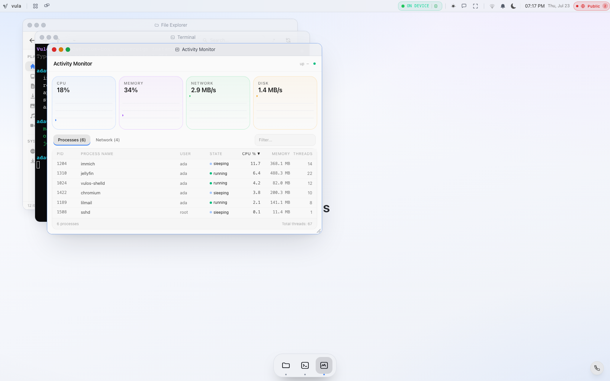

<sub><b>Real windowing</b> — drag, snap, and tile just like a native desktop.</sub>

</div>

---

## What is Vulos?

Vulos is a **sovereign personal server** — your own computer in the cloud (or in your closet) that you actually own. Open it in any browser and you land on a real desktop: windows, a dock, your files, a calendar, notes, a terminal, apps you install yourself, and an AI assistant that lives on *your* machine.

Nothing here runs on someone else's servers by default. Your data sits on hardware you control, your AI runs through a gateway you own, and there's no third party you have to sign in through to use any of it. The idea isn't secrecy for its own sake — it's **agency**: keeping your inbox, calendar, files, and AI on a machine that answers to you.

Run it on hardware you own two ways: deployed onto a machine you already run, so it persists like any normal computer, or booted live from a flash drive to try it with nothing touching your internal disk. See [Two ways to run it](#two-ways-to-run-it) below for which is which.

> *"Vulos" is isiZulu for "open."*

### Why Vulos — and who it's for

Most of your digital life lives on machines you don't control. Vulos moves the whole thing — desktop, files, calendar, contacts, notifications, and AI — onto one server that answers to **you**, reachable from any browser or your phone.

- **You want your own AI** without shipping your calendar, files, and inbox to a third party — bring your own provider key, or run local models on your own hardware.
- **You self-host** and are tired of stitching together ten containers — Vulos is one binary that gives you a coherent desktop, not a pile of dashboards.
- **You want continuity** — an always-on box plus a laptop that stay in sync, reachable from anywhere, with no vendor able to lock you out or read your data by default.

If you'd rather rent a slice of someone else's computer, Vulos isn't for you. If you want a computer that's actually *yours*, keep reading.

---

## A look inside

<table>
  <tr>
    <td width="50%"><br /><sub><b>Private AI</b> — an assistant that runs on <i>your</i> box, knows your day, and acts only with your OK.</sub></td>
    <td width="50%">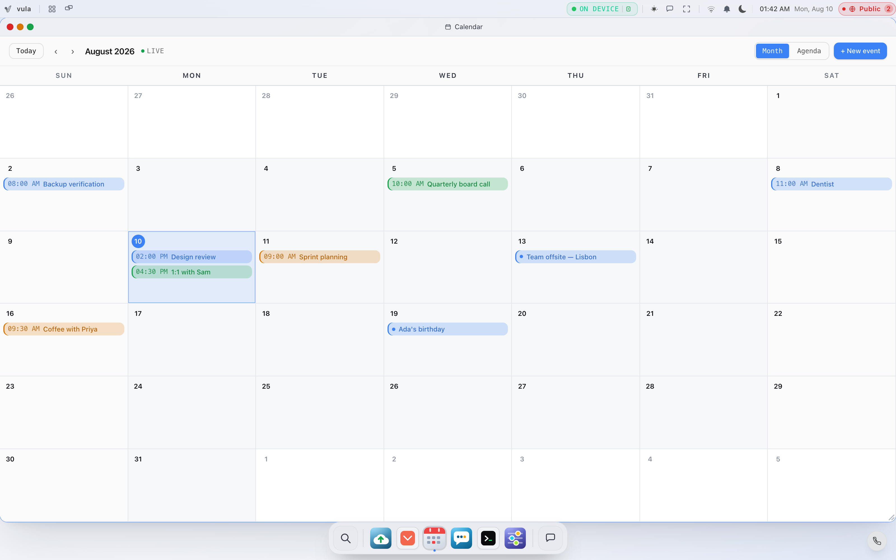<br /><sub><b>Calendar</b> — your schedule, on your server, feeding the assistant's context.</sub></td>
  </tr>
  <tr>
    <td width="50%">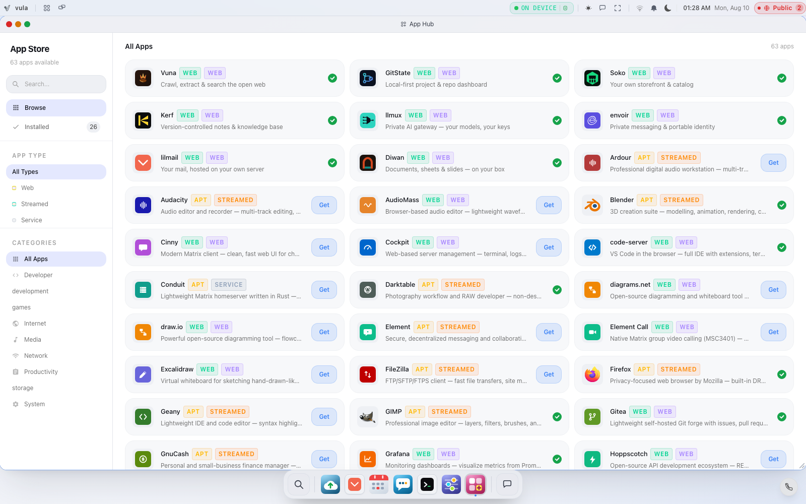<br /><sub><b>App hub</b> — install what you want, remove what you don't.</sub></td>
    <td width="50%">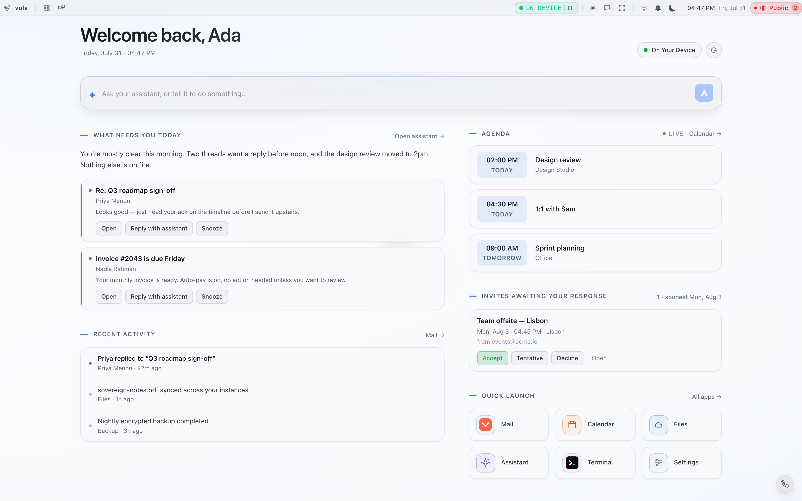<br /><sub><b>Desktop</b> — wallpaper, dock, and ambient widgets; ⌘Space to find any app.</sub></td>
  </tr>
  <tr>
    <td width="50%">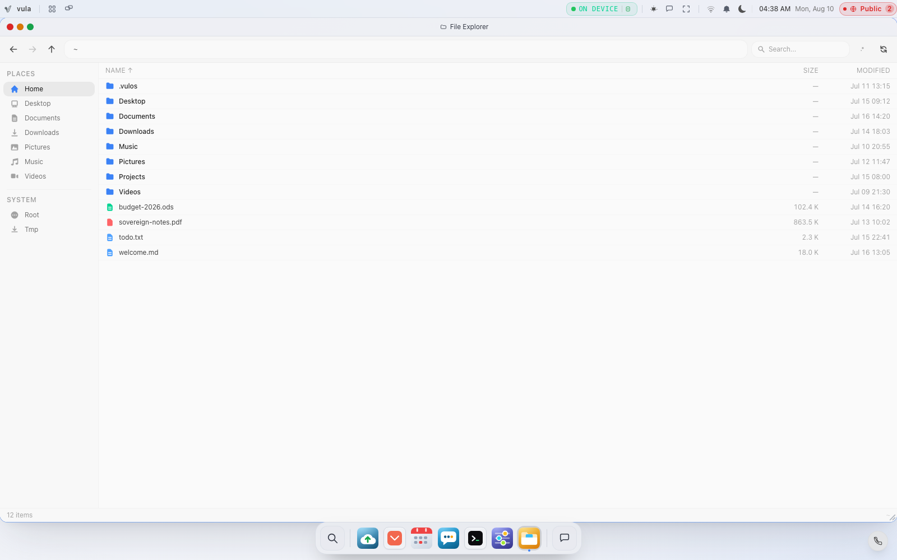<br /><sub><b>Files</b> — your storage, with real permissions and sealed sharing.</sub></td>
    <td width="50%"><br /><sub><b>Terminal</b> — a real shell into the machine you own.</sub></td>
  </tr>
  <tr>
    <td width="50%">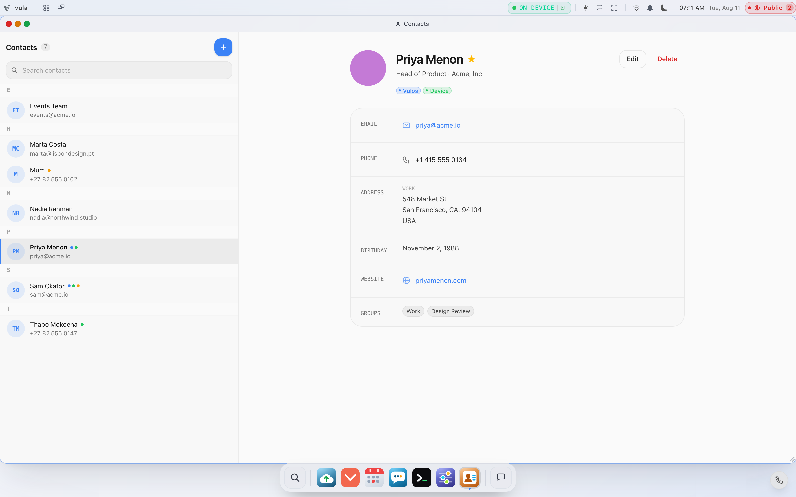<br /><sub><b>Contacts</b> — people and details that stay on your box, not a vendor's.</sub></td>
    <td width="50%"><br /><sub><b>Settings</b> — appearance, accounts, and system controls in one place.</sub></td>
  </tr>
  <tr>
    <td width="50%">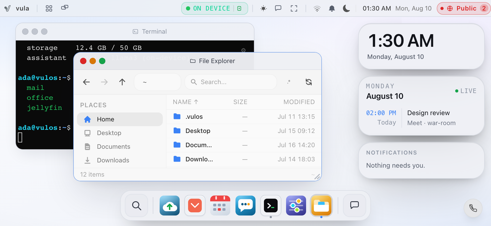<br /><sub><b>Mobile</b> — running apps as swipeable cards in the phone app switcher.</sub></td>
    <td width="50%">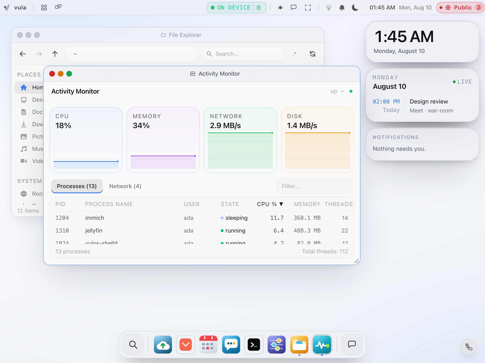<br /><sub><b>Tablet</b> — the same real windowing and tiling, sized for a tablet.</sub></td>
  </tr>
</table>

<sub>More screens and a full walkthrough live in the <a href="docs/USER-GUIDE.md">User Guide</a>.</sub>

<sub>The shots above are the real shipping UI rendered against <b>fixture data</b> — they show how Vulos looks, not a live box. Screenshots of the bundled apps <b>actually running</b> are in <a href="docs/screenshots/live-apps/">docs/screenshots/live-apps/</a>; <a href="docs/screenshots/PROVENANCE.md">PROVENANCE.md</a> records how every image was captured, and CI enforces it.</sub>

---

## One person, many instances

Vulos isn't locked to a single machine. Run it on your always-on home box **and** your laptop, and they sync — your apps, settings, and workspace follow you. One instance serves your traffic; the others stay in step. Reach any of them from your phone, whether you're on the couch or across the world.

<div align="center">
<picture>
  <source media="(prefers-color-scheme: dark)" srcset="docs/assets/peer-sync-dark.svg" />
  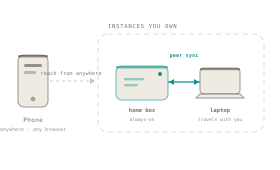
</picture>
</div>

<sub>You own every instance and hold the keys. Instances peer over their own Ed25519 identities and keep state in sync — the app registry syncs across same-LAN nodes today, with broader structured-data sync on the roadmap (see <a href="roadmap/SYNC.md">roadmap/SYNC.md</a>).</sub>

---

## Reachability & redundancy

**Vulos the project runs no infrastructure.** There is no hosted relay, no rendezvous service, no central box you sign in through. Every reachable endpoint in the picture is one *you* operate. That's the whole point — nothing you depend on answers to us.

**Run several boxes for redundancy.** They sync as peers (CRDT · Ed25519), so if one goes down your data and apps live on the others. And you reach them **however suits you — never locked to one relay:**

- **Direct — no relay at all.** A box with a public/static IP or your own domain serves **directly** over TLS: no relay, no middleman. Multiple static-IP boxes DNS-load-balance and fail over across each other. This is the simplest path when you have a public IP.
- **Your own Vulos relay (today's supported default).** Behind NAT, your home box opens *no ports* and dials **out** to a relay — a box with a public IP running `vulos relay serve`, built from this same repository (`backend/cmd/vulos`). You run that relay yourself on a cheap VPS (Hetzner, Fly, DigitalOcean — around €4/month); the VPS is the public endpoint, your home box stays sealed. It's a role in this project, not a separate product or a service we host — though note it is a different binary from the one a box runs, and no release artifact ships it, so you build it for the relay host yourself. A box can hold tunnels to several relays at once; run more than one for redundancy, and for resilient rendezvous discovery point boxes at **≥3 nodes under disjoint operators**. See [docs/REACH.md](docs/REACH.md) and [docs/RELAY-SELF-HOST.md](docs/RELAY-SELF-HOST.md).
- **Pier (experimental alternative).** [Pier](https://github.com/vul-os/pier) is the Kotva broker reference implementation — a separate, still-evolving broker that speaks the same rendezvous contract, so you *can* point a box at it instead of — or safely *alongside* — your own Vulos relay. It's an experimental option, not the default; your own Vulos relay is the recommended path today.

Every path lands on the **same** authenticated handler — there's no "trusted because it came over the LAN / direct / relay" bypass, and the trust boundary is identical whether the relay is your Vulos one or Pier. It's a real provider seam (direct · your relay · Pier), not a lock-in.

<sub>How it all wires up: <a href="docs/NETWORKING.md">docs/NETWORKING.md</a> (reachability, DNS, TLS, ports) and <a href="docs/PEERING.md">docs/PEERING.md</a> (peer identity and sync).</sub>

---

## Quickstart

### Run with Docker

The fastest way to try Vulos:

```bash
docker run -d \
  --name vulos \
  -p 8080:8080 \
  --shm-size=1g \
  -v vulos-data:/root/.vulos \
  ghcr.io/vul-os/vulos:latest
```

Open **http://localhost:8080** and complete first-boot setup.

<sub>Building the image yourself? <code>docker compose up --build</code> works out of the box. For GPU-accelerated app streaming, see <a href="docs/GETTING-STARTED.md">Getting Started</a>.</sub>

### Run locally for development

Prerequisites: **Node.js 22+** and **Go 1.25+**. No sibling repos, no cloud account — a clean clone builds and runs on its own.

```bash
git clone https://github.com/vul-os/vulos.git
cd vulos
cd frontend && npm install

# Terminal 1 — frontend (hot reload on http://localhost:5173)
npm run dev          # from frontend/

# Terminal 2 — backend (on :8080; Vite proxies /api to it)
cd backend && go run ./cmd/server --env=local
```

Or run both together with **`./scripts/dev.sh`** (equivalently `make dev`). Open **http://localhost:5173**.

Full setup, first-boot walkthrough, and hardware requirements: **[docs/GETTING-STARTED.md](docs/GETTING-STARTED.md)**.

---

## Features

**Desktop**
- **A real desktop, in the browser** — drag, resize, snap, and tile windows; virtual desktops; a dock with running-app indicators; Mission Control; persisted sessions. No Electron, no VNC.
- **A colourful launcher with real icons** — a coherent iconography system with a coloured app catalog, first-party brand marks for Vulos-ecosystem apps, and real system icons pulled from the installed Debian theme (all same-origin, nothing hotlinked). It reads like an OS, not a clip-art grid.
- **Proactive home + ⌘K** — the desktop opens as a home (agenda, focus, pending items, proposals), and one command palette drives the whole shell.
- **On-demand app streaming** — native Linux apps stream into desktop windows over WebRTC with GPU acceleration; a dedicated low-latency mode auto-engages for games. Close the window and the stream stops.

**AI**
- **A sovereign AI assistant** — an on-box agent that knows your calendar, contacts, files, and reminders and can act for you. It reads freely but *proposes* anything with side effects, so it can never act against you without your confirmation. Bring your own provider key, or run local models — see [docs/ASSISTANT.md](docs/ASSISTANT.md).

**Files**
- **Your files, your rules** — a Files service with proper viewer/editor/owner permissions, sealed sharing, share-by-email, and resumable chunked uploads that pick up where they left off. More in [docs/FILES.md](docs/FILES.md).

**Contacts**
- **One unified address book** — the box merges your Vulos/CardDAV contacts, your phone's device + SIM contacts (pushed up by the Android app), and any SIM plugged into the box itself into a single de-duplicated list, with a source badge on each entry so you can see where it came from (`GET /api/contacts/unified`). Every source is optional and the whole surface is owner-gated.

**Comms & notifications**
- **Sovereign notifications** — a real notification center plus opt-in Web Push where *your box* sends directly to your device, end-to-end encrypted (RFC 8291), working behind NAT with no central middleman. See [docs/COMMS.md](docs/COMMS.md).

**Identity & security**
- **Sign-in with nobody in the middle** — you sign in to your own box, and to nothing else. No Google login, no OAuth middleman, no Vulos account. Today that is a username and password, with a master recovery phrase to get back in and a device PIN that locks a running session. Passkeys (WebAuthn/FIDO2) and QR/phone-approval login are built on the server but have **no sign-in screen yet**, and passkey routes stay off on a freshly flashed box until you set an RP ID and origin — so treat passwordless as unreleased, not shipped.
- **Cluster join codes** — a second instance joins yours with a one-time `VULOS-XXXX-XXXX-XXXX` code. The separate *device*-pairing service — approval from an already-trusted device, server-side refusal of a self-pair, quorum-gated break-glass revocation — is written and tested as a library but **is not wired into the running server**, so those endpoints do not exist on a 0.3.0 box. See [docs/SECURITY.md](docs/SECURITY.md).

**Reachability**
- **Reach it from anywhere** — connect to your box even when it's behind NAT, without exposing it to the public internet; go direct with a static IP or domain, or self-host your own relay. See [docs/NETWORKING.md](docs/NETWORKING.md).

**Distribution**
- **One binary, immutable image** — a single Go server serves the whole shell. Ship it as a signed, immutable image with dm-verity and A/B slots, or just run the binary. (Signature verification, the epoch rollback floor, staging into the inactive slot and the slot flip itself all work — the flip is proven by a reboot. Nothing flips *automatically*: staging leaves the new image ready and applying it stays a deliberate step you take. See [docs/ARCHITECTURE.md](docs/ARCHITECTURE.md).)

**Bundled apps** — the essentials, built in: Files, Notes, a Text Editor, Calculator, Clock, Calendar, Contacts, Terminal, Camera, Gallery, an Image Editor, Music, Voice Recorder, Weather, a Browser, plus an app hub, activity monitor, and settings. Install more from the hub whenever you want — see [docs/APPS.md](docs/APPS.md).

---

## On your phone

Vulos has a **native Android app** that acts as a thin client to your box — your box stays the authority, the phone renders it. It can also serve as your **home-screen launcher**, making Vulos the front door of your phone.

An installable PWA is the everyday path (offline support and Web Push already work); the native app adds locally bundled assets, box-attached SMS and calling, and a set of **opt-in** native bridges — contacts, camera, push, files, biometric unlock, and the home-screen launcher — each one off until you turn it on. See **[clients/android/README.md](clients/android/README.md)** for the model and build path.

<table>
  <tr>
    <td width="50%" align="center">
      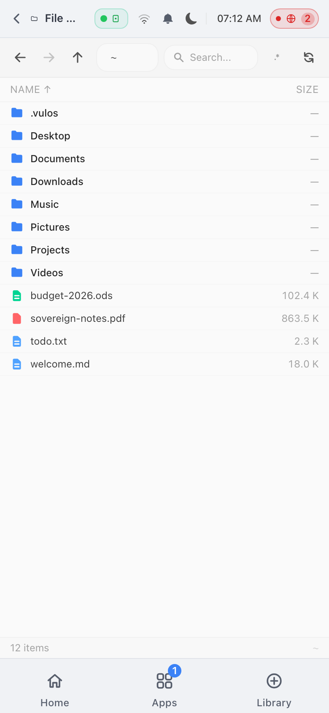<br />
      <sub><b>Files, in your pocket</b> — the same storage as your desktop, thumb-first.</sub>
    </td>
    <td width="50%" align="center">
      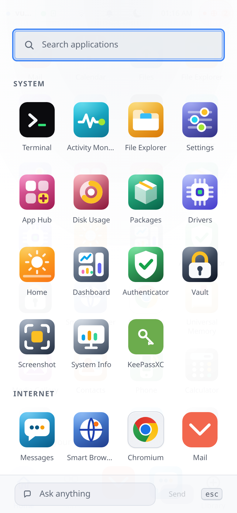<br />
      <sub><b>Your app grid</b> — every app your box runs, one tap away.</sub>
    </td>
  </tr>
</table>

---

## Sovereign AI, honestly

Vulos runs AI **through your own box**. Two honest modes: **bring your own key** to any provider (your keys, your box in the middle, no Vulos account or middleman), or run **local models** where your hardware allows so nothing leaves the box at all.

This is agency, not a magic promise: "sovereign AI" means *your gateway, your keys, your box deciding where data goes* — not that every box ships a free frontier model. The assistant is bound by a hard security contract: every side-effecting action is a confirmation-gated proposal, off-box egress passes a tier-aware Guard, and untrusted content (email bodies, file text) is framed as data so prompt-injection can't turn a helper into an attacker.

Details: **[docs/ASSISTANT.md](docs/ASSISTANT.md)** and the threat model in **[docs/THREAT-MODEL.md](docs/THREAT-MODEL.md)**.

---

## Two ways to run it

<div align="center">
<picture>
  <source media="(prefers-color-scheme: dark)" srcset="docs/assets/run-dark.svg" />
  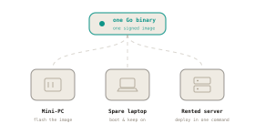
</picture>
</div>

Vulos is built to be owned end to end, and there are two ways to put it on hardware you own — pick based on whether you want it to stick around.

**Deploy it — for a box you're keeping.** Have a VPS, or a spare machine with a Debian-family Linux on it, that you can SSH into as root? Point the deploy script at it and it installs the persistent OS there, as a systemd service:

```bash
./build.sh --deploy YOUR_SERVER_IP
```

(`--domain` needs DNS credentials in the same command — automatic TLS is issued over DNS-01 — e.g. `--domain os.example.com --dns-namecheap USER APIKEY`.)

Installing onto a bare machine's **own disk** from inside the live session, via `vulos-install --disk`, is the path this project intends as primary. It is not available yet, though the reason has narrowed: the binary now ships — `build.sh` builds `./cmd/installer` into `/usr/local/bin/vulos-install` and fails if it is missing from the rootfs — and what remains is that no release yet carries the hand-signed `stable.json` the installer requires before it will write a system, because the release key never touches a build machine. The specifics are in [docs/GETTING-STARTED.md → Installing to the machine's own disk](docs/GETTING-STARTED.md#install-it-to-the-machines-disk).

**Try it live from a flash drive — for testing, demos, or a disposable machine.** The published `.img.gz` boots a full Vulos desktop straight off a USB stick:

```bash
gunzip -c vulos-v0.3.0-x86_64.img.gz | sudo dd of=/dev/sdX bs=4M status=progress
```

This is a live session, not an install. The root filesystem is a read-only image and the writable layer lives in RAM, so **nothing you do persists** — accounts, files, and settings are gone the moment you reboot or pull the drive. That's by design: it's the fastest way to try Vulos on real hardware, or to carry a desktop that's always clean on boot, without ever touching the machine's own disk. It's also the environment you install to disk from — see above.

The image is forkable — supply your own trust-anchor key for a fully independent build. Full detail on both paths: **[docs/GETTING-STARTED.md](docs/GETTING-STARTED.md)** and **[docs/DEPLOY.md](docs/DEPLOY.md)**.

---

## How it's built

A single Go binary serves the embedded React shell and exposes the system over HTTP, WebSocket, and WebRTC. The backend is organized into focused services (assistant, auth, files, notifications, peering, streaming) with local-first SQLite storage and optional encrypted S3/Restic backup.

Read the full component map and design decisions in **[docs/ARCHITECTURE.md](docs/ARCHITECTURE.md)**.

---

## FAQ

**Is my data really mine?**
Yes — it lives on hardware you control, in local-first SQLite plus your own storage, and you hold the keys. Backups are opt-in and encrypted. See [docs/ARCHITECTURE.md](docs/ARCHITECTURE.md) and [docs/FILES.md](docs/FILES.md).

**Do I need the cloud?**
No — and there's no Vulos-run cloud to depend on. A box runs standalone. To reach it behind NAT you point it at a relay you operate yourself (a cheap VPS running `vulos relay serve`), or you drop the relay entirely with a static IP or your own domain. Nothing routes through infrastructure we run. See [docs/NETWORKING.md](docs/NETWORKING.md).

**What does Vulos cost?**
Vulos is free — the software charges nothing and there's no account, subscription, or metering. The only money involved is third-party infrastructure *you* choose to rent: a VPS if you run a relay, storage if you back up off-box, an AI provider if you bring your own key. You pay those providers directly, not us.

**What hardware do I need?**
A mini-PC, a spare laptop, or a cloud server all work — the same image runs on each. GPU is optional and only matters for accelerated app streaming. Requirements are in [docs/GETTING-STARTED.md](docs/GETTING-STARTED.md).

**Does flashing the USB image install Vulos, or just let me try it?**
By itself, just try it. The published `.img.gz` boots a live session — the root filesystem is read-only and the writable layer lives in RAM — so accounts, files, and settings are gone on the next reboot. To keep a box, deploy to a machine you already run (`./build.sh --deploy`) or use Docker; both persist normally today. Installing from the live session onto the machine's own disk is intended but not yet available — see [docs/GETTING-STARTED.md](docs/GETTING-STARTED.md#install-it-to-the-machines-disk). See [Two ways to run it](#two-ways-to-run-it).

**Is the AI free?**
"Sovereign AI" means your gateway and your keys, not a bundled frontier model. Bring your own provider key (you pay that provider directly) or run local models where your hardware allows, so nothing leaves the box. See [docs/ASSISTANT.md](docs/ASSISTANT.md).

**How do multiple boxes stay in sync?**
They peer over their own Ed25519 identities and reconcile as CRDTs — no central server in the middle. Today the app registry syncs; broader structured-data sync is on the [roadmap](roadmap/SYNC.md). See [docs/PEERING.md](docs/PEERING.md).

---

## Documentation

Chapters run in the order you'd actually reach for them — install and use it
first, internals and APIs last. Full index: **[docs/README.md](docs/README.md)**.

| Guide | What's inside |
|---|---|
| [Getting Started](docs/GETTING-STARTED.md) | Install, first boot, requirements, upgrading |
| [User Guide](docs/USER-GUIDE.md) | Living in the desktop day to day |
| [Apps](docs/APPS.md) · [Assistant](docs/ASSISTANT.md) · [Files](docs/FILES.md) | Bundled apps, the AI assistant, and storage |
| [Networking](docs/NETWORKING.md) · [Peering](docs/PEERING.md) · [Comms](docs/COMMS.md) | Reachability, peer sync, and notifications |
| [Deploy](docs/DEPLOY.md) | Ship it to your own server over SSH |
| [Security](docs/SECURITY.md) · [Threat Model](docs/THREAT-MODEL.md) | The security posture, top to bottom |
| [Troubleshooting](docs/TROUBLESHOOTING.md) | Symptom, cause, fix |
| [Architecture](docs/ARCHITECTURE.md) | Component map and design decisions |
| [Configuration](docs/CONFIGURATION.md) | Environment variables, config files, flags |
| [Development](docs/DEVELOPMENT.md) | Building, testing, and the dev workflow |

---

## Security

We take security seriously and welcome good-faith research under a documented safe-harbor policy. Report vulnerabilities via GitHub Security Advisories or `exolutionza@gmail.com`. See **[SECURITY.md](SECURITY.md)** and the **[threat model](docs/THREAT-MODEL.md)**.

---

## Contributing

Contributions are welcome. Branch as `feat/`, `fix/`, or `docs/`, and run `make build` and `make test-local` (or `cd backend && go build ./... && go test ./...` plus `cd frontend && npm run build`) before opening a PR. The full guide is in **[CONTRIBUTING.md](CONTRIBUTING.md)**.

---

## License

[MIT](LICENSE-MIT) OR [Apache-2.0](LICENSE-APACHE) — © VulOS.

---

<div align="center">

<a href="https://github.com/vul-os/vulos">GitHub</a> · <a href="https://github.com/vul-os/vulos/issues">Issues</a> · <a href="https://github.com/vul-os/vulos/releases">Releases</a>

<br>

<sub>Vulos is a free, open-source, self-hosted <strong>personal server operating system</strong> — a real desktop, your files, and private AI, running on hardware you own.<br>
Built as an alternative to cloud desktops, consumer NAS appliances, and self-hosted app bundles.<br>
Keywords: personal server OS, sovereign server, self-hosted desktop, home server operating system,<br>
private AI server, self-hosted cloud, personal cloud, local-first AI, own your data, single-tenant desktop OS.</sub>

</div>

---

<p align="center">
  <a href="https://vulos.org"></a><br>
  <sub><a href="https://vulos.org"><b>vulos</b></a> — open by design</sub>
</p>
