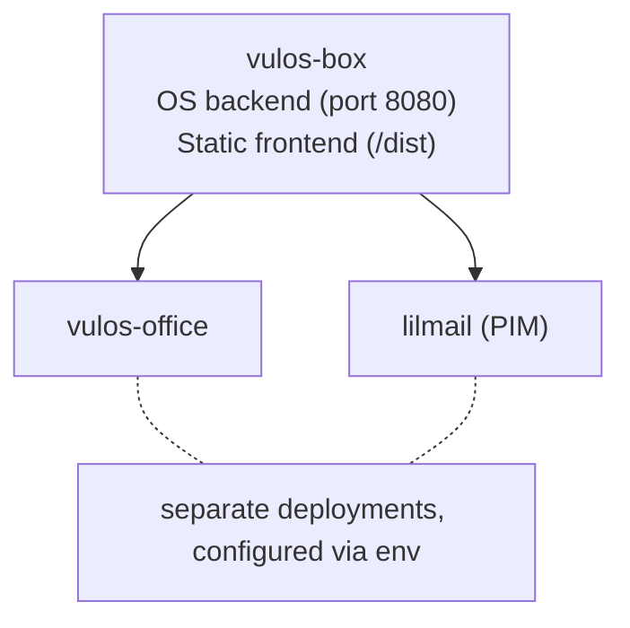

# Vulos OS — Headless box image (self-provisioned)

This directory contains the build definition for the `vulos-box` container image: a headless OS backend serving the shell, web terminal, and web apps. **No GPU, no desktop streaming, no Xvfb.** Run it on your own server (any VPS or home box) — Vulos does not host or provision boxes.

For a full desktop box with native app streaming, use the top-level `Dockerfile` instead. This headless image is the lean option for a server you SSH into and reach over the web.

## Image architecture



The image runs the Go OS backend only. Owned apps (Office) and PIM (lilmail) are independent deployments reached through the App Hub / PIM proxy; their URLs are injected at runtime via environment variables that the OS backend already reads.

## Build

From the repo root:

```sh
docker build -f deploy/box/Dockerfile -t ghcr.io/vul-os/vulos-box:latest .
```

To publish (CI does this — do not push manually from dev):

```sh
docker push ghcr.io/vul-os/vulos-box:latest
```

## Required environment variables

The server refuses to start in `VULOS_ENV=prod` (the default) without these:

| Variable                  | Description                                              |
|---------------------------|----------------------------------------------------------|
| `VULOS_RPID`              | WebAuthn relying party domain (e.g. `vulos.org`)         |
| `VULOS_ORIGIN`            | WebAuthn origin (e.g. `https://vulos.org`)               |
| `VULOS_RESTIC_PASSWORD`   | Restic backup encryption passphrase (strong random)      |
| `BURST_HEARTBEAT_SECRET`  | Shared secret for the `/init-passphrase` unlock endpoint |

## Optional environment variables

| Variable              | Default                | Description                              |
|-----------------------|------------------------|------------------------------------------|
| `VULOS_DATA_DIR`      | `/data`                | Persistent data directory (mount a volume) |
| `VULOS_S3_ENDPOINT`   | (none)                 | S3-compatible endpoint for backups       |
| `VULOS_S3_BUCKET`     | (none)                 | S3 bucket name                           |
| `VULOS_S3_ACCESS_KEY` | (none)                 | S3 access key                            |
| `VULOS_S3_SECRET_KEY` | (none)                 | S3 secret key                            |
| `EMBED_ENDPOINT`      | `http://localhost:11434` | Embedding model endpoint (Ollama)       |
| `AI_ENDPOINT`         | (none)                 | AI model endpoint                        |

## `/init-passphrase` contract

Your provisioning process calls this endpoint after booting a fresh box to deliver the data-encryption passphrase and unlock the vault (rather than baking the secret into the image).

### Request

```
POST /init-passphrase
Host: <vm-private-ip>:8080
X-Burst-Secret: <BURST_HEARTBEAT_SECRET>
Content-Type: application/json

{"passphrase": "<vault-encryption-passphrase>"}
```

- **Method:** `POST`
- **Path:** `/init-passphrase`
- **Auth:** `X-Burst-Secret` header must match the `BURST_HEARTBEAT_SECRET` environment variable set on the VM. Missing or wrong value → `401 Unauthorized`.
- **Body:** JSON with a single field `passphrase` (non-empty string). Empty or missing → `400 Bad Request`.
- **No session cookie** is required — the endpoint bypasses the standard session auth middleware.
- **Network:** should be called over the private/loopback interface. The endpoint does not restrict by remote IP (the shared secret provides authentication).

### Success response

```json
HTTP/1.1 200 OK
Content-Type: application/json

{"status":"ready"}
```

### Error responses

| Status | Meaning                                              |
|--------|------------------------------------------------------|
| 400    | Missing or malformed body / empty passphrase         |
| 401    | `X-Burst-Secret` header missing or wrong             |
| 503    | `BURST_HEARTBEAT_SECRET` not set on the server       |
| 500    | Vault init/unlock failed (check server logs)         |

### Example (curl)

```sh
curl -s -X POST http://10.0.0.2:8080/init-passphrase \
  -H "X-Burst-Secret: $BURST_HEARTBEAT_SECRET" \
  -H "Content-Type: application/json" \
  -d '{"passphrase": "correct-horse-battery-staple-..."}'
```

### Implementation note

`SetPassword` updates the in-memory passphrase and re-runs `vault.Init` (restic) with the new key. The vault must be configured with S3 credentials for Init to succeed. If S3 is not configured, Init is a no-op and the passphrase is stored for future use.
