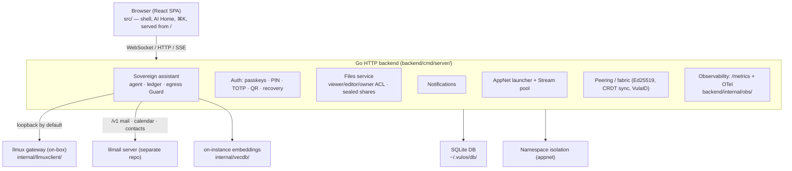
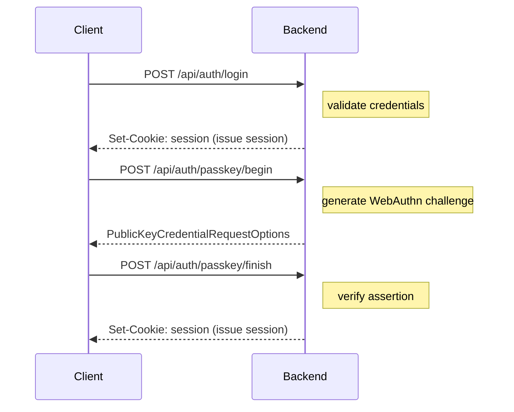
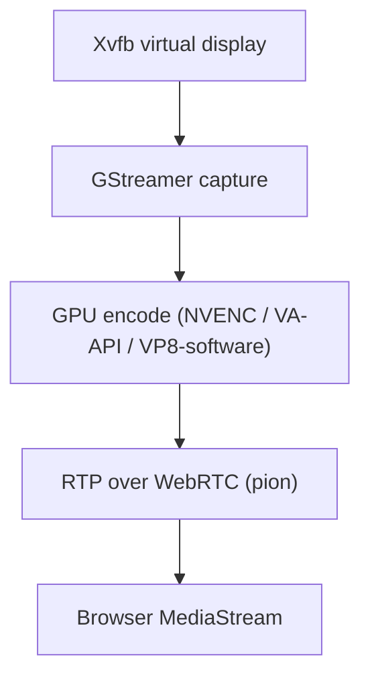
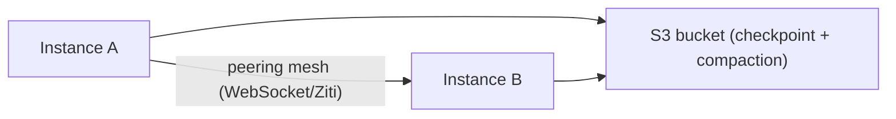
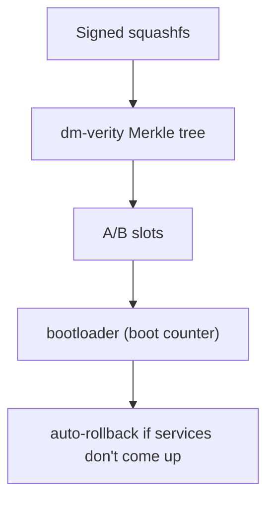

# Vulos OS — Architecture

## Overview

Vulos is a **sovereign personal server** with a browser-native desktop that runs on a single machine (bare-metal or VM/VPS) and exposes itself over WebSocket/WebRTC. The shell is a React SPA; the backend is a single Go binary. At its center is an on-box **sovereign assistant** — an AI agent aware of your calendar, contacts, files, and reminders that acts on your behalf under a confirmation-gated, egress-fenced security contract. Native Linux apps stream into browser windows on demand — no always-on VNC, no remote desktop protocol.

---

## System diagram



---

## Key design decisions

**Single binary.** The Go backend embeds the entire frontend SPA at build time via `go:embed`. One binary to deploy, one process to supervise.

**Local-first storage.** SQLite for auth/config; S3 (optional, via Restic) for encrypted backup. No external database required for a basic install.

**App sandboxing.** Each user app runs in its own Linux network namespace with a unique port. Traffic is proxied through the app gateway at `{app}--{profile}.{ulid}.vulos.org`. Web apps get no streaming overhead — just proxied HTTP.

**Sovereign assistant.** An on-box AI agent (`backend/services/assistant/`) with a curated toolset. Read-only tools (mail search, calendar/agenda, contacts, files, reminders) run inside the turn; anything with side effects becomes a *proposal* recorded in a single-use server-side ledger. Approval posts only the opaque proposal id to `/api/assistant/execute` — never client args. A tier-aware egress `Guard` fences model egress (local / sovereign / brokered / external), and tool results are framed as untrusted data to blunt prompt injection. The LLM runs through the on-box `llmux` gateway by default. See [THREAT-MODEL.md](../THREAT-MODEL.md) Component 5.

**Authentication.** Email + password + optional WebAuthn/TOTP. No third-party identity providers. Passkeys are the primary login for new accounts (with sign-counter clone/replay detection). Device PIN and QR/phone-approval cover kiosk and shared clients. A per-user master key is wrapped by both the password and a 24-word recovery phrase, so account recovery never needs a server-held plaintext key.

**Streaming on demand.** Native Linux apps (GIMP, LibreOffice, games) launch in their own Xvfb virtual display and stream via WebRTC. Close the window, stream stops. No persistent VNC session.

**CRDT sync.** Multi-instance data sync uses cr-sqlite (leaderless CRDTs). Every instance holds a full mergeable copy; concurrent writes converge without a leader. Sync state travels over the peering mesh (live) and S3 (cold checkpoint).

---

## Component map

### Frontend (`src/`)

| Directory | Purpose |
|-----------|---------|
| `src/shell/` | Window manager, dock, Mission Control, launchpad, AI Home, ⌘K palette, notification center |
| `src/auth/` | Login, passkey enrollment, QR login, setup wizard |
| `src/core/` | App registry, settings panel, system pulse |
| `src/builtin/` | Built-in apps: assistant, terminal, files/drive, app hub, dashboard, peering, notes |
| `src/apps/` | Heavier app integrations: vault, authenticator |
| `src/providers/` | React context providers |
| `src/layouts/` | Desktop and mobile layout shells |

### Backend (`backend/`)

| Path | Purpose |
|------|---------|
| `backend/cmd/server/` | HTTP server, all route handlers, middleware |
| `backend/services/assistant/` | Sovereign AI agent: tool catalog, proposal ledger, egress Guard, on-instance mail/RAG index |
| `backend/services/ai/` | LLM/embeddings service seam (the assistant's `Completer`) |
| `backend/services/auth/` | Email/password auth, sessions, device PIN, fingerprint |
| `backend/services/passkeys/` | WebAuthn/FIDO2 passkey registration/login, QR/phone approval |
| `backend/services/files/` | Files service: viewer/editor/owner ACL, sealed (content-blind) shares, share-by-email |
| `backend/services/notify/` | Notifications (types, priority, TTL, DND, WebSocket delivery) |
| `backend/services/joincode/`, `joinsync/`, `cloudenroll/` | Device/box join tokens, join ceremony, RFC 8628 enrollment |
| `backend/services/peering/` | Ed25519 peering, VulaID key lifecycle, relay, Drop |
| `backend/services/stream/` | WebRTC stream pool, bitrate control |
| `backend/services/gpu/` | GPU capability detection (NVENC, VA-API, software) |
| `backend/services/credvault/` | Server-side encrypted credential store (the OS's own, not third-party OAuth) |
| `backend/services/sync/` | CRDT rehydration and compaction |
| `backend/services/telemetry/` | GPU usage metering |
| `backend/internal/llmuxclient/` | Client for the on-box `llmux` LLM gateway (`LLMUX_URL`) |
| `backend/internal/multiinstance/` | Multi-instance quorum, signed change propagation |
| `backend/internal/safedial/` | SSRF-safe dialer (pre-dial validation + connect-time IP check) |
| `backend/internal/gpuhost/` | GPU host capability detection |
| `backend/internal/fabric/` | Fabric mesh identity and key management |
| `backend/internal/vecdb/` | Local vector store for on-instance retrieval |
| `backend/internal/obs/` | Prometheus metrics + OTel tracing |

---

## Browser architecture (BROWSER-01/02)

Browsing is **host-browser-native**: `POST /api/open` returns a `{"action":"open_in_host_browser","url":"..."}` instruction. The frontend shell opens the URL in the kiosk Chromium (bare-metal) or the user's desktop browser (remote). No server-side Chromium session is created.

The `services/webbrowser` package (server-side Chromium streaming) was removed in decision BROWSER-02. The `xvfb`, `chromium`, and `xdotool` streaming-only packages are no longer installed. The kiosk Chromium and its enterprise-policy files (`/etc/chromium/policies/managed/vulos.json`) remain intact — the kiosk Chromium *is* the host browser on bare metal.

Isolated/Disposable Browsing (RBI) is not implemented; the stub and its flag (`VULOS_ENABLE_ISOLATED_BROWSER`) have been removed.

---

## Auth flow



Session cookies are `HttpOnly`, `Secure`, `SameSite=Strict` in `prod` mode. In `local` mode cookie flags are relaxed for development without TLS.

---

## Sovereign assistant flow

```mermaid
sequenceDiagram
    participant Client
    participant Agent as Assistant agent
    participant Guard as Egress Guard
    participant Model as llmux (on-box)
    participant Ledger as Proposal ledger

    Client->>Agent: POST /api/assistant/agent {message}
    Agent->>Guard: Guard(cfg, allowExternal)
    Note right of Guard: classify tier; block if external & not opted-in
    Agent->>Model: prompt (mail content framed as UNTRUSTED DATA)
    Model-->>Agent: read-only tool calls (run server-side)
    alt side-effecting action
        Agent->>Ledger: Put(userID, proposal) — opaque id, single-use, TTL
        Agent-->>Client: {id, tool, summary, args(display only)}
        Client->>Agent: POST /api/assistant/execute {id}
        Note right of Agent: id ONLY — never client args
        Agent->>Ledger: Take(userID, id) → server-stored args
        Agent->>Agent: ExecuteProposal(server args)
    else answer
        Agent-->>Client: SSE token stream
    end
```

The streaming endpoint (`POST /api/assistant/agent/stream`) emits `status`,
`token`, `proposal`, and `done`/`error` events; the `Guard` runs once up front,
so a blocked tier makes zero model calls and streams nothing. A leaked proposal
id is not indefinitely replayable (single-use + 10-minute TTL) and is bound to
the calling user's session. See [THREAT-MODEL.md](../THREAT-MODEL.md) Component 5.

---

## Streaming pipeline



Stream pool (`backend/services/stream/pool.go`) manages the lifecycle: one stream per open native app window, ref-counted. When the last viewer closes the browser window the stream is torn down and the virtual display released.

GPU tier auto-detection (`backend/services/gpu/gpu.go`):
1. NVIDIA (NVENC) — `nvidia-smi` + GStreamer `nvh264enc`/`nvav1enc`
2. Intel/AMD (VA-API) — `/dev/dri` + `vainfo` + GStreamer `vaapih264enc`
3. Software (VP8) — always available fallback

---

## Multi-instance CRDT sync



- **Hot path**: live instances stream `crsql_changes` directly over the peering mesh (relay fallback for NAT/cross-location)
- **Cold path**: periodic durable checkpoint to the shared S3 bucket; offline instances catch up from the bucket
- **Snapshot/compaction**: periodic compacted snapshot so new instances bootstrap from `snapshot + short tail`, not unbounded replay
- **Coordination**: bucket-backed leases with fencing tokens (`If-Match` CAS) prevent concurrent compaction

---

## OS distribution (bare metal)



- OS ships as a signed, immutable squashfs pulled from `os.vulos.org`
- dm-verity enforces block-level integrity at runtime via the initramfs
- A/B slot auto-rollback: new image staged to inactive slot; if it doesn't come up clean the bootloader flips back
- Trust anchor: Ed25519 public key baked into the seed at flash time; forks supply their own key + bucket URL

---

## Observability

| Endpoint | Description |
|----------|-------------|
| `GET /metrics` | Prometheus textfile (`vulos_*` namespace) |
| OTel traces | Active when `OTEL_EXPORTER_OTLP_ENDPOINT` set; `backend/internal/obs.Start(ctx, op)` |

---

## See also

- [GETTING-STARTED.md](GETTING-STARTED.md) — install and first boot
- [CONFIGURATION.md](CONFIGURATION.md) — all environment variables and config files
- [REPRODUCIBLE-BUILDS.md](REPRODUCIBLE-BUILDS.md) — deterministic build + dm-verity signing
- [THREAT-MODEL.md](../THREAT-MODEL.md) — STRIDE threat model
- [ROADMAP.md](../ROADMAP.md) — design roadmap
