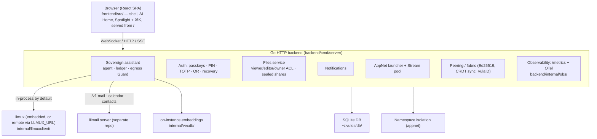
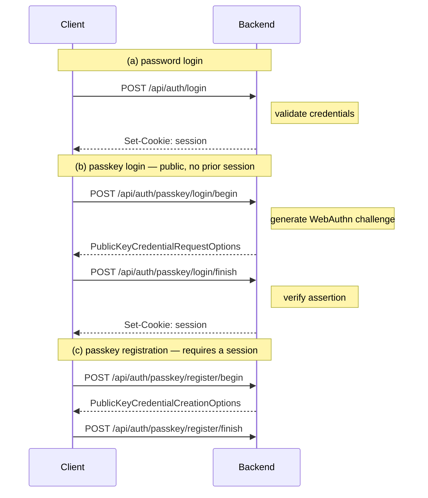
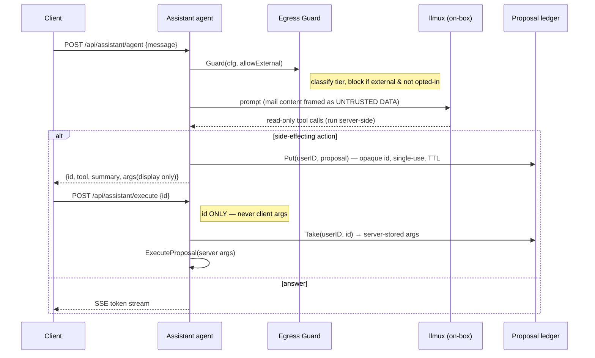
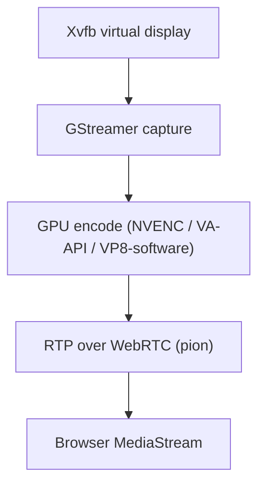
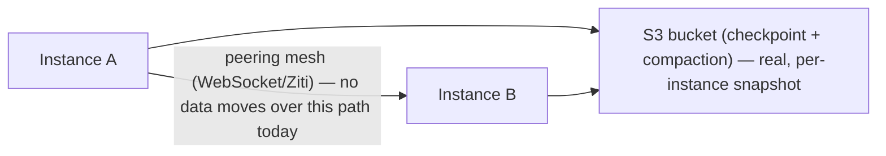
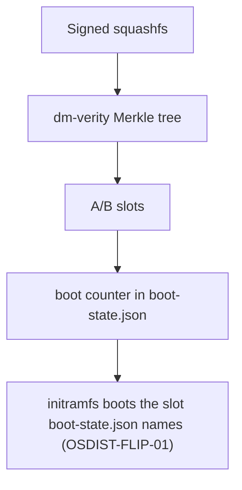

# Vulos OS — Architecture

## Overview

Vulos is a **sovereign personal server** with a browser-native desktop that runs on a single machine (bare-metal or VM/VPS) and exposes itself over WebSocket/WebRTC. The shell is a React SPA; the backend is a single Go binary. At its center is an on-box **sovereign assistant** — an AI agent aware of your calendar, contacts, files, and reminders that acts on your behalf under a confirmation-gated, egress-fenced security contract. Native Linux apps stream into browser windows on demand — no always-on VNC, no remote desktop protocol.

---

## Deployment modes

Vulos is one binary that runs in one of three shapes, selected by the `DEPLOY_MODE` environment variable (`backend/internal/deploymode/`). Unset ⇒ `standalone`. The mode changes **who owns the machine, who pays, and a few fail-closed security seams — not the feature set of the software.** This is the canonical framing the rest of the Vulos suite echoes.

| Mode | Who runs it | Control plane | Entitlement gating | Object storage |
|---|---|---|---|---|
| `standalone` (default) | You, on your own hardware or VPS — fully sovereign, off-grid | None. Nothing is contacted unless you set a control-plane env var | Off — every installed app is open, no metering | Local FS, or your own S3/MinIO with short-lived **STS prefix-scoped** creds minted per app |
| `os` | You, on your own hardware or VPS, optionally pointed at an external control plane | CP-adjacent: optional sign-in broker, integrations broker, `vk_` API keys, push relay — all config-driven, none built into the box | **Enforced, fail-closed** for `vk_`-keyed requests once a control plane is configured | Same STS prefix-scoped creds as standalone |
| `cloud` | A multi-tenant deployment shape for whoever operates shared infrastructure under this mode | This *is* the multi-tenant control-plane runtime | **Enforced, fail-closed** | **Per-object presigned URLs** (Tigris has no STS) — never raw bucket creds |

The one truth to hold onto: **`os` mode runs the exact same OS image as `standalone`.** Nothing about the software changes — only whether a control-plane URL is configured. "Self-host" itself has two flavors — the full OS box above, or a single standalone app binary (see the sibling app repos, which read the same `DEPLOY_MODE` enum).

Two independent switches distinguish `standalone` from `os`:

- **`DEPLOY_MODE`** governs entitlement enforcement. `os`/`cloud` are treated as cloud-adjacent (`Mode.IsCloudAdjacent()`) and gate `vk_`-keyed app dispatch fail-closed; `standalone` leaves every app open.
- **The control-plane URL** (`VULOS_CLOUD_URL` / `VULOS_CP_URL`) governs which optional control-plane seams are live — sign-in, the integrations broker, push relay. With no URL set, those seams are inert regardless of mode.

Either way, per-user **storage isolation always applies** — it protects the box's own users from each other and is enforced on-box, never requiring a control plane. Pointing a box at a control plane is a set of narrow, opt-in seams, each of which fails closed back to the sovereign path when that control plane is unreachable.

> Cloud-adjacent modes (`os`, `cloud`) refuse to boot with a plaintext software device keystore unless the operator sets `VULOS_ALLOW_SOFTWARE_KEYSTORE=1` — the TPM-less Fly cloud runtime uses that opt-out. `standalone` is unaffected: the software keystore is its documented fallback.

---

## System diagram

---

## Key design decisions

**One process.** The Go backend is a single binary and a single process to supervise — API, app gateway, peering and the static frontend all served from it. The SPA is *not* compiled into the binary: at startup the server looks for a web root on disk (first match of `/opt/vulos/webroot`, `./dist`, `../dist`, `../../dist`) and serves it with `http.FileServer`, falling back to `index.html` for client-side routes (`backend/cmd/server/main.go`). With no build present it logs `no frontend build found — API only mode` and runs headless. So a deploy is two artifacts — the binary and `dist/` — which is what the Dockerfile copies (`COPY --from=frontend /dist /opt/vulos/webroot`) and what lets the UI be rebuilt or replaced without recompiling Go.

**Signed app registry.** Every `registry.json` entry carries an Ed25519 signature from the release key, which is itself certified by the offline root key baked into the image at `/etc/vulos/trust-anchor.pub`. Installs fail closed: unsigned, tampered, or foreign-signed entries are refused, and the `VULOS_REGISTRY_INSECURE` escape hatch is rejected outright in production. See [KEY-CEREMONY.md](KEY-CEREMONY.md).

**Local-first storage.** SQLite for auth/config; S3 (optional, via Restic) for encrypted backup. No external database required for a basic install.

**App sandboxing.** Each user app runs in its own Linux network namespace with a unique port. Traffic is proxied through the app gateway at `{app}--{profile}.{ulid}.vulos.org`. Web apps get no streaming overhead — just proxied HTTP.

**Sovereign assistant.** An on-box AI agent (`backend/services/assistant/`) with a curated toolset. Read-only tools (mail search, calendar/agenda, contacts, files, reminders) run inside the turn; anything with side effects becomes a *proposal* recorded in a single-use server-side ledger. Approval posts only the opaque proposal id to `/api/assistant/execute` — never client args. A tier-aware egress `Guard` fences model egress (local / sovereign / brokered / external), and tool results are framed as untrusted data to blunt prompt injection. The LLM runs through `llmux` — embedded in the same process by default (one binary, no sidecar; `VULOS_AI_MODE=embedded`), or as a separate gateway process if `LLMUX_URL` points elsewhere. See [THREAT-MODEL.md](THREAT-MODEL.md) Component 5.

**Compute stance.** All AI/GPU compute (the assistant, AI apps, streaming encode) runs on the **user's own box**, mediated by `llmux` (local model or BYOK to an external provider). Nothing in this codebase hosts, provisions, or meters AI/GPU compute on your behalf.

**Authentication.** Email + password + optional WebAuthn/TOTP. No third-party identity providers. Passkeys are the primary login for new accounts (with sign-counter clone/replay detection). Device PIN and QR/phone-approval cover kiosk and shared clients. A per-user master key is wrapped by both the password and a 24-word recovery phrase, so account recovery never needs a server-held plaintext key.

**Streaming on demand.** Native Linux apps (GIMP, LibreOffice, games) launch in their own Xvfb virtual display and stream via WebRTC. Close the window, stream stops. No persistent VNC session.

**Multi-instance sync (real, for one domain over the LAN).** The design goal is a leaderless CRDT where every instance holds a full mergeable copy and concurrent writes converge without a leader. cr-sqlite is not integrated and never will be; the replacement is pure-Go change capture over SQLite's compiled-in SESSION extension (`backend/internal/sqlcrdt`) feeding a delta-state CRDT engine (`backend/internal/crdtsync`), and it is now **wired and running** — `cmd/server/main.go` calls `startCRDTSync` with the LAN-only mux, and the `reminders` table replicates between boxes. Two limits define it: it runs **only where the LAN layer runs** (`VULOS_LAN_ENABLE=1`), and **which data syncs is an enforced allow-list**, today just `reminders`. Details in the Multi-instance sync section below. Alongside it: a leaderless CRDT for the **app registry only** (`backend/internal/multiinstance/`), synced same-LAN via mDNS (`backend/internal/fabric/`) and gated behind `VULOS_LAN_ENABLE=1`; and a real S3 cold-path **snapshot of one instance's local DB file** (`backend/services/sync/`), not a cross-node merge. See roadmap/SYNC.md and roadmap/CLUSTER.md for the full reality check and the forward plan (a shared DMTAP-substrate Sync spec, relay as WAN rendezvous).

---

## Component map

### Frontend (`frontend/src/`)

| Directory | Purpose |
|-----------|---------|
| `frontend/src/shell/` | Window manager, dock, menu bar, Mission Control, Launchpad, Spotlight (⌘Space), AI Home, ⌘K command palette, notification center, ambient desktop widgets |
| `frontend/src/auth/` | Login, passkey enrollment, QR login, setup wizard |
| `frontend/src/core/` | App registry, settings panel, system pulse |
| `frontend/src/builtin/` | Built-in apps: assistant, terminal, files/drive, app hub, dashboard, peering, notes |
| `frontend/src/apps/` | Heavier app integrations: vault, authenticator |
| `frontend/src/providers/` | React context providers |
| `frontend/src/layouts/` | Desktop and mobile layout shells |

### Backend (`backend/`)

| Path | Purpose |
|------|---------|
| `backend/cmd/server/` | HTTP server, all route handlers, middleware |
| `backend/services/assistant/` | Sovereign AI agent: tool catalog, proposal ledger, egress Guard, on-instance mail/RAG index |
| `backend/services/ai/` | LLM/embeddings service seam (the assistant's `Completer`) |
| `backend/services/auth/` | Email/password auth, sessions, device PIN, fingerprint |
| `backend/services/passkeys/` | WebAuthn/FIDO2 passkey registration/login, QR/phone approval |
| `backend/services/files/` | Files service: viewer/editor/owner ACL, sealed (content-blind) shares, share-by-email, resumable (tus-style) chunked upload promote |
| `backend/services/upload/` | Resumable upload manager (tus core: Create/Head/Patch/Delete/Sweep), SQLite-persisted offset for resume-across-restart, per-chunk checksum, abandoned-partial sweep |
| `backend/services/notify/` | Notifications (types, priority, TTL, DND, WebSocket delivery) + cell-side **Web Push** send-path (VAPID, per-owner subscription store, RFC 8291) + cell-side **UnifiedPush** send-path (user-registered distributor endpoint, alongside Web Push) |
| `backend/services/joincode/`, `joinsync/` | Device/box join tokens and the join ceremony. (A `cloudenroll/` package was listed here but does not exist in this repository — the Vulos Cloud account/enrolment surface was removed.) |
| `backend/services/peering/` | Ed25519 peering, VulaID key lifecycle, single reachability seam (`resolvePeerBaseURL`) over the relay, Drop |
| `backend/services/stream/` | WebRTC stream pool, bitrate control |
| `backend/services/gpu/` | GPU capability detection (NVENC, VA-API, software) |
| `backend/services/credvault/` | Server-side encrypted credential store (the OS's own, not third-party OAuth) |
| `backend/services/sync/` | CRDT rehydration and compaction |
| `backend/services/telemetry/` | GPU usage metering |
| `backend/internal/llmuxclient/` | The `llmux` AI gateway seam — runs it embedded in-process by default, or talks to a remote one (`VULOS_AI_MODE`, `LLMUX_URL`) |
| `backend/internal/multiinstance/` | Multi-instance quorum, signed change propagation |
| `backend/internal/safedial/` | SSRF-safe dialer (pre-dial validation + connect-time IP check) |
| `backend/internal/gpuhost/` | GPU host capability detection |
| `backend/internal/fabric/` | Fabric mesh identity and key management |
| `backend/internal/vecdb/` | Local vector store for on-instance retrieval |
| `backend/internal/obs/` | Prometheus metrics + OTel tracing |

---

## Browser architecture (BROWSER-03)

Vulos ships **two user-selectable browsers**, side by side in the launcher, so
you can pick per task (both are registered in `frontend/src/core/AppRegistry.ts`):

1. **Smart Browser** (`id: browser`) — the client-side web app under
   `frontend/apps/browser/`. It opens in the host browser as an in-shell web-app lane
   entry and creates **no** server-side session. This is the light,
   zero-stream option; `POST /api/open` returns a
   `{"action":"open_in_host_browser","url":"..."}` instruction so the shell can
   also hand a URL off to the host/kiosk Chromium.
2. **Streaming Chrome** (`id: browser-stream`) — a **real Chromium instance
   running on the box**, streamed to the shell over WebRTC (Xvfb → GStreamer
   HW-encode → pion), with a **persistent per-user profile**
   (cookies/history/logins) derived from the authenticated user id. It is
   launched on demand via `POST /api/browser/launch`, which mints a per-user
   `stream.Session` rendered by `StreamViewer`.

The `services/webbrowser` package (server-side Chromium streaming) was removed
in the old decision BROWSER-02 and has since been **restored** (BROWSER-03,
`backend/services/webbrowser/chrome.go`). Unlike the original boot-time single
persistent session, it is now an **on-demand, per-user** launcher over the
shared `stream.Pool`: it owns a virtual PulseAudio sound card for audio capture,
manages tabs over the Chrome DevTools Protocol, and isolates each user's profile
directory under their own home. The kiosk Chromium and its enterprise-policy
files (`/etc/chromium/policies/managed/vulos.json`) remain the host browser on
bare metal, independent of either launcher app.

> Whether Streaming Chrome is usable in a given deployment depends on the box
> having Chromium plus the Xvfb/GStreamer streaming stack installed and a GPU
> or software-encode path available; see the [Streaming pipeline](#streaming-pipeline).

Isolated/Disposable Browsing (RBI) is not implemented; the stub and its flag (`VULOS_ENABLE_ISOLATED_BROWSER`) have been removed.

---

## Auth flow

Password and passkey login are **alternatives**, not steps of one sequence: the
passkey login routes are public and issue a session on their own
(`registerPasskeyLoginRoutes`, `cmd/server/routes_passkey_login.go:41-50`).
Passkey *registration* is the flow that needs a session first.

The session cookie is always `HttpOnly`. Its other flags key off whether the
request arrived over TLS, **not** off the env mode: over HTTPS it is `Secure` +
`SameSite=None` (needed for app subdomain iframes, which is why state-changing
requests carry a separate CSRF check); over plain-HTTP localhost dev it falls
back to `SameSite=Lax` (`services/auth/handlers.go:788-808`). `SameSite=Strict`
is not used for the session cookie — only for the short-lived `vulos_qr_bind`
browser-binding cookie. See [SECURITY.md](SECURITY.md#sessions).

---

## Sovereign assistant flow

The streaming endpoint (`POST /api/assistant/agent/stream`) emits `status`,
`token`, `proposal`, and `done`/`error` events; the `Guard` runs once up front,
so a blocked tier makes zero model calls and streams nothing. A leaked proposal
id is not indefinitely replayable (single-use + 10-minute TTL) and is bound to
the calling user's session. See [THREAT-MODEL.md](THREAT-MODEL.md) Component 5.

---

## Streaming pipeline

Stream pool (`backend/services/stream/pool.go`) manages the lifecycle: one stream per open native app window, ref-counted. When the last viewer closes the browser window the stream is torn down and the virtual display released. The same pool backs all three streaming surfaces below.

GPU tier auto-detection (`backend/services/gpu/gpu.go`):
1. NVIDIA (NVENC) — `nvidia-smi` + GStreamer `nvh264enc`/`nvav1enc`
2. Intel/AMD (VA-API) — `/dev/dri` + `vainfo` + GStreamer `vaapih264enc`
3. Software (VP8) — always available fallback

### Three streaming modes

All three ride the same pool + GPU encoder seam, but with different tunings:

1. **Native app-window streaming** (default). Ordinary Linux GUI apps
   (Audacity, KiCad, legacy X11 apps). `gpu.CaptureArgs` uses
   **dirty-region capture** (`use-damage=true`), so a static window produces
   near-zero frames, and idle streams are throttled — optimised for a
   still desktop, not motion.
2. **Gaming mode** (`opts.Gaming`). Auto-engaged **only for real games** —
   the launch handler classifies the command via `wine.IsGamingCommand`
   (wine/wine64/lutris/steam/steam-runtime) or an app manifest whose
   `category == "gaming"` (`backend/cmd/server/gaming_detect.go`); plain
   GPU-accelerated apps like Blender do **not** trip it. Gaming switches to
   full-frame capture (`use-damage=false`), a low-latency encoder profile
   (`GamingEncoderArgs`: `zerolatency`/`preset=low-latency-hp`, no B-frames,
   no lookahead, CBR, a 1-second GOP to bound keyframe-recovery latency), and
   a minimal receive-side jitter buffer on the client
   (`RTCRtpReceiver.playoutDelayHint = 0`, Chromium only —
   `frontend/src/builtin/stream/lowLatency.ts`). The resolved `gaming` flag is echoed
   back to `StreamViewer` so gaming input behaviour (pointer-lock) activates.
3. **Streaming Chrome** (`services/webbrowser`). A per-user persistent-profile
   Chromium session on the pool, launched via `POST /api/browser/launch` — see
   [Browser architecture](#browser-architecture-browser-03).

Actual frame-rate, latency, and GPU behaviour are **deployment-dependent**
(hardware, encoder availability, network path) and are not fixed guarantees;
the numbers above describe encoder *configuration*, not measured performance.

---

## Multi-instance sync — design intent vs shipped (see roadmap/SYNC.md for the full reality check)

- **Hot path (real, narrow)**: live instances exchange deltas directly over the LAN fabric. An earlier transport streamed `crsql_changes`, but that table never populated — cr-sqlite is not integrated — and that dead code was removed. What replaced it works.

  The no-CGO rule (D23 / D94-J) **stands and is not reversed**. What was wrong was an inference drawn from it: `load_extension` being unauthorised under `modernc.org/sqlite` blocks **third-party** loadable extensions such as cr-sqlite, and says nothing about upstream extensions compiled into the amalgamation. SQLite's own **SESSION** extension is compiled in, so change capture never needed CGO at all.

  - `backend/internal/sqlcrdt` — **change capture**. Diffs the synced tables against an attached baseline database via `sqlite3session_diff`, so writes from any connection or package are captured with no change to a single existing write path. Verified under `CGO_ENABLED=0` on darwin/arm64, linux/amd64 and linux/arm64, and that probe is kept as a permanent regression test.
  - `backend/internal/crdtsync` — **convergence**. A delta-state CRDT with a bounded op log: LWW registers (`OpSet`/`OpDel`, with row existence as its own register so delete-vs-update orders deterministically) and PN counters (`OpInc`), stamped with a hybrid logical clock and reconciled by version vector; a peer behind the pruned floor is served a snapshot instead of a delta.
  - `cmd/server/crdtsync_wiring.go` — the wiring. `POST /api/crdt/pull`, `POST /api/crdt/push` and `GET /api/crdt/status` are mounted on the **LAN-only `fabricMux`**, never the public surface, behind the same constant-time shared-secret check fabric's own routes use. A nil authorizer registers *nothing* and logs loudly rather than serving openly.

  What is proven: ordinary SQL `INSERT`/`UPDATE`/`DELETE` on one box appears on another, concurrent edits to **different columns of the same row** both survive, an offline box catches up, and three boxes converge (`internal/sqlcrdt/endtoend_test.go`).

  > **It runs only where the LAN layer runs.** The engine shares fabric's LAN mux and fabric's secret, so its call site is gated on `VULOS_LAN_ENABLE=1` *and* a non-empty `VULOS_FABRIC_SECRET`. That is **on in the shipped systemd unit** (`build.sh` sets `Environment=VULOS_LAN_ENABLE=1`) and **off for a bare `vulos-server` process** — live on a real box, dormant in a plain dev run. If you test with a bare server and see nothing replicate, that is the gate, not a defect. The gate chain is pinned by a test that fails if the call site gains an unreviewed condition, which is what stops it quietly becoming dead code again.

  **Two boundaries, easy to overstate in either direction:**

  - **LAN only. WAN is not delivered.** The seam is genuine — `crdtsync.PeerSource` is transport-agnostic and `fabric.RendezvousDiscoverer` already satisfies it — and a WAN peer is never downgraded to the LAN client (that client skips certificate verification because link-local trust comes from the shared secret inside the tunnel, so a relay-supplied address gets the WAN client, https enforced, or is skipped). The unresolved part is **peer identity**: authentication is still one shared secret, which is defensible inside a link-local tunnel and is not a peer identity across the internet. `crdtsync`'s own package doc names that plus NAT traversal as what a WAN transport still has to bring.
  - **An allow-list, not "the database syncs".** Domains are approved one at a time and refusals are recorded with reasons (`internal/crdtsync/policy.go`). Approved today: **`reminders`**, and nothing else. Refused on the record: `sessions` (one compromised instance would hand over live sessions everywhere, and revocation could not be relied on), auth material, node-local hardware state, and the security audit log (its value depends on being an append-only record of what happened *on this box*). `profiles` is refused as **wanted but not yet safe** — the row is a single JSON `data` blob holding `AIAPIKey` and `PinHash` alongside `Theme` and `Locale`, and column-level exclusion cannot strip a field from inside a blob, so syncing it as-is would ship API keys to every peer.

  So: capture and merge are real and tested; the coverage is **one domain over one transport**. Do not read this as whole-database or multi-node sync being finished.
- **Cold path (real)**: periodic durable checkpoint of each instance's own local DB file to the shared S3 bucket; offline instances catch up from the bucket.
- **Snapshot/compaction (real)**: periodic compacted snapshot so new instances bootstrap from `snapshot + short tail`, not unbounded replay — this snapshots one instance's local state, not a cross-node merge.
- **Coordination (real)**: bucket-backed leases with fencing tokens (`If-Match` CAS) prevent concurrent compaction.
- **What actually merges across instances today**: only the **app registry**, via a CRDT in `backend/internal/multiinstance/`, over **same-LAN mDNS** (`backend/internal/fabric/`). Nothing else merges, and there is no WAN path. Note this whole layer is gated behind `VULOS_LAN_ENABLE=1` (`backend/cmd/server/main.go:4335`) — without it, neither the fabric nor the rendezvous discoverers are wired up at all.

---

## Cell / edge: reachability, resumable upload, push

The box is always the authority for its own data; a handful of seams let it work behind NAT and across instances without a central data plane.

- **Single reachability seam.** All box→box delivery resolves its target through one primitive (`resolvePeerBaseURL(toVulaID, server)` in `peering/resolve.go`), which implements the *verified-direct → relay-tunnel → contact.Server* fallback ladder. The first two tiers come from a background-refreshed in-process cache (`RefreshPeerReachability`/`StartReachabilityRefresh`, gated on `VULOS_RELAY_BASE_URL`) fed by the operator's relay's peer-reachability resolve endpoint (`/_vulos-direct/resolve`); `resolvePeerBaseURL` itself stays a pure, non-blocking lookup so no call site needs to change. A box with no relay configured sees byte-identical `https://<server>` pass-through behavior. A durable outbox retries failed sends.
- **Server-to-server peering auth boundary.** A remote peer has no OS session on the receiving box, so the box's server-to-server surface authenticates the peer *itself*, not an OS login: the whole `/api/peering/inbound/*` subtree runs behind `peering.InboundMiddleware` (fail-closed Ed25519 envelope signature → revocation gate → approved-contacts allow-list, with `/inbound/request` the one exception so an unknown peer can send a first contact request), the relay store-and-forward routes verify an Ed25519-signed request, prekey publish/claim are gated by the signed-prekey signature, and `/.well-known/vula-id` exposes public fields only. These S2S routes are therefore exempt from the OS-session gate (like `/api/files/peer/serve`), while every *client*-facing peering route (contacts, conversations, media upload, identity export/revoke, collab WebSocket) stays OS-session-authed. Per-resource authorization is capability-scoped: per-contact permissions (message/media/call/video), per-document share ACL (`ShareStore.PeerPerm`, edit vs view), and group membership — no ambient "any approved peer can touch anything" authority.
- **Resumable upload through the relay.** Large files (≥16 MiB by default) upload in bounded chunks so each `PATCH` rides the relay as an ordinary ≤-cap HTTP request — the relay needs no changes. The box (`services/upload`) reassembles into the owner's own storage with an offset persisted in SQLite (so a dropped connection resumes via `HEAD` + `PATCH` from the committed offset), per-chunk + whole-file SHA-256 integrity, and an hourly sweep of abandoned partials. Additive: `nil` manager ⇒ `503`, and the UI falls back to the single-shot grant→PUT→commit path on an older box.
- **Sovereign Web Push (PUSH-CELL-01).** When VAPID keys are configured, the box sends Web Push **directly** to browser-vendor push services (FCM/Apple/Mozilla) — outbound-only, works behind NAT, no central dependency on a Vulos-run relay. Payloads are RFC-8291 encrypted (vendor routes but can't read). Only owner-targeted notifications are pushed, DND/prefs are honoured by the box first, and gone (404/410) subscriptions are pruned. Flag-gated: no keys ⇒ push off, the in-app WebSocket stream is unchanged. This sends real notification content, not the DMTAP substrate's content-free Wake token (`substrate/ROLES.md` §8) — a deliberate superset, documented with rationale in `backend/internal/webpush/README.md`. "Sovereign" here means no Vulos-operated intermediary, not zero third parties: Chrome/Firefox routing is swappable in principle, but Apple's vendor slot is not — every push to Safari/iOS transits APNs unconditionally, which is the one platform with no sovereign alternative (D96).
- **UnifiedPush, alongside Web Push (UP-CELL-01, D98).** `backend/internal/unifiedpush` lets a user register their OWN push endpoint — handed to them by a UnifiedPush distributor they installed (e.g. ntfy) — removing the vendor from the path entirely on Android. It hooks into the exact same choke point as Web Push (`Service.SendNotification` → `maybeUnifiedPush`, right beside `maybeWebPush`): identical owner-targeting rule, identical DND/prefs `SuppressFunc`, identical prune-on-404/410 policy. A user-supplied endpoint is screened twice against `backend/internal/safedial` — once at registration, once at send time against the resolved IP — denying loopback, link-local, cloud metadata, and the box's own LAN (no `allowLAN` opt-out here, unlike some peer-share paths). Flag-gated (`VULOS_PUSH_UNIFIEDPUSH_ENABLE`) and fully additive: with it unset, or with no endpoint registered, behavior is unchanged. There is still no client UI to register an endpoint (backend-only wave) and no UnifiedPush distributor exists for iOS, so the D96/D98 iOS-APNs exception is untouched by this addition.

Video calling is third-party: install Jitsi Meet / Element Call from the App Store (see [COMMS.md](COMMS.md)) — Vulos does not ship a first-party video product. The sovereign P2P **Messages** builtin keeps its own in-process Pion SFU (`backend/services/peering/sfu`) for peer group calls, with no host-registry escalation.

---

## OS distribution (bare metal)

> This describes the design for an **installed, persistent** bare-metal box,
> produced today by running `vulos-install --disk /dev/sdX` from a booted live
> session (`build.sh --disk` itself is a local build-time target only, used by
> the boot smoke harness — it is not what ships to a real disk, and it is not a
> release artifact). `vulos-install --disk` has landed in code but has not yet
> been exercised end-to-end against real disk hardware. The published `.img.gz`
> is a separate, **live session** mode — read-only root, RAM-only writable
> layer, nothing persists across a reboot — and has no A/B slots or update path
> to roll back, because it never writes to the machine's disk in the first
> place. See [GETTING-STARTED.md → Installing to disk](GETTING-STARTED.md#installing-to-disk-the-primary-path).

- OS ships as a signed, immutable squashfs pulled from `os.vulos.org`
- dm-verity **is** enforcing runtime integrity on a newly installed disk, proven
  by a real boot (VERITY-03). See the note below for the three bounds: the
  roothash is unsigned on this path, pre-existing disks stay unverified, and the
  iPXE chainload is unexercised
- A/B slots: a new image is staged into the inactive slot, and `init` counts
  boots and decides when a rollback is warranted
- Trust anchor: Ed25519 public key baked into the seed at flash time; forks supply their own key + bucket URL

> **The slot flip works, and is proven by a reboot (OSDIST-FLIP-01).** This
> section previously said the flip did not work, because
> `writeSlotABootEntry` writes the systemd-boot entry **once, at install time,
> hardcoded to slot-a** and nothing rewrote it. That entry is still written
> once and still says slot-a — what changed is that the bootloader entry is no
> longer the thing that decides. `scripts/initramfs/vulos-live` now reads
> `boot-state.json` at init-bottom and boots the slot it names, treating the
> cmdline as the default rather than the answer. It fails closed in that order:
> no state file, an unreadable or truncated one, an `active` outside `a|b`, or a
> chosen slot whose squashfs is missing all keep the cmdline image, so a
> half-written JSON file can never boot nothing.
>
> Proven end-to-end, not just unit-tested: `scripts/netboot-install-smoke.sh`
> Phase 4 stages slot-b, flips `active` to `b`, boots the same disk again with
> nothing else changed, and requires BOTH that the machine serves HTTP AND that
> `/var/cache/vulos/booted-slot` records `slot=b via=boot-state`. Requiring both
> matters — HTTP alone would pass if it quietly booted slot-a. A rollback uses
> the same mechanism in the other direction, so the boot counter's decision now
> takes effect instead of being recorded with a log line saying it had none.
>
> Two limits of that proof, stated so nobody reads more into it than it shows:
> the harness HARDLINKS slot-b to slot-a's image (the installed root partition
> has no room for a second ~593 MB squashfs — itself worth knowing, since an
> A/B update on a disk that size has nowhere to stage), so what is proven is
> *which slot the firmware and initramfs choose*, not that a genuinely different
> image boots. And the update path above the flip — download, verify, stage into
> the inactive slot — is exercised by its own tests, not by this reboot.

> **dm-verity is ACTIVE on a newly installed disk, and proven by a real boot
> (VERITY-03).** `scripts/netboot-install-smoke.sh` exits 0 through a real build
> → real installer → real QEMU boot, and its Phase 5 requires three things
> together: the slot carries `os-core.hashtree` + `os-core.roothash`, those
> verify against the staged image, and the boot itself recorded `verity=active`
> in `/var/cache/vulos/booted-slot`. Passing on the artifacts alone would not
> have been enough — the marker is what proves the boot *opened the device*
> rather than merely finding files next to the image.
>
> **Why it was broken is the instructive part.** `cryptsetup-bin` was installed
> in `scripts/baremetal-builder.Dockerfile` — the machine *running* the build.
> `veritysetup` was therefore present to generate the hash tree and absent from
> the image the build *produces*, so the initramfs hook took its documented
> unverified loop-mount fallback on every boot. Measured with `unmkinitramfs` on
> the real ESP image across four smoke runs, every one reported
> `IR_VERITYSETUP=no`. Every layer reported success while block-level integrity
> was not running. Commit `8a7d43c9` closes it with the two halves that were
> missing: `cryptsetup-bin` in the **rootfs** package list, a custom
> initramfs-tools hook (`scripts/initramfs/vulos-verity`) that `copy_exec`s
> `veritysetup` with its library closure, and `dm-mod`, `dm-bufio`, `dm-verity`
> and `reed_solomon` in `/etc/initramfs-tools/modules` (`MODULES=most` excludes
> `drivers/md` entirely, and `dm-verity.ko` without `dm-bufio` and
> `reed_solomon` loads with "Unknown symbol"). Debian ships no verity initramfs
> hook — `cryptsetup-initramfs` is LUKS-only, with zero occurrences of "verity"
> — so nothing in the archive would ever have copied it in.
>
> **Three bounds, so this is not read as more than it is:**
>
> 1. **The roothash is not signed on this path — `sig=false`.** dm-verity binds
>    the image to a roothash; nothing yet binds that roothash to the release key
>    here. `build.sh` produces `os-core.roothash` but no `.sig`, and builds only
>    `vulos-server` and `vulos-init` — `backend/cmd/vulos-verify-sig/` is source
>    only and is not on a shipped box. So the hook's roothash-authenticity gate
>    is unreachable, and a local boot takes its documented branch: *"roothash
>    signature not verified (local live-USB; no .sig/anchor/verifier). dm-verity
>    still binds the image to this roothash."* Tamper detection against the
>    staged roothash is real; provenance of that roothash is not established.
> 2. **This is true of NEW installs, not of existing disks.** A pre-existing disk
>    with no verity siblings still boots **unverified** — Phase 4b proves it: the
>    hook itemises the missing hashtree/roothash, falls back to the loop mount,
>    records `verity=inactive`, and serves HTTP. That is deliberate (an installed
>    cmdline carries no `vulos.netboot=1`, and the fail-closed gate is reserved
>    for network-fetched payloads), so nothing is silently downgraded past a
>    check meant to stop it — but an already-installed box does not gain verity
>    by upgrading in place.
> 3. **What is proven is the local-disk boot path.** The iPXE / UEFI-HTTP-Boot
>    chainload (`scripts/netboot/boot.ipxe`, `imgverify`, TLS pinning) is still
>    unexercised; the harness starts from "already fetched into RAM". A real
>    **netboot** does fail closed if the signed roothash is missing, which is the
>    gate working rather than a regression.

---

## Observability

| Endpoint | Description |
|----------|-------------|
| `GET /metrics` | Prometheus textfile (`vulos_*` namespace). **Not public** — owner session, or `VULOS_METRICS_TOKEN` as a bearer token; anything else gets `403 metrics are owner-only` (`metricsAuthorized`, `backend/cmd/server/metrics_auth.go`) |
| OTel traces | Active when `OTEL_EXPORTER_OTLP_ENDPOINT` set; `backend/internal/obs.Start(ctx, op)` |

> **Half of the metric set is registered but never recorded.** `obs.Init()`
> registers nine collectors. The four assistant/sovereignty ones —
> `vulos_assistant_guard_allowed_total`, `..._blocked_total`,
> `..._proposals_pending`, `..._rag_mode` — are live, written from
> `routes_assistant.go` and `routes_models.go`. The five generic ones —
> `vulos_request_count_total`, `vulos_request_duration_seconds`,
> `vulos_error_count_total`, `vulos_queue_depth`, `vulos_cache_hit_ratio` — have
> no `Inc()`/`Set()`/`Observe()` call anywhere in `backend/` outside
> `obs_test.go`. They scrape as a permanent zero rather than being absent, which
> is the worse failure: a dashboard built on them looks healthy. There is also
> no HTTP middleware feeding them, and `RequestDuration` is a plain `Histogram`
> with no labels, so per-route or per-operation latency cannot be expressed
> against it as it stands. [SLOs.md](SLOs.md) records which service level
> objectives this makes uncomputable.

---

## See also

- [GETTING-STARTED.md](GETTING-STARTED.md) — install and first boot
- [CONFIGURATION.md](CONFIGURATION.md) — all environment variables and config files
- [REPRODUCIBLE-BUILDS.md](REPRODUCIBLE-BUILDS.md) — deterministic build + dm-verity signing
- [THREAT-MODEL.md](THREAT-MODEL.md) — STRIDE threat model
- [ROADMAP.md](../ROADMAP.md) — design roadmap
