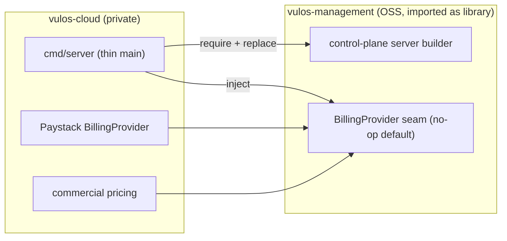

# Architecture — the two-repo split and the BillingProvider seam

Vulos ships as two repositories that build one control plane. This document
explains the split, the `BillingProvider` seam that makes it work, and the Go
module mechanics that let the private cloud repo consume this OSS repo as a
library.

## The dividing line

There is exactly one rule:

> **If a self-hoster needs it to run their deployment → it lives in
> vulos-management (OSS, MIT). If it exists only because we charge money → it
> lives in vulos-cloud (private).**

Everything else follows from that.

| | **vulos-management** (this repo) | **vulos-cloud** (private) |
|---|---|---|
| License | MIT | Proprietary |
| Role | The complete operational control plane + admin console | The commercial layer only |
| Ships | accounts / auth / 2FA / OAuth sign-in, device enrollment (RFC-8628), OS routing + org/box directory, relay autoscaler + PoP registry/heartbeats + fleet health, superadmin + org-admin console, status pages, the `BillingProvider` **interface + no-op default** | the Paystack `BillingProvider` impl, commercial pricing/catalog, billing-only superadmin panels, the hosted marketing site |
| Runs standalone? | Yes — fully functional, metered-but-free | No — it's a thin wrapper that imports vulos-management |

The important consequence: **there is no forked control plane.** The OSS control
plane is the production control plane. vulos-cloud does not re-implement routing
or auth or the fleet — it imports them and injects a billing provider.

## The BillingProvider seam

The control plane records billable events regardless of who is running it —
storage sampled, relay GB, mailboxes, box-hours. What differs is what happens to
those events. That difference is isolated behind one seam.

```
                     records usage events
   control plane  ─────────────────────────►  BillingProvider (interface)
   (this repo)                                       │
                                     ┌───────────────┴────────────────┐
                                     ▼                                ▼
                          Noop BillingProvider              Paystack BillingProvider
                          (this repo, default)              (vulos-cloud, injected)
                          charges nothing,                  real recurring + overage
                          verifies nothing,                 charging, commercial
                          no network call                   pricing
```

- **No-op default (OSS):** every metered path still runs and every event is
  still recorded and visible to the operator, but the provider charges nothing,
  verifies nothing, and makes **no network call off the box**. Self-hosting is
  metered-but-free with zero phone-home.
- **Paystack provider (cloud):** injected at the composition root in the private
  build. Adds real recurring + overage + add-on charging and commercial pricing.

Both builds compile against the **same interface**; only the injected
implementation differs. No package in vulos-management imports a payment
processor directly — the charge/verify hot paths go through the seam.

### Where the seam lives in the code

Today, in vulos-cloud, the seam is expressed as the `payments.PaymentRail`
interface (`InitTransaction` / `VerifyTransaction` / `VerifyWebhookSignature`)
with three concrete rails: `PaystackRail`, `StubRail` (network-free, used by
tests and dev), and rail selection via `payments.Default()` reading
`CP_PAYMENT_RAIL`. The richer billing state machine lives in
`internal/billing`. In the extracted layout:

- The **interface** (`BillingProvider` / `PaymentRail`) and a **no-op/stub
  default** move into vulos-management as a public package.
- The **Paystack implementation** and the **commercial pricing/catalog** stay in
  vulos-cloud and register themselves into the seam at wire-time.

See [EXTRACTION-PLAN.md](EXTRACTION-PLAN.md) for exactly which packages move and
which stay, and the module mechanics.

## The StorageProvisioner seam

The control plane manages a storage plane (per-account content, uploads,
sampling), but **it does not create buckets** — provisioning object storage is a
Cloud-only concern. That boundary is a second seam.

```
   control plane  ─────────────────────►  StorageProvisioner (interface)
   (this repo)                                    │
                              ┌────────────────────┴────────────────────┐
                              ▼                                          ▼
                   BYOB StorageProvisioner                   Tigris StorageProvisioner
                   (this repo, default)                      (vulos-cloud, injected)
                   uses an operator-supplied,                auto-provisions per-account
                   S3-compatible bucket;                     Tigris buckets + keys;
                   creates nothing                           bills egress/storage
```

- **BYOB default (OSS):** the self-hoster brings their own S3-compatible bucket
  and credentials; the control plane reads/writes it but never calls a
  provider's bucket-creation API. Sovereign, zero external accounts required.
- **Tigris provisioner (cloud):** injected in the private build; auto-provisions
  per-account Tigris buckets and access keys, and feeds storage sampling into
  billing.

Management is deliberately **BYOB** — the same reason billing is a no-op by
default. A self-hoster should never need a Tigris (or any vendor) account to run
their deployment.

## How vulos-cloud consumes this repo

The two repos are separate Go modules. vulos-cloud imports vulos-management and
overrides billing at the composition root.

**Module mechanics:**

1. vulos-management publishes its control-plane packages under **public** import
   paths (`pkg/...` or top-level packages), *not* `internal/...` — Go forbids
   importing another module's `internal/` tree, so anything cloud needs must be
   public.
2. vulos-cloud's `go.mod` does:
   ```
   require github.com/vul-os/vulos-management v0.x.y
   // during co-development:
   replace github.com/vul-os/vulos-management => ../vulos-management
   ```
3. vulos-cloud's `cmd/server` (the thin commercial main) builds the
   vulos-management server and **injects** the Paystack `BillingProvider` and
   commercial pricing into it before starting — the same way the OSS `cmd/server`
   injects the no-op provider.



The OSS `cmd/server` in this repo wires the no-op provider and is a
fully-working control plane on its own. The cloud `cmd/server` is the *only*
place the Paystack provider is constructed.

## Deployment shapes

The control plane is a single Go binary (SQLite by default; Postgres optional
for the cloud pricing tables). Its shape is defined by whether a real
`BillingProvider` is wired:

| Shape | How | Billing |
|---|---|---|
| **Self-hosted** (default, this repo) | run the vulos-management binary | metered-but-free no-op; no phone-home |
| **Commercial** (vulos-cloud build) | run the cloud binary that injects Paystack | real recurring + overage charging |

Both are the same control-plane code; the cloud build only *adds* a billing
provider on top.

## Related docs

- [SELF-HOST.md](SELF-HOST.md) — run the whole suite sovereignly with compose
- [DEPLOY-CP.md](DEPLOY-CP.md) — production control-plane deploy checklist
- [DEPLOY-RELAY.md](DEPLOY-RELAY.md) — relay PoP fleet deploy
- [SUPERADMIN-CONSOLE.md](SUPERADMIN-CONSOLE.md) — the operator console
- [EXTRACTION-PLAN.md](EXTRACTION-PLAN.md) — the plan to move the Go control-plane
  code out of vulos-cloud into this repo
