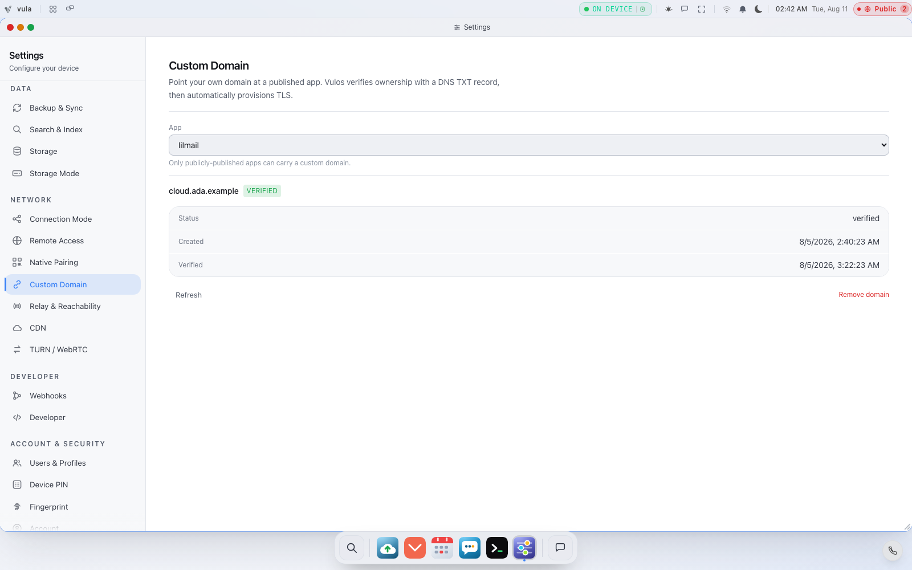

# Adding a Custom Domain

You can point a domain you own — `example.com`, `cloud.mysurname.co.za` — at your
Vulos box. There are two related things you might mean by "a custom domain", and
Vulos handles them in different places:

1. **Reach the whole box on your own domain** — the *Own Domain* connection mode.
2. **Give a published app or website its own domain** — the *Custom Domain* panel,
   with a DNS TXT-record challenge.

Both are **owner-gated**. This page covers each.

For the networking model behind it see [NETWORKING.md](NETWORKING.md); for the
settings surfaces see [SETTINGS.md](SETTINGS.md).

---

## 1. Reach the whole box on your own domain

In **Settings → Connection Mode** you choose how the box reaches the outside
world. One of the options is **Own Domain**: you put your own domain and reverse
proxy in front of the box.

- Choose **Own Domain** and set your public IP/domain under **Remote Access** so
  the box knows the URL it is reached on.
- Point your domain's DNS at your box (or at the reverse proxy in front of it),
  terminate TLS there, and proxy through to the box.
- Switching connection mode **never changes the box's identity** — its ULID and
  keys stay the same. You can move between Fabric (relay), Direct, Own Domain and
  Local-Only without re-enrolling.

This is the option to use when you want `cloud.example.com` to *be* your box. The
full connection-mode reference, DNS, TLS and ports are in
[NETWORKING.md](NETWORKING.md).

---

## 2. Give a published app its own domain

When you publish an app, it gets a default subdomain. To put your **own** domain
on it, use **Settings → Custom Domain** (`frontend/src/core/settings/DomainPanel.tsx`).

<picture>
  
</picture>

### Prerequisite

The app must **already be published** (visibility `public` — see
[APPS.md](APPS.md)). If it isn't, the backend refuses with `409` and the panel
tells you to publish first.

### The flow (DNS TXT challenge)

The handlers live in `backend/services/appnet/customdomain.go` and are scoped to
the authenticated owner (`X-User-ID`, stamped by the auth middleware — a client
cannot forge it):

1. **Attach the domain.** `POST /api/apps/{id}/domain` with your domain. The box
   generates a random **challenge token** and records the domain as `pending`,
   returning the DNS record you must create.
2. **Publish the DNS TXT record.** At your DNS provider add:

   ```
   _vulos-verify.<your-domain>   TXT   <challenge_token>
   ```

3. **Verify.** `POST /api/apps/{id}/domain/verify` performs a live DNS TXT lookup
   for `_vulos-verify.<your-domain>`. If it finds your token the domain flips to
   `verified`; otherwise it stays pending and tells you what it found.
   **`verified` means the DNS challenge passed — it does not mean the domain
   serves your app.** See the next section.
4. **Check status** any time with `GET /api/apps/{id}/domain`, and **remove** the
   domain with `DELETE /api/apps/{id}/domain` (which reverts the app to its
   default subdomain).

The panel shows a **Pending / Verified** badge so you can see where a domain is
in the process.

> **`VULOS_CADDY_DIR` in dev/CI** is set to `noop`, and both the snippet write
> and its removal no-op on that value
> (`backend/services/appnet/customdomain.go:222,255`), so nothing touches a
> Caddyfile in a dev or CI setup.

### ⚠️ What "verified" does *not* do — you must wire the proxy yourself

On success the box writes a Caddy virtual-host snippet to
`$VULOS_CADDY_DIR/<appID>--custom.caddy`, defaulting to
`/etc/caddy/vulos-apps/` (`customdomain_api.go:60-66,201-202`). That is the
whole of the "activation". Three things it does not do, none of which the
status badge knows about:

- **Nothing reloads Caddy.** No Go path in the repo runs `caddy reload` or
  `systemctl reload caddy` after writing the snippet — a freshly-written vhost
  is not live until the operator reloads Caddy themselves.
- **Nothing imports the snippet directory.** `build.sh:486-499` is the only
  Caddyfile generator in the repo, and the `/etc/caddy/Caddyfile` it writes
  contains **no `import` of `/etc/caddy/vulos-apps/`**. The snippets are written
  *for a self-hoster to include from their own Caddyfile*
  (`subdomain_provision.go:292`) — nothing includes them automatically.
- **Most deployments have no Caddy at all.** Caddy is installed only by
  `build.sh --deploy`, the SSH-to-a-Linux-server path (`build.sh:459-529`).
  It is not in the Dockerfile and not in the bare-metal image's package list, so
  on Docker, live USB, netboot and disk installs the snippet is written into a
  directory nothing reads.

So treat `verified` as "the DNS challenge passed and a vhost file has been
generated for you", and finish the job in your own reverse proxy. A future
change may close this; today it is on you.

### Published static websites

Static sites you deploy through the web host (`/api/web/*`) attach custom domains
the same way, via `POST /api/web/sites/{site}/domains`. Every management route
there is scoped to the owner (`X-User-ID`) and fails closed with `401` on an empty
session.

> **On this path a custom domain never reaches `active` at all — by
> construction.** `DomainStatus` promotes a domain only when the installed
> `CertProvider` confirms it holds a certificate
> (`backend/services/webhost/domain.go:147-150`), and the provider installed is
> always `NoopCertProvider{}` (`webhost/webhost.go:196`), whose `HasCert` is a
> hard `false` (`webhost/cert.go:74`). The seam to swap in a real one,
> `WithCertProvider` (`webhost/webhost.go:156`), has **zero call sites anywhere
> in the repo** — nothing installs a TLS backend. certmagic and every ACME
> dependency are deliberately absent from `go.mod` (`webhost/cert.go:35-38`).
>
> The code is honest about this where it can be — the domain stays `pending`
> rather than pretending — so the correct expectation is: attach a domain to get
> its DNS instructions, then terminate TLS for it in your own reverse proxy.
> Vulos will not issue a certificate for it.

---

## CDN (owner only) — read this caveat

**Settings → CDN** lets the owner describe a CDN vendor (Cloudflare / Fastly /
Bunny) in front of the box — origin host, Host header, authenticated-origin-pulls
— and preview an origin-firewall ruleset that would restrict inbound traffic to
that vendor's published IP ranges.

> **Important:** the CDN panel is explicit that enabling the firewall here only
> **generates and shows** the ruleset. It does **not** yet apply anything to the
> box's actual network filter. Treat it as a configuration preview, not a live
> enforcement switch.

---

## Related pages

- [NETWORKING.md](NETWORKING.md) — connection modes, DNS, TLS, ports, firewall.
- [SETTINGS.md](SETTINGS.md) — where these panels live.
- [APPS.md](APPS.md) — publishing an app so a domain can be attached.
- [ACCOUNTS-ACCESS.md](ACCOUNTS-ACCESS.md) — why these actions are owner-gated.
