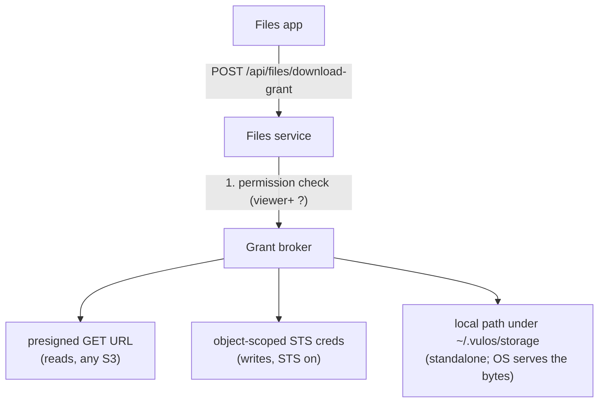

# The Files app & storage

How Vulos OS stores your files: the Files (Drive) app, resumable uploads, the viewer/editor/owner sharing model, external drives (Google Drive, Dropbox, GCS), and where your bytes actually live — on disk and in the object store.

---

## The two file apps, at a glance

Vulos OS ships two built-in apps that deal with files. They do different jobs:

| App | Launchpad id | What it is |
|---|---|---|
| **Drive** | `drive` | Your personal cloud drive. Folders, uploads, versions, sharing, external mounts. Backed by the OS Files service (`/api/files/*`) and your per-user storage bucket. This chapter is about this app. |
| **Files** | `files` | A system file manager for browsing the box's local filesystem (the machine itself, not your Drive). Useful for admins poking at the OS. |

Everything below refers to **Drive** — the Files service — unless it says otherwise.

The Drive app has three views in its sidebar:

- **My Drive** — files and folders you own.
- **Shared with me** — items other users granted you access to.
- **Received** — items redeemed from a peer-share capability link (box-to-box shares), staged locally until you save them into your Drive.

## What you can do

| Action | Where | Minimum role required |
|---|---|---|
| Browse / list a folder | My Drive, Shared with me | viewer |
| Download a file | row menu → Download | viewer |
| View version history | row menu → Versions | viewer |
| Upload a file | toolbar → Upload | editor on the target folder |
| Create a folder | toolbar → New folder | editor on the parent |
| Rename / move | row menu | editor |
| Delete | row menu | editor |
| Share with a user, create a link | row menu → Share | owner |
| Revoke a share or link | Share dialog | owner |

A few behaviors worth knowing:

- **Delete is a soft delete.** The item disappears from listings, but there is currently no trash view and no undelete action in the UI. Treat delete as permanent.
- **Moves are real byte moves.** Renaming or moving a folder relocates the underlying objects so the store always mirrors your folder tree. A move either fully lands or fully rolls back — you never end up half-moved.
- **You cannot move an item into a different user's Drive**, and you cannot move a folder into its own subtree.
- **Names** are limited to 255 characters and may not contain `/`, `\`, or be `.` / `..`. Two siblings cannot share a name.
- **Versions**: every completed upload to an existing file records a new version entry (size, uploader, timestamp), viewable from the row menu.
- **Search**: the sovereign assistant can find files for you by name — it only ever sees files you own or that were shared with you. See [ASSISTANT.md](ASSISTANT.md).

## How uploads work

You do not need to know any of this to drag a file into the window — but it explains what you see in the progress bar, and it matters if you script against the API.

### Small files (under 16 MiB): single shot

The app asks the OS for an upload grant, sends the bytes, then commits:

1. `POST /api/files/upload-grant` — creates (or locates) the file entry and returns a short-lived write grant (15 minutes).
2. The bytes go either **directly to the object store** (a presigned URL or object-scoped credentials, when your deployment supports it) or through the OS itself via `PUT /api/files/content?node=<id>` (capped at 512 MiB per request). The OS-mediated path is what a standalone box with no object store uses.
3. `POST /api/files/commit` — records the new version and final size.

Every step is permission-checked server-side before any byte moves.

### Large files (16 MiB and up): resumable chunked upload

Large files use a [tus.io](https://tus.io)-style resumable protocol (version 1.0.0). The file is cut into bounded chunks so each request stays small enough to ride the Vulos relay, and an interrupted upload resumes exactly where it left off instead of starting over.

Endpoints (session-authenticated, like the rest of `/api`):

| Method & path | Purpose |
|---|---|
| `OPTIONS /api/files/upload/resumable` | Capability discovery (`Tus-Extension: creation,checksum,termination`) |
| `POST /api/files/upload/resumable` | Create an upload: `Upload-Length` + `Upload-Metadata` → `201` with the upload id |
| `HEAD /api/files/upload/resumable/{id}` | Ask the server how many bytes it has committed (`Upload-Offset`) |
| `PATCH /api/files/upload/resumable/{id}` | Append one chunk at `Upload-Offset` |
| `DELETE /api/files/upload/resumable/{id}` | Cancel and discard the partial upload |

`Upload-Metadata` (comma-separated `key base64(value)` pairs) carries:

| Key | Required | Meaning |
|---|---|---|
| `filename` | yes | Target file name |
| `parent` | no | Target folder id (empty = Drive root) |
| `content_type` | no | MIME type |
| `sha256` | no | Hex SHA-256 of the whole file, verified before the file enters your Drive |

Limits and behavior:

- **One upload is capped at 5 GiB** (`Tus-Max-Size`); a create declaring more is rejected with `413`.
- **One chunk is capped at 64 MiB.** The app sends 8 MiB chunks by default.
- **Resume-from-committed-offset:** after a dropped connection, the client `HEAD`s the upload, reads `Upload-Offset`, and continues from there. A `PATCH` whose offset does not match the server's committed offset gets `409` — the guard against gaps and duplicated chunks. The committed offset is persisted, so resume survives a server restart too.
- **Integrity, twice:** an optional per-chunk `Upload-Checksum: sha256 <base64>` header is verified *before* the chunk is committed to disk (mismatch → `460`), and the optional whole-file `sha256` from the metadata is verified over the assembled file *before* it is promoted into your Drive. A corrupt upload never touches your files.
- **Abandoned partials expire.** An upload untouched for 24 hours is swept (both the record and the staged bytes), so walked-away uploads never leak disk.
- **At most 32 uploads in flight per user** (`429` beyond that) — finish or cancel one first.
- Partial uploads are strictly private: another user probing your upload id gets `404`.

Staged chunks are assembled under `~/.vulos/data/uploads/` on the box and, on completion, streamed into your Drive through the same permission-checked path as any other upload.

Scripted example (bash, small enough for one chunk):

```bash
# 1. create
curl -si -X POST https://your-box/api/files/upload/resumable \
  -H "Cookie: $SESSION" \
  -H "Tus-Resumable: 1.0.0" \
  -H "Upload-Length: $(stat -c%s report.pdf)" \
  -H "Upload-Metadata: filename $(printf report.pdf | base64)"
# → 201, {"id":"01J...","offset":0,...}

# 2. send the bytes (offset 0)
curl -si -X PATCH https://your-box/api/files/upload/resumable/01J... \
  -H "Cookie: $SESSION" \
  -H "Tus-Resumable: 1.0.0" \
  -H "Content-Type: application/offset+octet-stream" \
  -H "Upload-Offset: 0" \
  --data-binary @report.pdf
# → 204, Upload-Offset: <size>, Upload-Complete: 1, Vulos-Node-Id: <file id>
```

## Sharing and the permission model

### Roles: viewer < editor < owner

Every file and folder has an owner (the user whose Drive it lives in) and, optionally, per-user grants:

| Role | Can |
|---|---|
| **viewer** | List, download, see versions |
| **editor** | Everything a viewer can, plus upload, rename, move, delete, create folders |
| **owner** | Everything, plus manage shares and links. Ownership follows the Drive — it cannot be granted away |

Rules, all enforced by the server before anything happens:

- **Permissions inherit down folders.** Sharing a folder as `editor` makes everything inside it editable by that person. Where several grants apply, the *highest* wins.
- **Only the owner can share, unshare, or manage links.**
- Collaborators creating files inside your shared folder create them *in your Drive* — you own them.
- Unauthorized access to a file id returns `404`/`403` and never a storage grant; the existence of files you cannot see is not leaked.

Sharing actions in the UI map to `POST /api/files/share`, `/api/files/share-by-email`, `/api/files/unshare`, and `GET /api/files/shared-with-me`.

### Share by email

You share with an **email address**, not an internal account id. The OS resolves the address and routes automatically:

- **Same instance / same cloud:** the recipient gets a normal role grant and the item appears in their "Shared with me".
- **Remote (another Vulos box or a cloud account elsewhere):** the OS mints a per-document, role-scoped, expiring, revocable *capability* bound to the recipient's identity and delivers it to their server. See [PEERING.md](PEERING.md) for the identity layer underneath.

### Share links

`Share → Create link` mints an expiring, revocable token:

- Default lifetime **7 days**, maximum **30 days** — no permanent public links.
- Anyone signed in to the instance who has the link can redeem it for **read** access to the file (`POST /api/files/redeem-link`). Editor-role links exist in the data model, but redemption currently grants read only.
- The owner can list and revoke links at any time; a revoked or expired link answers `410`.

### Peer-share: box-to-box, no bucket required

A box with no object store at all can still share, directly to another box, over the peering transport:

- The owner's box signs a **capability** (one file or folder, one access level, an expiry, optionally bound to one recipient identity) with its own Ed25519 peering key.
- The capability *is* the link — a self-contained paste-anywhere token. The recipient's box verifies the signature before contacting anyone, then streams the bytes straight from the owner's box (folders arrive as a tar archive).
- Capabilities are **revocable**: the owner keeps a record and refuses to serve bytes for a revoked one, even though the token itself is still validly signed.
- Redeemed items land in the **Received** view, staged on local disk, until you "Save to Drive".

UI: row menu → *Peer share* to issue; sidebar → *Received* → *Redeem link* to accept. API: `/api/files/peer/issue`, `/peer/revoke`, `/peer/shares`, `/peer/redeem`, `/peer/received`, `/peer/save`.

### Sealed (content-blind) sharing

When a share to a remote recipient has to pass through infrastructure neither of you controls (for example the Vulos cloud staging a file for an account-only recipient), the Drive app can **seal** the content first:

- Your browser encrypts the file (X25519 key agreement, HKDF-SHA256, AES-256-GCM — all standard WebCrypto) to the recipient's published content key and to your own, producing a `VSEAL1` envelope. The file name and type ride *inside* the encryption.
- The relaying server transports ciphertext it cannot open; only the recipient's device (holding their master key) can decrypt.
- **Fail closed:** if the recipient has never published a content key, the sealed share is refused rather than silently sent as plaintext.

Your master key — and therefore your ability to open sealed content — is protected by your recovery phrase. See [BACKUP-RECOVERY.md](BACKUP-RECOVERY.md) and [SECURITY.md](SECURITY.md).

### Cloud storage default sealing

**Storage is not content-blind by default.** A normal Drive upload — `POST
/api/files/upload-grant` then a direct `PUT` of your file's raw bytes — is
plaintext on the wire and plaintext in the bucket. When your bucket is a
self-hosted S3/MinIO/Tigris endpoint you configured yourself, that plaintext
never leaves infrastructure you control. When your bucket is **provisioned by
Vulos Cloud** (`DEPLOY_MODE=cloud`), the control plane holds the Tigris master
credential and *brokers* the presigned PUT/GET URL — so it is technically
capable of reading those bytes. See vulos-cloud's `DEPLOY-SECURITY.md` §1 for
that trust boundary in full; this is the honest default, not a defect.

To close that gap for the common case, a cloud-provisioned deployment now
defaults **single-shot Drive uploads** to client-side sealed:

- `POST /api/files/upload-grant` returns `grant.seal_default: true` exactly
  when `DEPLOY_MODE=cloud` **and** the grant is a presigned URL to a real
  bucket (never for self-host, and never for `DEPLOY_MODE=os`, where you — not
  the CP — hold the bucket credential).
- When true, the Drive app seals the file client-side to **your own**
  published X25519 content key — the identical VSEAL1 envelope + WebCrypto
  primitives used for [content-blind sharing](#sealed-content-blind-sharing)
  above, just wrapped to one recipient (you) instead of a peer. The CP's
  presign broker then only ever sees ciphertext; only a device holding your
  master key can open it. Downloading is unchanged — the Drive app already
  auto-detects and opens any VSEAL1 envelope, sealed-by-default or shared.
- **Fail-closed, not fail-silent:** if no master key is unlocked in the
  browser, the upload is refused with an explicit "Unlock your account to
  upload to cloud storage sealed by default" error — it never falls back to a
  silent plaintext upload.
- File name and content-type are **not** wrapped into the seal for this case
  (unlike a share): they already live only in your box's own SQLite index,
  which the CP never sees, so there is nothing to hide there.

**Known, honest gap — not yet covered:** the **resumable/chunked** upload path
(files ≥ 16 MiB) is **not** sealed. VSEAL1 authenticates one AEAD tag over the
*whole* plaintext, which does not compose with per-chunk streaming without a
wire-format change (a real, tracked follow-up — not silently assumed done).
Large files uploaded to a cloud-provisioned bucket are plaintext to the CP
today exactly like any other unsealed upload. `DEPLOY_MODE=os` deployments and
self-hosted object stores are entirely unaffected by any of this — sealing is
a client-added confidentiality layer on top of whatever bucket you point at,
never a storage-tier guarantee.

## External drives and importing

### Mounting Google Drive, Dropbox, or Google Cloud Storage

If your box is enrolled with a control plane that brokers integrations (see [CLOUD.md](CLOUD.md)), you can connect external stores so they appear in the Drive sidebar as additional drives:

| Provider | Read | Write |
|---|---|---|
| Google Drive (`gdrive`) | yes | provider-dependent (`writable` flag per mount) |
| Dropbox (`dropbox`) | yes | provider-dependent |
| Google Cloud Storage (`gcs`) | yes (bucket + prefix you specify) | provider-dependent |

The trust model is deliberate:

- **Your box never holds the provider's long-lived refresh token.** It mints a short-lived access token from the cloud integration broker for each call, uses it once, and drops it. Nothing token-shaped is written to the Files database — the mount record stores only "this user connected provider X" plus non-secret config.
- Provider traffic goes only to the provider's fixed API hosts (SSRF-guarded).
- Writes to a writable mount never silently overwrite: the default conflict policy renames the new item with a ` (n)` suffix; overwrite must be requested explicitly.
- Without a configured broker, the whole feature degrades to "not available" — local Drive and peer-share keep working. There is no hard cloud dependency.

UI: sidebar → *Connect*. API: `/api/files/external/status`, `/connect`, `/disconnect`, `/mounts`, `/list`, `/content`, `/folder`, `/upload`.

### Importing (copies you own)

A mount is a window into the provider; an **import** copies files *into* your Drive so they persist after you disconnect:

- Sources: Google Drive and OneDrive for files (Google-native docs are exported to Office formats on the way in), plus Google Contacts and Google Calendar, which import via the mail connector (CalDAV/CardDAV) rather than your Drive.
- Two modes: **Import once** (a single copy) or **Keep in sync** (re-pulls add new files; your copies are never deleted).
- API: `POST /api/files/import`, `GET /api/files/import/jobs`, `POST /api/files/import/jobs/{id}/sync`, `DELETE /api/files/import/jobs/{id}`.

## Quotas and limits

There is currently **no per-user storage byte quota** enforced by the Files service on a self-hosted box — capacity is bounded by your disk or bucket. (Managed Vulos Cloud plans meter storage at the billing layer instead.) The enforced limits are operational:

| Limit | Value |
|---|---|
| Single-shot OS-mediated upload | 512 MiB per request |
| One resumable upload | 5 GiB |
| One resumable chunk | 64 MiB |
| Concurrent unfinished resumable uploads per user | 32 |
| Storage grant lifetime | 15 minutes |
| Share link lifetime | 7 days default, 30 days max |

## Where your bytes actually live

The Files service is a *control plane*: it owns the index (names, folders, permissions, versions, links) in a SQLite database at `~/.vulos/db/files.db` on the box. The *bytes* live separately, in one of two places.

### With an object store (S3 / MinIO / Tigris)

Every user gets their **own bucket**, named `vulos-<userID>` by default (the prefix is configurable). Inside a user's bucket:

```
vulos-<userID>/
  <userID>/drive/<folder>/<file>     ← your Drive documents (canonical layout)
  <userID>/<appID>/...               ← per-app data for apps with the "storage" permission
```

- `<userID>/drive/...` mirrors your visible folder tree one-to-one — the key *is* the path, which is why moves relocate bytes.
- Each app you grant the `storage` permission gets its own `<userID>/<appID>/` prefix, separate from your documents.
- The OS keeps its own cluster/sync data in a separate bucket (`vulos-cluster` by default) under an `os/` prefix — never mixed with user data.
- Per-user buckets mean cross-*user* isolation holds by construction. Cross-*app* isolation within one user additionally needs STS (below).

### Without an object store (standalone)

A box with no S3 endpoint configured stores bytes on its own disk under `~/.vulos/storage/`, mirroring the exact same key layout (`~/.vulos/storage/<userID>/drive/...`). Uploads and downloads then flow through the OS data plane (`PUT`/`GET /api/files/content`) since a browser cannot touch the box's filesystem directly. Everything in this chapter — permissions, sharing, resumable upload, peer-share — works identically.

Note for backups: this directory is **not** covered by the built-in Restic vault, which snapshots `~/.vulos/data` only — see [BACKUP-RECOVERY.md](BACKUP-RECOVERY.md).

### Related on-disk paths

| Path | What it holds |
|---|---|
| `~/.vulos/db/files.db` | The Drive index: folders, permissions, links, versions, audit log |
| `~/.vulos/db/uploads.db` | Resumable-upload state (committed offsets) |
| `~/.vulos/data/uploads/` | Staging area for in-flight resumable uploads |
| `~/.vulos/db/peer-received/` | Staged bytes redeemed from peer-share capabilities |
| `~/.vulos/storage/` | Standalone-mode object bytes (no S3 configured) |
| `~/.vulos/<appID>/` | Sandboxed local data for built-in apps (the `appfs` API) |

## For admins: configuring the storage seam

Concepts first: when an app (or the Files app) needs bucket access, the OS *brokers* it — it resolves the user's bucket and hands out the narrowest credential it can. The quality of "narrowest" depends on whether you configure STS.

### Core storage variables

These configure the unified per-user object store (they take precedence over the legacy `VULOS_S3_*` cluster variables, which are accepted as fallbacks for the connection settings):

| Variable | Default | Meaning |
|---|---|---|
| `VULOS_STORAGE_ENDPOINT` | _(empty → standalone local-FS mode)_ | S3-compatible endpoint |
| `VULOS_STORAGE_REGION` | `us-east-1` | Region |
| `VULOS_STORAGE_ACCESS_KEY` / `VULOS_STORAGE_SECRET_KEY` | _(empty)_ | The box's own S3 credentials (the identity STS scoping is minted from) |
| `VULOS_STORAGE_USE_SSL` | `false` | TLS to the endpoint |
| `VULOS_STORAGE_BUCKET_PREFIX` | `vulos-` | Per-user bucket name prefix (`vulos-<userID>`) |
| `VULOS_STORAGE_BUCKET` | _(unset)_ | **Opt-in single shared bucket.** Only for a genuinely single-user box — the server refuses to boot with this set while more than one user exists |
| `VULOS_STORAGE_OS_BUCKET` | `vulos-cluster` | Bucket for the OS's own cluster/sync data |
| `VULOS_STORAGE_LOCAL_ROOT` | `~/.vulos/storage` | Standalone-mode byte root |
| `VULOS_STORAGE_BROKER_SECRET` | _(unset → injection disabled, fail-closed)_ | Authenticates the gateway to apps consuming injected storage headers |

### STS: short-lived, scoped credentials

| Variable | Default | Meaning |
|---|---|---|
| `VULOS_STORAGE_STS_ENDPOINT` | _(unset → self-host defaults to the box's own object-store endpoint when one is configured)_ | STS endpoint (e.g. your MinIO server) |
| `VULOS_STORAGE_STS_DISABLE` | _(unset)_ | Set to `1` to opt out of the self-host STS auto-default |
| `VULOS_STORAGE_STS_ROLE_ARN` | _(unset)_ | Role ARN; required for AWS STS, ignored by MinIO's AssumeRole |
| `VULOS_STORAGE_STS_DURATION_SECONDS` | `900` | Lifetime of minted credentials |

With STS available (the self-host default whenever an object store is configured):

- Apps with the `storage` permission receive credentials scoped to exactly their `<userID>/<appID>/` prefix.
- Files write grants become **object-scoped** STS credentials — read/write on exactly one key, minted only after the permission check, expiring in minutes.

**A storage-permitted app never receives a static, full-bucket credential.** If STS is unavailable — no object store configured at all (nothing to protect), `VULOS_STORAGE_STS_DISABLE=1` is set, or a mint attempt fails — the gateway injects **no** storage credential at all (fail-closed); the app must call `POST /api/storage/presign` for a short-lived, object-scoped grant instead (the same broker Files uses, generalised to any storage-permitted app). If an object store IS statically configured and at least one installed app declares the `storage` permission, the server **aborts at boot** rather than silently degrading in that combination. Cross-user isolation always holds regardless (per-user buckets); Files read grants remain single-object presigned URLs.

The full variable reference, including the self-host bundle's `/etc/vulos/storage.yaml`, lives in [CONFIGURATION.md](CONFIGURATION.md); the bundle install flow is in [SELF-HOST-BUNDLE.md](SELF-HOST-BUNDLE.md).

### How a grant is minted (mental model)



Every grant carries an expiry (15 minutes by default) and names exactly one object. The permission check always happens before the mint — an unauthorized caller never receives a grant of any kind.

## Troubleshooting quick hits

- **"external mounts not available" (503):** your box has no integration broker configured (standalone). Expected; local Drive is unaffected.
- **"peer-share unavailable" (503):** the box has no peering identity yet — see [PEERING.md](PEERING.md).
- **Resumable upload keeps answering 409:** your client's offset is stale; `HEAD` the upload and resume from the returned `Upload-Offset`.
- **Upload rejected with 429:** you have 32 unfinished uploads; cancel some (`DELETE`) or let the 24-hour sweeper reap them.
- **A shared link stopped working (410):** it expired (7-day default) or the owner revoked it — ask for a fresh one.

More in [TROUBLESHOOTING.md](TROUBLESHOOTING.md). For day-to-day usage of the shell and apps, see [USER-GUIDE.md](USER-GUIDE.md) and [APPS.md](APPS.md); for backups of everything described here, see [BACKUP-RECOVERY.md](BACKUP-RECOVERY.md).
