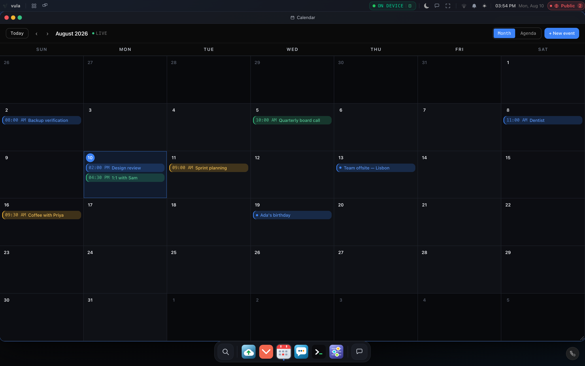
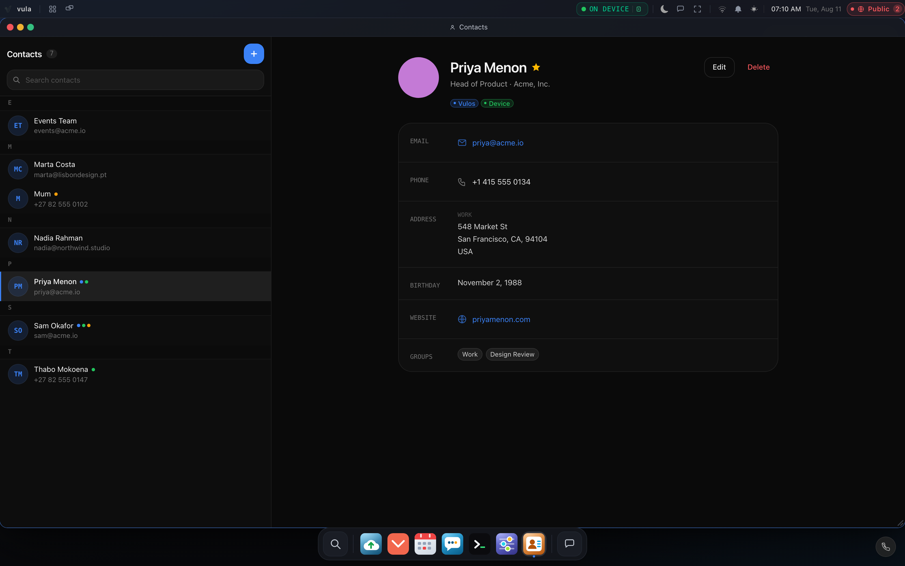

# Mail, Calendar and Contacts

Vulos does **not** host a mailbox for you and does not give you a Vulos e-mail
address. Instead it follows the **GNOME model**: a single data engine connects to
the mail/calendar/contacts accounts you **already own**, and the OS ships thin
surfaces on top of it. You bring your own account — Gmail, Outlook/Microsoft 365,
Fastmail, your employer's server, or any plain IMAP/CalDAV/CardDAV host.

This page explains how the pieces fit together and — importantly — where your
mail credentials are and are not visible.

For the wiring/config reference see [MAIL-LILMAIL.md](MAIL-LILMAIL.md).

---

## The pieces

| Piece | Role | Analogy (GNOME) |
|---|---|---|
| **lilmail** | The **data engine**. Connects your IMAP / CalDAV / CardDAV account (directly, or via an OAuth-linked Google/Microsoft account) and exposes a stable `/v1` API. | Evolution-Data-Server |
| **Mail app** | The OS's built-in inbox surface. | GNOME's mail client |
| **Calendar app** | Thin OS surface for events. | GNOME Calendar |
| **Contacts app** | Thin OS surface for your address book. | GNOME Contacts |

lilmail runs as its own local service (default `http://localhost:3000`,
configurable via `VULOS_MAIL_URL`) and lives in its own repository — no mail
source is vendored into the OS. An on-box mail *server* engine exists but is
dormant and experimental; the default and expected setup is **bring-your-own
mailbox**.

<picture>
  
</picture>

---

## Calendar and Contacts — credentials stay on the box

The Calendar and Contacts surfaces read and write through a
**credential-brokering proxy** on the box
(`backend/cmd/server/routes_pim.go`). This is the important privacy property:

- The browser calls the box, session-authenticated:
  `GET/POST/PUT/PATCH/DELETE /api/pim/calendar/*` and `/api/pim/contacts/*`.
- The box forwards those to lilmail's `/v1/calendar/*` and `/v1/contacts/*`, and
  **injects the mail credentials itself** (the `X-Vulos-Mail-*` headers, taken
  from the box's environment). The browser never supplies — and never sees — the
  broker secret or your mail password.
- Any `X-Vulos-Mail-*` header a browser tries to send is **stripped** before the
  real credentials are injected, so a page cannot forge the broker credential.
- The proxy is **PIM-only**: only the `calendar/` and `contacts/` subtrees are
  reachable. Any other `/v1` path (mail bodies, drafts, send) is refused with
  `404` here.
- `/api/pim/*` is not a public path, so an unauthenticated request is rejected
  with `401` before anything is proxied. If mail is misconfigured or unreachable
  the widgets degrade honestly (`503`/`502`) rather than hang.

The credentials the box injects come from its configuration
(`VULOS_MAIL_BROKER_*` environment variables — provider, account, IMAP/SMTP
hosts and ports, and a broker secret). When those are set, the broker mode is
active; when they are not, the proxy falls back to forwarding only your session
cookie.

---

## Unified contacts — one address book from every source

The Contacts app doesn't only show your CardDAV/Vulos cards. It shows a single,
de-duplicated address book merged from every place your contacts actually live:

<picture>
  
</picture>

- **Vulos / CardDAV** — the cards behind the proxy above.
- **Device + phone SIM** — the contacts on your Android phone. The Vulos app
  reads them (with your permission) and pushes them to the box at
  `POST /api/contacts/ingest/device`; nothing is read without the grant, and the
  push is owner-scoped.
- **Box SIM** — if a SIM is plugged into the box itself (a box with a GSM modem),
  its phonebook is read best-effort and contributes too.

The box merges these into one list at `GET /api/contacts/unified`
(`backend/services/contacts/`): entries that are clearly the same person are
fused, and each merged contact records **which sources it came from**. The
Contacts app badges them — `Vulos`, `Device`, `Box SIM` — so a contact that
exists in more than one place shows all of its badges, and a phone- or SIM-only
contact appears as a read-only row (you edit it on the device it lives on).

The unified endpoint is owner-gated and read-only; create/edit/delete still go to
CardDAV through the broker proxy. If a source is unavailable the list simply
omits it — the address book degrades to whatever sources are present.

---

## Mail — you sign in to lilmail's own UI

The **Mail** app is embedded differently from Calendar/Contacts. The OS shell
frames lilmail's own server-rendered UI in an `<iframe>` (it fetches the service
URL from `GET /api/mail/url`). lilmail handles the **IMAP/SMTP login itself** —
you enter your mailbox's e-mail and password into lilmail.

> **Be aware:** for the Mail app, the mail login is entered into the lilmail UI,
> which the browser is displaying. This is lilmail's own connection to your mail
> server — it is unrelated to your Vulos OS sign-in. The
> "browser never sees the mail password" guarantee described above applies to the
> **Calendar and Contacts** proxy path, not to the Mail app's direct login. If you
> prefer the brokered model for mail too, configure the box's broker credentials
> so lilmail is fed the account server-side.

For lilmail to embed cleanly it must allow the OS origin in its
`frame_ancestors` setting — see [MAIL-LILMAIL.md](MAIL-LILMAIL.md) for the exact
`config.toml`.

---

## Linking a Google or Microsoft account

lilmail's `/v1` contract supports connecting your calendar/contacts either
**directly** (IMAP/CalDAV/CardDAV with a username and app-password) or via an
**OAuth-linked Google/Microsoft account**, so the box can mint short-lived tokens
rather than holding a long-lived password. The direct path is the plainest to set
up today; the OAuth-linked path is the recommended target where your provider
requires it (for example Gmail accounts with modern-auth enforced).

---

## What this gives you, and what it doesn't

- **You keep your mailbox.** Your mail, calendar and contacts live where they
  always did; Vulos is a client, not a host.
- **No lock-in and no new address.** There is no Vulos mailbox to migrate off,
  and your identity is not tied to any mail account (see
  [IDENTITY-KEYS.md](IDENTITY-KEYS.md)).
- **Calendar/Contacts credentials stay on the box.** The browser talks only to
  `/api/pim/*`; the box holds the keys.
- **Mail is a direct client login.** The Mail app signs in to your mail server
  through lilmail unless you configure server-side brokering.

---

## Related pages

- [MAIL-LILMAIL.md](MAIL-LILMAIL.md) — service wiring, ports and `frame_ancestors`.
- [USER-GUIDE.md](USER-GUIDE.md) — using the apps day to day.
- [IDENTITY-KEYS.md](IDENTITY-KEYS.md) — why identity is decoupled from mail.
