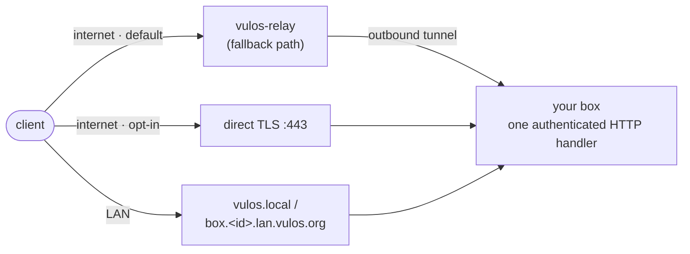

# Reachability & networking

How the outside world reaches your Vulos box: direct connections, the relay fallback, LAN discovery, DNS, TLS, and the ports you need to open (or keep closed) for each way of running it.

---

## The reachability model in one paragraph

A Vulos box always works from behind NAT. By default, all inbound traffic arrives through the Vulos relay fabric — the box makes an *outbound* connection, so you never have to open a port. If your box has a public IP or hostname, you can opt in to a **direct** public TLS listener; clients then try the direct path first and fall back to the relay when it is unreachable. Direct is a faster transport, not a different security posture: the direct listener serves the exact same authenticated handler as the relay-fronted path, so an unauthenticated request gets the same 401 either way. On top of both, an opt-in **LAN layer** keeps the box reachable on your local network even with the internet down.

If you remember one thing: **you never *have* to port-forward a Vulos box.** Everything below the "Direct mode" section is opt-in performance and independence, not a requirement.

A quick map of the paths a request can take:



All three paths land on the **same** authenticated HTTP handler. There is no "trusted because it came from the LAN" or "trusted because it came direct" bypass anywhere in the chain.

---

## Connection modes

The operator picks a high-level networking posture in Settings (persisted to `~/.vulos/db/network-mode.json`, surfaced over `GET`/`POST /api/network/mode`):

| Mode | What it means |
|---|---|
| `fabric` | Default. Traffic rides the Vulos relay fabric. No inbound ports needed. |
| `direct` | Direct WAN exposure with periodic re-enrollment (public IP + DNS kept up to date). |
| `own` | You bring your own domain and reverse proxy; Vulos sits behind it. |
| `local` | LAN-only. External listeners are blocked entirely. |

`local` mode is enforced in code, not just cosmetic: when it is selected, the server refuses to start the direct public listener even if `VULOS_DIRECT_ENABLE=1` is set.

The mode-switching endpoint is one of the routes disabled by the `VULOS_DISABLE_EXEC` kill-switch (see [SECURITY.md](SECURITY.md)).

---

## The sovereign tunnel (relay path)

The relay itself — the server that terminates tunnels and forwards clients to your box — lives in a separate project (`vulos-relay`) and is not part of this repository. The relay *agent* that dials out from your machine is also a separate binary; the OS deliberately does not embed it. What this repo provides is the box side of the contract:

- **The env seam.** When the direct listener comes up, the OS publishes its advertised endpoint to a co-located relay agent by setting `VULOS_RELAY_DIRECT_ENDPOINT` in the process environment. The agent hands that endpoint to the relay in its Register frame; the relay verifies it before ever telling a client about it.
- **The ownership probe.** The box serves an unauthenticated well-known path, `/_vulos-direct/probe`, on its direct listener. The relay GETs it with a one-time nonce in the `X-Vulos-Direct-Probe` header and the box echoes the nonce back. Only a box that actually controls the advertised endpoint can answer, so a box cannot advertise an endpoint it does not serve. This is the *only* unauthenticated route on the direct listener, and it carries no user data.
- **Host registration.** Opt-in host roles (BYO GPU streaming host, cross-instance notify fan-out) register with a relay over HTTPS using:

| Variable | Purpose |
|---|---|
| `VULOS_RELAY_BASE_URL` | HTTPS base URL of the vulos-relay node to register with. **Config-driven, never hardcoded** — set it to your OWN `vulos-relay` instance to self-host the relay; unset falls back to the managed relay (`https://relay.vulos.org`). |
| `VULOS_RELAY_NAME` | The name this box registers under |
| `VULOS_RELAY_TOKEN` | Bearer token the relay authorizes the box's registration/fan-out with |

The relay endpoint is fully config-driven: a self-hoster running their own `vulos-relay` points the box at it with `VULOS_RELAY_BASE_URL` (+ `VULOS_RELAY_TOKEN` for auth), and the managed relay is only the default when neither is set. No relay hostname is baked into the box wiring.

Because the relay path is outbound-only from the box, it works behind NAT, CGNAT, and hotel Wi-Fi. It is the mode that "always works"; everything else is an optimization.

---

## Direct mode: the public TLS listener

Direct mode is **off by default** and config-gated, because most boxes are NAT'd and must stay on the relay path. Turn it on only when the box has a genuinely reachable public IP or hostname.

```bash
VULOS_DIRECT_ENABLE=1
VULOS_DIRECT_HOSTNAME=box1.example.net
```

Full env surface (from `backend/internal/directlisten`):

| Variable | Default | Purpose |
|---|---|---|
| `VULOS_DIRECT_ENABLE` | unset (off) | `1` opts in. Unset means relay-only. |
| `VULOS_DIRECT_HOSTNAME` | — | Public DNS name. Required for ACME and for building the advertised endpoint. |
| `VULOS_DIRECT_ADDR` | `:443` | Listen address. |
| `VULOS_DIRECT_CERT_MODE` | `acme` | `acme` (Let's Encrypt via autocert) or `provided` (your own cert files). |
| `VULOS_DIRECT_CERT_FILE` / `VULOS_DIRECT_KEY_FILE` | — | Cert + key paths for `provided` mode. |
| `VULOS_DIRECT_ACME_CACHE` | under `~/.vulos/auth/direct-acme` | Where issued certs are cached (so a restart doesn't re-hit Let's Encrypt rate limits). |
| `VULOS_DIRECT_ACME_EMAIL` | — | Optional ACME account contact. |
| `VULOS_DIRECT_ENDPOINT` | derived `https://<hostname>[:port]` | Override for the advertised endpoint. Must be `https://` — a cleartext endpoint is refused. |

Behaviour worth knowing:

- **TLS is required.** The listener only ever serves HTTPS (TLS 1.2 minimum). In `acme` mode the certificate is requested automatically for `VULOS_DIRECT_HOSTNAME` (the ACME host policy is pinned to that one hostname, so an attacker-supplied SNI can never trigger an issuance); the challenge is answered on the same `:443` listener. In `provided` mode you supply the cert — the option for boxes with only a static IP, or behind your own PKI.
- **Fail-closed configuration.** ACME mode without a hostname, or provided mode without cert files, is a startup error, not a listener that silently cannot serve.
- **Self-reachability pre-check.** After start, the box fetches its *own* probe path over the public endpoint with a fresh nonce. If a firewall silently drops the traffic, you get a log line telling you the endpoint is not externally reachable yet — clients simply keep using the relay until it is.
- **Status route.** `GET /api/network/direct` (session-authed) reports `{enabled, endpoint, addr}` so you can confirm the fast path is active from the UI or curl.

---

## Domains and DNS

### How your box gets its name

The box's public domain is resolved in this order (from `backend/services/network`):

1. `VULOS_DOMAIN`, if set — always wins.
2. In `fabric` or `direct` domain mode: `{instance-ulid}.vulos.org`.
3. In `own` mode: the configured domain.
4. In `local` mode: `localhost`.

The public URL is surfaced at `GET /api/network/status`:

```bash
curl -s http://localhost:8080/api/network/status | jq
# { "url": "...", "domain": "...", "instance_id": "01H...", "hostname": "mybox", "mode": "..." }
```

### App subdomains and why the domain matters

The main request handler routes by `Host` header: a request for `{appId}.<your-domain>` is dispatched to the app gateway instead of the OS shell. That is why the domain must be a real, resolvable name with a wildcard: each app lives on its own subdomain (which is also what keeps app cookies and storage out of the OS origin). In development, `dev.sh` defaults `VULOS_DOMAIN` to `lvh.me` — a public domain whose every subdomain resolves to `127.0.0.1` — so `https://{app}.lvh.me:8080` works with no DNS setup at all.

### Published app subdomains (`VULOS_DNS_API`)

When you publish an app (visibility "public"), the box provisions a subdomain of the form:

```
{app}--{profile}.{instance-ulid}.vulos.org
```

The DNS record is created by calling a cloud DNS provisioning API. The relevant env vars:

| Variable | Default | Purpose |
|---|---|---|
| `VULOS_DNS_API` | `https://api.vulos.org/dns/provision` | The DNS provisioning endpoint. The sentinel value `noop` skips the network call entirely (dev/CI/self-hosted). |
| `VULOS_BASE_DOMAIN` | `vulos.org` | The base domain used to build app FQDNs. |
| `VULOS_CADDY_DIR` | `/etc/caddy/vulos-apps` | Directory where per-app Caddyfile snippets are written so self-hosters can `include` them from their main Caddyfile. `noop` skips snippet writes. |

This surface fails closed in production: in `VULOS_ENV=prod`, if `VULOS_DNS_API` or `VULOS_CADDY_DIR` is unset the server **refuses to register the subdomain routes at all**, so customers are never falsely told their domain is being provisioned while nothing happens. In dev/local both default to `noop` with a logged warning.

Each generated Caddy snippet declares the app's hostname with ACME TLS (Caddy requests the certificate automatically) and a `reverse_proxy` to the app's upstream.

### Custom domains for published apps

You can attach your own domain to a published app instead of the generated subdomain:

1. `POST /api/apps/{id}/domain` with `{"domain": "mysite.example.com"}` — returns a challenge token.
2. Add a DNS TXT record: `_vulos-verify.mysite.example.com` → the challenge token.
3. `POST /api/apps/{id}/domain/verify` — the box does a live TXT lookup; on success it writes a Caddy vhost snippet (ACME TLS) and marks the domain verified.
4. `DELETE /api/apps/{id}/domain` reverts to the default subdomain.

### Direct-mode DNS enrollment

In direct mode the box keeps its public DNS record pointing at its current IP: it detects its public IP via an echo service, enrolls with the Vulos control API (`https://control.vulos.org` by default) which returns acme-dns credentials (persisted in-process as `VULOS_ACME_DNS_UUID` / `VULOS_ACME_DNS_KEY`), and watches for IP changes, updating the record when your ISP hands you a new address.

### LAN DNS (works with the internet down)

With the LAN layer enabled (below), the box itself answers DNS for `box.<instance-id>.lan.vulos.org` on UDP port 53, so that name resolves on your LAN even when public DNS — or your whole uplink — is down.

---

## TLS: who terminates it, where

| Deployment | TLS terminated by | Certificate source |
|---|---|---|
| Local dev (`./dev.sh`, `--env=local`) | The Go backend, *if* certs exist; otherwise plain HTTP on loopback | `~/.vulos/localhost.pem` + `~/.vulos/localhost-key.pem` — the mkcert convention. `dev.sh` mounts these into the Docker container when present. |
| Docker / single binary in prod | The Go backend | `/etc/vulos/tls/cert.pem` + `/etc/vulos/tls/key.pem` (checked at startup, after the mkcert paths) |
| Direct mode | The direct listener inside the backend | ACME/Let's Encrypt (autocert) or operator-provided files (see table above) |
| LAN layer | The LAN HTTPS listener inside the backend | A cloud-issued certificate for `box.<id>.lan.vulos.org`, delivered to `/var/lib/vulos/tls/lan.crt` + `lan.key` (paths overridable via `VULOS_LAN_CERT` / `VULOS_LAN_KEY`), hot-reloaded on change; falls back to a self-signed cert until the real one arrives |
| `own` mode / published apps | Your reverse proxy (Caddy is the supported path) | Caddy's automatic ACME, driven by the snippets Vulos writes into `VULOS_CADDY_DIR` |
| Self-host bundle | Per-service listeners (OS on 8443, mail on 8444, office on 8445) | Configured via `/etc/vulos/fabric.yaml` (`domain`, `acme_email`) — see [SELF-HOST-BUNDLE.md](SELF-HOST-BUNDLE.md) |

Fetching the trusted LAN certificate from the cloud control plane is itself opt-in (`VULOS_LANCERT_ENABLE=1`) and hardened: the puller accepts an extra CA bundle (`VULOS_LANCERT_CA_PEM` / `VULOS_LANCERT_CA_FILE`) or SPKI pins (`VULOS_LANCERT_SPKI_PINS`), and refuses a plaintext control-plane URL unless `VULOS_LANCERT_ALLOW_INSECURE=1` is set (never do this outside a lab).

For local development with real HTTPS, generate the certs once with [mkcert](https://github.com/FiloSottile/mkcert):

```bash
mkcert -install
mkcert -cert-file ~/.vulos/localhost.pem -key-file ~/.vulos/localhost-key.pem localhost 127.0.0.1
```

The backend picks them up automatically on next start.

---

## LAN reachability and local discovery

The LAN layer (`VULOS_LAN_ENABLE=1`, off by default — not every install wants extra listeners) makes the box fully usable with the internet down. It starts three things:

1. **mDNS advertisement** — the box announces itself as `vulos.local` over multicast DNS (UDP 5353), so any client on the same network reaches it with zero configuration.
2. **A tiny DNS responder** — authoritative for `box.<instance-id>.lan.vulos.org` on UDP 53, answering with the box's LAN IP.
3. **A LAN HTTPS listener** — serves the full OS on `:443`, **pinned to the detected LAN IP** rather than all interfaces, so a multi-homed or public box never accidentally exposes this listener on its WAN side.

| Variable | Default | Purpose |
|---|---|---|
| `VULOS_LAN_ENABLE` | unset (off) | `1` enables the whole LAN layer. |
| `VULOS_LAN_HTTPS_ADDR` | `:443` | LAN HTTPS listen address (override for non-root runs). |
| `VULOS_LAN_DNS_ADDR` | `:53` | LAN DNS listen address. |
| `VULOS_LAN_CERT` / `VULOS_LAN_KEY` | `/var/lib/vulos/tls/lan.crt` / `.key` | LAN TLS material paths. |

mDNS and DNS bind failures are logged but non-fatal — a box that can still be reached by IP is better than no box.

Two practical notes:

- **Privileged ports.** 443 and 53 need root (or `CAP_NET_BIND_SERVICE`). If you run the backend as an unprivileged user, override both addresses (e.g. `VULOS_LAN_HTTPS_ADDR=:8443 VULOS_LAN_DNS_ADDR=:5354`) and adjust clients accordingly.
- **Containers and CI.** Multicast is often unavailable inside containers (no `CAP_NET_RAW`, no multicast-capable interface). The LAN layer treats mDNS as best-effort in that case: the HTTPS listener still comes up, only zero-config discovery is lost.

### Same-LAN box-to-box sync (fabric)

If you run more than one box on a LAN, the fabric sync loop discovers sibling boxes over mDNS and exchanges app-registry changesets directly — no cloud, no S3. It is gated on a shared secret: set the same `VULOS_FABRIC_SECRET` on every sibling box. Without the secret the exchange handlers stay **off (fail-closed)** rather than open an unauthenticated endpoint. The fabric handlers are mounted only on the LAN-pinned listener, never on the public surface.

### Box-to-box sync across the internet (fabric over rendezvous)

mDNS only sees multicast, so LAN discovery alone means two of your own boxes in
two different houses can never find each other. Set `VULOS_RENDEZVOUS_URL` to any
relay running the open rendezvous role and they can:

```sh
VULOS_RENDEZVOUS_URL=https://relay.example.org/rendezvous
```

Each box announces its reachable endpoints under its **own Ed25519 key** — the
same per-instance key the CRDT already uses to verify signed uninstall
observations, so no second identity is introduced — and resolves the keys of the
siblings in its registry roster. Everything after discovery is unchanged: the
changeset exchange still runs directly to the peer over TLS, still requires
`VULOS_FABRIC_SECRET`, and still fails closed without it.

This **composes with mDNS rather than replacing it**. A box in the same house is
still found by multicast with no round trip to anyone; the same box moved behind
a different NAT is found through the relay. If either source fails you keep the
peers the other one found.

What the relay learns is which keys are online and what endpoints they claim —
that is the price of NAT traversal. It sees no app data: announce and resolve
carry none, and it never sees a changeset. A relay that lies can withhold a peer
or point at an address you cannot authenticate to; it cannot forge a changeset,
because signature checking happens at the peer and is downstream of discovery.

Any conforming relay works — self-host `vulos-relayd`, use Vulos's, or set
nothing at all and stay LAN-only. The protocol is documented in
`vulos-relay/docs/RENDEZVOUS.md`.

| Variable | Effect |
|---|---|
| `VULOS_RENDEZVOUS_URL` | Relay rendezvous prefix. Unset = mDNS only (previous behaviour). |
| `VULOS_PUBLIC_URL` | Announced ahead of the LAN address, for peers resolving from outside. |

### Drop (nearby file sharing)

Drop advertises the service `_vula-drop._tcp.local` over mDNS so nearby Vulos peers discover each other, then transfers files over HTTP on the box's main port (8080). Discoverability is a per-box setting; inbound requests from non-contacts require approval. Cross-box shares that target private/LAN addresses are blocked by the SSRF guard unless you explicitly allow LAN peers with `VULOS_PEER_ALLOW_LAN=1` — legitimate for self-hosted boxes that genuinely live on the same network. See [PEERING.md](PEERING.md) and [FILES.md](FILES.md).

---

## Ports

Ports actually bound by the software in this repo, plus the self-host bundle's documented ports:

| Port | Protocol | What | When it exists | Exposure guidance |
|---|---|---|---|---|
| 8080 (or `PORT`) | TCP | Main backend: API, shell, apps, Drop transfers | Always | Loopback-only in `local`/`dev` env; all interfaces in `prod`. Front with TLS before exposing. |
| 5173 | TCP | Vite dev server (HMR), proxies `/api` to 8080 | `npm run dev` only | Never expose. Development only. |
| 443 | TCP | Direct public TLS listener | `VULOS_DIRECT_ENABLE=1` | The one port to forward for direct mode. |
| 443 | TCP | LAN HTTPS listener (pinned to LAN IP) | `VULOS_LAN_ENABLE=1` | LAN only by construction; do not forward. |
| 53 | UDP | LAN DNS responder | `VULOS_LAN_ENABLE=1` | LAN only; do not forward. |
| 5353 | UDP (multicast) | mDNS: `vulos.local`, Drop discovery, fabric sibling discovery | LAN layer / Drop / fabric | Multicast never crosses your router; nothing to forward. |
| 3478 | UDP/TCP | TURN media relay (coturn) | Only if you run your own coturn with `TURN_SECRET` set — the backend mints HMAC credentials for it but does not run the server | On the coturn host, per coturn docs. |
| ephemeral UDP | UDP | WebRTC media (calls, streaming, in-process SFU) | During calls | Outbound/NAT-traversed; TURN covers the hard cases. |
| 8443 / 8444 / 8445 | TCP | Bundle: OS / mail / office HTTPS | Self-host bundle | See [SELF-HOST-BUNDLE.md](SELF-HOST-BUNDLE.md). |
| 25, 587 | TCP | Bundle: SMTP inbound / submission | Self-host bundle with mail | Must be open for self-hosted mail; many ISPs block 25. |
| 9000 | TCP | Bundle: MinIO | `--storage=minio` | Loopback-only by design; never expose. |

AI-generated sandbox backends bind `127.0.0.1` only and are reached through the gateway — they never listen externally.

---

## Firewall guidance by mode

**LAN-only (`local` mode, or just never forwarding anything)**
- Inbound from WAN: nothing. Leave the router alone.
- On the box's host firewall, allow from your LAN: TCP 8080 (or 443 + UDP 53/5353 if `VULOS_LAN_ENABLE=1`).
- External listeners are blocked in software too; this mode is belt-and-braces.

**Relay fallback (`fabric` mode — the default)**
- Inbound from WAN: nothing. The relay agent dials out.
- Outbound: allow HTTPS (443) to your relay and, if used, the Vulos cloud endpoints.
- This is the right mode for CGNAT, and the safe default for everyone else.

**Direct + domain (`direct` or `own` mode)**
- Forward TCP 443 to the box (the direct listener; also carries the ACME challenge).
- Keep 8080 unforwarded — the direct listener already serves the full OS over TLS.
- Point DNS at your public IP (`direct` mode keeps it updated automatically; in `own` mode your proxy handles the domain).
- Work through the pre-exposure checklist in [SECURITY.md](SECURITY.md) *before* forwarding the port.

---

## Group calls: in-process SFU, no host-registry escalation

First-party Vulos Meet (and the self-host SFU host-registry escalation path
that used to back it — `internal/meethost`, `VULOS_SFU_HOST`, `/api/meethost/status`)
is retired; video calling is third-party (Jitsi Meet / Element Call, installed
from the App Store — see [COMMS.md](COMMS.md), including its own BYO LiveKit
SFU option for Element Call). What remains first-party is the sovereign P2P
**Messages** builtin's own group calling: an in-process Pion SFU
(`backend/services/peering/sfu`, `/api/sfu/rooms/*`) for peer group calls
within the small mesh cap, with **no** opt-in to advertise a box as a
dedicated big-call SFU host the way the retired Meet host registry did.

A BYO opt-in still exists for GPU streaming hosts (`VULOS_GPU_HOST=1`, `VULOS_GPU_ADVERTISE_HOST`, `VULOS_STREAMER_BINARY`; status at `/api/gpuhost/status`) — an unrelated role that uses the box's single fabric identity, the same Ed25519 keypair (VulaID) the box advertises for peering.

---

## TURN: media relay for hard NATs

WebRTC media (calls, streaming) normally flows peer-to-peer over ephemeral UDP. When both sides sit behind symmetric NATs, a TURN relay is the escape hatch. Vulos does not ship a TURN server; it integrates with a coturn instance you run yourself:

| Variable | Default | Purpose |
|---|---|---|
| `TURN_SECRET` | unset (TURN disabled) | Shared secret; setting it enables credential minting |
| `TURN_HOST` | `localhost` | Hostname/IP clients dial to reach your TURN server — set this to the box's real public hostname/IP; the previous hardcoded `localhost` only worked when the signaling client and TURN server were the same machine |
| `TURN_PORT` | `3478` | The coturn port advertised in credentials |
| `TURN_REALM` | `vulos` | The coturn realm |
| `VULOS_STUN_DISABLE_PUBLIC` | unset (public STUN included) | Drops the public Google STUN fallback from `GET /api/peering/ice` — for a fully-sovereign deployment with no third-party network dependency for call setup |

The backend mints short-lived credentials (24-hour TTL) using the standard `use-auth-secret` HMAC scheme: username is `<expiry>:<userID>`, credential is `base64(HMAC-SHA256(secret, username))`. Note the HMAC here is **SHA-256**, so your `turnserver.conf` must include the `sha256` option alongside `use-auth-secret` — coturn's default is SHA-1 and the credentials will not verify without it.

**Self-hosted STUN, for free.** Whenever `TURN_SECRET` is set, `GET /api/peering/ice` also includes a `stun:<TURN_HOST>:<TURN_PORT>` entry — coturn answers plain STUN binding requests on the same port it serves TURN, so a self-hosted TURN deployment already gives you a fully self-hosted STUN option with zero extra infrastructure. Combined with `VULOS_STUN_DISABLE_PUBLIC=1`, a box needs no third-party STUN/TURN server at all.

`GET /api/peering/federation` reports the box's current sovereign-federation posture (relay/verify/rendezvous configuration, TURN host, and whether public STUN is disabled) in one place.

---

## Wi-Fi and Ethernet on bare metal

On a bare-metal install, Settings manages the box's own network connection through the backend (wpa_supplicant/iw under the hood):

| Endpoint | What it does |
|---|---|
| `GET /api/wifi/status` | Current connection (SSID, IP, signal, band, TX rate) |
| `GET /api/wifi/scan` | Visible networks with signal and security (WPA2/WPA3/open) |
| `POST /api/wifi/connect` | Join a network (audited) |
| `POST /api/wifi/disconnect` | Drop the current connection |
| `GET /api/wifi/saved` / `POST /api/wifi/forget` | Manage remembered networks |
| `GET /api/network/status` | Box identity: URL, domain, instance ID, hostname, mode |

These endpoints shell out to system tools, so they are part of the exec surface disabled by the `VULOS_DISABLE_EXEC` kill-switch, and each mutation is written to the exec audit log. In Docker they are mostly moot — the container uses the host's networking.

---

## Verifying reachability from the command line

A short diagnostic sequence when "the box is unreachable":

```bash
# 1. Is the backend up at all? (from the box itself)
curl -s http://localhost:8080/healthz
# {"status":"ok","version":"..."}

# 2. What does the box think its identity and mode are?
curl -s http://localhost:8080/api/network/status | jq
curl -s http://localhost:8080/api/network/mode | jq        # needs a session in prod

# 3. Is the direct fast path active?
curl -s http://localhost:8080/api/network/direct | jq
# {"enabled":false}  → relay-only, as designed
# {"enabled":true,"endpoint":"https://box1.example.net", ...}

# 4. Does the direct endpoint answer from OUTSIDE? (run from another network)
curl -si https://box1.example.net/_vulos-direct/probe -H 'X-Vulos-Direct-Probe: test123'
# HTTP/2 200 with body "test123" → reachable and ownership-provable
# (without the header it returns 400 by design — it is not an open reflector)

# 5. On the LAN, does zero-config resolution work?
ping vulos.local
```

If step 4 times out but step 1 works, your firewall or NAT is dropping inbound 443 — which is exactly the situation the box's own self-reachability check logs at startup, and exactly when clients fall back to the relay. More recipes in [TROUBLESHOOTING.md](TROUBLESHOOTING.md).

---

## See also

- [SECURITY.md](SECURITY.md) — the pre-exposure checklist, auth surface, and fail-closed defaults
- [CONFIGURATION.md](CONFIGURATION.md) — the full env var reference
- [DEPLOY.md](DEPLOY.md) and [SELF-HOST-BUNDLE.md](SELF-HOST-BUNDLE.md) — installing and running
- [GETTING-STARTED.md](GETTING-STARTED.md) — first boot
- [PEERING.md](PEERING.md) — box-to-box identity, contacts, and Drop
- [CLOUD.md](CLOUD.md) — what the optional cloud control plane does (and doesn't)
- [TROUBLESHOOTING.md](TROUBLESHOOTING.md) — when a box is unreachable
