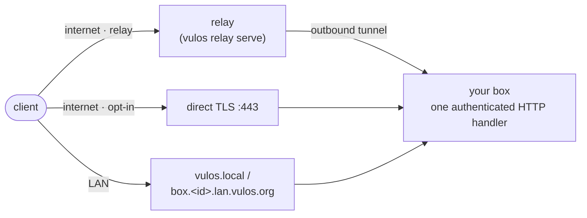

# Reachability & networking

How the outside world reaches your Vulos box: direct connections, the relay tunnel, LAN discovery, DNS, TLS, and the ports you need to open (or keep closed) for each way of running it.

---

## The reachability model in one paragraph

Vulos is the OS. You run it on your own hardware or on any cloud VPS you rent, from any provider — it's the same binary either way. A box behind NAT or CGNAT is reached through a **relay**: the box dials **out** and holds the connection open, and the relay forwards traffic back down it, so there is never a port to open and nothing exposed on your side. Vulos ships its own relay — `vulos relay serve`, built from this same repository (`backend/cmd/vulos`) — so this needs no third-party tunnel service and no separate project. A relay is *hired, not depended on*: it is named by configuration rather than compiled in, and a box holds tunnels to **every** relay you list at once, so no single one is load-bearing. If your box instead has a public IP or a domain of its own, you can skip relays entirely and serve **direct** over TLS; clients try direct first and fall back to the tunnel. Direct is a faster transport, not a different security posture: the direct listener serves the exact same authenticated handler as the relay-fronted path, so an unauthenticated request gets the same 401 either way. On top of both, an opt-in **LAN layer** keeps the box reachable on your local network even with the internet down.

**Nobody runs a relay on your behalf.** A box with nothing configured has no relay and no hostname to dial — it is LAN-reachable, and publicly reachable only in direct mode. Making it reachable from the internet means either running a relay (yours or someone else's) or giving the box a public IP. That is a property of the network, not a gap in the design; see [REACH.md](REACH.md).

There are three ways to make a box reachable, and you can mix them:

| # | Option | When to use it | Setup |
|---|---|---|---|
| (a) | **No relay** | The box has a public IP, or only ever needs to be reached from its own LAN. | [Jump to setup](#a-no-relay-at-all) — nothing to configure |
| (b) | **A relay** — yours, a friend's, or a Pier instance | Behind NAT/CGNAT and you want the box reachable from anywhere. | [Jump to setup](#b-run-a-relay--yours-or-someone-elses) · full recipes in [RELAY-SELF-HOST.md](RELAY-SELF-HOST.md) |
| (c) | **Direct** | Box has a public IP or your own domain (bare metal with a static IP, or a cloud VPS) — no relay at all. | [Jump to setup](#c-direct-public-ip-or-your-own-domain) |

If you remember one thing: **you never *have* to port-forward a Vulos box** — option (b) needs only outbound 443. What it does need is a machine somewhere with a public IP, which is either yours or someone's.

A quick map of the paths a request can take:



All three paths land on the **same** authenticated HTTP handler. There is no "trusted because it came from the LAN" or "trusted because it came direct" bypass anywhere in the chain.

---

## Connection modes

The operator picks a high-level networking posture in Settings (persisted to `$HOME/db/network-mode.json`, surfaced over `GET`/`POST /api/network/mode`):

| Mode | What it means |
|---|---|
| `fabric` | Default. Traffic rides a relay tunnel — option (a)/(b) below. No inbound ports needed. |
| `direct` | Direct WAN exposure — option (c) below. DNS is **manual**: the automatic re-enrolment library exists but is not wired in (see [Direct-mode DNS enrollment](#direct-mode-dns-enrollment)). |
| `own` | You bring your own domain and reverse proxy; Vulos sits behind it — option (c) below. |
| `local` | LAN-only. Blocks the **direct public listener** specifically — it does not change the main listener's bind host, which follows `VULOS_ENV`. |

`local` mode is enforced in code, not just cosmetic: when it is selected, the server refuses to start the direct public listener even if `VULOS_DIRECT_ENABLE=1` is set.

The mode-switching endpoint is one of the routes disabled by the `VULOS_DISABLE_EXEC` kill-switch (see [SECURITY.md](SECURITY.md)).

---

## The relay: how a NAT'd box is reachable

A box behind NAT or CGNAT cannot accept inbound connections, so it dials **out** to
a relay and holds that connection open; a client that wants to reach the box
connects to the relay, which forwards traffic back down the tunnel the box already
opened. Nothing on the box ever accepts an inbound connection.

Vulos ships **its own** relay — `vulos relay serve`, from the same repository as
the box. There is no separate product to install and no third-party tunnel service
in the path. One practical note: the relay is a *different* binary from the one a
box runs (`backend/cmd/vulos` vs `backend/cmd/server`), and neither `build.sh` nor
the Docker image ships it — you build it for the relay host yourself
(`cd backend && go build -o vulos ./cmd/vulos`). **[REACH.md](REACH.md)** is the full reference;
**[RELAY-SELF-HOST.md](RELAY-SELF-HOST.md)** has step-by-step recipes for Hetzner
and Fly.io.

Two properties make a relay something you *hire* rather than *depend on*:

- **It is swappable.** A relay is named by configuration, never compiled in. Point
  at your own, at a friend's, or at an [Pier](https://github.com/vul-os/pier)
  instance — no code change.
- **It is plural.** A box holds a live tunnel to **every** configured relay at once,
  so no single one is load-bearing. Two relays under different operators is the
  recommended posture.

Be clear-eyed about what a relay can do: it terminates the public TLS, so it sees
the plaintext of requests it forwards. It cannot forge a session or an identity —
the auth handshake your box speaks travels through it unmodified — but "cannot read"
is not a claim being made. Run your own, or one belonging to someone whose interests
align with yours. See
[What a relay can and cannot do](REACH.md#what-a-relay-can-and-cannot-do).

Three concrete ways this plays out, matching the summary table above:

### (a) No relay at all

Out of the box, with nothing configured, a box runs with **no relay**. It is
reachable on its LAN, and publicly only if direct mode (option (c)) is enabled.
Nobody operates a relay on your behalf and no hostname is compiled in, so an
unconfigured box has nothing to dial.

It does **not** announce that: a box with no relay configuration takes a silent
path (`reachwire.go`, the `set.Len()==0` branch) and logs nothing about reach.
The `relay endpoints NOT configured` pair of lines you may have seen quoted here
fires only when relay config was present and **failed to load**. To check the
state deliberately, read `GET /api/network/reach`.

This is the correct posture for a box on a VPS with a public IP, and for a box that
only ever needs to be reached from the house it lives in.

### (b) Run a relay — yours, or someone else's

Stand one up on any machine with a public IP (see
[RELAY-SELF-HOST.md](RELAY-SELF-HOST.md)):

```bash
vulos relay grant box1                       # mint a token
vulos relay serve -domain relay.example.com \
  -grants-file /etc/vulos-relay/grants.json -rendezvous
```

Then point the box at it. The endpoint file is preferred over environment variables
because it holds bearer tokens and lives at mode 0600, where `ps` and crash dumps
cannot reach it:

```bash
VULOS_RELAY_ENDPOINTS_FILE=/etc/vulos/relays.json
```

```json
[
  { "url": "https://relay-a.example.com", "name": "box1", "token": "…" },
  { "url": "https://relay-b.example.com", "name": "box1", "token": "…" }
]
```

The box is now served at `https://box1.relay-a.example.com` **and**
`https://box1.relay-b.example.com` — both tunnels are live simultaneously.

| Variable | Purpose |
|---|---|
| `VULOS_RELAY_ENDPOINTS_FILE` | Path to the JSON endpoint list. **Preferred.** Must not be world-accessible (the check tests world bits only, so `0640` passes). A rejected file is not fatal — the box boots with no tunnels. |
| `VULOS_RELAY_ENDPOINTS` | The same list inline, for platforms whose secret channel is the environment (Fly, Docker, Kubernetes). |
| `VULOS_RELAY_BASE_URL` / `_NAME` / `_TOKEN` | The legacy single-endpoint form. Still fully supported. |

**Using Pier instead** is a supported alternative and needs no code change, and
no sidecar: list the Pier relay in `VULOS_RELAY_ENDPOINTS` (or the legacy
`VULOS_RELAY_BASE_URL`) and **the OS's own embedded agent dials it**, through the
same header-trust boundary it uses for a Vulos relay. Pier speaks the same
reverse-tunnel wire protocol and the same rendezvous contract, so
`VULOS_RENDEZVOUS_URL` may list Vulos and Pier nodes interchangeably.

The agent holds one link per endpoint and has no notion of "provider", so a
built-in Vulos relay and a Pier relay can sit in **one endpoint set at the same
time** for redundancy — the two are not mutually exclusive
(`services/relayconfig/providers.go`).

Under the hood, the box-side contract is:

- **The embedded agent.** Vulos's own agent runs **in the OS process** and serves the
  OS's own handler directly — no sidecar binary, no loopback listener, and therefore
  no loopback SSRF surface. A tunnelled request runs the exact same auth, session,
  CSRF, rate-limit and security-header chain as one arriving on the box's own
  listener.
- **The ownership probe.** A box may also advertise a public direct endpoint. It
  serves an unauthenticated well-known path, `/_vulos-direct/probe`; the relay GETs
  it with a one-time nonce and the box echoes it back. Only a box that actually
  controls the advertised endpoint can answer, so a box cannot advertise an endpoint
  it does not serve. It is the only route that bypasses the auth
  handler entirely; the direct listener serves the same OS handler as every other
  path, so the usual unauthenticated allow-list (login, register, the setup
  wizard, box-to-box peering) is reachable there exactly as over the relay.
- **The header-trust boundary.** The relay strips every `X-Vulos-Reach-*` header from
  inbound client requests before forwarding, then sets the ones it vouches for; the
  agent translates those into `r.RemoteAddr` and `r.TLS` and strips them again. See
  [the security model](REACH.md#security-model).

## Direct mode: the public TLS listener

Direct mode is **off by default** and config-gated, because most boxes are NAT'd and must stay on a relay tunnel. Turn it on only when the box has a genuinely reachable public IP or hostname — including a cloud VPS, which almost always has one.

```bash
VULOS_DIRECT_ENABLE=1
VULOS_DIRECT_HOSTNAME=box1.example.net
```

Full env surface (from `backend/internal/directlisten`):

| Variable | Default | Purpose |
|---|---|---|
| `VULOS_DIRECT_ENABLE` | unset (off) | `1` opts in. Unset means relay-only. |
| `VULOS_DIRECT_HOSTNAME` | — | Public DNS name. Required for ACME and for building the advertised endpoint. |
| `VULOS_DIRECT_ADDR` | `:443` | Listen address. |
| `VULOS_DIRECT_CERT_MODE` | `acme` | `acme` (Let's Encrypt via autocert) or `provided` (your own cert files). |
| `VULOS_DIRECT_CERT_FILE` / `VULOS_DIRECT_KEY_FILE` | — | Cert + key paths for `provided` mode. |
| `VULOS_DIRECT_ACME_CACHE` | under `~/.vulos/auth/direct-acme` | Where issued certs are cached (so a restart doesn't re-hit Let's Encrypt rate limits). |
| `VULOS_DIRECT_ACME_EMAIL` | — | Optional ACME account contact. |
| `VULOS_DIRECT_ENDPOINT` | derived `https://<hostname>[:port]` | Override for the advertised endpoint. Must be `https://` — a cleartext endpoint is refused. |

Behaviour worth knowing:

- **TLS is required.** The listener only ever serves HTTPS (TLS 1.2 minimum). In `acme` mode the certificate is requested automatically for `VULOS_DIRECT_HOSTNAME` (the ACME host policy is pinned to that one hostname, so an attacker-supplied SNI can never trigger an issuance); the challenge is answered on the same `:443` listener. In `provided` mode you supply the cert — the option for boxes with only a static IP, or behind your own PKI.
- **Fail-closed configuration.** ACME mode without a hostname, or provided mode without cert files, is a startup error, not a listener that silently cannot serve.
- **Self-reachability pre-check.** After start, the box fetches its *own* probe path over the public endpoint with a fresh nonce. If a firewall silently drops the traffic, you get a log line telling you the endpoint is not externally reachable yet — clients simply keep using the relay tunnel until it is.
- **Status route.** `GET /api/network/direct` (session-authed) reports `{enabled, endpoint, addr}` so you can confirm the fast path is active from the UI or curl.

### (c) Direct: public IP or your own domain

This is the no-broker option. It works identically whether the box is bare metal with a static IP or a cloud VPS — a VPS just makes "genuinely reachable public IP" true from the moment you rent it.

**On a cloud VPS (any provider — Hetzner, DigitalOcean, AWS, etc.):**

1. **Rent a VPS and note its public IPv4/IPv6 address.** Any provider works; Vulos is the same binary regardless of who you rent from.
2. **Point a DNS `A` (and `AAAA`, if you have IPv6) record at it** — e.g. `box1.example.net → 203.0.113.10`. Use whatever DNS provider you already use for the domain; nothing in Vulos provisions this for you in direct mode (that's different from the *published-app-subdomain* DNS automation below).
3. **Open port 443 in the provider's firewall/security group.** Cloud VPS providers usually block everything by default at the network layer, on top of any host firewall — check both. Nothing else needs to be open; see [Ports](#ports) below.
4. **Install Vulos on the VPS** (Docker, the binary, or `./build.sh --deploy` over SSH — see [DEPLOY.md](DEPLOY.md); not the live USB flash image, which is a RAM-only session meant for trying Vulos on hardware you're sitting in front of, not a rented VPS you want to persist) and set:
   ```bash
   VULOS_ENV=prod
   VULOS_DIRECT_ENABLE=1
   VULOS_DIRECT_HOSTNAME=box1.example.net
   VULOS_RPID=box1.example.net        # bind passkeys to the same domain — see SECURITY.md
   VULOS_ORIGIN=https://box1.example.net
   ```
5. **Start the box.** ACME issues the certificate automatically against port 443 on first start; watch the startup log for `[direct] public listener up` and the self-reachability check passing.
6. **Confirm it from outside** the VPS's own network (see [Verifying reachability](#verifying-reachability-from-the-command-line) below).

**On bare metal with a static IP** the steps are the same minus the "rent a VPS" step — you forward TCP 443 on your router to the box instead of opening a cloud security group.

**Multiple static-IP boxes, DNS load-balanced:** point the same hostname at more than one box's IP (multiple `A`/`AAAA` records, or a provider's DNS load-balancing/health-check feature) and clients fail over across them — there's no coordinator in the loop, it's ordinary DNS.

**`own` mode** is the same public-TLS idea but with your own reverse proxy (Caddy is the supported path) in front instead of the built-in direct listener — see the TLS table below and [Custom domains for published apps](#custom-domains-for-published-apps).

---

## Domains and DNS

### How your box gets its name

The box's public domain is resolved in this order (from `backend/services/network`):

1. `VULOS_DOMAIN`, if set — always wins.
2. In `fabric` or `direct` domain mode: `{instance-ulid}.vulos.org`.
3. In `own` mode: the configured domain.
4. In `local` mode: `localhost`.

The public URL is surfaced at `GET /api/network/status`:

```bash
curl -s http://localhost:8080/api/network/status | jq
# { "url": "...", "domain": "...", "instance_id": "01H...", "hostname": "mybox", "mode": "..." }
```

### App subdomains and why the domain matters

The main request handler routes by `Host` header: a request for `{appId}.<your-domain>` is dispatched to the app gateway instead of the OS shell. That is why the domain must be a real, resolvable name with a wildcard: each app lives on its own subdomain (which is also what keeps app cookies and storage out of the OS origin). In development, `scripts/dev.sh` defaults `VULOS_DOMAIN` to `lvh.me` — a public domain whose every subdomain resolves to `127.0.0.1` — so `https://{app}.lvh.me:8080` works with no DNS setup at all.

### Published app subdomains (`VULOS_DNS_API`)

When you publish an app (visibility "public"), the box provisions a subdomain of the form:

```
{app}--{profile}.{instance-ulid}.{VULOS_BASE_DOMAIN}
```

`VULOS_BASE_DOMAIN` has **no default** (`subdomain_provision.go`'s
`defaultBaseDomain` is `""`) — the `vulos.org` you may have seen in this example
is not a fallback the code supplies.

The DNS record is created by calling whatever DNS provisioning API you point the box at — there is no default host. The relevant env vars:

| Variable | Default | Purpose |
|---|---|---|
| `VULOS_DNS_API` | `noop` | The DNS provisioning endpoint. Unset means no DNS provider is configured; the sentinel value `noop` skips the network call entirely (dev/CI/self-hosted). Point it at your own provider's endpoint to have records created automatically. |
| `VULOS_BASE_DOMAIN` | _(empty)_ | The base domain used to build app FQDNs. |
| `VULOS_CADDY_DIR` | `/etc/caddy/vulos-apps` | Directory where per-app Caddyfile snippets are written so self-hosters can `include` them from their main Caddyfile. `noop` skips snippet writes. |

This surface fails closed in production: in `VULOS_ENV=prod`, if `VULOS_DNS_API` or `VULOS_CADDY_DIR` is unset the server **refuses to register the subdomain routes at all**, so customers are never falsely told their domain is being provisioned while nothing happens. In dev/local both default to `noop` with a logged warning.

Each generated Caddy snippet declares the app's hostname with ACME TLS (Caddy requests the certificate automatically) and a `reverse_proxy` to the app's upstream.

### Custom domains for published apps

You can attach your own domain to a published app instead of the generated subdomain:

1. `POST /api/apps/{id}/domain` with `{"domain": "mysite.example.com"}` — returns a challenge token.
2. Add a DNS TXT record: `_vulos-verify.mysite.example.com` → the challenge token.
3. `POST /api/apps/{id}/domain/verify` — the box does a live TXT lookup; on success it writes a Caddy vhost snippet (ACME TLS) and marks the domain verified.
4. `DELETE /api/apps/{id}/domain` reverts to the default subdomain.

### Direct-mode DNS enrollment

**Not wired in — direct-mode DNS is manual today.** `backend/services/network/enroll.go` implements the whole loop (`DetectPublicIP`, `EnrollDirect`, `UpdateDNS`, `WatchIPChanges`, returning acme-dns credentials as `VULOS_ACME_DNS_UUID` / `VULOS_ACME_DNS_KEY`), but **nothing outside that package and its tests ever constructs or calls any of it**, so no box updates its own record. Point your `A`/`AAAA` record at the box yourself and update it if your ISP changes your address.

There is also no hosted control API to enrol with: `defaultControlURL` is `""` (`enroll.go:36`) — you supply one with `VULOS_CONTROL_URL`. Vulos the org operates no control plane.

### LAN DNS (works with the internet down)

With the LAN layer enabled (below), the box itself answers DNS for `box.<instance-id>.lan.vulos.org` on UDP port 53, so that name resolves on your LAN even when public DNS — or your whole uplink — is down.

---

## TLS: who terminates it, where

| Deployment | TLS terminated by | Certificate source |
|---|---|---|
| Local dev (`./scripts/dev.sh`, `--env=local`) | The Go backend, *if* certs exist; otherwise plain HTTP on loopback | `~/.vulos/localhost.pem` + `~/.vulos/localhost-key.pem` — the mkcert convention. `scripts/dev.sh` mounts these into the Docker container when present. |
| Docker / single binary in prod | The Go backend | `/etc/vulos/tls/cert.pem` + `/etc/vulos/tls/key.pem` (checked at startup, after the mkcert paths) |
| Direct mode | The direct listener inside the backend | ACME/Let's Encrypt (autocert) or operator-provided files (see table above) |
| LAN layer | The LAN HTTPS listener inside the backend | An externally-issued certificate for `box.<id>.lan.vulos.org`, delivered to `/var/lib/vulos/tls/lan.crt` + `lan.key` (paths overridable via `VULOS_LAN_CERT` / `VULOS_LAN_KEY`), hot-reloaded on change; falls back to a self-signed cert until the real one arrives |
| `own` mode / published apps | Your reverse proxy (Caddy is the supported path) | Caddy's automatic ACME, driven by the snippets Vulos writes into `VULOS_CADDY_DIR` |

Fetching the trusted LAN certificate from an external issuance endpoint is itself opt-in (`VULOS_LANCERT_ENABLE=1`, endpoint at `VULOS_CLOUD_BASE_URL` — **required, with no default**: unset means the puller refuses to construct and stays disabled, because Vulos operates no hosted control plane) and hardened: the puller accepts an extra CA bundle (`VULOS_LANCERT_CA_PEM` / `VULOS_LANCERT_CA_FILE`) or SPKI pins (`VULOS_LANCERT_SPKI_PINS`), and refuses a plaintext endpoint URL unless `VULOS_LANCERT_ALLOW_INSECURE=1` is set (never do this outside a lab). Leave `VULOS_LANCERT_ENABLE` unset and the LAN layer just uses its self-signed fallback — nothing about the LAN listener depends on this being configured.

For local development with real HTTPS, generate the certs once with [mkcert](https://github.com/FiloSottile/mkcert):

```bash
mkcert -install
mkcert -cert-file ~/.vulos/localhost.pem -key-file ~/.vulos/localhost-key.pem localhost 127.0.0.1
```

The backend picks them up automatically on next start.

---

## LAN reachability and local discovery

The LAN layer (`VULOS_LAN_ENABLE=1`, off by default — not every install wants extra listeners) makes the box fully usable with the internet down. It starts three things:

1. **mDNS advertisement** — the box announces itself as `vulos.local` over multicast DNS (UDP 5353), so any client on the same network reaches it with zero configuration.
2. **A tiny DNS responder** — authoritative for `box.<instance-id>.lan.vulos.org` on UDP 53, answering with the box's LAN IP.
3. **A LAN HTTPS listener** — serves the full OS on `:443`, **pinned to the detected LAN IP** rather than all interfaces, so a multi-homed or public box never accidentally exposes this listener on its WAN side.

| Variable | Default | Purpose |
|---|---|---|
| `VULOS_LAN_ENABLE` | unset (off) | `1` enables the whole LAN layer. |
| `VULOS_LAN_HTTPS_ADDR` | `:443` | LAN HTTPS listen address (override for non-root runs). |
| `VULOS_LAN_DNS_ADDR` | `:53` | LAN DNS listen address. |
| `VULOS_LAN_DNS_DISABLE` | unset (responder on) | `1` turns off **only** the DNS responder, leaving the HTTPS listener and mDNS (`vulos.local`) intact. For a network that already has a resolver on `:53` (a router or Pi-hole) and would otherwise get a port conflict or a surprise UDP:53 responder on a LAN scan. |
| `VULOS_LAN_CERT` / `VULOS_LAN_KEY` | `/var/lib/vulos/tls/lan.crt` / `.key` | LAN TLS material paths. |

mDNS and DNS bind failures are logged but non-fatal — a box that can still be reached by IP is better than no box.

Two practical notes:

- **Privileged ports.** 443 and 53 need root (or `CAP_NET_BIND_SERVICE`). If you run the backend as an unprivileged user, override both addresses (e.g. `VULOS_LAN_HTTPS_ADDR=:8443 VULOS_LAN_DNS_ADDR=:5354`) and adjust clients accordingly.
- **Containers and CI.** Multicast is often unavailable inside containers (no `CAP_NET_RAW`, no multicast-capable interface). The LAN layer treats mDNS as best-effort in that case: the HTTPS listener still comes up, only zero-config discovery is lost.

### Native client pairing (pinning this box's LAN certificate)

A native client (`clients/core/`) is meant to trust this box's LAN TLS certificate by **pinning its public key (SPKI SHA-256)** at first connection, rather than relying on a public certificate authority — the same trust-on-first-use model SSH and Syncthing use. `GET /api/lan/pairing` (session-gated like any other authenticated OS route) and `vulos-server -print-pairing` (a one-shot console print, for an operator at the console or over SSH) both expose the same payload: the box's name, LAN address, SPKI fingerprint, and a `vulos://pair?...` URI. In the OS shell this is surfaced as **Settings → Native Pairing** (rendered as a QR code plus the fingerprint in text, for reading aloud over a trusted channel).

**This is the box side of the mechanism only.** `clients/core/` implements the pin/verify/store logic, but as of this writing no shell — desktop, Android, or iOS — calls it, and nothing consumes *this* QR code. The Android shell does ship a camera QR scanner (`nativeBridge.camera.scanQR`, ZXing), but it is wired to the setup wizard's cluster **join code**, not to a `vulos://pair` payload. Nothing connects end to end for a real user today; this exists so the payload is ready once a client scans it.

### Same-LAN box-to-box sync (fabric)

If you run more than one box on a LAN, the fabric sync loop discovers sibling boxes over mDNS and exchanges app-registry changesets directly — no cloud, no S3. It is gated on a shared secret: set the same `VULOS_FABRIC_SECRET` on every sibling box. Without the secret the exchange handlers stay **off (fail-closed)** rather than open an unauthenticated endpoint. The fabric handlers are mounted only on the LAN-pinned listener, never on the public surface.

### File sync is bidirectional

Files placed in the data directory are uploaded to your bucket by an fsnotify
watcher, and remote changes are fetched back on boot and then every two minutes
(`PullInterval`, default `2m`).

Downward sync is conservative about your local work. A remote file is applied
directly when the local copy is absent or unchanged since the last sync. If the
local copy was edited while the box was away, the local version is preserved
beside the remote one as `<name>.conflict-<node>-<timestamp>.<ext>` and the
remote version takes the canonical path — so a divergence costs you a file to
reconcile, never an edit.

Files this node uploaded are skipped on the way down, so a box does not
re-download its own writes.

A negative `PullInterval` disables downward sync and leaves the box upload-only.

### Box-to-box sync across the internet (fabric over rendezvous)

mDNS only sees multicast, so LAN discovery alone means two of your own boxes in
two different houses can never find each other. Set `VULOS_RENDEZVOUS_URL` to one or more
relays running the open rendezvous role and they can:

```sh
# A comma-separated LIST. Each entry becomes its own discovery source, and a
# source that errors is skipped rather than failing the set — so listing two or
# three under different operators removes discovery as a single point of failure
# (the substrate spec's shape: KOTVA 4.2.1(3)).
VULOS_RENDEZVOUS_URL=https://relay-a.example.org/rendezvous,https://relay-b.example.org/rendezvous
```

Serve the role with `vulos relay serve -rendezvous`. It is off by default: a plain
reverse-tunnel relay is a complete, useful thing, and every role an operator did not
ask for is surface they did not choose to expose.

Each box announces its reachable endpoints under its **own Ed25519 key** — the
same per-instance key the CRDT already uses to verify signed uninstall
observations, so no second identity is introduced — and resolves the keys of the
siblings in its registry roster. Everything after discovery is unchanged: the
changeset exchange still runs directly to the peer over TLS, still requires
`VULOS_FABRIC_SECRET`, and still fails closed without it.

This **composes with mDNS rather than replacing it**. A box in the same house is
still found by multicast with no round trip to anyone; the same box moved behind
a different NAT is found through the relay. If either source fails you keep the
peers the other one found.

What the relay learns is which keys are online and what endpoints they claim —
that is the price of NAT traversal. It sees no app data: announce and resolve
carry none, and it never sees a changeset. A relay that lies can withhold a peer
or point at an address you cannot authenticate to; it cannot forge a changeset,
because signature checking happens at the peer and is downstream of discovery.

Any conforming rendezvous role works here — a `vulos relay serve -rendezvous`
node, a Pier instance, or set nothing at all and stay LAN-only. The two are
**wire-compatible** (the protocol is byte-identical, and a test drives the real
box-side client against the Vulos implementation), so a single
`VULOS_RENDEZVOUS_URL` list may mix them freely. Protocol details:
[REACH.md](REACH.md#discovery-finding-your-other-boxes).

| Variable | Effect |
|---|---|
| `VULOS_RENDEZVOUS_URL` | Comma-separated rendezvous prefixes. Unset = mDNS only. |
| `VULOS_PUBLIC_URL` | Announced ahead of the LAN address, for peers resolving from outside. |

### Drop (nearby file sharing)

Drop advertises the service `_vula-drop._tcp.local` over mDNS so nearby Vulos peers discover each other, then transfers files over HTTP on the box's main port (8080). Discoverability is a per-box setting; inbound requests from non-contacts require approval. Cross-box shares that target private/LAN addresses are blocked by the SSRF guard unless you explicitly allow LAN peers with `VULOS_PEER_ALLOW_LAN=1` — legitimate for self-hosted boxes that genuinely live on the same network. See [PEERING.md](PEERING.md) and [FILES.md](FILES.md).

---

## Ports

Ports actually bound by the software in this repo:

| Port | Protocol | What | When it exists | Exposure guidance |
|---|---|---|---|---|
| 8080 (or `PORT`) | TCP | Main backend: API, shell, apps, Drop transfers | Always | Loopback-only in `local`/`dev` env; all interfaces in `prod`. Front with TLS before exposing. |
| 5173 | TCP | Vite dev server (HMR), proxies `/api` to 8080 | `npm run dev` only | Never expose. Development only. |
| 443 | TCP | Direct public TLS listener | `VULOS_DIRECT_ENABLE=1` | The one port to forward for direct mode. |
| 443 | TCP | LAN HTTPS listener (pinned to LAN IP) | `VULOS_LAN_ENABLE=1` | LAN only by construction; do not forward. |
| 53 | UDP | LAN DNS responder | `VULOS_LAN_ENABLE=1` | LAN only; do not forward. |
| 5353 | UDP (multicast) | mDNS: `vulos.local`, Drop discovery, fabric sibling discovery | LAN layer / Drop / fabric | Multicast never crosses your router; nothing to forward. |
| 3478 | UDP/TCP | TURN media relay (coturn) | Only if `TURN_SECRET` is set. The backend mints HMAC credentials **and execs `turnserver` itself** (`main.go:519`) when the binary is on `PATH` | On the coturn host, per coturn docs. |
| ephemeral UDP | UDP | WebRTC media (calls, streaming, in-process SFU) | During calls | Outbound/NAT-traversed; TURN covers the hard cases. |

AI-generated sandbox backends bind `127.0.0.1` only and are reached through the gateway — they never listen externally.

---

## Firewall guidance by mode

**LAN-only (`local` mode, or just never forwarding anything)**
- Inbound from WAN: nothing. Leave the router alone.
- On the box's host firewall, allow from your LAN: TCP 8080 (or 443 + UDP 53/5353 if `VULOS_LAN_ENABLE=1`).
- In software, `local` mode blocks the direct public listener only. The main `:8080` listener still binds per `VULOS_ENV` (loopback in `local`/`dev`, all interfaces in `prod`), so do not rely on the mode alone to keep it off your WAN.

**Relay tunnel (`fabric` mode — the default)**
- Inbound from WAN: nothing. The embedded agent dials out.
- Outbound: allow HTTPS (443) to each configured relay (`VULOS_RELAY_ENDPOINTS_FILE` / `VULOS_RELAY_ENDPOINTS`). There is no default host — an unconfigured box dials nothing.
- This is the right mode for CGNAT, and the safe default for everyone else. On a cloud VPS you can use it too — it's not just for NAT'd boxes — though a VPS usually has a real public IP, making option (c) direct available.

**Direct + domain (`direct` or `own` mode — includes most cloud VPS deployments)**
- Forward TCP 443 to the box (the direct listener; also carries the ACME challenge). On a cloud VPS this means opening port 443 in the provider's firewall/security group, not a router.
- Keep 8080 unforwarded — the direct listener already serves the full OS over TLS.
- Point DNS at your public IP (`direct` mode keeps it updated automatically; in `own` mode your proxy handles the domain).
- Work through the pre-exposure checklist in [SECURITY.md](SECURITY.md) *before* forwarding the port.

---

## Group calls: in-process SFU, no host-registry escalation

First-party Vulos Meet (and the self-host SFU host-registry escalation path
that used to back it — `internal/meethost`, `VULOS_SFU_HOST`, `/api/meethost/status`)
is retired; video calling is third-party (Jitsi Meet / Element Call, installed
from the App Store — see [COMMS.md](COMMS.md), including its own BYO LiveKit
SFU option for Element Call). What remains first-party is the sovereign P2P
**Messages** builtin's own group calling: an in-process Pion SFU
(`backend/services/peering/sfu`, `/api/sfu/rooms/*`) for peer group calls
within the small mesh cap, with **no** opt-in to advertise a box as a
dedicated big-call SFU host the way the retired Meet host registry did.

A BYO opt-in still exists for GPU streaming hosts (`VULOS_GPU_HOST=1`, `VULOS_GPU_ADVERTISE_HOST`, `VULOS_STREAMER_BINARY`; status at `/api/gpuhost/status`) — an unrelated role that uses the box's single fabric identity, the same Ed25519 keypair (VulosID) the box advertises for peering.

---

## TURN: media relay for hard NATs

WebRTC media (calls, streaming) normally flows peer-to-peer over ephemeral UDP. When both sides sit behind symmetric NATs, a TURN relay is the escape hatch. Vulos does not *bundle* a TURN server, but it will **launch one for you**: when `TURN_SECRET` is set, `main.go:519` calls `StartCoturn`, which writes a `turnserver.conf` and execs `turnserver` (`services/network/turn.go:113`). You supply the coturn binary on `PATH`; the box supplies the config and the process:

| Variable | Default | Purpose |
|---|---|---|
| `TURN_SECRET` | unset (TURN disabled) | Shared secret; setting it enables credential minting |
| `TURN_HOST` | `localhost` | Hostname/IP clients dial to reach your TURN server — set this to the box's real public hostname/IP; the previous hardcoded `localhost` only worked when the signaling client and TURN server were the same machine |
| `TURN_PORT` | `3478` | The coturn port advertised in credentials |
| `TURN_REALM` | `vulos` | The coturn realm |
| `VULOS_STUN_DISABLE_PUBLIC` | unset (public STUN included) | Drops the public Google STUN fallback from `GET /api/peering/ice` — for a fully-sovereign deployment with no third-party network dependency for call setup |

The backend mints short-lived credentials (**1-hour TTL** — `services/network/turn.go:66`, reduced from 24 h deliberately) using the standard `use-auth-secret` HMAC scheme: username is `<expiry>:<userID>`, credential is `base64(HMAC-SHA256(secret, username))`. Note the HMAC here is **SHA-256**, so your `turnserver.conf` must include the `sha256` option alongside `use-auth-secret` — coturn's default is SHA-1 and the credentials will not verify without it.

**Self-hosted STUN, for free.** Whenever `TURN_SECRET` is set, `GET /api/peering/ice` also includes a `stun:<TURN_HOST>:<TURN_PORT>` entry — coturn answers plain STUN binding requests on the same port it serves TURN, so a self-hosted TURN deployment already gives you a fully self-hosted STUN option with zero extra infrastructure. Combined with `VULOS_STUN_DISABLE_PUBLIC=1`, a box needs no third-party STUN/TURN server at all.

`GET /api/peering/federation` reports the box's current sovereign-federation posture (relay/verify/rendezvous configuration, TURN host, and whether public STUN is disabled) in one place.

---

## Wi-Fi and Ethernet on bare metal

On a bare-metal install, Settings manages the box's own network connection through the backend (wpa_supplicant/iw under the hood):

| Endpoint | What it does |
|---|---|
| `GET /api/wifi/status` | Current connection (SSID, IP, signal, band, TX rate) |
| `GET /api/wifi/scan` | Visible networks with signal and security (WPA2/WPA3/open). **Admin-only and audited**: a scan drives the radio as root and holds a lock, so it is a host mutation despite being a read-shaped GET |
| `POST /api/wifi/connect` | Join a network (audited) |
| `POST /api/wifi/disconnect` | Drop the current connection |
| `GET /api/wifi/saved` / `POST /api/wifi/forget` | Manage remembered networks |
| `GET /api/network/status` | Box identity: URL, domain, instance ID, hostname, mode |

These endpoints shell out to system tools and each mutation is written to the exec audit log. Note they are **not** covered by the `VULOS_DISABLE_EXEC` kill-switch — `routes_wifi.go` contains no such check. Today that switch gates `/api/apps/launch`, `/api/sandbox/run`, `/api/exec`, `/api/stream/launch-app` and `POST /api/network/mode`, and nothing else. In Docker they are mostly moot — the container uses the host's networking.

---

## Verifying reachability from the command line

A short diagnostic sequence when "the box is unreachable":

```bash
# 1. Is the backend up at all? (from the box itself)
curl -s http://localhost:8080/healthz
# {"status":"ok","version":"..."}

# 2. What does the box think its identity and mode are?
#    All /api/network/* routes need a session — in EVERY env, not just prod.
#    They are not in the public allow-list and there is no dev bypass.
curl -s -b "$COOKIE" http://localhost:8080/api/network/status | jq
curl -s -b "$COOKIE" http://localhost:8080/api/network/mode | jq

# 3. Is the direct fast path active?
curl -s -b "$COOKIE" http://localhost:8080/api/network/direct | jq
# {"enabled":false}  → relay-only, as designed
# {"enabled":true,"endpoint":"https://box1.example.net", ...}

# 4. Does the direct endpoint answer from OUTSIDE? (run from another network)
curl -si https://box1.example.net/_vulos-direct/probe -H 'X-Vulos-Direct-Probe: test123'
# HTTP/2 200 with body "test123" → reachable and ownership-provable
# (without the header it returns 400 by design — it is not an open reflector)

# 5. On the LAN, does zero-config resolution work?
ping vulos.local
```

If step 4 times out but step 1 works, your firewall or NAT is dropping inbound 443 — which is exactly the situation the box's own self-reachability check logs at startup, and exactly when clients fall back to the relay. More recipes in [TROUBLESHOOTING.md](TROUBLESHOOTING.md).

---

## See also

- [SECURITY.md](SECURITY.md) — the pre-exposure checklist, auth surface, and fail-closed defaults
- [CONFIGURATION.md](CONFIGURATION.md) — the full env var reference
- [GETTING-STARTED.md](GETTING-STARTED.md) — installing and first boot
- [DEPLOY.md](DEPLOY.md) — deploying to a server you already run
- [PEERING.md](PEERING.md) — box-to-box identity, contacts, and Drop
- [TROUBLESHOOTING.md](TROUBLESHOOTING.md) — when a box is unreachable
