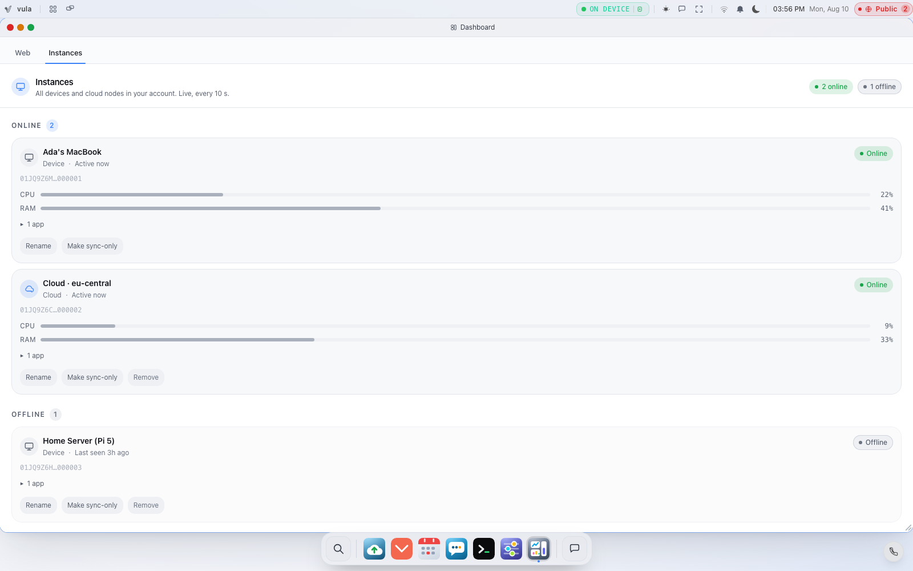

# Removing a Compromised Device

If a device is lost, stolen, or you simply no longer trust it, you want two
things to happen: it should stop appearing in your fleet, and — more
importantly — its **identity key should be revoked** so it can no longer prove it
is you anywhere in the fleet.

Vulos treats these as two layers. This page explains both, who is allowed to do
them, and how a revocation spreads to your other boxes.

For the keys themselves see [IDENTITY-KEYS.md](IDENTITY-KEYS.md); for the security
rationale see [SECURITY.md](SECURITY.md) and [THREAT-MODEL.md](THREAT-MODEL.md).

---

## Layer 1 — Remove the instance from your fleet

<picture>
  
</picture>

The **Dashboard → Instances** panel lists every box and cloud instance on your
account. From it the owner can **Remove** an instance
(`DELETE /api/instances/{ulid}`).

- **Admin/owner only.** The registry drives routing and sync peers, not just a
  view, so mutating it is gated to admins. A non-admin session is refused with
  `403`; an unauthenticated one with `401`
  (`backend/cmd/server/routes_instances_manage.go`).
- **You cannot remove the box you are signed in to** — that returns a `409` with
  "cannot remove this instance". Remove a *different* box.
- Removing an instance drops it from routing and sync and emits a
  `device.removed` webhook event.

Removing an instance stops routing traffic to it and stops treating it as a sync
peer. On its own, though, it does **not** cryptographically retire that device's
identity key. For a genuinely compromised device, do Layer 2 as well.

---

## Layer 2 — Revoke the device's identity key (break-glass)

Revocation permanently retires a device identity key. Once a key is revoked it is
revoked **forever** — the revocation set only ever grows, there is no
"un-revoke" (`backend/services/devicekey/revocation.go`).

There are two ways a revocation is authorised:

| Method | When you use it | What signs it |
|---|---|---|
| **Self** | Planned decommission while the device still works and can be trusted. | The device key signs its own retirement. |
| **Break-glass** | The device is **lost or compromised** and cannot be trusted to sign anything. | A **quorum of your *other* boxes** vouches for the revocation. |

The API is `POST /api/auth/device/revoke`
(`backend/cmd/server/routes_devicekey_lifecycle.go`).

### It requires owner + step-up re-auth

Revoking (or rotating) a device key is a destructive action, so the request must
pass **two gates**:

1. **Owner check** — your session must belong to the admin/owner role. The
   user ID is read from the header the auth middleware stamps from your validated
   session; a client cannot forge it.
2. **Step-up re-auth** — you must have recently re-proven your password to mint a
   short-lived "elevated" token (`backend/services/stepup`, TTL 5 minutes). A
   normal session cookie is **not** enough on its own. Complete
   `POST /api/auth/stepup/verify` first.

Miss either gate and the request is refused with `403` before any key material is
touched.

### Why break-glass needs *other* boxes

The design rule is non-negotiable: **a box can never authorise its own
recovery, enrolment, or revocation.** If box S is fully compromised, the attacker
has S's keys — but not the power to self-authorise anything
(`backend/services/fleetid`, `VerifyQuorum`).

So a break-glass revocation must carry a bundle of **vouch certificates from at
least two other boxes** in your fleet. The quorum check enforces, in order:

- **Self-exclusion** — a box may never vouch for itself, even with a perfectly
  valid signature.
- **Rostered, verified, distinct, non-revoked** vouchers only — each voucher must
  be a member of *this* box's own roster, verify against the roster's recorded
  key, not itself be revoked, and be counted once.
- **A floor of two** other boxes — a threshold below 2 is silently raised to 2.

Break-glass requests take `request_id` and a non-empty `quorum_certs` bundle; an
insufficient or invalid quorum is treated as an **authorisation failure (`403`)**,
not a server error, and no key is touched.

### How you obtain the vouch certificates — and why you cannot yet

The certificates come from a vouch service each box runs
(`backend/services/fleetid/voucher_handler.go`), which registers two routes:

| Route | Facing | Gate |
|---|---|---|
| `POST /api/fleetid/vouch/request` | Peer — another box asks *this* box to vouch | Never signs without a prior approval decision; a **self-vouch is refused outright** before the policy is even consulted |
| `POST /api/fleetid/vouch/approve` | Operator at this box | Admin role required |

The default policy is `NewManualApprovalPolicy` — **it never auto-approves**. A
human at the vouching box must approve the exact `(action, subject, payload,
request)` tuple before any certificate is signed. Both routes register only when
`VULOS_FABRIC_SECRET` is set *and* the sealed per-instance signing key loads;
otherwise the box logs that it cannot vouch for peers and mounts nothing.

> **Not reachable by a peer today.** `/api/fleetid/vouch/request` is designed to
> be peer-facing — its own comment says approval, not caller authentication, is
> what protects it — but the path is absent from `auth.publicPaths` and matches
> no public prefix, so `authHandler.Middleware` (`cmd/server/main.go:4276`)
> returns `401` to a remote box before the handler runs. Until that entry is
> added, a quorum cannot be collected over HTTP; the primitive and its
> verification (`VerifyQuorum`) are real and tested, but the transport that
> would deliver a request to a sibling box is closed. There is also no UI for
> approving a pending vouch — the approve endpoint has no frontend caller.

### Small fleets (1–2 boxes)

Peer-vouching only becomes available once you have **three or more boxes** (so
that at least two *other* boxes can vouch). With one or two boxes a quorum can
never be met by design. In that case recovery falls back to the **off-box
24-word recovery phrase** (see [IDENTITY-KEYS.md](IDENTITY-KEYS.md)) — which is
itself an off-box authority, so the "no self-authorisation" rule still holds.

---

## How revocation is enforced and propagated

A revocation is not just a note — it is **enforced** and it **spreads**:

- **Enforced everywhere the checker is wired.** Once the process-wide revocation
  checker is installed, every admission/verify point rejects a revoked
  fingerprint. A box whose *own* active key has been revoked also **refuses to
  mint any new signature** under that key (`ErrActiveKeyRevoked`) — so a
  compromised-then-revoked key is barred from producing new authority, not merely
  reported as revoked.
- **Self-verifying certificates.** A `DeviceRevocationCert` can be checked by any
  box against nothing but the cert's own contents (self) or that box's own roster
  (break-glass). Trust in the transport is therefore unnecessary.
- **Pull-based propagation.** Peers fetch each other's lists from
  `GET /api/auth/device/revocations` (an intentionally ungated,
  machine-to-machine endpoint), verify every entry against their **own** roster,
  and merge what verifies. The moment a box merges a valid revocation it fails
  closed on that key **forever after** — merge order and transport are irrelevant
  to correctness. There is a per-store cap as a poisoning/DoS backstop.

---

## Honest note on today's surface

The **Remove instance** action (Layer 1) has a polished UI in the Instances
panel. The **key revocation/rotation** actions (Layer 2) are exposed and fully
enforced at the **API level** (`/api/auth/device/revoke`, `/api/auth/device/rotate`)
with the owner + step-up gates described above, but a one-click "Revoke this
device's key" button is not yet surfaced in the standard settings UI. For a
confirmed compromise, the safe belt-and-braces action today is: **remove the
instance from the fleet (UI), then perform a break-glass revocation of its key via
the API**, and — if the device also held storage credentials — rotate those and
consider re-keying storage (see [BACKUP-RECOVERY.md](BACKUP-RECOVERY.md)).

---

## Related pages

- [ADD-DEVICE.md](ADD-DEVICE.md) — the join flow this reverses.
- [IDENTITY-KEYS.md](IDENTITY-KEYS.md) — the keys being revoked.
- [ACCOUNTS-ACCESS.md](ACCOUNTS-ACCESS.md) — owner role and step-up.
- [SECURITY.md](SECURITY.md) / [THREAT-MODEL.md](THREAT-MODEL.md) — the model behind it.
