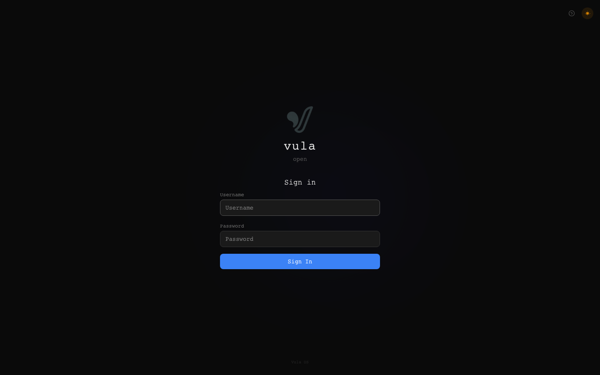
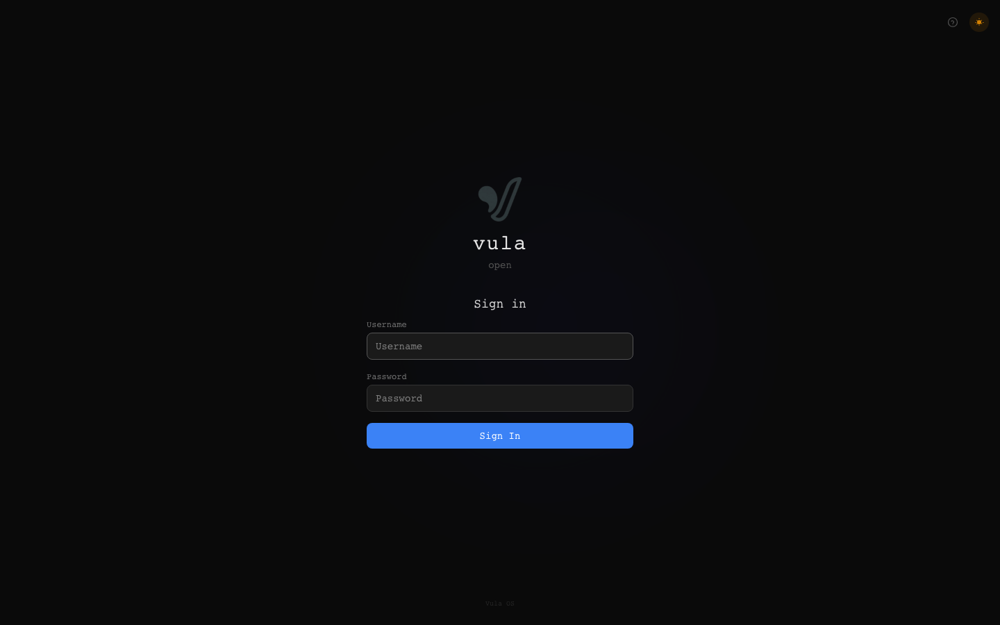
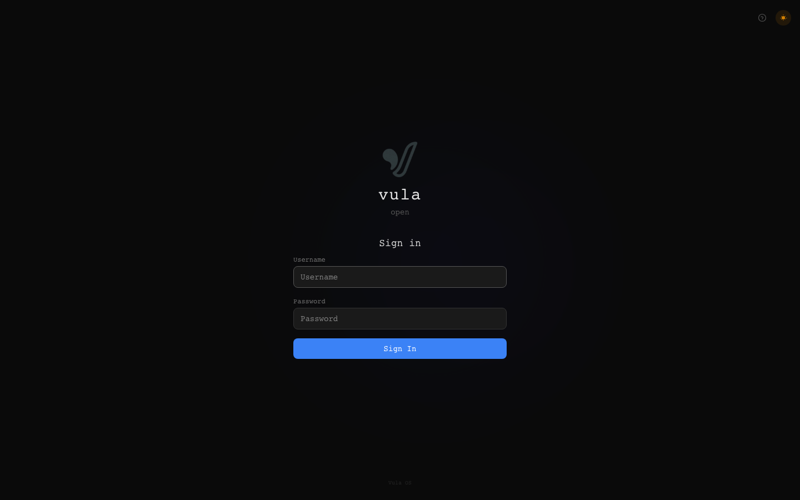
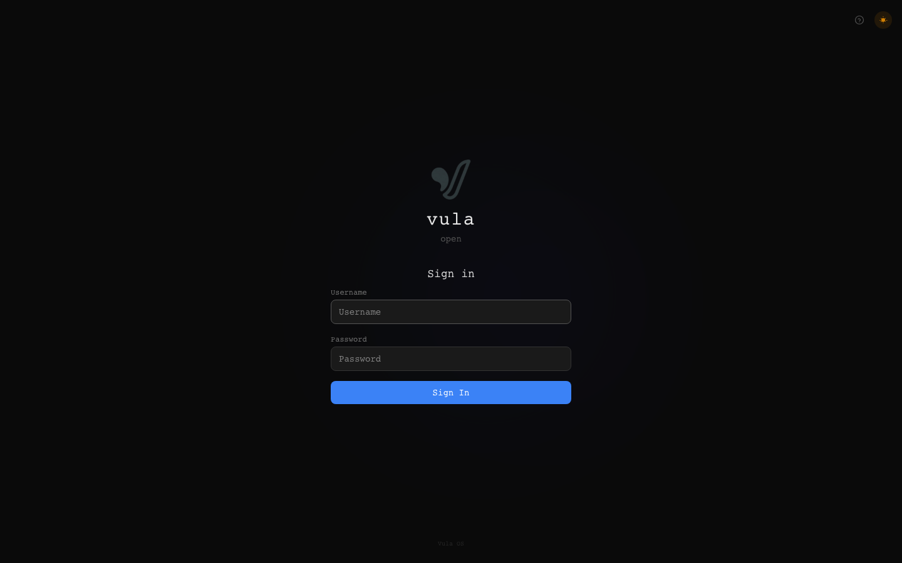
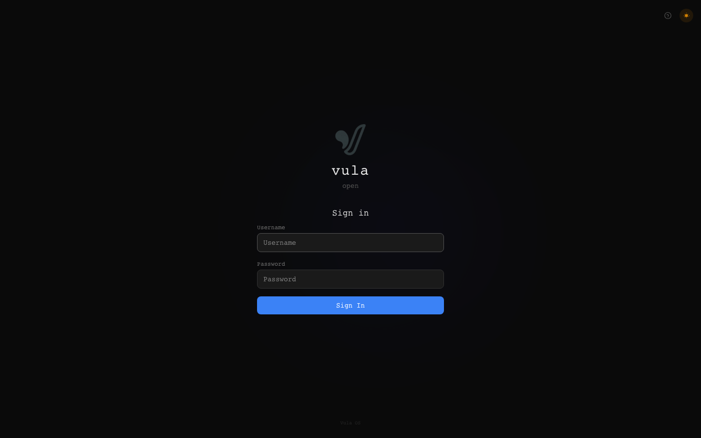
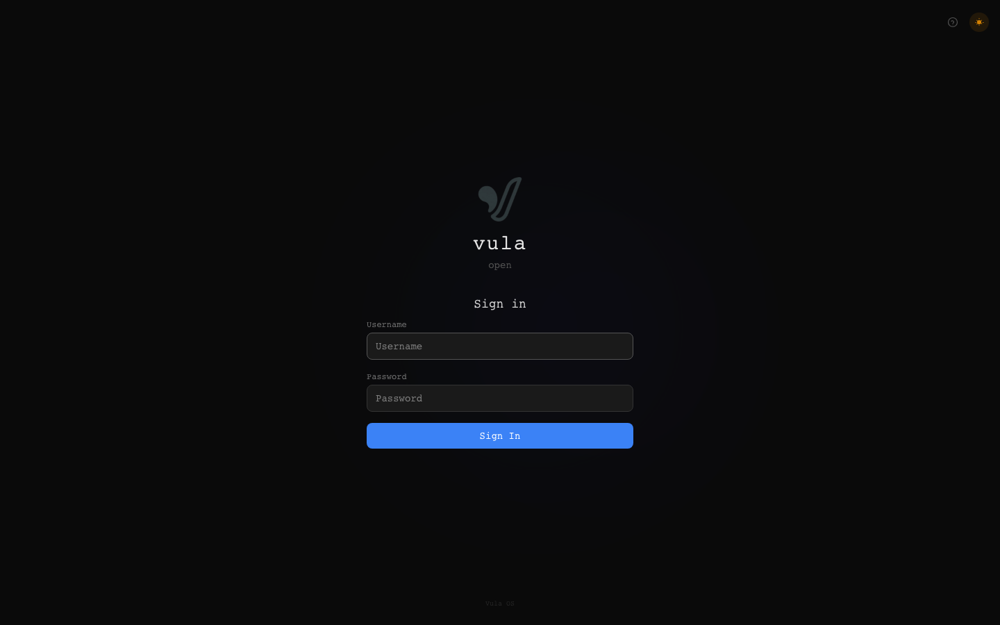
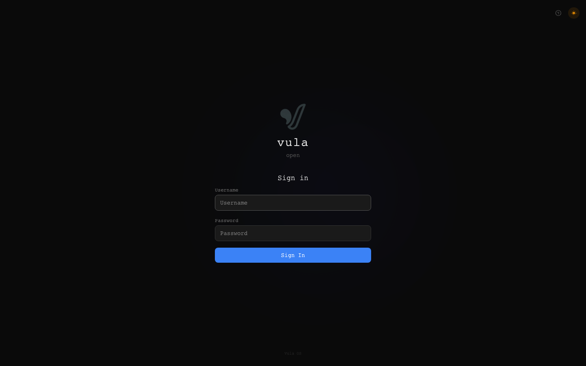
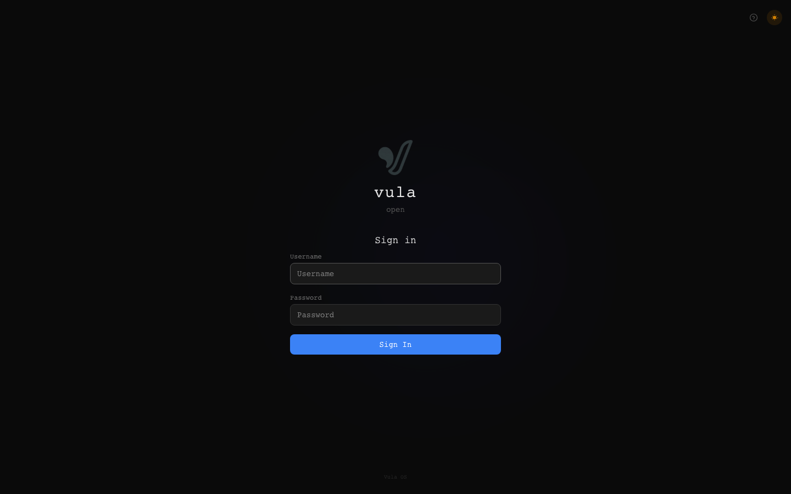

# Vulos Screenshots

This document contains the screenshot gallery and instructions for regenerating screenshots.

---

## Gallery

### Hero — Desktop shell



**The Vulos shell: window manager, dock, and running apps in a browser tab.**

---

### Login



**Email/password and passkey login. QR login available for kiosk/shared clients.**

---

### Launchpad



**Full-screen app launcher with search. All installed apps in one view.**

---

### Settings



**System settings: display, WiFi, audio, Bluetooth, energy, backup, and more.**

---

### Terminal



**Persistent PTY terminal (xterm.js). Sessions survive browser reloads.**

---

### File Manager



**Browse, upload, and download files. Drag-and-drop support.**

---

### App Hub (App Store)



**Install web apps and desktop apps from apt/Flatpak. Each app gets its own isolated network namespace.**

---

### Activity Monitor



**Process list, CPU, memory, and network connections.**

---

## Regenerating screenshots

Screenshots are captured by `scripts/screenshots.mjs` using Playwright (Chromium headless). They are saved to `docs/screenshots/` at 1440×900.

### Prerequisites

```bash
# Install Node dependencies (includes playwright as devDependency)
npm install

# Install Chromium browser for Playwright
npx playwright install chromium
```

### Boot the app

Screenshots require a running Vulos instance. The screenshotter reads `BASE_URL` (default `https://localhost:8080`).

```bash
# Terminal 1 — backend (local/dev mode, serves HTTPS on :8080)
cd backend && go run ./cmd/server --env=local

# Terminal 2 — (optional) frontend dev server with proxy
npm run dev    # or skip this and use the backend's embedded frontend
```

Or target Docker:

```bash
docker run -d --name vulos -p 8080:8080 --shm-size=1g ghcr.io/vul-os/vulos:latest
BASE_URL=http://localhost:8080 npm run screenshots
```

### Capture

```bash
npm run screenshots
# → writes docs/screenshots/*.png
```

To target a specific host:

```bash
BASE_URL=https://os.yourdomain.com npm run screenshots
```

### Route list

The screenshotter captures these routes/states (defined in `scripts/screenshots.mjs`):

| Screenshot file | Route / state |
|-----------------|---------------|
| `hero.png` | Desktop shell (authenticated) |
| `login.png` | `/` — login screen (unauthenticated) |
| `launchpad.png` | Desktop shell → Launchpad open |
| `settings.png` | Desktop shell → Settings open |
| `terminal.png` | Desktop shell → Terminal open |
| `files.png` | Desktop shell → File Manager open |
| `apphub.png` | Desktop shell → App Hub open |
| `activity.png` | Desktop shell → Activity Monitor open |

### Notes

- Views that require full backend infrastructure (streaming, GPU encoding) may render partially or show loading states. The images committed are best-effort from a `local` mode dev server.
- Screenshots that could not be captured in this environment are listed in `docs/screenshots/README.md`.
- The `hero.png` is also embedded in the root `README.md`.
