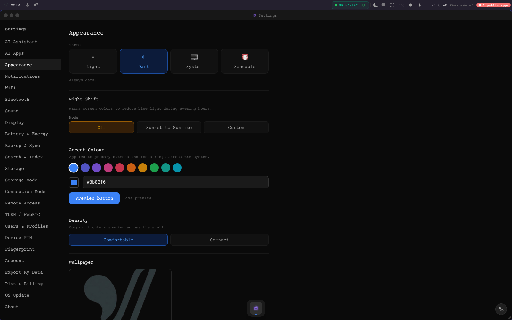

# Vulos Screenshots

Screenshot gallery and instructions for regenerating. See
[`screenshots/README.md`](screenshots/README.md) for the full inventory and how
capture works.

---

## Gallery

### Hero — Desktop / Home


**The Vulos shell: your sovereign-instance Home — greeting, assistant composer,
today's brief, live agenda, and invites, in a browser tab.**

---

### File Explorer


**Browse your box's files with a familiar sidebar and semantic search.**

---

### Settings — Appearance



**System settings: theme (Light/Dark/System/Schedule), night shift, accent
colour, density, wallpaper — plus AI, network, storage, energy and more.**

---

### App Hub


**Install web and desktop apps from a vetted catalogue. Each app gets its own
isolated network namespace. (`apphub-installed.png` shows the Installed tab.)**

---

### Dashboard — Web publishing & Instances


**Publish apps to the web with per-app resource monitoring, and see every
device + cloud node in your account with live routing (`dashboard.png` /
`instances.png`).**

---

### Terminal


**Persistent PTY terminal (xterm.js). Sessions survive browser reloads.**

---

## Regenerating screenshots

`npm run screenshots` is fully self-contained: it builds the production bundle,
serves it with `vite preview`, and drives the real shell with a mocked backend +
deterministic demo data. **No running Go server, no real `$HOME`, no real user
data** — see [`screenshots/README.md`](screenshots/README.md) for the privacy
model.

```bash
npm install
npx playwright install chromium   # once
npm run screenshots               # → docs/screenshots/*.png
PORT=5320 npm run screenshots     # override the preview port if 5317 is taken
```

Dark shots are `<name>.png`; light shots are `<name>-light.png`. `hero.png` is
also embedded in the root `README.md`.
