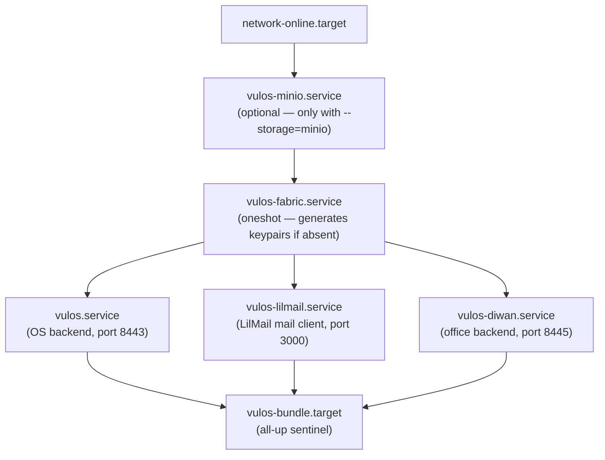

# Vulos Bundle — Self-Host Guide

One command installs the **Vulos OS backend + Diwan** (`diwan`) on a single Linux
machine, supervised by systemd (or OpenRC on Alpine), sharing one config dir,
one data dir, one fabric identity, and one S3 storage backend.

```
curl -fsSL https://get.vulos.org | sudo bash
```

> **Mail is a client, not a bundled server.** The bundle installs **LilMail**, a
> mail/calendar/contacts client that connects to a mailbox you already own
> (Gmail/Outlook/any IMAP/SMTP) — see [MAIL-LILMAIL.md](MAIL-LILMAIL.md). It hosts
> no mail and binds no privileged port; you point it at your own account in its
> config before starting it.

---

## Table of Contents

1. [What gets installed](#what-gets-installed)
2. [Prerequisites](#prerequisites)
3. [Install matrix (bash / Docker / Raspberry Pi)](#install-matrix)
4. [Storage backends (Tigris vs. local MinIO)](#storage-backends)
5. [Installer flags](#installer-flags)
6. [Shared directory layout](#shared-directory-layout)
7. [Service ordering and supervision](#service-ordering-and-supervision)
8. [Security hardening](#security-hardening)
9. [Post-install steps](#post-install-steps)
10. [Upgrading](#upgrading)
11. [Troubleshooting](#troubleshooting)

---

## What gets installed

| Service | Binary | Port(s) | Purpose |
|---|---|---|---|
| vulos | `/usr/local/bin/vulos` | 8443 | OS backend — API gateway, app fabric |
| vulos-diwan | `/usr/local/bin/diwan` | 8445 | Diwan — collaborative office suite (Docs / Sheets / Slides / PDF / Whiteboard) |
| vulos-lilmail | `/usr/local/bin/lilmail` | 3000 | LilMail — mail/calendar/contacts client for your own mailbox |
| minio (optional) | `/usr/local/bin/minio` | 9000 (loopback) | Local S3-compatible storage |

All services run as the `vulos` system user (UID < 1000, no login shell).
The bundle installs all three services — `vulos`, `lilmail`, and `diwan`.
LilMail is a client for a mailbox you already own, so it hosts nothing itself.

---

## Prerequisites

- Linux x86\_64 or arm64 (aarch64)
- systemd **or** OpenRC
- `curl` and `sha256sum` on PATH
- A current Go toolchain and `git` — the office and mail services are built on the box from a pinned release tag (install Go from https://go.dev/dl/)
- Root access (`sudo`)
- Open ports: 443 or 8443/8445 (HTTPS); LilMail serves on 3000 (behind your TLS)
- 2 GB RAM minimum (4 GB recommended for all three services)
- 10 GB disk (more for mail/office data)

---

## Install matrix

### Bare-metal / VPS (bash)

**Debian 12 / Ubuntu 22.04+ / Ubuntu 24.04** (recommended):

```bash
curl -fsSL https://get.vulos.org | sudo bash
```

**Fedora 39+ / RHEL 9+**:

```bash
curl -fsSL https://get.vulos.org | sudo bash
```

**Arch Linux**:

```bash
curl -fsSL https://get.vulos.org | sudo bash
```

**Alpine Linux 3.19+** (OpenRC):

```bash
# Alpine uses OpenRC — the installer detects this automatically
curl -fsSL https://get.vulos.org | sudo bash
```

### Docker (development / macOS / Windows)

The native installer requires Linux. On macOS or Windows, use Docker Compose:

```bash
# Download the bundle compose file
curl -fsSL https://get.vulos.org/bundle/docker-compose.yml -o vulos-bundle.yml

# Start all three services
docker compose -f vulos-bundle.yml up -d

# Tail logs
docker compose -f vulos-bundle.yml logs -f
```

The compose file runs the same three binaries in separate containers with
shared named volumes for `/etc/vulos` and `/var/lib/vulos`.

### Raspberry Pi 4 / 5 (arm64)

The installer detects `aarch64` and fetches arm64 binaries automatically.
Tested on Raspberry Pi OS Bookworm (64-bit) and Ubuntu Server 24.04 for Pi.

```bash
# Same command — arch is auto-detected
curl -fsSL https://get.vulos.org | sudo bash
```

Minimum: Pi 4 with 4 GB RAM. No inbound mail ports are needed — LilMail
connects outbound to your existing mailbox.

### Dry run (inspect the plan without making changes)

```bash
curl -fsSL https://get.vulos.org | sudo bash -s -- --dry-run
```

---

## Storage backends

The bundle supports three storage modes. **The default is your own disk.** No
hosted storage vendor is contacted, and no credentials are needed, unless you
ask for one.

| Mode | Flag | Where your bytes live | Who can read the disk |
|---|---|---|---|
| **Local filesystem** | *(default)* `--storage=local-fs` | `/var/lib/vulos/storage` on this box | you |
| Co-located MinIO | `--storage=minio` | MinIO on this box, `127.0.0.1:9000` | you |
| Tigris (hosted) | `--storage=tigris` | a third party's bucket | you and Tigris |

### Local filesystem (default)

```bash
# Default — nothing to configure, nothing to sign up for
curl -fsSL https://get.vulos.org | sudo bash
```

The OS stores object bytes as plain files under `/var/lib/vulos/storage`,
mirroring the bucket/key layout an object store would have used. There is no
endpoint, no access key, and no network call in the storage path at all. Back
it up like any other directory — see [BACKUP-RECOVERY.md](BACKUP-RECOVERY.md).

Choose one of the other two when you have an actual reason to:

- **more than one node** must serve the same data → co-located MinIO plus the
  sync layer;
- you want an **off-box copy** of the bytes and accept that a third party holds
  them → a hosted S3 provider.

### Local MinIO (multi-node, S3 API on your own hardware)

MinIO provides S3-compatible storage on your own disk. Choose it when
something needs a real S3 API — chiefly replication between your own nodes.

```bash
curl -fsSL https://get.vulos.org | sudo bash -s -- --storage=minio
```

This installs and configures MinIO as a systemd service (`vulos-minio.service`)
that runs on `127.0.0.1:9000` (loopback only — not exposed externally).

A random 32-byte secret key is generated at `/var/lib/vulos/minio/.minio_secret`
and read by the systemd service at start time.

If MinIO is **already installed** on the machine, the installer skips the
download and uses the existing binary. Set `--storage=minio` to point the
bundle at it; then configure `/etc/vulos/storage.yaml` with the existing
endpoint and credentials.

### Tigris (hosted — opt in)

[Tigris](https://www.tigrisdata.com) is an S3-compatible **hosted** object
store. Choosing it means a company other than you stores your box's object
data. It is a legitimate choice — off-box durability without running storage
hardware — but it is a choice, not the default.

```bash
curl -fsSL https://get.vulos.org | sudo bash -s -- --storage=tigris

# Then edit:
sudo nano /etc/vulos/storage.yaml
# → Set access_key, secret_key, and bucket
```

Create a bucket directly at [storage.tigris.dev](https://storage.tigris.dev).
Tigris works from anywhere over the public network ($0 egress). Note the
consistency caveat in [COORDINATION.md](../roadmap/COORDINATION.md): only
Single-region and Multi-region Tigris buckets are strongly consistent, and the
bucket lease refuses/warns on the eventually-consistent classes.

### Changing backends later

The installer **never** rewrites an existing `/etc/vulos/storage.yaml` and
**never** migrates data between backends. Re-running it on a box that already
has one reports the backend it found and leaves it alone — including when a
`--storage=` flag disagrees, which it reports rather than half-applies.

To move deliberately: stop the bundle, copy the bytes to the new backend
yourself, then edit `/etc/vulos/storage.yaml`.

---

## Installer flags

| Flag | Default | Description |
|---|---|---|
| `--dry-run` | off | Print the install plan without making changes |
| `--storage=local-fs` | **on** | Store object data on this box's filesystem — no object store, no credentials, no third-party service |
| `--storage=minio` | off | Install + use co-located MinIO (`--storage=local` is a legacy alias for this) |
| `--storage=tigris` | off | Opt in to hosted Tigris S3 storage (a third party holds your data) |
| `--no-enable` | off | Install units but do not enable/start services (useful in CI or containers) |
| `--help` | — | Print usage and exit |

An existing `/etc/vulos/storage.yaml` outranks every `--storage=` flag.

---

## Shared directory layout

All three services share the same config and data roots:

```
/etc/vulos/
  fabric.yaml       — shared mesh identity, domain, TLS
  storage.yaml      — storage backend selector (local by default; S3/MinIO credentials when used)
  vulos.yaml        — OS backend config (inherits from fabric + storage)
  lilmail/
    config.toml     — LilMail config (point [imap] at your own mailbox)
  office.yaml       — Diwan config (inherits from fabric + storage)
  bundle.yaml       — installer metadata (arch, distro, storage mode)

/var/lib/vulos/
  fabric_public.pem   — shared fabric X25519 public key
  fabric_private.pem  — shared fabric X25519 private key (mode 600)
  vulos/              — OS backend data
  lilmail/
    cache/              — LilMail durable store (bbolt) + attachment staging
  office/
    uploads/            — office file uploads
  storage/            — object bytes (default local-fs backend)
  minio/              — MinIO data (only when --storage=minio)
    .minio_secret     — MinIO root password (mode 600)
```

All files under `/var/lib/vulos` are owned by `vulos:vulos`. Config files
under `/etc/vulos` are owned `root:vulos` with mode 640 so the service user
can read but not write them.

---

## Service ordering and supervision

### systemd dependency graph



`vulos-bundle.target` is the recommended unit to use for start/stop/status:

```bash
sudo systemctl start  vulos-bundle.target
sudo systemctl stop   vulos-bundle.target
sudo systemctl status vulos-bundle.target
```

Individual services can be restarted independently:

```bash
sudo systemctl restart vulos-lilmail.service
```

### OpenRC (Alpine)

On Alpine Linux the installer writes init scripts to `/etc/init.d/vulos`,
`/etc/init.d/vulos-lilmail`, and `/etc/init.d/vulos-diwan`. Each script
declares `need net` and `after vulos-fabric` ordering.

```bash
sudo rc-update add vulos default
sudo rc-update add vulos-lilmail default
sudo rc-update add vulos-diwan default
sudo rc-service vulos start
```

---

## Security hardening

The installer inherits hardened patterns from `install-vulos.sh` and
applies them consistently to all three services:

| Control | Detail |
|---|---|
| Non-root service user | All services run as `vulos` system account (UID < 1000, `/usr/sbin/nologin`) |
| UID-collision guard | Installer aborts if an existing `vulos` user has UID >= 1000 |
| Verified acquisition | The OS backend is verified against `checksums.txt` before install (no skip path); the office and mail services are built on the box from a pinned release tag |
| Symlink-safe dirs | Installer aborts if `/etc/vulos` is a symlink (prevents traversal attacks) |
| `NoNewPrivileges=yes` | All systemd units — prevents privilege escalation via setuid |
| `ProtectSystem=strict` | Filesystem namespace — writable only via `ReadWritePaths` |
| `PrivateTmp=yes` | Private `/tmp` namespace per service |
| `PrivateDevices=yes` | No access to raw device files |
| `CapabilityBoundingSet=` | Empty for every service — none binds a privileged port |
| Config file modes | `/etc/vulos/*.yaml` owned `root:vulos`, mode 640 |
| Private key modes | `fabric_private.pem` mode 600 |
| MinIO loopback-only | MinIO binds `127.0.0.1:9000` — not exposed to external network |

---

## Post-install steps

1. **Edit shared fabric config:**
   ```bash
   sudo nano /etc/vulos/fabric.yaml
   # Set: domain, acme_email
   ```

2. **Set storage credentials** (Tigris) or verify MinIO secret:
   ```bash
   sudo nano /etc/vulos/storage.yaml
   ```

3. **Generate the fabric keypair and point LilMail at your mailbox:**
   ```bash
   sudo -u vulos /usr/local/bin/vulos keygen --fabric
   sudo nano /etc/vulos/lilmail/config.toml   # set [imap] to your own account
   ```

4. **Start the bundle:**
   ```bash
   sudo systemctl enable --now vulos-bundle.target
   ```

5. **Configure DNS:**
   - A record → this server's IP
   - No MX/SPF/DKIM records are needed: LilMail sends and receives through your
     existing mailbox provider, so their mail DNS already applies.

Your bundle is a **fully self-contained, sovereign server** — it routes, serves,
and delivers mail entirely on its own once DNS is configured above. Nothing
about it phones home or depends on any Vulos-operated service. If the box
sits behind NAT or CGNAT, see [NETWORKING.md](NETWORKING.md) for reaching it
through **Ephor** (`github.com/vul-os/ephor`) — a hosted instance, your own
self-hosted one, or direct TLS if you have a static IP.

---

## Upgrading

Run the installer again — it is idempotent. Existing config files are never
overwritten (the installer checks before writing). The OS backend is re-fetched
and re-verified; the office and mail services are rebuilt from the latest
release tag. The Go toolchain and git must be present for those builds.

```bash
curl -fsSL https://get.vulos.org | sudo bash
sudo systemctl restart vulos-bundle.target
```

To upgrade a single service:

```bash
# Re-run the installer to rebuild the service, then:
sudo systemctl restart vulos-lilmail.service
```

---

## Troubleshooting

### Service fails to start

```bash
sudo systemctl status vulos-bundle.target
sudo journalctl -u vulos -u vulos-lilmail -u vulos-diwan -n 100
```

### LilMail can't reach your mailbox

LilMail connects outbound to the IMAP/SMTP account in its config. If it can't:
- Check `[imap]` server/port in `/etc/vulos/lilmail/config.toml`
- Confirm the box can reach your provider (some networks block outbound 993/587)
- For Gmail/Outlook, use an app password or OAuth, not your login password

### MinIO not starting

```bash
sudo systemctl status vulos-minio.service
sudo journalctl -u vulos-minio -n 50
# Check the secret file exists:
sudo ls -la /var/lib/vulos/minio/.minio_secret
```

### Build or checksum failure

If the OS backend download is corrupted in transit the installer aborts on a
SHA-256 mismatch — re-run it and it re-fetches and re-verifies from scratch. If
the office or mail build fails, the usual cause is a Go toolchain older than the
module's `go` directive; install a current toolchain from https://go.dev/dl/ and
re-run.

### Config already exists warning

The installer never overwrites existing config files. To reset a config:
```bash
sudo mv /etc/vulos/lilmail/config.toml /etc/vulos/lilmail/config.toml.bak
# Re-run the installer — it will write a fresh default
```
