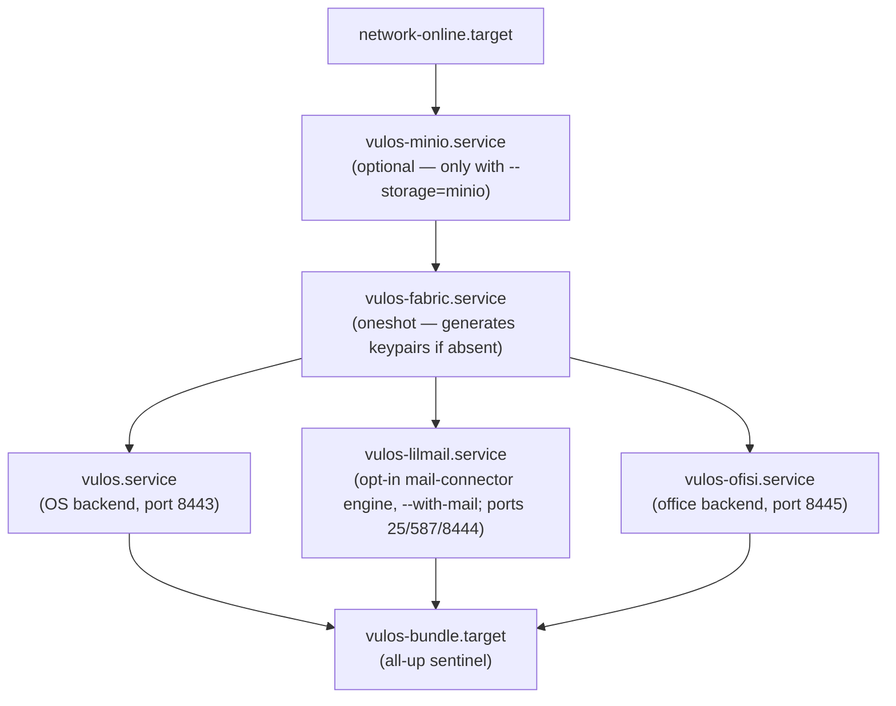

# Vulos Bundle — Self-Host Guide

One command installs the **Vulos OS backend + Ofisi** (`vulos-office`) on a single Linux
machine, supervised by systemd (or OpenRC on Alpine), sharing one config dir,
one data dir, one fabric identity, and one S3 storage backend.

```
curl -fsSL https://get.vulos.org | sudo bash
```

> **Mail is a connector, not a bundled server.** By default the Vulos inbox
> connects to a mailbox you already own (Gmail/Outlook/any IMAP/SMTP) via LilMail
> + `@vulos/mail-ui` — see [MAIL-LILMAIL.md](MAIL-LILMAIL.md). The Vulos-hosted
> mail **engine** (`vulos-mail`) is **dormant/experimental** and is installed only
> when you opt in with `--with-mail` (off by default). Nothing below requires it.

---

## Table of Contents

1. [What gets installed](#what-gets-installed)
2. [Prerequisites](#prerequisites)
3. [Install matrix (bash / Docker / Raspberry Pi)](#install-matrix)
4. [Storage backends (Tigris vs. local MinIO)](#storage-backends)
5. [Installer flags](#installer-flags)
6. [Shared directory layout](#shared-directory-layout)
7. [Service ordering and supervision](#service-ordering-and-supervision)
8. [Security hardening](#security-hardening)
9. [Post-install steps](#post-install-steps)
10. [Upgrading](#upgrading)
11. [Troubleshooting](#troubleshooting)

---

## What gets installed

| Service | Binary | Port(s) | Purpose |
|---|---|---|---|
| vulos | `/usr/local/bin/vulos` | 8443 | OS backend — API gateway, app fabric |
| vulos-office | `/usr/local/bin/vulos-office` | 8445 | Ofisi — collaborative office suite (Docs / Sheets / Slides / PDF / Whiteboard) |
| vulos-mail (opt-in) | `/usr/local/bin/lilmail` | 25, 587, 8444 | Dormant/experimental self-hosted mail engine — installed only with `--with-mail` |
| minio (optional) | `/usr/local/bin/minio` | 9000 (loopback) | Local S3-compatible storage |

All services run as the `vulos` system user (UID < 1000, no login shell).
By default the bundle installs `vulos` + `vulos-office`; `vulos-mail` is opt-in
because mail is normally a connector to an existing mailbox, not a hosted server.

---

## Prerequisites

- Linux x86\_64 or arm64 (aarch64)
- systemd **or** OpenRC
- `curl` and `sha256sum` on PATH
- A current Go toolchain and `git` — the office and mail services are built on the box from a pinned release tag (install Go from https://go.dev/dl/)
- Root access (`sudo`)
- Open ports: 25, 587 (mail), 443 or 8443/8444/8445 (HTTPS)
- 2 GB RAM minimum (4 GB recommended for all three services)
- 10 GB disk (more for mail/office data)

---

## Install matrix

### Bare-metal / VPS (bash)

**Debian 12 / Ubuntu 22.04+ / Ubuntu 24.04** (recommended):

```bash
curl -fsSL https://get.vulos.org | sudo bash
```

**Fedora 39+ / RHEL 9+**:

```bash
curl -fsSL https://get.vulos.org | sudo bash
```

**Arch Linux**:

```bash
curl -fsSL https://get.vulos.org | sudo bash
```

**Alpine Linux 3.19+** (OpenRC):

```bash
# Alpine uses OpenRC — the installer detects this automatically
curl -fsSL https://get.vulos.org | sudo bash
```

### Docker (development / macOS / Windows)

The native installer requires Linux. On macOS or Windows, use Docker Compose:

```bash
# Download the bundle compose file
curl -fsSL https://get.vulos.org/bundle/docker-compose.yml -o vulos-bundle.yml

# Start all three services
docker compose -f vulos-bundle.yml up -d

# Tail logs
docker compose -f vulos-bundle.yml logs -f
```

The compose file runs the same three binaries in separate containers with
shared named volumes for `/etc/vulos` and `/var/lib/vulos`.

### Raspberry Pi 4 / 5 (arm64)

The installer detects `aarch64` and fetches arm64 binaries automatically.
Tested on Raspberry Pi OS Bookworm (64-bit) and Ubuntu Server 24.04 for Pi.

```bash
# Same command — arch is auto-detected
curl -fsSL https://get.vulos.org | sudo bash
```

Minimum: Pi 4 with 4 GB RAM. Port 25 forwarding must be enabled on your
router/ISP (many residential ISPs block port 25 — use a VPS or relay instead).

### Dry run (inspect the plan without making changes)

```bash
curl -fsSL https://get.vulos.org | sudo bash -s -- --dry-run
```

---

## Storage backends

The bundle supports two storage modes for S3-compatible object storage.

### Tigris (default — recommended)

[Tigris](https://www.tigrisdata.com) is an S3-compatible hosted object store
that runs close to your users. It requires no local disk for object data.

```bash
# Default — uses Tigris
curl -fsSL https://get.vulos.org | sudo bash

# Then edit:
sudo nano /etc/vulos/storage.yaml
# → Set access_key, secret_key, and bucket
```

Create a bucket directly at [storage.tigris.dev](https://storage.tigris.dev).
Tigris is S3-compatible and works from anywhere over the public network ($0 egress).

### Local MinIO (complete BYO / air-gap)

MinIO provides S3-compatible storage on your own disk. Choose this for
complete self-hosting with no external dependencies.

```bash
curl -fsSL https://get.vulos.org | sudo bash -s -- --storage=minio
```

This installs and configures MinIO as a systemd service (`vulos-minio.service`)
that runs on `127.0.0.1:9000` (loopback only — not exposed externally).

A random 32-byte secret key is generated at `/var/lib/vulos/minio/.minio_secret`
and read by the systemd service at start time.

If MinIO is **already installed** on the machine, the installer skips the
download and uses the existing binary. Set `--storage=minio` to point the
bundle at it; then configure `/etc/vulos/storage.yaml` with the existing
endpoint and credentials.

---

## Installer flags

| Flag | Default | Description |
|---|---|---|
| `--dry-run` | off | Print the install plan without making changes |
| `--with-mail` | off | Also install the dormant/experimental `vulos-mail` engine (ports 25/587/8444). Omit it and mail stays a connector to your existing mailbox |
| `--storage=tigris` | on | Use Tigris S3-compatible hosted storage |
| `--storage=minio` | off | Install + use local MinIO (`--storage=local` is an alias) |
| `--no-enable` | off | Install units but do not enable/start services (useful in CI or containers) |
| `--help` | — | Print usage and exit |

---

## Shared directory layout

All three services share the same config and data roots:

```
/etc/vulos/
  fabric.yaml       — shared mesh identity, domain, TLS
  storage.yaml      — S3/MinIO credentials and backend selector
  vulos.yaml        — OS backend config (inherits from fabric + storage)
  mail.yaml         — vulos-mail config (inherits from fabric + storage)
  office.yaml       — vulos-office config (inherits from fabric + storage)
  bundle.yaml       — installer metadata (arch, distro, storage mode)

/var/lib/vulos/
  fabric_public.pem   — shared fabric X25519 public key
  fabric_private.pem  — shared fabric X25519 private key (mode 600)
  vulos/              — OS backend data
  mail/
    x25519_public.pem   — mail encryption public key
    x25519_private.pem  — mail encryption private key (mode 600)
  office/
    uploads/            — office file uploads
  minio/              — MinIO data (only when --storage=minio)
    .minio_secret     — MinIO root password (mode 600)
```

All files under `/var/lib/vulos` are owned by `vulos:vulos`. Config files
under `/etc/vulos` are owned `root:vulos` with mode 640 so the service user
can read but not write them.

---

## Service ordering and supervision

### systemd dependency graph



`vulos-bundle.target` is the recommended unit to use for start/stop/status:

```bash
sudo systemctl start  vulos-bundle.target
sudo systemctl stop   vulos-bundle.target
sudo systemctl status vulos-bundle.target
```

Individual services can be restarted independently:

```bash
sudo systemctl restart vulos-lilmail.service
```

### OpenRC (Alpine)

On Alpine Linux the installer writes init scripts to `/etc/init.d/vulos`,
`/etc/init.d/vulos-lilmail`, and `/etc/init.d/vulos-ofisi`. Each script
declares `need net` and `after vulos-fabric` ordering.

```bash
sudo rc-update add vulos default
sudo rc-update add vulos-lilmail default
sudo rc-update add vulos-ofisi default
sudo rc-service vulos start
```

---

## Security hardening

The installer inherits hardened patterns from `install-vulos.sh` and
applies them consistently to all three services:

| Control | Detail |
|---|---|
| Non-root service user | All services run as `vulos` system account (UID < 1000, `/usr/sbin/nologin`) |
| UID-collision guard | Installer aborts if an existing `vulos` user has UID >= 1000 |
| Verified acquisition | The OS backend is verified against `checksums.txt` before install (no skip path); the office and mail services are built on the box from a pinned release tag |
| Symlink-safe dirs | Installer aborts if `/etc/vulos` is a symlink (prevents traversal attacks) |
| `NoNewPrivileges=yes` | All systemd units — prevents privilege escalation via setuid |
| `ProtectSystem=strict` | Filesystem namespace — writable only via `ReadWritePaths` |
| `PrivateTmp=yes` | Private `/tmp` namespace per service |
| `PrivateDevices=yes` | No access to raw device files |
| `CapabilityBoundingSet=` | Empty for vulos, vulos-ofisi, vulos-fabric, vulos-minio |
| `CapabilityBoundingSet=CAP_NET_BIND_SERVICE` | the mail engine only — needed for ports 25 + 587 |
| Config file modes | `/etc/vulos/*.yaml` owned `root:vulos`, mode 640 |
| Private key modes | `fabric_private.pem`, `x25519_private.pem` mode 600 |
| MinIO loopback-only | MinIO binds `127.0.0.1:9000` — not exposed to external network |

---

## Post-install steps

1. **Edit shared fabric config:**
   ```bash
   sudo nano /etc/vulos/fabric.yaml
   # Set: domain, acme_email
   ```

2. **Set storage credentials** (Tigris) or verify MinIO secret:
   ```bash
   sudo nano /etc/vulos/storage.yaml
   ```

3. **Generate keypairs:**
   ```bash
   sudo -u vulos /usr/local/bin/vulos keygen --fabric
   sudo -u vulos /usr/local/bin/vulos-mail keygen
   ```

4. **Start the bundle:**
   ```bash
   sudo systemctl enable --now vulos-bundle.target
   ```

5. **Configure DNS:**
   - A record → this server's IP
   - MX record → mail subdomain
   - SPF, DKIM, DMARC records — your `vulos keygen` output prints the exact
     records to publish (and they are shown in Settings → Mail → DNS). No cloud
     account is required to generate or read them.

Your bundle is a **fully self-contained, sovereign server** — it routes, serves,
and delivers mail entirely on its own once DNS is configured above. Nothing
about it phones home or depends on any Vulos-operated service. If the box
sits behind NAT or CGNAT, see [NETWORKING.md](NETWORKING.md) for reaching it
through **Ephor** (`github.com/vul-os/ephor`) — a hosted instance, your own
self-hosted one, or direct TLS if you have a static IP.

---

## Upgrading

Run the installer again — it is idempotent. Existing config files are never
overwritten (the installer checks before writing). The OS backend is re-fetched
and re-verified; the office and mail services are rebuilt from the latest
release tag. The Go toolchain and git must be present for those builds.

```bash
curl -fsSL https://get.vulos.org | sudo bash
sudo systemctl restart vulos-bundle.target
```

To upgrade a single service:

```bash
# Re-run the installer to rebuild the service, then:
sudo systemctl restart vulos-lilmail.service
```

---

## Troubleshooting

### Service fails to start

```bash
sudo systemctl status vulos-bundle.target
sudo journalctl -u vulos -u vulos-lilmail -u vulos-ofisi -n 100
```

### Port 25 blocked by ISP

Many residential and cloud ISPs block inbound port 25. Options:
- Use a VPS with port 25 open (Hetzner, OVH, etc.)
- Use a mail relay service (configured in `/etc/vulos/mail.yaml`)
- Contact your ISP to unblock port 25

### MinIO not starting

```bash
sudo systemctl status vulos-minio.service
sudo journalctl -u vulos-minio -n 50
# Check the secret file exists:
sudo ls -la /var/lib/vulos/minio/.minio_secret
```

### Build or checksum failure

If the OS backend download is corrupted in transit the installer aborts on a
SHA-256 mismatch — re-run it and it re-fetches and re-verifies from scratch. If
the office or mail build fails, the usual cause is a Go toolchain older than the
module's `go` directive; install a current toolchain from https://go.dev/dl/ and
re-run.

### Config already exists warning

The installer never overwrites existing config files. To reset a config:
```bash
sudo mv /etc/vulos/mail.yaml /etc/vulos/mail.yaml.bak
# Re-run the installer — it will write a fresh default
```
