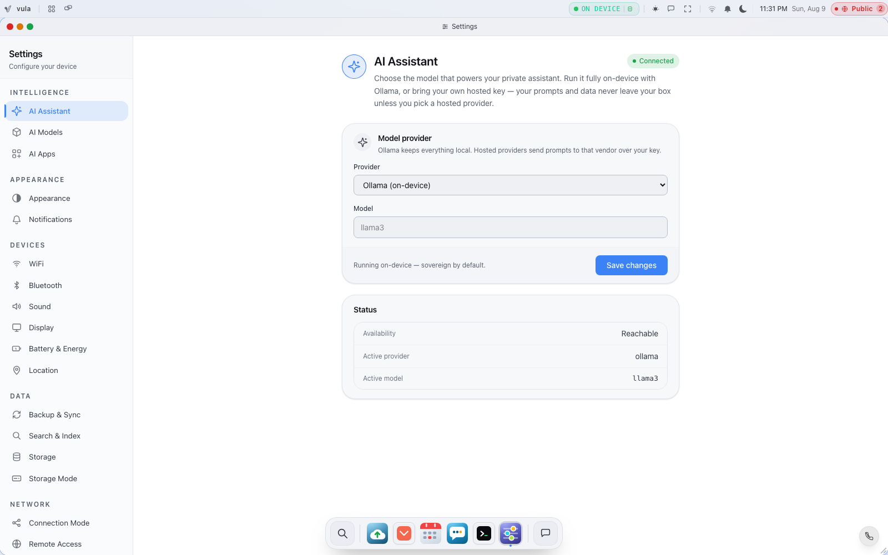
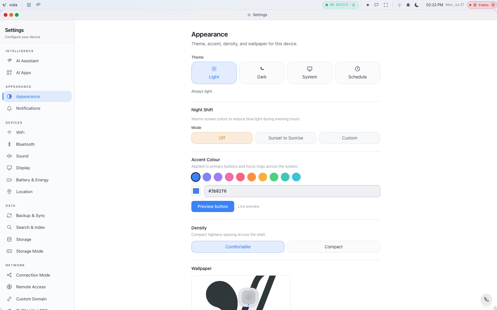

# Settings

The Settings app is where you configure your box: appearance, devices, storage, network reachability, accounts, and system updates. This chapter walks every pane in the order the app itself groups them, so you can use it as a reference while you click around.

Open **Settings** from the Launchpad, the Home quick-launch tiles, or **Cmd-K/Ctrl-K** (some palette actions deep-link straight to a section). On a phone or narrow window the section list becomes a drawer behind a **☰** button in the top bar; on a desktop-sized window it is a permanent sidebar on the left.

Sections marked **owner only** below are hidden from the nav entirely for non-admin users — and the backend independently rejects the same requests from a non-owner, so hiding the button is a convenience, not the actual security boundary.

For background on accounts, roles, and the desktop shell that surrounds Settings, see [USER-GUIDE.md](USER-GUIDE.md). For the operator-side environment variables that some of these panes read and write, see [CONFIGURATION.md](CONFIGURATION.md).

<picture>
  
</picture>

---

## Intelligence

| Pane | What you do there |
|---|---|
| **AI Assistant** | Choose the assistant's provider (Ollama/local, Claude, OpenAI, or any OpenAI-compatible custom endpoint), its model name, and an API key if the provider needs one. A live status line shows whether the configured provider actually answers. |
| **AI Models** *(owner only)* | Manages what's really installed on the box's private-AI seam: which local embeddings model is present for semantic search, whether its real tokenizer is installed (upgrading search from a lexical fallback to genuine semantic retrieval), and the chat models the on-box `llmux` gateway currently exposes. An **Import** flow lets you upload a model or tokenizer artifact. |
| **AI Apps** | Manages small interactive apps the assistant has generated for you — open one (it runs in a sandboxed iframe with no access to your session), inspect its version history and roll back, control who else can see it, or delete it. If an administrator has disabled AI-app editing, saving/deleting/rollback show as disabled with an explanatory banner; you can still open existing apps. |

## Appearance

| Pane | What you do there |
|---|---|
| **Appearance** | Theme (Light / Dark / System / Schedule, with a dark-from/light-from time picker under Schedule), Night Shift (off / sunset-to-sunrise / a custom time window, plus a warmth slider), an accent colour (ten presets or a custom hex value, live-previewed on a sample button), density (Comfortable / Compact spacing across the whole shell), and wallpaper (upload an image or reset to default). |
| **Notifications** | Do Not Disturb and notification-sound toggles, the per-device Web Push toggle for this browser, and per-source toggles (Mail, Assistant, System, …) that stop a source being collected at all, not just silenced. See [Notifications](USER-GUIDE.md#notifications) in the User Guide. |

<picture>
  
</picture>

## Devices

| Pane | What you do there |
|---|---|
| **WiFi** | See connection status, scan for networks, and connect with a password. |
| **Bluetooth** | Power Bluetooth on/off, scan, and pair/connect/disconnect/forget devices. |
| **Sound** | Pick default input/output devices, and adjust or mute volume per device. |
| **Display** | Brightness (where the hardware reports one), and resolution per connected output. |
| **Battery & Energy** | Battery percentage and charge state (where available), and a Performance / Balanced / Saver power-mode switch, plus read-only CPU governor, screen, and idle-time status. |
| **Location** | Off by default. When you turn it on, your browser reports its position **to your own box only** (never a third party), so box apps like Maps or Weather can use it without prompting you again per app. Turning it off stops reporting immediately. |

## Data

| Pane | What you do there |
|---|---|
| **Backup & Sync** | Shows whether the encrypted backup vault (Restic, via the `S3_*` variables) is initialised, when it last ran, and how many snapshots exist; **Backup Now** and **Sync to This Device** trigger it on demand. If the vault isn't configured, the panel says so and points at the environment variables it needs. |
| **Search & Index** | Status of Recall, the on-box semantic index over your files (files indexed, total scanned, last run) with a **Reindex** button. The assistant uses this index to answer questions about your data. |
| **Storage** | Your object-store endpoint, bucket, region, and keys — the per-user storage gateway behind Files/Drive and app storage. |
| **Storage Mode** | Where the wider bundle (mail, office, OS) reads and writes its objects: **This device** (default — plain files on this box's own disk, no object store, no credentials, no third-party service), **Local MinIO + CRDT sync** (a co-located MinIO becomes the source of truth and the sync layer replicates to peer instances), or **Central Tigris** (opt-in — every read/write goes straight to a hosted third-party bucket). Changing this needs a restart of `vulos-bundle.target` to take effect. A box installed before the local default was introduced keeps the backend it was already using; nothing is migrated for you. |

## Network

| Pane | What you do there |
|---|---|
| **Connection Mode** | Choose how this box reaches the outside world: **Fabric** (the relay-based default, works behind NAT), **Direct** (expose this node directly on the public internet), **Own Domain** (your own domain and reverse proxy), or **Local Only** (LAN-only; external listeners blocked — for air-gapped use). Switching modes never changes the node's identity (its ULID). See [NETWORKING.md](NETWORKING.md). |
| **Remote Access** | Sets the URL used to reach this device — leave as `localhost` for local use, or set your public IP/domain for remote access. |
| **Custom Domain** | Attach your own domain to a published app: the panel walks you through the DNS TXT-record challenge and verification. An app must already be published (visibility `public`, see [APPS.md](APPS.md)) before you can attach a domain. |
| **Relay & Reachability** *(owner only)* | Picks the provider used to reach this box from outside your network and for box-to-box rendezvous: the built-in Vulos relay (the default — it just works, nothing to configure), Pier (an experimental alternative broker), your own STUN/TURN, a libp2p Circuit Relay v2 peer, a WireGuard mesh (Tailscale/Headscale/Nebula), or none at all if this box has a static IP. This only changes ingress/rendezvous — real-time call audio (Meet/Talk) keeps using its own ICE/TURN path regardless, so you can't accidentally break call quality while changing how the box itself is reached. A **Test** button TCP-probes whatever is currently configured. |
| **CDN** *(owner only)* | Configure a CDN vendor (Cloudflare/Fastly/Bunny) in front of this box — origin host, Host header, authenticated-origin-pulls — and preview an origin-firewall ruleset restricting inbound traffic to that vendor's published IP ranges. The panel is explicit that enabling the firewall here only **generates and shows** the ruleset; nothing is applied to the box's actual network filter yet. |
| **TURN / WebRTC** | Point real-time app streaming at your own coturn server (host, port, realm, shared secret) if devices behind strict NAT need a dedicated TURN relay, and test reachability. |

## Developer

| Pane | What you do there |
|---|---|
| **Webhooks** *(owner only)* | Subscribe a URL to box events; each delivery is a signed (`X-Vulos-Signature: HMAC-SHA256`) JSON POST. Every URL is screened server-side against loopback/private/link-local/metadata ranges both when you save it and again at delivery time. Creating or editing a subscription requires a fresh step-up (re-entering your password) since a webhook is, by nature, somewhere your data can leave to. You can rotate the signing secret, send a test delivery, and inspect recent delivery attempts. |
| **Developer** | Issue and revoke bearer keys for this box's public REST API (`/api/v1/…`) — distinct from your browser session and from any cross-product entitlement key. Issuing a new key requires step-up; the raw secret is shown once. |

## Account & Security

| Pane | What you do there |
|---|---|
| **Users & Profiles** | Set your own lock-screen PIN. Admins can also add a user (display name, username, a 4+ character password), change any other user's role (Admin/User/Guest), and remove a user (irreversible). |
| **Device PIN** | Set, change, or remove the 4–8 digit lock-screen PIN for this device. The PIN never leaves the device — it's derived locally (argon2id) and sealed via the TPM where one is available. Changing or removing it needs a full password re-auth; the pane also shows lockout state (attempts remaining, or a permanent lock requiring full sign-in). |
| **Fingerprint** | Only shown as usable when the box detects a supported `fprintd`/`libfprint2` reader (Synaptics, Goodix, ELAN, AuthenTec, DigitalPersona, Validity, and similar USB sensors — not available in most VMs or on macOS/Windows). Enroll, re-enroll, or remove fingerprint unlock; after 3 failed scans the lock screen falls back to PIN or password. |
| **Account** | Display name, language, timezone, and **Log Out**. |
| **Offline Data** | Discloses that a successful online sign-in caches a password-wrapped key envelope on this device so you can unlock cached data when the box is unreachable, and gives you the one control that matters: **forget offline data on this device**, which wipes that cached credential and any shell-held app caches. |
| **Export My Data** | Downloads a single `.zip` of your mail (`.eml`), Drive files (real bytes), calendar (`.ics`), contacts (`.vcf`), and OS preferences (secrets scrubbed) — all in standard formats that need nothing Vulos-specific to read back. The panel states plainly what's included and what isn't (Diwan documents and chat/video history that live in their own comms apps, and anything held only on a peer via an end-to-end share, are not in this archive). |
| **Sign-in security** | Watches sensitive changes to your account — password or encryption-key resets, passkey changes, role changes, bulk exports, large downloads — and flags anything that looks anomalous (several sensitive changes in a short time, or a change from an unfamiliar device/network). A flagged alert is also pushed to every signed-in device the moment it fires. From here you can mark an alert **This was me**, or **Not me — lock account**, which signs every device out (including this one) and requires signing back in with your password. |

## System

| Pane | What you do there |
|---|---|
| **OS Update** | Vulos checks its release channel in the background and cryptographically verifies every manifest against the release-signing trust chain baked into the image — that check **never** downloads or stages anything on its own. This pane shows the running version, the latest verified version (flagged prominently if it's a security release), and lets you explicitly **Download & stage** it: staging downloads, verifies, and writes the release to the inactive A/B slot, but the box keeps running the current version until you separately reboot. |
| **Box Health** *(owner only)* | A live view of the box's own vitals: the same degraded-checks probe used at `/api/health` (data-dir writable, free disk, sync lag), live CPU/memory/load-average/uptime, and one-shot storage/host details. |
| **About** | Version and system info, plus open-source licence notices and the GPL/LGPL written offer, fetched on demand. |

---

## What isn't here

Two things worth noting so you don't go looking for them:

- There's no "AI Router" pane — routing an AI request to a local model, `llmux`, or an external provider is governed by the **AI Assistant** pane plus the operator's environment configuration (`AI_PROVIDER`, `LLMUX_URL`, and the sovereignty tier shown by the trust badge — see [ASSISTANT.md](ASSISTANT.md)), not a separate settings screen.
- Sign-in and the wider account-security model are covered in [SECURITY.md](SECURITY.md), not here — this page only documents what's inside the Settings app itself.
