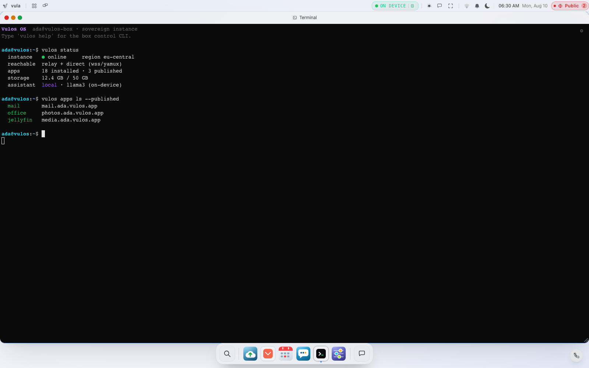

# Terminal

A real Linux shell on your box, running in the browser. Vulos is the OS you run on your own hardware or any cloud VPS — there is no sandboxed "cloud shell" behind this: the Terminal app opens a genuine PTY (pseudo-terminal) on the machine the backend is running on, and whatever you type runs exactly as if you had SSH'd in.



## What it is

- **A full interactive shell**, not a restricted command box. The backend spawns your login shell (`$SHELL`, falling back to `/bin/bash`) with `--login`, attaches it to a PTY, and streams input/output over a WebSocket (`wss://<your-box>/api/pty`) to an [xterm.js](https://xtermjs.org) terminal in the window. Resize, colours, scrollback, copy/paste, clickable links — all the normal terminal behaviour applies.
- **Runs as your Linux user, not root.** When per-profile isolation is configured, the server (running as root) resolves your Vulos profile to a real Linux system user and drops privileges to that user's uid/gid before starting the shell, with `$HOME` set to that user's home directory. Only admin profiles get `sudo`. If the server is *not* running as root, per-profile isolation cannot be enforced — rather than silently share one Linux identity across every profile, the terminal refuses to start at all (fail-closed).
- **Sessions persist independently of the browser tab.** Closing the window detaches the WebSocket but leaves the shell process running; reopening Terminal shows a session picker so you can re-attach (or "Takeover" a session someone else is attached to) instead of always starting fresh. Killing a session from the picker terminates the underlying shell process.
- **Scrollback is a 64KB ring buffer** per session, replayed to a client the moment it (re)attaches, so you don't lose recent output on a reconnect — it isn't unlimited history.
- **Output is coalesced**, not streamed byte-by-byte: the backend buffers PTY output for up to 16ms (or until a chunk hits 16KB) before sending a frame, which is a bandwidth/latency optimisation and has no effect on what you see.
- **Only reachable when signed in.** `/api/pty` and `/api/pty/sessions` sit behind the same session middleware as the rest of the OS API — no valid session cookie or token, no shell. There is no anonymous or public terminal endpoint.

## Opening it

Launch **Terminal** from any of:

- The **Launchpad** (rocket icon in the menu bar) — it's filed under the "system" category.
- The **Home** screen's quick-launch row.
- **Cmd-K** (the command palette) — search for "terminal", "shell", "bash", "console", or "cli".
- The **dock**, if you've pinned it there.

Opening it with no live sessions drops you straight into a new shell. If you have one or more sessions already running, you'll see the session picker first — pick "New Session" or attach to an existing one.

## Common tasks

Everything below is a plain shell command run inside the Terminal app itself (or over SSH — it's the same box). `sudo` is only available if your Vulos profile has the admin role.

**Check that everything is up:**

```bash
sudo systemctl status vulos-bundle.target        # the whole stack
sudo systemctl status vulos.service              # just the OS backend
```

**Tail logs:**

```bash
sudo journalctl -u vulos -n 200 --no-pager        # OS backend, last 200 lines
sudo journalctl -u vulos -f                       # follow live
sudo journalctl -u vulos -u vulos-lilmail -u vulos-diwan -n 100   # mail + office together
```

If you're running under Docker instead of the systemd bundle:

```bash
docker logs vulos --tail 200
docker logs vulos -f
```

**Disk usage** (your data lives under `~/.vulos`, or wherever `VULOS_DATA_DIR` points):

```bash
df -h                    # free space on the box
du -sh ~/.vulos/*        # what's using space inside your data dir
```

The `/api/health` endpoint also degrades itself below 500 MiB free, so a quick check is:

```bash
curl -s http://localhost:8443/api/health | jq   # 8080 in Docker/dev instead of 8443
```

**Restart a service after a config change:**

```bash
sudo systemctl restart vulos.service         # OS backend only
sudo systemctl restart vulos-lilmail.service    # mail only
sudo systemctl restart vulos-bundle.target   # the whole bundle
```

**Inspect network/reachability:**

```bash
curl -s http://localhost:8443/api/network/status | jq   # requires a session
curl -s http://localhost:8443/api/network/direct | jq    # direct-mode status, if enabled
```

`ss -tulpn` and `ip a` work exactly as you'd expect on any Linux box, for a lower-level look at what's listening and on what address.

**Applying OS updates.** This is the one thing the terminal is deliberately *not* the path for on an OS-image install: OTA update checks are verify-only and run in the background automatically, but actually staging a new image only ever happens when you click "Download & stage update" in **Settings → OS Update** — that route requires the owner role and a fresh step-up elevation, and nothing in the backend calls it on its own. Don't try to reproduce this by hand from the shell. If you're running the self-hosted bundle from Docker rather than an OS image, see the upgrade steps in [DEPLOY.md](DEPLOY.md#upgrading) instead (a `docker pull` + restart, run from your host, not necessarily from inside the Terminal app).

## Safety notes

This is a real shell with real consequences — there is no sandbox between you and the box's filesystem, processes, and network.

- Commands you run here can delete data, kill services, or break the box exactly as they would over SSH — there's no confirmation dialog standing between you and `rm -rf`.
- Don't run untrusted scripts or paste commands you don't understand, especially anything that pipes straight into a shell (`curl ... | sh`).
- Stick to your own home directory and the documented service commands above unless you know exactly what a broader change does — other profiles' home directories are locked to `0700` for a reason.
- Killing a session from the picker kills the actual process tree underneath it (including anything you left running, like a long build or `tail -f`), not just the browser connection.
- If you're an admin and have `sudo`, treat it with the same care you would on any server you're responsible for: a mistake here affects every profile and app on the box, not just your own.

## Where to go next

- [USER-GUIDE.md](USER-GUIDE.md) — the Launchpad, dock, Cmd-K palette, and the rest of the desktop shell.
- [CONFIGURATION.md](CONFIGURATION.md) — environment variables, the self-hosted bundle's directory layout, and `VULOS_DATA_DIR`.
- [NETWORKING.md](NETWORKING.md) — direct mode, the relay, ports, and verifying reachability from the command line in more depth.
- [TROUBLESHOOTING.md](TROUBLESHOOTING.md) — where logs live, health checks, and symptom-by-symptom fixes if a service won't come up.
