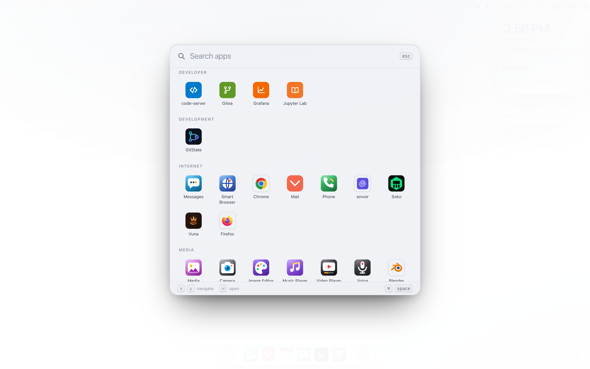
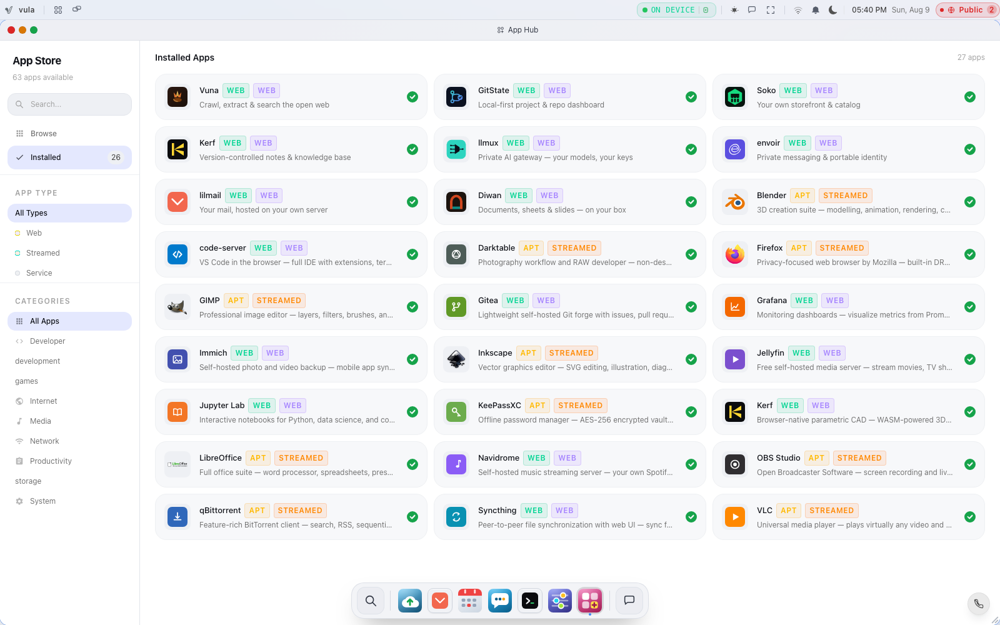

# Using the Vulos Desktop

Vulos is a full desktop that runs in your browser and lives on hardware you own — a mini-PC, a spare laptop, or a cloud VPS you rent from any provider. This is the daily-driver manual for what you actually see once you open it: first sign-in, the shell (windows, dock, tiling), Files, the App Hub, the assistant, Calendar/Contacts/Notes, notifications, the terminal, and using it from your phone.

This chapter assumes a running box — see [GETTING-STARTED.md](GETTING-STARTED.md) for installation, and the section directly below for the choice that determines whether what you set up here survives a reboot. Networking and reachability (relays, Pier, direct, your own domain) are their own chapter: [NETWORKING.md](NETWORKING.md).

---

## Two ways to run Vulos

Before you set anything up, one decision matters more than any setting inside the desktop: **is this box going to persist, or is it a live session?** Vulos supports both, on purpose, and they behave very differently.

### Set it up to persist — for a box you're keeping

This is how Vulos is meant to be run. A persistent box behaves like any normal computer: it writes your accounts, files, keys, and settings to its own disk, and everything is exactly where you left it after a reboot, a power cut, or pulling the plug.

There are two ways to get a persistent box today:

- **Deploy to a machine you already run** — a VPS, or a spare machine with a Debian-family Linux on it, reachable over SSH as root by key. The build runs on your own machine and is pushed across:
  ```bash
  ./build.sh --deploy YOUR_SERVER_IP
  ```
  `--domain` cannot be passed alone — automatic TLS is issued over DNS-01, so it needs DNS credentials in the same command (`--domain os.example.com --dns-namecheap USER APIKEY`) or the script exits. See [DEPLOY.md](DEPLOY.md).
- **Docker**, with your data on a named volume (`-v vulos-data:/root/.vulos`) — see [GETTING-STARTED.md](GETTING-STARTED.md).

**Installing to a bare machine's own disk is not available yet**, although the README and the release notes still describe it as the primary path. `vulos-install` is not compiled into any shipped image, so it is not in the live session that would run it. The specifics, and what that installer would and would not give you, are in [GETTING-STARTED.md → Installing to the machine's own disk](GETTING-STARTED.md#install-it-to-the-machines-disk).

### Try it live from a flash drive — for testing, demos, or a disposable machine

The published `.img.gz` on the [Releases page](https://github.com/vul-os/vulos/releases) boots a full Vulos desktop straight off a USB stick, on real hardware, with nothing written to the machine's internal disk:

```bash
gunzip -c vulos-vX.Y.Z-x86_64.img.gz | sudo dd of=/dev/sdX bs=4M status=progress
```

This is a **live session**, not an installed system. The root filesystem is a read-only image and the writable layer lives in RAM. That means:

- **Nothing persists across a reboot.** The account you create, the recovery phrase you're shown, any files you upload, any app you install — all of it lives in RAM for that boot only. Pull the drive or restart the machine and you're back to a blank first-boot wizard.
- It's genuinely useful anyway: the fastest way to see the real desktop on real hardware before committing a machine to it, a demo you can hand someone without any cleanup, or a recovery/rescue environment that's guaranteed clean every time you boot it.

### Moving from a live session to something that persists

There's no in-place "make this permanent" button for a live session — a live boot never writes to the internal disk, so there's nothing to promote. Treat the live session as a preview: it tells you whether the machine is a good host, and then you set that machine up persistently by another route (today, install a Debian-family Linux on it and use `./build.sh --deploy`). If you connected S3-compatible storage during the live session's setup wizard, the **Join existing** flow on the persistent box can sync your data back down from that storage — see [BACKUP-RECOVERY.md](BACKUP-RECOVERY.md).

---

## First sign-in: the setup wizard

The first time you open your box's address in a browser, it checks whether an account already exists. If not, you land in the setup wizard instead of the sign-in screen.

The wizard opens with a choice:

- **New system** — set this device up from scratch.
- **Join existing** — connect this device to storage from a Vulos box you already run, and sync into it. You give it your existing S3-compatible storage details and an encryption passphrase; it syncs in the background and then asks only for a lock-screen PIN. Use this to add a second box or restore one — see [BACKUP-RECOVERY.md](BACKUP-RECOVERY.md).

A **New system** setup walks through these steps, most skippable:

| Step | What happens |
|---|---|
| Welcome | "Get Started". *Vula* is isiZulu for "open". |
| Device type | PC / Tablet / Mobile, TV, Car, or Watch — auto-detected from `GET /api/device-profile`, and it reshapes the whole UI (a TV, for instance, gets a 10-foot remote-driven interface). |
| Language | Pick from the OS's supported languages. |
| Timezone | Picked on a map; defaults to what your browser reports. |
| Network | Scan and join WiFi, or skip if you're on Ethernet. |
| Your account | Display name, username, password. This becomes the **administrator** account — the same credentials you'll use for `sudo` in the Terminal. |
| Lock Screen PIN | Optional 4–8 digit PIN for the lock screen. Skippable; set it later in Settings. |
| Your apps | Two toggles, both on by default: claiming your Vulos username (which enables the Mail connector), and installing the Diwan productivity app. Uncheck either for a leaner install. **Files, Calendar and Contacts are always included.** |
| Appearance | Dark / Light / Auto theme. |
| Node identity | Shows your instance's read-only ULID and lets you set a hostname (lowercase letters, numbers, hyphens). |
| Storage | Optionally connect S3-compatible storage with an encryption passphrase. |
| SSH | Optionally generate an Ed25519 SSH keypair for the box, client-side in your browser — the private key is shown once for you to copy. |
| Recovery kit | A versioned credentials JSON (instance ULID, hostname, checksum) you download and confirm by typing `confirm`. Shown once. |
| Ready | A summary of everything chosen; pressing the finish button creates the account. |

### The recovery phrase

The moment your account is created, the server mints a per-user master key and shows a **24-word recovery phrase — exactly once**. A checkbox gates the **Continue** button — but there **is** a way past the screen without ticking it: a **"Skip for now" → "Skip and accept the risk"** path (`frontend/src/auth/MasterKeyReveal.tsx:119-158`), which the wizard treats identically to confirming. So it is possible to finish setup having never seen the phrase. The warning is literal: **a forgotten password cannot be recovered without this phrase** — the master key it protects wraps your encrypted content. Store it offline. More in [SECURITY.md](SECURITY.md) and [BACKUP-RECOVERY.md](BACKUP-RECOVERY.md).

The recovery **kit** (the JSON file from setup) is separate from the recovery **phrase**. An admin can re-download the kit later at `GET /api/recovery/kit`. It is **admin-gated but not restricted to a local session** — `routes_kit.go:23-46` checks the role and uses `RemoteAddr` only for the audit log, so the same request works from anywhere the box is reachable. (The setup wizard's on-screen text makes the same "trusted local session" claim, and is wrong in the same way.) The phrase itself is never re-shown.

### Optional private AI

Right before you enter the desktop, the wizard offers to download an on-box embedding model ("Enable private AI search"). It's genuinely optional — search still works in lexical mode without it — and the model is fetched from a pinned source and SHA-256-verified before use. You can enable it later from **Settings → AI Models** if you skip it here. See [ASSISTANT.md](ASSISTANT.md).

---

## The desktop at a glance

After signing in you land on the desktop: a wallpaper, a translucent **menu bar** across the top, a **dock** along the bottom, an ambient **widget column** on the right, and windows floating above all of it.

<picture>
  
</picture>

### The menu bar

Left to right:

- **vula** — the system menu: your profile, hostname, uptime, live CPU/memory/temperature, and **Log Out**.
- **Desktop indicator** — "Desktop 2" plus a close button, shown only when you have more than one virtual desktop.
- **Applications** (rocket icon) — opens the Launchpad.
- **Mission Control** (stacked-windows icon) — same as pressing F3.
- **Trust badge** — the always-on sovereignty indicator: which AI tier is active and what leaves this box. Click it to open the transparency panel.
- **Chat** — toggles the assistant chat panel on the right edge.
- **Fullscreen** — browser fullscreen on/off (F11 also works, since Vulos runs in a browser).
- **WiFi** — connection status; the dropdown scans and joins networks.
- **Battery** — percentage, charging state, temperature, uptime (only on hardware that reports one).
- **Notifications** (bell) — opens the Notification Center, described below.
- **Theme toggle** — dark / light.
- **Clock** — time and date; the dropdown is a calendar.

### The widget column

Down the right-hand side, sitting on the wallpaper: a clock, what's next on your
calendar, and whatever the box is trying to tell you. They are desktop
furniture, not an overlay — a window that reaches them simply covers them, and
they show real state or an honest empty, never invented content.

### Spotlight — finding and launching things

Press **⌘Space** (Ctrl+Space) for the launcher: fuzzy search across every app by
name, description and keyword. **⌘K** opens the wider command palette, which
also reaches mail, actions and the assistant.

### Home — your day at a glance

**Home** is an app, opened from the dock or by searching for it. It is not a
launcher, it is a brief, assembled in one round-trip to `GET /api/assistant/home`:

- **What needs you today** — the assistant's attention items, with snooze/handled actions.
- **Agenda** — today's and upcoming events and reminders.
- **Recent activity** — a light feed.
- **A composer** — ask the assistant anything; anything that would change state comes back as a proposal card you approve before it runs.
- **Quick launch** — Mail, Calendar, Files, Assistant, Notes, Terminal, Settings, plus "All apps" for the full Launchpad.

Each section fails independently — if the assistant is offline, the brief says so and the rest of Home still renders. The brief is computed on your own box; it introduces no new network calls off it. Details in [ASSISTANT.md](ASSISTANT.md).

Home used to be the desktop backdrop, rendered full-bleed whenever no window was
open. That meant the wallpaper was never actually visible and closing every
window revealed another page rather than a desktop, so it now opens in a window
like any other app.

### The dock

A bottom-center dock. It is always there — pinned apps you use constantly, plus
any other app while it is running — with Spotlight at its left end and the
assistant at its right.

- Click a window's icon → focus and raise it.
- Click the focused window's icon → minimize it (toggle).
- Click a minimized window's icon → restore and focus it.

A dot under each icon marks a running window; it takes your accent color when focused. Minimized windows show dimmed. Screen readers get the same information: each tile is named for its app and describes itself as running, focused or minimized.

### The assistant panel

The dock's assistant tile (and the menu bar's chat button) slides the assistant
in from the right. It lives outside the window layer, so it survives every
window operation, and it can be popped out into a real window at any time.

---

## Launching apps

Three equivalent front doors:

1. **Launchpad** — rocket icon in the menu bar. A fullscreen grid grouped by category, with a search field that focuses automatically. Esc closes it.
2. **Command palette** — press **Cmd-K / Ctrl-K**, type a few letters of the app's name, Enter. The fastest path once you know it.
3. **Home quick launch** — the curated tiles on the Home surface.

<picture>
  
</picture>

What's installed and how the App Hub works is its own section below, and in full in [APPS.md](APPS.md).

---

## Window management

Every window has a title bar with close / minimize / maximize controls. Beyond the basics:

### Snap by dragging

Drag a window's title bar toward a screen edge and a snap preview appears (a 48 px hot zone):

- **Left / right edge** → left / right half.
- **Top edge** → maximize.
- **Any corner** → that quarter of the screen.

Halves and quarters tile the usable area exactly, with no seams, below the menu bar. Dragging a tiled window frees it back to floating. Double-clicking the title bar toggles maximize / restore.

### Tile with the keyboard

`Super+Arrow` (the Cmd key on a Mac keyboard) tiles the active window: `←`/`→` snap to a half, `↑` maximizes, `↓` restores the window's remembered floating geometry — the shell preserves where the window was before you first tiled it. `Ctrl+Alt+Arrow` does the same on keyboards without a usable Super key.

`Alt+`\` (backtick) cycles through windows; add Shift to cycle backwards. `Ctrl/Cmd+W` closes the active window. None of these fire while you're typing in a text field.

<picture>
  
</picture>

### Window sessions persist

The shell saves your desktops and windows to the browser (debounced, on every change) and restores them on reload: which desktop each window was on, its position, size, minimized state, and tile state. Built-in apps and web-app windows restore faithfully; streaming windows (a native-app browser, remote sessions) need a live backend session, so they're intentionally dropped on reload rather than shown broken.

### Virtual desktops

- **Ctrl+1–9** switches desktops; **Ctrl+N** creates one.
- The menu-bar indicator's × closes the current desktop — its windows move to the next desktop rather than closing.
- In Mission Control you can also move windows between desktops.

### Mission Control

**F3** (or **Ctrl+Up**) lays every window on the current desktop out in a grid, with a strip of desktops along the top. Click a window to jump to it, hit the × on a thumbnail to minimize it, Esc to leave. Minimized windows are hidden here — that's what the dock is for.

---

## The command palette (Cmd-K)

**Cmd-K / Ctrl-K** opens the unified palette from anywhere. One input, four live sections:

| Section | Backed by | Enter does |
|---|---|---|
| Apps | The app registry (recents shown when the query is empty) | Launches the app |
| Mail | Live `GET /api/mail/search` (debounced) | Opens the message in Mail |
| Actions | The command registry — built-ins plus commands contributed by apps | Runs the action |
| Ask | The agentic assistant | Streams an answer inline |

Navigation: **↑/↓** move, **Tab** jumps to the next section (Shift+Tab back), **Enter** activates, **Esc** closes.

Question-shaped queries automatically get an "Ask the assistant" row; prefix with **`?`** to force it. Answers stream token-by-token into the palette. If the assistant wants to *change* something, it returns a proposal card instead — press **Y** to approve or **N** to reject; nothing runs until you approve. Mail search degrades gracefully: if Mail is unreachable, the palette says so instead of breaking.

Built-in actions include composing an email, creating a calendar event, jumping to a specific Settings section, opening the notification panel, toggling the theme, locking the screen, showing the keyboard-shortcut legend, opening the transparency panel, and revealing Home.

---

## Files

Vulos ships two apps that deal with files, and it's worth knowing them apart:

- **Files** (Launchpad tile "Files", app id `drive`) is your personal cloud drive — folders, uploads, versions, sharing, external mounts. This section is about this one.
- **File Explorer** (app id `files`) is a system file manager for browsing the box's own local filesystem — useful if you're the admin poking at the machine itself, not where your documents live.

<picture>
  
</picture>

Files has three views in its sidebar:

- **My Drive** — files and folders you own.
- **Shared with me** — items other users granted you access to.
- **Received** — items redeemed from a box-to-box share link, staged locally until you save them into your Drive.

### Everyday actions

1. **Upload** — toolbar → Upload, or just drag a file into the window. Small files go up in one shot; anything 16 MiB or larger uses a resumable, chunked upload that survives a dropped connection and picks up exactly where it left off.
2. **Create a folder** — toolbar → New folder.
3. **Rename or move** — row menu on any item. A move relocates the underlying bytes so the store always mirrors your folder tree; it either fully lands or fully rolls back.
4. **Delete** — row menu → Delete. This is a soft delete with no trash view and no undo in the UI today — treat it as permanent.
5. **View version history** — row menu → Versions. Every completed upload to an existing file records a new version (size, uploader, timestamp).
6. **Download** — row menu → Download.

Names are capped at 255 characters and can't contain `/`, `\`, or be `.`/`..`; two siblings can't share a name. You can't move an item into another user's Drive, or a folder into its own subtree.

### Sharing

Three ways to share, from the row menu:

- **Share with a user** — grant a role by email address: **viewer** (list/download/see versions), **editor** (also upload, rename, move, delete, create folders), or **owner** (also manage shares and links). Permissions inherit down a folder, and only the owner can share, unshare, or manage links.
- **Create a link** — an expiring, revocable token (7 days by default, 30 max) that grants read access to anyone signed in who has it. Revoke it any time from the Share dialog.
- **Peer share** — for box-to-box sharing with no object store required at all: your box signs a capability (one file or folder, one access level, an expiry) with its own peering key, and the recipient's box verifies it and streams the bytes straight from yours. The recipient finds it under **Received** and redeems it there.

Full detail on roles, sealed (content-blind) sharing, and external drive mounts (Google Drive, Dropbox, GCS) lives in [FILES.md](FILES.md).

---

## The App Hub

The **App Hub** is the store front for everything installable beyond what ships by default — Navidrome, Gitea, Jellyfin, Grafana, Jupyter, draw.io, Cockpit, Firefox, and dozens more.

<picture>
  
</picture>

### Finding and installing an app

1. Open **App Hub** from the Launchpad, Home quick launch, or Cmd-K.
2. You land on the **Browse** tab: a searchable, filterable catalogue with category and type filters along the top.
3. Click an app's tile to open its detail panel — description, version picker (where more than one is offered), and a details table (source, category, license, architecture, homepage).
4. Click **Install**. A progress indicator shows what's happening (e.g. "Downloading from Flathub…" or "Installing packages…"); errors surface inline with the actual failure text, not a generic spinner that hangs.

### Managing what's installed

Switch to the **Installed** tab to see everything currently on your box, with a count badge. From here you can launch an installed app or remove it — removal shows the same kind of in-progress state as install.

<picture>
  
</picture>

Installing and removing apps is admin-gated — a non-admin account on the box can't add or remove software. Every registry entry is checksum-pinned and Ed25519-signed before it's allowed to install; the full supply-chain story, the sandboxing every app runs under, and publishing an app of your own to a subdomain are in [APPS.md](APPS.md).

---

## The assistant

The assistant is a private AI that runs over your **mail**, on your own instance, with the headline being honesty about where it runs and what leaves the box.

<picture>
  
</picture>

### Talking to it

Open **Assistant** from the Launchpad, Home, or Cmd-K (prefix a palette query with `?` to ask directly). Two quick-action shortcuts are offered up front — "What needs my attention" and "Summarize my inbox" — or just type a question.

At the top of the panel sits the **sovereignty badge**: which tier the current model runs at (on your device, an operator-declared endpoint, a brokered no-train provider, or an external one), with a picker to change it. Click the badge for the full transparency panel — what leaves this box, and a "Download my data" export.

### Proposals: nothing runs without your OK

If you ask the assistant to *do* something — draft a reply, create an event — it doesn't just act. A mutating request comes back as a **proposal card**: you review what it intends to do and press **Approve** or **Reject**. Only your approval sends the opaque proposal id back to the server, which then executes exactly the action it already generated — never anything a forged request could substitute in. Nothing changes state until you say so.

Full detail on tiers, egress, and the assistant's mail integration is in [ASSISTANT.md](ASSISTANT.md).

---

## Calendar, Contacts, and Notes

Calendar and Contacts are thin, standalone apps over a mailbox you already own (Gmail, Outlook, or any IMAP/CalDAV/CardDAV account) — they store nothing of their own; connect a mailbox once in Mail and both come alive. If no mailbox is connected yet, each shows an honest **"Connect Mail"** state rather than an error.

<picture>
  
</picture>

### Calendar

1. Open **Calendar** from the Launchpad, Home, or Cmd-K.
2. Switch between **Month** and **Agenda** view with the toggle in the header; `‹`/`›` step a month at a time.
3. Click **+ New event** (or click a day in Month view) to open the event editor: title, all-day toggle, start/end, location, and notes.
4. Save to add it, or open an existing event to edit or delete it from the same editor.

Cmd-K's "New event" action deep-links straight into Calendar with the editor pre-opened.

### Contacts

<picture>
  
</picture>

1. Open **Contacts**. The list pane on the left is searchable; select anyone to see their detail card on the right.
2. Click **New contact** (or the + button) to open the editor: name, title, organization, any number of emails and phone numbers (a blank row always trails so you can keep adding), and notes.
3. Save to add them, or open an existing contact to edit it in place.

### Notes

**Notes** ("Universal Memory" in its own manifest) is a bundled notes and knowledge-base app, reachable from the Home quick launch, Launchpad, or Cmd-K — write and organize notes that stay indexed on your own box. It ships as one of the default apps rather than a PIM widget, so it has no separate editor walkthrough here; open it and start writing.

---

## Passwords and 2FA codes

Two more built-in apps, both reachable from Launchpad or Cmd-K. Both are built
around the assumption that you will one day want to leave, or that the box will
one day be gone — so both import from what you already use and export something
you can open without Vulos.

### Vault — passwords

**Vault** is a password manager behind its own **master password**, separate
from your OS sign-in, and it relocks itself after five minutes of inactivity. It
has a password generator, and the toolbar's Import/Export button brings an
existing vault across from:

- **Bitwarden** (`.json`)
- **Chrome / Chromium** (`.csv`)
- **KeePass** (`.csv`)
- **1Password** (`.csv` and `.1pif`)
- a Vulos encrypted backup (`.vault`)

An import reports exactly how many entries were imported, skipped as duplicates,
and failed, rather than a bare success message. Export writes a
passphrase-encrypted `.vault` backup.

### Authenticator — 2FA codes

**Authenticator** holds TOTP codes. Add an account by pasting an `otpauth://`
URI or typing the name, issuer and secret by hand — or import in bulk from
**Google Authenticator's "Transfer accounts" QR** (its `otpauth-migration://`
payload) or a Vulos backup.

Its export is deliberately encrypted with a **passphrase you choose, not with
any key this box holds** — the situation a 2FA backup exists for is the one
where the box is gone, and a backup that only the box can decrypt would be
useless in exactly that case. Keep the passphrase somewhere the box is not.

---

## Notifications

### The bell and the panel

The bell in the menu bar shows an unread badge (and a strike-through when Do Not Disturb is on). The panel groups notifications by day, then by source (Mail, Assistant, System, …), with unread dots colored by severity. Per-item: mark read, dismiss. Panel-wide: **Mark all read** and **Clear**.

New notifications also appear briefly as **toasts**. Notifications come from two feeds folded into one store: client-side events, and the backend feed (`GET /api/notifications`, streamed over `/api/notifications/stream`).

### Do Not Disturb

The toggle at the bottom of the notification panel (also in **Settings → Notifications**) is a **local, per-browser mute**: anyone signed in can flip it, it silences pop-up toasts on this device only, and notifications still collect quietly in the bell. It lives entirely in this browser's storage — the box is never told about it, so **it does not stop Web Push**: a phone with this browser's Do Not Disturb on will still buzz for a notification that would otherwise push.

> **A separate, box-wide DND also exists, and it's the one Web Push honours —
> but there is no toggle for it anywhere in the UI today.** `~/.vulos/db/dnd.json`
> holds one DND state for the whole box, consulted by the delivery path without
> reference to who a notification is for; Web Push checks it before sending, so
> turning it on really does stop your phone from buzzing (see the "Sovereign
> Web Push" entry in [ARCHITECTURE.md](ARCHITECTURE.md)). Because
> turning it on silences *every* account, `POST /api/notifications/dnd` is
> admin-only (DND-SCOPE-01) while `GET /api/notifications/dnd` (read the
> current state) is open to any signed-in user. The only caller of the write
> side today is internal, not a Settings control: a profile whose layout is
> set to car/driving automatically sets this box-wide DND to "total" while
> that layout is active and clears it again on exit. Per-user DND is not
> implemented; it would need DND keyed by recipient and consulted per
> delivery.

### Settings → Notifications

- **Do Not Disturb** — the local, per-browser mute described above, not the box-wide one. **Notification sounds** toggle alongside it.
- **This device — Push notifications**: an opt-in, per-device Web Push toggle. When on, your box notifies this browser even while the Vulos tab is closed. The payload is end-to-end encrypted (RFC 8291) — whatever relays it can't read it. The toggle is honest about why it can't be enabled when it can't: unsupported browser, no send-path configured on the box, or permission blocked in the browser.
- **Sources**: turn a source (Mail, Assistant, System, …) off entirely — it stops being collected at all, not just silenced.

Notification preferences live on this device (browser storage), matching the per-device nature of Web Push — which is also why this pane's Do Not Disturb can't be the box-wide one described above.

**UnifiedPush — an Android-only alternative, API-only for now.** Alongside Web Push, the box can also send to a push endpoint YOU nominate instead of a browser vendor — the [UnifiedPush](https://unifiedpush.org) standard, where you install a "distributor" app (e.g. ntfy, which you can self-host) that hands you an endpoint URL. Registering one removes the vendor from the delivery path entirely, which Web Push cannot do on Android. This exists today as a backend capability the box exposes (`POST /api/notifications/unifiedpush/subscribe`, opt-in via an operator flag) — there is no Settings toggle for it yet, so using it means registering the endpoint yourself rather than clicking a button. It changes nothing about Web Push, which keeps working exactly as described above whether or not UnifiedPush is also configured. There is no UnifiedPush distributor for iOS, so this option does not touch the iOS exception below.

**The iOS exception.** Push delivery is not equally sovereign on every platform. On Android and desktop browsers, your box hands the encrypted payload to the browser vendor's push relay (Chrome/FCM, Firefox/Mozilla) purely as a delivery pipe. On iOS, Apple requires all background push — including Safari Web Push — to transit **APNs**, Apple's own push service; there is no way to reach an iPhone in the background without it. The notification payload itself is still end-to-end encrypted (Apple relays ciphertext it cannot read), but the fact that a push occurred, and when, is visible to Apple's infrastructure regardless. This is a platform restriction Apple imposes, not a gap in Vulos's own push stack — see decision D96 in [decisions.md](decisions.md) for the full reasoning.

---

## The Settings app

Open **Settings** from the Launchpad, Home quick launch, or Cmd-K (palette actions can deep-link straight to a section). Panes are grouped in the sidebar:

<picture>
  
</picture>

| Group | Panes |
|---|---|
| **Intelligence** | AI Assistant · AI Models (owner only) · AI Apps (per-app AI access) |
| **Appearance** | Appearance · Notifications |
| **Devices** | WiFi · Bluetooth · Sound · Display · Battery & Energy · Location · This device (Android app only) |
| **Data** | Backup & Sync · Search & Index · Storage · Storage Mode |
| **Network** | Connection Mode · Remote Access · Native Pairing · Custom Domain · Relay & Reachability (owner) · CDN (owner) · TURN / WebRTC |
| **Developer** | Webhooks (owner) · Developer |
| **Account & Security** | Users & Profiles · Device PIN · Fingerprint · Account · Offline Data · Export My Data · Sign-in security |
| **System** | OS Update · Box Health (owner only) · About |

Owner-only panes are hidden from non-admin users in the UI, and the backend independently rejects non-owners on those endpoints.

A few worth calling out:

- **Appearance** — theme (Dark / Light / Auto / Schedule), night light (off / sunset-to-sunrise / custom), accent color, density (Comfortable / Compact), and wallpaper.

  <picture>
    
  </picture>

- **Sign-in security** watches for account-takeover patterns on your own profile — a burst of sensitive changes (password, recovery key, passkeys, role, a bulk export or mass download), or one from an unfamiliar device or network. A flagged alert lets you say "this was me" and dismiss it, or "this wasn't me" and sign every device out.
- **Export My Data** takes your data out in open formats: Mail as `.eml` per message, Files as your real Drive tree with original names, Calendar/Contacts as `.ics`/`.vcf` where your mail service exposes them, and your Settings as JSON (API keys, PINs, and passwords are never included).
- **Relay & Reachability** and **Connection Mode** are how the box chooses to be reachable from outside — the built-in Vulos relay (the default, zero-config), Pier (an experimental alternative), your own relay, or a direct connection over your own domain. Full detail in [NETWORKING.md](NETWORKING.md).

Backend-level configuration (environment variables, `--env` profiles) is in [CONFIGURATION.md](CONFIGURATION.md).

---

## Accounts, sign-in, and locking

### Multi-user

Vulos is multi-user with three roles: **Admin**, **User**, **Guest**. The first account created during setup is the admin. In **Settings → Users & Profiles** an admin can:

- Add a user (display name, username, password). **The server requires 12+ characters** (`minPasswordLength`, `backend/services/auth/auth.go:28`); the field's "4+ chars" placeholder is wrong and is not enforced client-side, so a shorter password is accepted by the form and then rejected on submit. The setup wizard has the same bug — it validates 4.
- Change any other user's role.
- Remove a user (irreversible).

Every user gets their own profile, session, and per-user master key. Your OS username and password double as your `sudo` credentials in the Terminal.

### Signing in

Enter your username and password. On success the shell also unwraps your master key client-side and holds it in memory for the session (never persisted to disk), so encrypted content works without re-prompting.

If the box has no users at all (an edge case outside the wizard), the same screen becomes a create-account form.

### Locking

- **Ctrl+L** locks the screen immediately.
- Energy management locks automatically: when the backend reports the screen dimmed you get the clock **screensaver**; when it reports the screen off, the shell locks. Any key or tap wakes it.

The lock screen asks for your **PIN** (the 4–8 digit one from setup or Settings). Wrong attempts shake, report attempts remaining, then back off — repeated failures temporarily lock retries, and persistent failure locks the device permanently until you do a full sign-in. If you never set a PIN, the lock screen unlocks with a plain Enter — set one if the screen sits somewhere semi-public.

### Fingerprint

If your hardware has a reader, enroll in **Settings → Fingerprint** (start enrollment, scan, done).

### Logging out

**vula menu → Log Out**, or **Settings → Account → Log Out**. Logout ends your session; your windows and desktops are restored next time you sign in on the same browser.

### More than one box, one account

You're not locked to a single machine. Run Vulos on an always-on home box **and** a laptop, and they sync as peers over their own device identities — your apps, settings, and workspace follow you, and reaching either one from your phone works the same way regardless of which is answering. See [PEERING.md](PEERING.md) for how instances pair and stay in sync.

---

## The terminal

Terminal opens a **real shell into the machine itself** — the same account, the same `sudo` credentials you signed in with, over a live PTY (`/api/pty`), not a sandboxed toy.

<picture>
  
</picture>

1. Open **Terminal** from the Launchpad, Home, or Cmd-K.
2. If you have running sessions already, you land on a session picker: each one shows whether it's alive, detached, or attached elsewhere, with **Attach** (or **Takeover**, if it's attached in another window) and a kill button. Click **+ New Session** to start fresh.
3. Sessions persist server-side — closing the window detaches it rather than killing it, so a long-running command keeps going and you can reattach later.

Appearance is yours to tune: four color themes (Default, Solarized, Dracula, Light), a choice of monospace font families, and font sizes from 11 to 20 px — all remembered per browser.

---

## Using it from your phone

Vulos is the same box, the same URL, the same account — open it in your phone's browser and the shell **adapts** rather than shrinking a desktop into a postage stamp. There are no tiny draggable windows on a phone: a launched app takes the full screen, and a persistent bottom dock — **Home · Apps · Library** — is the one thumb-reachable way to move around.

<table>
  <tr>
    <td width="50%"></td>
    <td width="50%"></td>
  </tr>
</table>

- **Home** — the same brief you get on desktop: agenda, assistant composer, quick launch.
- **Apps** — the app switcher: a full-height list of every running app as a large card, badged with how many are open (disabled when none are); tap one to jump back in. Every open app stays mounted in the background (not unmounted) when you switch away, so its scroll position and state are exactly where you left them.
- **Library** — opens the full Launchpad grid, with search.

Because it's a real web app, you can **add it to your home screen** from your phone's browser share/menu (Vulos ships a standard web app manifest with a standalone display mode), so it opens full-screen like an installed app without an app-store round-trip.

---

## Where to next

- [APPS.md](APPS.md) — the built-in apps and the App Hub, permissions, sandboxing, and publishing an app to a subdomain.
- [FILES.md](FILES.md) — the Files app, uploads, sharing, and where your bytes live.
- [ASSISTANT.md](ASSISTANT.md) — the assistant, proposals, and private AI in full.
- [NETWORKING.md](NETWORKING.md) — connection modes, Pier, and remote access.
- [PEERING.md](PEERING.md) — box-to-box connections, peer sync, and calls.
- [SECURITY.md](SECURITY.md) — the trust model behind the trust badge.
- [BACKUP-RECOVERY.md](BACKUP-RECOVERY.md) — the recovery phrase, kit, and backups.
- [TROUBLESHOOTING.md](TROUBLESHOOTING.md) — when something misbehaves.
