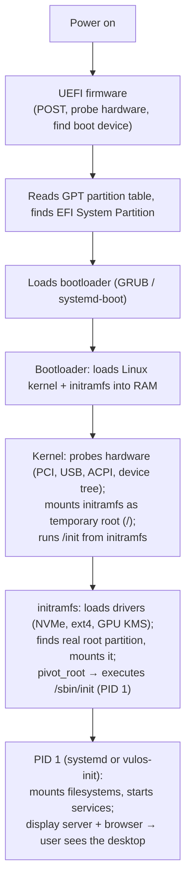
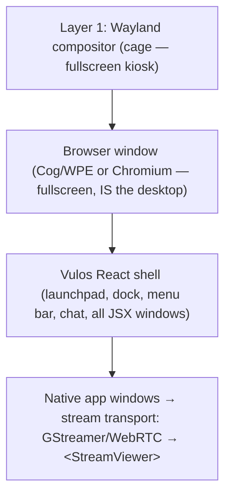
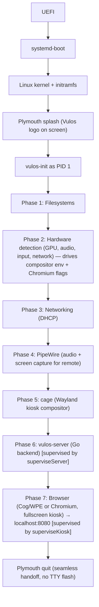
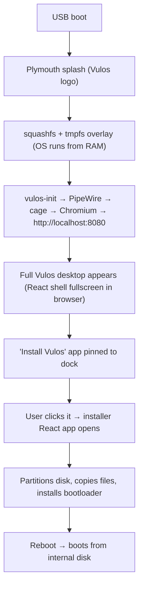

# Bare Metal Init

How Vulos boots on real hardware — from power-on to the desktop.

Works two ways simultaneously:
1. **Remote** — access from any browser on the network (current system, unchanged)
2. **Local** — user sits at the physical machine, interacts directly

The React shell is the window manager on **every** form factor (local seat, remote browser, phone, TV) — never two window systems. What varies is only the **transport** by which a native Linux app's pixels reach a JSX `<AppWindow>`: `stream` (headless + GStreamer/WebRTC into `<StreamViewer>`) or, on bare metal in future, `surface` (a real wlroots `xdg-toplevel` whose GPU buffer is scanned zero-copy into the window's screen rect). **v1 ships always-stream over `cage`**, including on bare metal — see "Window Model" below. (Decision: `decisions.md` D93.)

> **Goal.** Boot the same image on USB / VM / cloud and reach a Vulos desktop in seconds. **v1:** `cage` runs the Cog/WPE browser fullscreen; the React shell is the sole window manager; native apps stream in (same pipeline as remote). **v2:** `labwc` adds a `surface` transport so heavy local apps render direct (zero-copy) while still framed by the React shell.
> **Non-goals.** Replacing GNOME/KDE for general-purpose Linux. Building our own kernel. We use stock Debian + a few well-chosen pieces (cage, Plymouth, sd-boot; labwc reserved for v2).
> **Status.** Mostly complete. Cage + browser-as-kiosk, Plymouth ↔ cage handoff, init networking (DHCP / WiFi fallback / mDNS), and ARM device variants are all shipped. **Caveat:** `build.sh --disk` is the working UEFI path (systemd-boot + kernel + initrd via mtools; smoke-tested by `scripts/baremetal-smoke.sh`). `build.sh --live` currently formats an ESP but installs no bootloader, kernel, initrd, or loader entry — the live-USB image is non-bootable. Live-USB ESP fix is outstanding (BMINIT-14 reopened; see SMOKE-02).

---

## Window Model (authoritative — supersedes the "two-layer / browser as background / native app launching" sections below, which describe the **v2** target only)

A Wayland compositor stacks **surfaces**, not "windows". If the whole shell (chrome + every JSX window) is one fullscreen browser surface, it has exactly one z-position — so a native toplevel is *unconditionally* in front of every JSX window and the dock. You cannot interleave "pixels inside the wallpaper" with real windows; correct blending requires every interleavable window to be its own surface. Therefore:

**The React shell is always the window manager.** Native-app pixels are a per-app **transport**, not a separate window system:

| Transport | How | Used for |
|---|---|---|
| `stream` | app headless → GStreamer (NVENC/VAAPI/VP8) → WebRTC → JSX `<StreamViewer>` | all remote/browser/phone/TV; **bare-metal v1**; no-GPU/software fallback |
| `surface` | app is a real wlroots `xdg-toplevel` (XWayland for X11); GPU buffer scanned zero-copy into the JSX window's screen rect | **bare-metal v2**, latency-critical local apps (games/Blender/video) |

### v1 — ship now: always-stream over `cage`
`cage` runs Cog/WPE fullscreen; the React shell is the only window manager (z-order/focus/dock/decorations all JSX, already built). Native apps stream in via the **existing, tested** Docker/remote pipeline. No labwc / wlr-layer-shell / `wlr-foreign-toplevel` / per-window webview needed. The shell is local-native (browser renders directly on the GPU via the compositor); only the *interior of heavy native-app windows* pays the encode tax. `detectNativeMode()` + native-launch (BMINIT-02/04/06) are an **opt-in v2 path, not the bare-metal default**. → **BMINIT-16**.

### v2 — follow-up: `surface` transport on `labwc` (not a v1 blocker)
labwc becomes the *sole* WM. Chrome moves to `wlr-layer-shell` (wallpaper on `background`; dock/menubar on `overlay` so chrome is always correctly foreground). Each JSX window becomes its own Cog/WPE `xdg-toplevel` webview, so JSX and native windows are **peers in one z-stack**. `wlr-foreign-toplevel-management-v1` unifies the dock/focus/z-order across both kinds; labwc SSD is the single decorator (the in-JSX traffic-light component is suppressed on bare metal). The React WM goes "thin": it stops positioning/stacking and instead mirrors labwc state. → **BMINIT-17** (surface transport / DMABUF passthrough), **BMINIT-18** (labwc unification: layer-shell chrome + per-window webview + foreign-toplevel).

---

## How Modern OS Boot Works



There is no assembly "start screen". The kernel provides a framebuffer via KMS/DRM from very early in boot. Plymouth draws a splash on that framebuffer. By the time PID 1 runs, you have pixels on screen. Starting Wayland is just launching a userspace program.

For a **live USB**: the kernel loads a **squashfs** (compressed read-only filesystem) into RAM, overlays tmpfs for writes. The whole OS runs from memory. An installer app (running inside the OS) partitions the internal disk, copies files, installs a bootloader. No separate installer environment needed — the live OS IS the installer.

---

## Where Vulos Is Today

### Current bare metal boot
```
UEFI → GRUB → kernel → initramfs → systemd → vulos.service (headless, port 8080)
```
- `build.sh` creates Debian trixie rootfs, `release.yml` packages as `.img.gz`
- No display server — headless only, access via browser on another device

### Current kiosk mode (vulos-init as PID 1)
```
vulos-init → mount filesystems → vulos-server → cage + Cog → http://localhost:8080
```
- Single-window kiosk: cage runs one Cog/WPE instance fullscreen — React shell is the sole WM
- Native apps stream into the shell (same pipeline as remote/Docker) — **this is the v1 target**
- `detectNativeMode()` / `POST /api/shell/native-window` exist but are opt-in v2 paths, not the bare-metal default

---

## Target Architecture

### v1: one compositor, always-stream



- **cage** — single-app Wayland kiosk (76KB); no configuration needed; runs the browser fullscreen
- The browser IS the desktop — React shell owns every pixel, every window, every z-position
- Native Linux apps (GIMP, LibreOffice, Blender, games…) stream via the same WebRTC pipeline as remote
- No labwc / wlr-layer-shell / `wlr-foreign-toplevel` / per-app webview needed
- Remote users and local users use the same streaming transport — one code path, always tested

See `STREAMING-OPTIMIZATIONS.md` for the full cage + PipeWire + GStreamer pipeline.

```
Bare metal local:     cage (fullscreen kiosk) + React shell + stream transport for native apps
Streaming remote:     cage per session (headless, one app, PipeWire capture) — identical pipeline
No GPU fallback:      Xvfb + ximagesrc (current system, unchanged)
```

### v2: surface transport on labwc (BMINIT-17/18 — not a v1 blocker)

> **This section describes future work only.** Nothing below is in v1.

Two compositors, each optimal for its job. Both wlroots-based, <1MB combined install (cage 76KB + labwc 713KB).

**Bare metal v2 (labwc)** — zero-copy `surface` transport; JSX and native windows peer in one z-stack:

| | cage | sway | labwc |
|---|---|---|---|
| Multi-window | No (single app kiosk) | Yes | Yes |
| Server-side decorations | No | No (CSD only) | Yes — themed title bars |
| Config complexity | None | High (i3-style tiling) | Low (openbox XML) |
| Resource usage | Minimal | Medium | Low |
| Window stacking | N/A | Tiling-focused | Floating (desktop-style) |
| Custom themes | N/A | No SSD | Yes — openbox themes |

labwc gives us floating windows with custom-themed title bars — exactly what we need to match the traffic light UI without modifying each app, and without requiring each window to be its own webview until v2.

**Streaming (cage)** — one app per session, headless, captured via PipeWire (v1 and v2):

| | cage | labwc |
|---|---|---|
| Purpose | Single-app kiosk (exactly what streaming needs) | Multi-window desktop |
| Headless | Rock solid (primary use case) | Had crash bugs in headless (#605) |
| Config needed | None — app maximized automatically | Needs `rc.xml` with fullscreen window rule |
| Memory per session | ~5MB | ~12-15MB |
| SSD overhead | None | Draws title bar pixels for nobody to see |
| 10 concurrent sessions | ~50MB | ~150MB |
| PipeWire/DMA-BUF path | wlroots (identical) | wlroots (identical) |

---

## Boot Sequence (v1 — current target)



---

## Phase 1: Filesystems

Already implemented in `cmd/init/main.go`. Additions:

- [ ] Mount `/sys/firmware/efi/efivars` (UEFI boot management)
- [ ] Mount `/dev/shm` with size=2g (Chromium, Wine, DXVK)
- [ ] Mount user data partition if separate
- [ ] Overlay filesystem for live USB mode (squashfs + tmpfs)

---

## Phase 2: Hardware Detection

- [ ] GPU: reuse `gpu.Detect()` — probe `/dev/dri`, `nvidia-smi`, `vainfo`
- [ ] Audio: `/proc/asound/`, pick PipeWire or PulseAudio
- [ ] Input: enumerate `/dev/input/event*` — keyboard, mouse, touchscreen, gamepad
- [ ] Network: `/sys/class/net/` — wired vs wireless
- [ ] Storage: `/sys/block/` — for installer disk selection
- [ ] Battery: `/sys/class/power_supply/` — laptop detection
- [ ] Write results to `/var/log/vulos-boot.log`

---

## Phase 3: Networking

- [ ] DHCP on wired interfaces by default (systemd-networkd)
- [ ] WiFi: `wpa_supplicant` with saved credentials if no wired
- [ ] Fallback: `localhost:8080` — kiosk works locally without network
- [ ] mDNS/Avahi: advertise `vula.local` on LAN
- [ ] DNS resolution: ensure `/etc/resolv.conf` populated

---

## Phase 4: Compositor — cage (v1)

`cage` runs the browser as a single fullscreen Wayland surface — no configuration needed.

```bash
cage -- chromium --kiosk --ozone-platform=wayland http://localhost:8080
# or, if Cog/WPE is available:
cage -- cog --platform=wl http://localhost:8080
```

- GPU detected: `WLR_RENDERER=vulkan` or `WLR_RENDERER=gles2` (set from host-profile probes)
- No GPU: `WLR_RENDERER=pixman` (software, still works)
- No display connected → skip cage, run headless (detect via `/sys/class/drm/card*/status`)
- `vulos.kiosk=force` kernel cmdline overrides display detection (QEMU / CI use)

### Browser choice

**Chromium (current default)**
- `chromium --kiosk --ozone-platform=wayland http://localhost:8080`
- Already in the image, smoke-tested; GPU flags driven by host-profile detection

**WPE WebKit via Cog (preferred when available)**
- Lightweight, no browser chrome; ~150MB RAM vs ~400MB+ for Chromium
- `cog --platform=wl http://localhost:8080`

---

## Phase 4 (v2 only): Compositor — labwc (BMINIT-18)

> **v2 future work.** Nothing in this section ships in v1. See BMINIT-18.

labwc uses openbox-style XML config in `~/.config/labwc/`:

```xml
<!-- rc.xml — window behaviour -->
<labwc_config>
  <theme>
    <name>vulos</name>
    <!-- Server-side decorations with our traffic light buttons -->
    <titlebar>
      <height>28</height>
      <font>Noto Sans 11</font>
    </titlebar>
  </theme>

  <!-- Pin the browser window to the background -->
  <windowRules>
    <windowRule identifier="cog" type="full_maximise" skipTaskbar="yes">
      <action name="MoveToLayer" layer="background" />
    </windowRule>
  </windowRules>

  <!-- All other windows float on top -->
  <focus>
    <followMouse>no</followMouse>
    <raiseOnFocus>yes</raiseOnFocus>
  </focus>
</labwc_config>
```

### Traffic Light Theme (v2)

labwc supports openbox themes. Create `/usr/share/themes/vulos/openbox-3/themerc`:

```ini
# Title bar
window.active.title.bg: flat solid
window.active.title.bg.color: #1a1a1a
window.inactive.title.bg: flat solid
window.inactive.title.bg.color: #2a2a2a

# Traffic light buttons (rendered as coloured circles)
window.active.button.close.unpressed.image.color: #ff5f57
window.active.button.max.unpressed.image.color: #28c840
window.active.button.iconify.unpressed.image.color: #febc2e

window.active.button.close.hover.image.color: #ff3b30
window.active.button.max.hover.image.color: #00b341
window.active.button.iconify.hover.image.color: #f5a623

# Button layout: close, minimize, maximize on the LEFT (macOS-style)
window.active.button.layout: CMI

# Rounded corners
border.width: 1
border.color: #333333
window.handle.width: 0
padding.width: 8
```

This gives every native window the same red/yellow/green traffic lights as the in-browser window system, without modifying any app.

---

## Phase 5: cage + Chromium Kiosk (v1)

The browser is the desktop. cage runs a single fullscreen Chromium/Cog window showing `http://localhost:8080`. The React shell inside it renders everything — dock, launchpad, menu bar, chat, and all native-app windows (as `<StreamViewer>` panes). There is no separate compositor layer; the browser IS the only surface.

### How it works (v1)

1. `cage` starts (single-app fullscreen Wayland compositor)
2. Chromium or Cog/WPE launches inside cage → `http://localhost:8080`
3. User sees the Vulos desktop — dock, menu bar, launchpad — all React
4. User opens a native app → stream transport: app runs headless under cage, GStreamer/WebRTC into `<StreamViewer>` inside the shell
5. `superviseKiosk` keeps cage + browser alive with exponential backoff (1 s → 30 s, reset on healthy run ≥ 30 s)

### Host-profile detection drives kiosk behaviour

`detectHost()` probes GPU, input devices, and RAM at boot via `services/hwdetect/` and `services/gpu/`, producing a `hostProfile`. The profile drives:
- `WLR_RENDERER` env for cage (vulkan / gles2 / pixman)
- Chromium GPU flags (`--enable-gpu`, `--use-gl=egl`, etc.)
- Whether the remote-browser stream pool pre-warms (`PrewarmBrowser = HasHWGPU && !LowMem`)

One image, one boot path — behaviour is derived from runtime probes, not separate build variants.

### Supervision (vulos-init)

`vulos-init` supervises two critical processes so the desktop never goes blank:

- `superviseServer` — keeps `vulos-server` alive. Uses `cmd.Wait()` (no polling overhead). On exit, restarts with **exponential backoff 1 s → 30 s** (doubles each failed restart, resets to 1 s after any run that stays up ≥ 30 s).
- `superviseKiosk` — keeps the `cage` + browser kiosk alive with the same backoff pattern and healthy-run reset.

Both goroutines run forever; they are not restartable from outside. A healthy 30-second run is considered a clean start and resets the backoff counter to 1 s.

---

## Phase 5 (v2 only): labwc — browser as shell background (BMINIT-18)

> **v2 future work.** The "browser pinned as background, native windows on top" model requires every interleavable JSX window to be its own `xdg-toplevel` surface — see the Window Model section. Nothing below ships in v1.

1. labwc starts
2. Cog (WPE WebKit) launches fullscreen → `http://localhost:8080`
3. labwc window rule pins Cog to background layer (always behind)
4. User sees the Vulos desktop — dock at bottom, menu bar at top
5. User opens a desktop app → `surface` transport: app launches as a real `xdg-toplevel` Wayland window on top; labwc decorates it with the Vulos traffic-light theme

---

## Phase 6: Native App Launching

### v1 flow — always-stream (bare metal and remote identical)
```
User clicks app → POST /api/stream/launch → cage (headless) + GStreamer + WebRTC → <StreamViewer> in React shell
```

This is the same pipeline used for remote/Docker access. On bare metal v1, the local user sees the same streamed window in the React shell as a remote user would. Trade-off: encode/decode overhead for heavy apps; payoff: one tested code path, no compositor complexity.

- **Built-in apps** (terminal, files, settings, etc.) — React components, no streaming needed
- **Desktop apps** (GIMP, LibreOffice, Blender, etc.) — stream transport (cage per-session, PipeWire → GStreamer → WebRTC)
- **Games / Wine** — stream transport (same path, with GPU encoder for NVENC/VAAPI when available)

---

## Phase 6 (v2 only): Native App Launching — surface transport (BMINIT-17)

> **v2 future work.** Requires labwc + `wlr-foreign-toplevel` + per-window webview (BMINIT-17/18). `detectNativeMode()` / `POST /api/shell/native-launch` (BMINIT-02/04/06) are opt-in v2 paths only.

### v2 bare metal flow (future)
```
User clicks app → detect native mode → launch app as xdg-toplevel on labwc → surface transport → JSX window rect
```

### v2 implementation (future)

When `isOnDevice()` is true and surface transport is active, Launchpad changes launch behaviour:

- [ ] **Desktop apps** (GIMP, LibreOffice, Blender, etc.) — launch natively on labwc compositor
  - `POST /api/shell/native-launch` → `exec.Command(binary, args...)` with `WAYLAND_DISPLAY` set
  - App appears as a real `xdg-toplevel` Wayland window; labwc decorates it with traffic-light theme
  - No Xvfb, no GStreamer, no WebRTC — direct GPU rendering to screen (zero-copy DMABUF)
- [ ] **Wine/Lutris games** — launch natively with `WAYLAND_DISPLAY` (or XWayland for X11 games)
- [ ] **Browser tabs** — Cog spawns new windows (`POST /api/shell/native-window`)

### v2: dock on bare metal (future)

- [ ] Dock shows both in-browser windows AND native windows
- [ ] Native windows tracked via `wlr-foreign-toplevel-management-v1` protocol (labwc supports this)
- [ ] Backend: `GET /api/shell/windows` returns list of all Wayland windows (title, app_id, state)
- [ ] Clicking a native window in the dock focuses it (via `wlr-foreign-toplevel` activate)
- [ ] Minimise/close from dock works on native windows too

---

## Installer

### The easiest path: browser-based installer

Yes — install the browser first. The installer is just another Vulos app.



This is exactly what Ubuntu, Fedora, and ChromeOS do — boot into a live desktop, run the installer as an app. No separate installer environment. No assembly. No C program drawing pixels. The entire installer UI is React running in the browser.

### Boot splash (before browser is ready)

Plymouth handles this. From power-on to browser-ready takes ~5-15 seconds:

```
0s    UEFI POST
2s    Bootloader → kernel loading
3s    Plymouth splash appears (Vulos logo + progress bar)
5s    vulos-init starts, hardware probes run
8s    cage + Chromium launch
10s   Browser loads React app from localhost:8080
12s   Plymouth fades out, desktop appears
```

Plymouth draws directly to the kernel framebuffer (KMS/DRM). No display server needed. When cage starts, it takes over the DRM master and Plymouth hands off seamlessly — `plymouth quit --retain-splash`.

### Plymouth theme

```
/usr/share/plymouth/themes/vulos/
  ├── vulos.plymouth          (theme manifest)
  ├── vulos.script            (animation script)
  ├── logo.png                (Vula logo, centred)
  ├── progress.png            (progress bar sprite)
  └── background.png          (dark background)
```

```ini
# vulos.plymouth
[Plymouth Theme]
Name=Vulos
Description=Vulos boot splash
ModuleName=script

[script]
ImageDir=/usr/share/plymouth/themes/vulos
ScriptFile=/usr/share/plymouth/themes/vulos/vulos.script
```

### What the user sees

```
┌─────────────────────────────────────────────┐
│                                             │
│                                             │
│                                             │
│              ┌───────────┐                  │
│              │           │                  │
│              │  VULA OS  │                  │
│              │   logo    │                  │
│              │           │                  │
│              └───────────┘                  │
│                                             │
│          ████████████░░░░░░░  67%           │
│                                             │
│                                             │
│                                             │
│                                             │
│      Ctrl+V for verbose output              │
│                                             │
└─────────────────────────────────────────────┘
```

Dark background, centred Vula logo, **determinate progress bar** (not a spinner — user sees actual percentage), subtle hint text at bottom. Clean, confident, branded.

### Determinate progress bar

Plymouth supports `plymouth --update=<message>` and `plymouth system-update --progress=<percent>` from systemd service files. Each boot phase reports its progress:

```
 0%   Kernel loaded, initramfs running
10%   Filesystems mounted
20%   vulos-init started, hardware probes complete
30%   Networking up (DHCP acquired)
45%   PipeWire started
55%   cage started (compositor ready)
65%   vulos-server started (HTTP 200 on /health)
80%   Browser launched, loading React app
95%   Desktop shell rendered
100%  Plymouth fades out → desktop visible
```

Implementation: each systemd unit and init script calls `plymouth update --status="phase" --progress=N` at key milestones. This is how Ubuntu/Fedora do their progress bars — they're not fake timers, they're tied to actual service completion.

```bash
# Example: in vulos.service ExecStartPre
ExecStartPre=/usr/bin/plymouth update --status="Starting Vulos" --progress=65

# Example: after cage starts (ExecStartPost in cage launch unit)
ExecStartPost=/usr/bin/plymouth update --status="Display ready" --progress=55
```

### Verbose mode (Ctrl+V)

Press `Ctrl+V` during boot → splash dissolves, reveals live systemd journal output scrolling underneath:

```
┌─────────────────────────────────────────────┐
│ [  OK  ] Started systemd-networkd           │
│ [  OK  ] Started PipeWire Media Session     │
│ [  OK  ] Started WirePlumber                │
│ [  OK  ] Started cage Wayland compositor    │
│ [  OK  ] Started Vulos Server               │
│          Starting Chromium kiosk...         │
│ [  OK  ] Started Chromium kiosk             │
│                                             │
└─────────────────────────────────────────────┘
```

This is standard systemd + Plymouth behaviour. Plymouth renders the splash on top of the TTY. `Ctrl+V` (mapped via Plymouth key binding) switches to the TTY showing `systemd-journal` output. Press `Ctrl+V` again to go back to the splash.

The verbose output is **always running** behind the splash — Plymouth just hides it. No custom code needed, just configure Plymouth's key binding:

```ini
# In vulos.script
Plymouth.SetKey("v", Plymouth.ToggleVerbose);
```

### Boot experience comparison

| OS | What user sees | Verbose escape | Progress type |
|---|---|---|---|
| macOS | Apple logo + progress bar | Cmd+V | Determinate (fake timer) |
| Windows | Logo + spinning dots | None | Indeterminate |
| ChromeOS | Chrome logo | None | Indeterminate |
| Ubuntu | Logo + dot animation | Esc | Indeterminate |
| **Vulos** | **Logo + progress bar + %** | **Ctrl+V** | **Determinate (real milestones)** |

We're the only one with a genuinely determinate progress bar tied to real boot phases. macOS fakes it with a timer. Ubuntu doesn't even try. We show actual progress because we control the entire boot chain.

### Installer app

Built as a React component in the Vulos shell, backed by Go API endpoints.

**Backend endpoints:**
- [ ] `GET /api/installer/disks` — list internal drives (lsblk, size, model, existing partitions)
- [ ] `GET /api/installer/status` — check if running from live USB or installed
- [ ] `POST /api/installer/install` — trigger installation
- [ ] `GET /api/installer/progress` — WebSocket, streams install progress

**Installation steps:**
1. Select target disk
2. Partition: ESP (512MB FAT32) + root (ext4, rest of disk)
3. Format partitions
4. Copy rootfs (`rsync` from squashfs mount to target)
5. Install bootloader (`bootctl install` for systemd-boot)
6. Write `/etc/fstab`, hostname, timezone
7. Set up user account
8. Reboot prompt

**Installer UI:**
- [ ] Welcome screen with Vula logo
- [ ] Disk selection with visual disk map
- [ ] Progress bar during copy (rsync output parsed for percentage)
- [ ] Success screen with reboot button
- [ ] Error handling with recovery options

---

## squashfs + Live USB

> **The squashfs is also the OTA artifact.** The `build.sh --live` squashfs+overlay output is reused verbatim as the **signed, immutable OS image** that ships in the public OS bucket — see OS-DISTRIBUTION.md (artifact + A/B slots + auto-rollback), SIGNING.md (dm-verity + per-stage signature verification), and NETBOOT.md (the same `--live` image is the "Try Vulos" live-RAM session that boots over UEFI HTTP Boot / iPXE and then *installs to disk*). The local seed that bootstraps all of this (bootloader + verify-capable initramfs + baked trust anchor) is SEED-TRUST.md. BMINIT-14 (make `--live` bootable) is the prerequisite for that whole chain.

### Image layout (GPT)

```
USB drive
  ├── p1  ESP        512MB   FAT32   (systemd-boot + kernel + initramfs)
  └── p2  rootfs     rest    ext4    (filesystem.squashfs + persistence)
```

### Boot flow

1. systemd-boot loads kernel with: `root=LABEL=vulos-live init=/sbin/vulos-init quiet splash`
2. initramfs detects squashfs on the partition
3. Mounts squashfs as read-only lower + tmpfs as upper → overlay root
4. pivot_root to overlay → full Vulos running from RAM
5. USB can be removed after boot (if enough RAM, ~4GB minimum)

### Build changes

- [ ] `build.sh`: add `mksquashfs` step after debootstrap
- [ ] `release.yml`: create separate live USB `.img.gz` with squashfs layout
- [ ] initramfs hook: `/etc/initramfs-tools/scripts/local-bottom/vulos-live`

---

## Installed System Layout

### Partition table (GPT)

```
/dev/nvme0n1 (or /dev/sda)
  ├── p1  ESP     512MB   FAT32   /boot/efi   (bootloader, kernel, initramfs)
  ├── p2  root    rest    ext4    /            (Vulos)
  └── (optional) p3  home         ext4    /home
```

### Kernel

- Debian stock kernel (`linux-image-amd64` / `linux-image-arm64`)
- Kernel command line: `root=UUID=... init=/sbin/vulos-init quiet splash plymouth.theme=vulos`
- All common hardware modules included (no custom build needed)

### initramfs

- Built by `update-initramfs`
- Includes: storage drivers, filesystem drivers, GPU KMS drivers, Plymouth
- Live USB variant includes squashfs + overlay logic

---

## ARM Support (Raspberry Pi, Pine64, PinePhone)

ARM boards use U-Boot or board firmware instead of UEFI/GRUB.

### Raspberry Pi
- [ ] Boot firmware reads `config.txt` + `kernel8.img` from FAT32 partition
- [ ] Device tree blob (`.dtb`) describes hardware
- [ ] GPU: VideoCore VI, mesa V3D driver
- [ ] cage + Chromium kiosk works on Pi 4/5 with mesa (v1); labwc + surface transport is v2

### PinePhone
- [ ] U-Boot in SPI flash or SD card
- [ ] Touch input via libinput (cage passes touch events to the browser)
- [ ] Mobile display: rotation + scaling handled by Chromium kiosk flags
- [ ] postmarketOS kernel + device tree

### Build
- [ ] `build.sh` already supports `ARCH=arm64`
- [ ] `release.yml` already builds arm64 images
- [ ] Device-specific image variants: `vulos-arm64-rpi.img.gz`, `vulos-arm64-pinephone.img.gz`

---

## Docker vs Bare Metal

| | Docker | Bare Metal (remote) | Bare Metal (local, v1) | Bare Metal (local, v2) |
|---|---|---|---|---|
| PID 1 | tini | vulos-init | vulos-init | vulos-init |
| Display | Xvfb (virtual) | Xvfb (virtual) | cage (fullscreen kiosk) | labwc (real display, multi-window) |
| Apps | Streamed (WebRTC) | Streamed (WebRTC) | Streamed (WebRTC, same pipeline) | `surface` transport (zero-copy DMABUF) |
| Window chrome | CSS (in-browser) | CSS (in-browser) | CSS (in-browser, React shell) | labwc SSD theme (traffic lights) |
| GPU | `--gpus all` | Direct | Direct | Direct |
| Input | `--device /dev/uinput` | uinput | libinput (real devices) | libinput (real devices) |
| Audio | PulseAudio (virtual) | PulseAudio (virtual) | PipeWire (real hardware) | PipeWire (real hardware) |
| Boot | Instant | 5-15s | 5-15s | 5-15s |

---

## TTY Fallback

If cage or the browser fails (and superviseKiosk cannot recover), drop to a text console:

```
┌─────────────────────────────────────┐
│          Vulos v0.1.0             │
│                                     │
│  Open in browser:                   │
│    http://192.168.1.42:8080         │
│    http://vula.local:8080           │
│                                     │
│  Press Enter for recovery shell     │
└─────────────────────────────────────┘
```

Rendered via `getty` + bash script. No display server needed.

---

## Recovery & Debug

- [ ] `init=/bin/bash` kernel param → emergency root shell
- [ ] `console=ttyS0,115200` → serial console for headless debug
- [ ] Recovery mode in bootloader menu → root shell, no GUI
- [ ] `journalctl -u vulos` for service logs
- [ ] `/var/log/vulos-boot.log` for hardware detection

---

## Implementation Order

### v1 (current)
1. cage + Chromium kiosk (always-stream, React shell as sole WM) — **BMINIT-16**
2. Plymouth boot splash with Vulos branding
3. Seamless Plymouth → cage handoff (no TTY flash)
4. squashfs + live USB overlay — **BMINIT-14** (ESP fix outstanding)
5. Installer app (React UI + Go backend)
6. Networking in init (DHCP, WiFi, mDNS)
7. ARM device images (Raspberry Pi, PinePhone)

### v2 (future — surface transport)
8. surface transport / DMABUF passthrough — **BMINIT-17**
9. labwc unification: layer-shell chrome + per-window webview + foreign-toplevel — **BMINIT-18**
10. labwc config + Vulos traffic-light openbox theme
11. Dock integration with `wlr-foreign-toplevel` (show native windows in dock)
