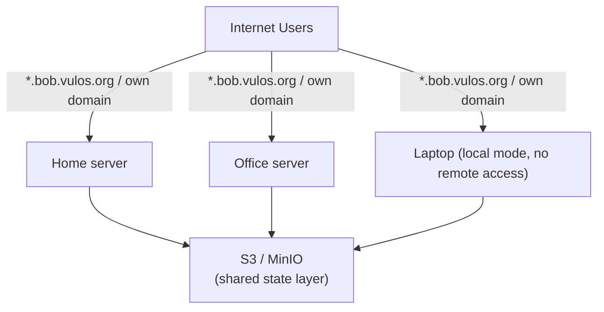
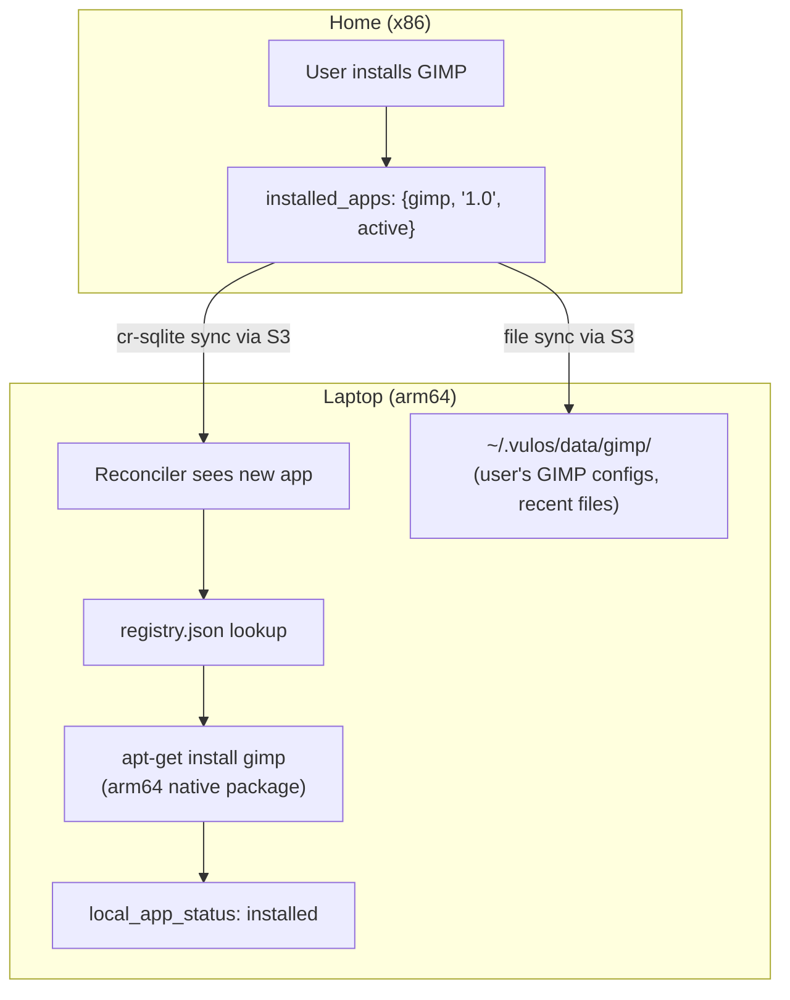
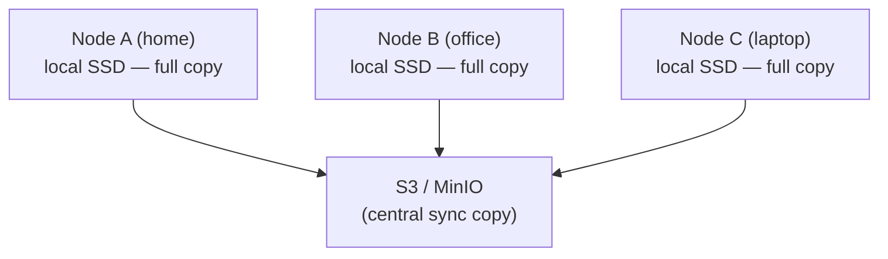
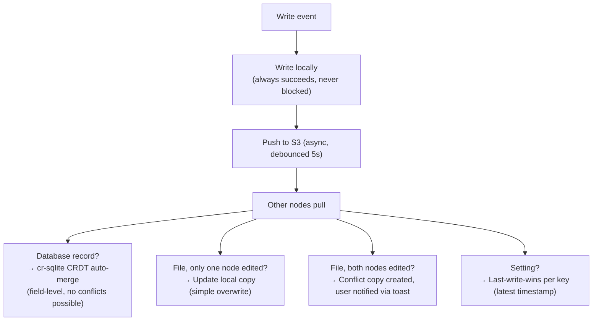

# Multi-Node Cluster & Storage

How multiple Vula instances share state. Each node is a full, independent Vula instance. There is **no primary node** — every node is equal. Nodes sync state through S3-compatible storage (MinIO).

For network/domain setup see NETWORK.md. For first-boot wizard see INIT.md. For bare metal boot see BAREMETAL-INIT.md.

> **See also (new design extensions).** This doc covers the foundational S3 sync model. Three follow-on docs build on it: **SYNC.md** (two-tier sync — instance↔instance hot path over the peering mesh + the existing durable bucket cold path — and bucket-side snapshot/compaction so a new instance bootstraps from a snapshot + short tail instead of an unbounded changeset log); **COORDINATION.md** (bucket-backed leases with monotonic fencing tokens — generalizing the advisory presence lease below into the cluster's one exclusion/ownership primitive, no leader election); **CONCURRENCY.md** (per-data-type conflict policy + the manifest-declared `concurrency` posture). The **data bucket** here is distinct from the public read-only **OS bucket** (OS-DISTRIBUTION.md).

> **Goal.** Make N Vula instances behave like one: shared auth, profiles, settings, installed-apps, and file state. Backing store: any S3-compatible bucket the user controls (default: a MinIO instance one of the nodes runs).
> **Non-goals.** Real-time clustering. A primary node. A control plane we operate. Hot-replicating the running OS. **cr-sqlite** as the merge engine — see the reality check immediately below; it conflicts with the pure-Go/no-CGO rule (D23/D94-J).
> **Status — REALITY CHECK (2026-07-19).** The rest of this document (original text, kept below for design context) describes a **cr-sqlite CRDT** model as the multi-node merge engine. **cr-sqlite is not integrated, and cannot be under the current pure-Go/no-CGO rule** (`docs/decisions.md` D23; reaffirmed D94 item J — *"Stay Go for everything... no Rust. Consistent with the CGO-free/modernc SQLite rule"*). A former `backend/services/store/store.go` attempted to `load_extension()` a native `crsqlite.{so,dylib,dll}` at runtime, but `modernc.org/sqlite` is a pure-Go SQLite reimplementation that refuses the call outright (`load_extension` → "not authorized"), so `DB.CRSQLiteLoaded` was false on every build and `crsql_as_crr` never ran. That package and the `crsql_changes` streaming in `backend/services/sync/hotpath.go` were **deleted on 2026-07-20** as unreachable dead code (both had zero callers). `backend/services/cluster/reconcile.go` says so directly: the `installed_apps` CRR table "in production... lives in a cr-sqlite database; here it is persisted as JSON."
>
> **What is actually shipped and working today:**
> - A real, pure-Go **leaderless CRDT** for the app registry only (LWW + OR-set + writer tie-break + signed uninstall quorum) in `backend/internal/multiinstance/appsync.go` — no CGO, no cr-sqlite.
> - A **same-LAN transport** for that CRDT over mDNS discovery + authenticated HTTPS in `backend/internal/fabric/` (`fabric.go`'s own doc comment: *"Pure-Go: no CGO, no cr-sqlite."*). LAN-only; there is no WAN path for it yet.
> - The **S3/MinIO cold path** described below: node presence/heartbeat (`cluster/cluster.go`, `cluster/s3.go`, SSE-C + Argon2id encryption) and whole-database-file snapshot/restore via `VACUUM INTO` (`services/sync/dbio.go`, `snapshot.go`, `bootstrap.go`) — this genuinely works, but it snapshots **one node's local SQLite file**, not a cross-node CRDT-merged state. There is no general-purpose cross-node merge for auth/settings/sessions today.
>
> **Forward plan (not shipped):** adopt the shared DMTAP-substrate **Sync** spec — a CRDT op algebra + version-vector/reconciliation wire protocol + first-class snapshots (`VULOS-PRODUCT-STANDARD.md` substrate capability 3) — with the relay as the WAN rendezvous point, replacing the cr-sqlite framing below. This is a design direction, not code; the goal is one shared sync engine used by bindings rather than every product hand-rolling its own.
>
> Read the remainder of this document (original text) as historical design intent: wherever it says "cr-sqlite" or presents changeset sync as shipped, read it as "the planned CRDT merge engine (not yet integrated)" unless a passage explicitly says JSON/file-based today.

---

## Architecture



### Two Node Modes

| | Server Mode | Local Mode |
|---|---|---|
| **Use case** | Headless, serves remote users | Physical screen, someone sits in front |
| **Remote access** | Yes — via vulos.org subdomain or own domain | No — direct local use only |
| **S3 Sync** | Yes | Yes |
| **MinIO Storage Node** | Optional | Optional |
| **Display** | Xvfb (virtual) | Physical display |

Both modes run the exact same Vulos. The only difference is whether a tunnel runs and whether the display is physical or virtual.

```
VULOS_MODE=server     # or "local"
VULOS_S3_SYNC=true    # both modes sync to S3
```

Every node:
- Stores everything locally on disk (fast reads, always available)
- Pushes changes to S3 asynchronously on write
- Pulls latest state from S3 on boot
- Works fully offline — sync catches up when connectivity returns

---

## MinIO as a Built-In App

MinIO runs as a standard Vula app from the registry. Enable it on any node to make that node a storage server. Nodes without MinIO just sync to a peer that has it.

### Registry Entry

```json
{
  "minio": {
    "name": "Storage Node",
    "type": "service",
    "description": "Distributed S3-compatible storage. Enable to make this node a storage server.",
    "category": "system",
    "icon": "storage",
    "versions": {
      "1.0": {
        "install": "curl -sSL https://dl.min.io/server/minio/release/linux-${ARCH}/minio -o /usr/local/bin/minio && chmod +x /usr/local/bin/minio",
        "command": "minio server /root/.vulos/minio-data --console-port ${PORT} --address :9000",
        "port": 9001,
        "env": {
          "MINIO_ROOT_USER": "${VULOS_STORAGE_ACCESS_KEY}",
          "MINIO_ROOT_PASSWORD": "${VULOS_STORAGE_SECRET_KEY}"
        },
        "singleton": true,
        "auto_start": true,
        "permissions": ["network", "filesystem"]
      }
    }
  }
}
```

### Storage Topologies

**Single MinIO node** (simplest — start here):
```
Home server: Vula + MinIO (storage node)
Office:      Vula (syncs to home MinIO)
Laptop:      Vula (syncs to home MinIO)
```

**Two MinIO nodes** (redundant — recommended):
```
Home server: Vula + MinIO ◄──► Office: Vula + MinIO
                                 (MinIO replication between both)
Laptop:      Vula (syncs to nearest MinIO)
```
MinIO site replication keeps both storage nodes in sync. If home goes down, office MinIO has everything.

**External S3** (no self-hosted storage):
```
All nodes sync directly to AWS S3 / Backblaze B2 / any S3-compatible provider
No MinIO needed — just set S3_ENDPOINT to the provider
```

### Settings UI

Storage nodes see:
```
Storage Node
├── Enabled: [toggle]
├── Allocated: 50 GB / 500 GB [slider]
├── Peers:
│   ├── home-server  (online, 120 GB used)
│   └── office-nuc   (online, 80 GB used)
├── Redundancy: 2 copies
└── Status: Healthy
```

Non-storage nodes see:
```
Storage
├── Sync: enabled
├── Connected to: home-server (MinIO)
├── Last sync: 12s ago
└── Local cache: 8 GB
```

---

## State Sync Layer

### The Problem

Multiple nodes read and write the same data. Nodes may be on different networks. The same user may be active on two nodes simultaneously. No node should be required to be online for others to work.

### Strategy Per Data Type — DESIGN INTENT, not current shipped behaviour

The table below is the **original design intent**: different data gets a different conflict resolution discipline, with cr-sqlite as the assumed engine for structured data. Per the reality check at the top of this document, **the "cr-sqlite → S3" rows are not implemented** — there is no working cross-node CRDT merge for the auth DB, settings, or chat history today. The one row that *is* real is the app install list, and it is real via the pure-Go `multiinstance`/`fabric` CRDT (LAN-only), not cr-sqlite.

| Data | Storage | Sync Method (design intent) | Conflict Strategy | Actually shipped? |
|------|---------|-------------|-------------------|-------------------|
| **Auth DB** (users, sessions, profiles) | SQLite | cr-sqlite → S3 | CRDT auto-merge | **No** — single-node only; DB file is snapshotted to S3 (SYNC-02/03) but not cross-node merged |
| **Settings / preferences** | SQLite | cr-sqlite → S3 | Last-write-wins per field | **No** — same as above |
| **App install list** | SQLite (JSON today) | cr-sqlite → S3 | Last-write-wins (union) | **Partially** — real pure-Go LWW+OR-set CRDT (`multiinstance.AppSync`), synced LAN-only over mDNS (`internal/fabric`), not via cr-sqlite/S3 |
| **User files** (documents, downloads) | Local disk | rclone bisync → S3 | Conflict copies | Design intent; see FILES.md for what Files actually ships |
| **Recall / embeddings** | Local | Rebuilt from synced files | Regenerated per node | Design intent |
| **App runtime state** | Memory | Not synced | Ephemeral, per-node | N/A (correct as stated) |
| **Chat history** | SQLite | cr-sqlite → S3 | CRDT merge (append-only) | **No** |
| **Browser profiles** | Local disk | rclone → S3 | Conflict copies | Design intent |

### Why These Choices (design rationale, engine not yet built)

**cr-sqlite (CRDT for SQLite)** was the original plan for structured data (auth, settings, app lists, chat): each node has a local SQLite database, and cr-sqlite tracks changes as conflict-free replicated data types so that when two nodes sync, changes merge automatically without conflicts — the same idea Apple Notes and Figma use for multi-device sync. **This plan is superseded** by the forward plan in the reality check above (the shared DMTAP-substrate Sync spec) because cr-sqlite cannot be adopted without CGO, which conflicts with D23/D94-J. The rationale below (why CRDT vs LWW vs conflict-copies per data kind) still holds — only the specific engine (cr-sqlite) is off the table.

**Conflict copies** — for user files. If the same file is edited on two nodes before sync, the system keeps both versions:
```
notes.txt                                  ← latest version (winner)
notes.conflict-home-20260401-143022.txt    ← other version (preserved)
```
No data is ever lost. The user resolves manually if needed.

**Last-write-wins** — for settings and preferences. If you change your theme on two devices, the latest change wins. This matches user expectation — "I just changed this, it should be what I set."

**Not synced** — app processes and runtime state. Apps run locally on whichever node the user is on. If a node dies, apps restart fresh on the new node with their data intact (synced through S3).

---

## Concurrent Sessions — Same User, Multiple Nodes

This is the core challenge: a user is logged in at home (bare metal) AND at office (bare metal or remote) at the same time.

### What Doesn't Conflict (90% of usage)

- Opening different apps on different nodes — independent processes, no shared state
- Reading files — reads never conflict
- Installing apps — install list merges via CRDT (union)
- Changing different settings — cr-sqlite merges different fields cleanly

### What Could Conflict

**Same file edited on two nodes:**

1. **Presence hints** (prevention layer):
   - When a user opens a file for editing, the node writes a lightweight lease to S3:
     ```json
     {"node": "home", "user": "alice", "file": "notes.txt", "expires": "2026-04-01T14:35:00Z"}
     ```
   - Other nodes check before opening — see the hint and show:
     *"This file is open on Home — open read-only or edit anyway?"*
   - Leases expire automatically (60s heartbeat). No stale locks if a node crashes.
   - **This is advisory, not blocking.** The user can always override.

2. **Conflict copies** (safety net):
   - If both nodes edit anyway, sync detects the divergence (version vectors)
   - Both versions are kept, user is notified
   - A notification appears: *"notes.txt was edited on both Home and Office — review conflict"*

**Same DB field written on two nodes:**
- cr-sqlite handles this automatically
- For settings: last-write-wins per column (latest timestamp)
- For sessions: both sessions stay valid (different tokens, both merge into the table)
- For users: field-level merge (name changed on one node, email on another — both apply)

### Multiple Remote Sessions (Same User, Different Server Nodes)

Same user, two browser tabs hitting two different server nodes via tunnel load balancing. Handled identically:

- Sessions are synced via cr-sqlite — valid on all nodes
- Sticky sessions keep a tab on one node normally
- If that node dies, tunnel routes to another — session is valid there too because it's synced

### No Distributed Locks

Distributed locks across the internet are fragile, slow, and create single points of failure. If the lock holder dies, everyone waits. If the network partitions, deadlock.

Instead: **local-first writes + async sync + conflict resolution.** Every write succeeds locally and immediately. Conflicts are resolved during sync, not prevented with locks.

> **For genuine exclusion** (a singleton app that must run in exactly one place, a run-once job, ownership of the snapshot/compaction cycle) we *do* need a coordination primitive — but not a distributed *lock service*. COORDINATION.md defines a **bucket-backed lease with a monotonic fencing token** (an always-present object mutated via `If-Match` CAS): coarse, durable, crash-safe, leaderless, and correctness never depends on any external service. This complements (not replaces) the local-first model — leases guard exclusivity; CRDTs/conflict-copies handle everyday concurrent edits.

---

## Sync Implementation

> **Phase status.** Phase 1's non-CRDT half landed only in part: auth is SQLite-backed and CGO-free (`modernc.org/sqlite`). What did **not** land is the cr-sqlite half — `store.Open` tried to `load_extension()` a native cr-sqlite shared library, but that call cannot succeed in a pure-Go binary, so `crsql_as_crr` never registered any CRR. `backend/services/store/` was never wired to anything and was deleted on 2026-07-20. Phases 2-5 below describe the cr-sqlite-dependent sync layer as originally planned; they are superseded by the forward plan in the reality check at the top of this document.

### Phase 1: SQLite Migration

Replace JSON file stores with SQLite (+ cr-sqlite, as originally planned — see the phase-status note above for why the CRDT half did not land).

**Current JSON stores to migrate:**
- `~/.vulos/db/auth.json` → `auth` table (users, sessions, profiles)
- `~/.vulos/db/recall.json` → `recall` table (embeddings, indexed files)
- Chat history (in-memory) → `chat` table
- App install state → `apps` table

**What changes in code:**

1. New package `backend/services/store/` — SQLite wrapper attempting a cr-sqlite extension load (shipped, then deleted 2026-07-20: the load cannot succeed under the no-CGO rule and nothing imported the package)
2. `auth.Store` switches from JSON read/write to SQLite queries
3. `Flush()` becomes a no-op (SQLite handles persistence)
4. Other services that persist JSON follow the same pattern

**Schema example:**
```sql
-- cr-sqlite enabled: each table gets CRDT tracking
SELECT crsql_as_crr('users');
SELECT crsql_as_crr('sessions');
SELECT crsql_as_crr('profiles');
SELECT crsql_as_crr('settings');
SELECT crsql_as_crr('installed_apps');

CREATE TABLE users (
    id          TEXT PRIMARY KEY,
    username    TEXT UNIQUE NOT NULL,
    password_hash TEXT,
    email       TEXT,
    name        TEXT,
    picture     TEXT,
    providers   TEXT,  -- JSON
    created_at  TEXT,
    last_login  TEXT
);

CREATE TABLE sessions (
    token       TEXT PRIMARY KEY,
    user_id     TEXT NOT NULL,
    email       TEXT,
    name        TEXT,
    device_id   TEXT,
    expires_at  TEXT,
    created_at  TEXT
);

CREATE TABLE profiles (
    user_id     TEXT PRIMARY KEY,
    display_name TEXT,
    role        TEXT DEFAULT 'user',
    theme       TEXT DEFAULT 'dark',
    avatar      TEXT,
    timezone    TEXT,
    preferences TEXT  -- JSON
);
```

### Phase 2: S3 Sync Layer

**Database sync (cr-sqlite → S3):**

cr-sqlite exposes a changes table (`crsql_changes`) that captures every mutation as a CRDT changeset. The sync loop:

```
Every 5 seconds (or on write, debounced):
  1. SELECT changes FROM crsql_changes WHERE db_version > last_pushed_version
  2. Serialize changesets → upload to S3 as: nodes/{node_id}/changes/{version}.bin
  3. Update last_pushed_version

On pull (every 10 seconds, or on boot):
  1. List S3: nodes/*/changes/ — find changesets newer than last_pulled_version per peer
  2. Download new changesets
  3. Apply via crsql_changes INSERT (cr-sqlite merges automatically)
```

**File sync (rclone bisync → S3):**

```
New package: backend/services/sync/

Watches: ~/.vulos/data/, ~/.vulos/db/browser-profiles/
Ignores: ~/.vulos/apps/bin/ (reinstalled from registry, not synced)

On file change (inotify/fsnotify):
  1. Check presence leases for the file
  2. Upload to S3: files/{relative_path}
  3. Write version metadata: files/{relative_path}.meta (node_id, timestamp, hash)

On pull:
  1. List S3 files changed since last pull
  2. For each file:
     - If local is unchanged → download and overwrite
     - If local was also changed → create conflict copy, notify user
  3. Update last_pull_timestamp
```

**Presence leases:**

```
S3 key: leases/{user_id}/{file_path_hash}
Value:  {"node": "home", "user": "alice", "file": "notes.txt", "heartbeat": "2026-04-01T14:30:00Z"}
TTL:    Managed by heartbeat — if heartbeat > 60s old, lease is stale

On file open for edit:
  1. Check S3 for existing lease
  2. If exists and fresh → warn user, offer read-only or override
  3. Write/renew own lease
  4. Heartbeat every 30s while file is open
  5. Delete lease on file close
```

### Phase 3: Node Configuration

**New config fields:**
```env
# Node identity
VULOS_NODE_ID=home-server          # unique per node (defaults to hostname)
VULOS_MODE=server                  # "server" (headless + tunnel) or "local" (physical display)

# Storage
VULOS_S3_ENDPOINT=http://home:9000 # MinIO or external S3
VULOS_S3_BUCKET=vulos-cluster
VULOS_S3_ACCESS_KEY=...
VULOS_S3_SECRET_KEY=...
VULOS_SYNC_ENABLED=true
VULOS_SYNC_INTERVAL=5              # seconds between sync pushes
```

**New package `backend/services/cluster/`:**

```go
type Node struct {
    ID       string
    Mode     string // "server" or "local"
    Hostname string
    LastSeen time.Time
    Storage  bool   // running MinIO
}

type Cluster struct {
    nodeID    string
    s3client  *minio.Client
    db        *sql.DB       // local cr-sqlite
    syncLoop  *SyncLoop
    fileSync  *FileSync
    presence  *PresenceManager
}

// Register announces this node to the cluster via S3
func (c *Cluster) Register() error

// Peers returns known nodes from S3 metadata
func (c *Cluster) Peers() ([]Node, error)

// Health returns node health for tunnel health checks
func (c *Cluster) Health() map[string]any
```

### Phase 4: MinIO App Integration

1. Add MinIO to `registry.json` (see entry above)
2. Storage settings UI in `src/core/Settings.tsx`:
   - Toggle storage node on/off
   - Disk allocation slider
   - Peer list with status
   - Redundancy level selector
3. On MinIO enable: configure as S3 endpoint for this node and peers
4. Optional: MinIO site replication between two+ storage nodes for redundancy

---

## App Registry Sync Across Nodes

Apps don't sync as binaries — each node installs natively from the registry. What syncs is the **intent** (which apps should be installed), and each node fulfills that intent using its own package manager and architecture.

### What Syncs: The Installed Apps List

**This is the one part of this document that is actually shipped** — not via cr-sqlite (per the reality check at the top), but via a real, pure-Go leaderless CRDT: `backend/internal/multiinstance/appsync.go` (LWW + OR-set + writer-node tie-break + signed uninstall quorum), transported same-LAN-only over mDNS + authenticated HTTPS by `backend/internal/fabric/`. `backend/services/cluster/reconcile.go` persists the row set as JSON today ("in production this lives in a cr-sqlite database; here it is persisted as JSON" — its own comment), not the SQL schema below, which remains the *design* shape:

```sql
-- Design shape (not the real storage — see note above; reconcile.go uses JSON)
CREATE TABLE installed_apps (
    app_id       TEXT PRIMARY KEY,
    version      TEXT NOT NULL,
    installed_by TEXT,           -- node that first installed it
    installed_at TEXT,
    status       TEXT DEFAULT 'active'  -- 'active', 'removed', 'pending'
);
SELECT crsql_as_crr('installed_apps'); -- aspirational; never actually runs (no CGO)
```

When you install GIMP on home, this row syncs to other nodes **on the same LAN** via the pure-Go app-registry CRDT above (not cr-sqlite, and not yet over the internet/relay). When laptop's fabric sync pulls that changeset, it sees a new app in `installed_apps` that isn't locally installed yet.

### The Reconciliation Loop

Each node runs a reconciler on boot and after every sync pull:

```go
func (c *Cluster) ReconcileApps() {
    // 1. Get desired state from synced DB
    desired := db.Query("SELECT app_id, version FROM installed_apps WHERE status = 'active'")

    // 2. Get actual state from local filesystem
    actual := appStore.Installed()  // scans ~/.vulos/apps/*/app.json

    // 3. Diff
    toInstall := desired - actual   // in DB but not on disk
    toRemove  := actual - desired   // on disk but removed from DB

    // 4. Act
    for _, app := range toInstall {
        go appStore.InstallFromRegistry(ctx, app.ID, app.Version)
    }
    for _, app := range toRemove {
        appStore.Uninstall(app.ID)
    }
}
```

This uses the existing `InstallFromRegistry()` which runs the install recipe from `registry.json` — `apt-get install`, `flatpak install`, or download binary. Each node installs natively for its own architecture and package manager state.

### Install Progress Tracking

Since installs take time (especially Flatpak), each node tracks its own install state locally:

```sql
-- Local only, NOT synced via cr-sqlite
CREATE TABLE local_app_status (
    app_id     TEXT PRIMARY KEY,
    state      TEXT,   -- 'installing', 'installed', 'failed', 'removing'
    progress   TEXT,   -- "downloading 45%", "unpacking", etc.
    error      TEXT,
    updated_at TEXT
);
```

The sync screen and Settings UI read from this to show per-app progress:

```
App installs
├── GIMP           ✓ Installed
├── Blender        ↓ Installing (apt: unpacking...)
├── LibreOffice    ◻ Queued
└── KiCad          ✗ Failed (retrying in 30s)
```

### What About App Data?

App data (`~/.vulos/data/{appID}/`) syncs via the file sync layer (rclone), separate from the install:

1. **Install recipe** syncs via DB → each node installs natively
2. **App data** (documents, saves, config) syncs via S3 file sync
3. **App binaries** never sync — each node has its own native install

### Uninstall Sync

User uninstalls GIMP on home → `installed_apps` row gets `status = 'removed'` → syncs to all nodes → reconciler on each node runs `Uninstall()` → apt/flatpak removal happens natively on each.

### Failure Handling

- **Install fails** (broken package, missing dep) → `local_app_status.state = 'failed'`, retry with exponential backoff (30s, 1m, 5m, 15m), then stop and surface in UI
- **App not in registry** (old version, removed app) → mark as `status = 'skipped'` locally, don't block other installs
- **Arch mismatch** (app only available for x86, node is arm64) → check registry recipe for arch support before attempting, mark `skipped` with reason
- **Disk full** → pause install queue, notify user, resume when space freed

### Full Flow: Install on One Node, Appears on All



---

## Redundancy Model



**Every node has a full copy of all data.** S3 is the sync hub AND an additional redundancy copy. If any single node dies, its data exists on S3 and on every other node. If S3 goes down, every node keeps working with local data. If all nodes die except one, full recovery from that one node.

This gives **N+1 redundancy** where N is the number of nodes. S3/MinIO is the +1.

**No single point of failure:**
- No primary node
- No required coordinator
- No centralized database
- S3 going down = sync pauses, everything else continues
- Node going down = other nodes unaffected, tunnel reroutes

---

## Encryption at Rest

**S3/MinIO encryption (SSE-C — client-side keys):**

All data is encrypted before leaving the node. MinIO never sees plaintext.

```go
// Derive encryption key from user's passphrase
func deriveEncryptionKey(passphrase string, salt []byte) []byte {
    // Argon2id: memory-hard, resistant to GPU/ASIC attacks
    return argon2.IDKey([]byte(passphrase), salt, 3, 64*1024, 4, 32)
}

// Every S3 PUT includes the encryption key header
func putEncrypted(client *minio.Client, bucket, key string, data io.Reader, encKey []byte) error {
    sse, _ := encrypt.NewSSEC(encKey)
    _, err := client.PutObject(ctx, bucket, key, data, -1, minio.PutObjectOptions{
        ServerSideEncryption: sse,
    })
    return err
}
```

- Passphrase is set during init (Storage step — see INIT.md)
- Key is derived via Argon2id and held in memory while the node runs
- All nodes in the cluster must use the same passphrase (entered during join)
- If the passphrase is lost, S3 data is unrecoverable — this is by design
- The passphrase itself is never stored on disk or in S3

**Encryption salt** is stored in S3 at `cluster/encryption-salt` (unencrypted, public metadata). This is safe — salt doesn't need to be secret, it just prevents rainbow table attacks.

---

## Sync Conflict Resolution Summary



**Presence hints reduce conflicts but don't prevent them.** The safety net (conflict copies for files, CRDTs for DB) ensures no data loss regardless.

---

## Implementation Order

1. **SQLite + cr-sqlite migration** — replace `auth.json` and other JSON stores. Prerequisite for everything else. No sync yet, just local SQLite.
2. **S3 sync layer** — push/pull cr-sqlite changesets and files to S3. SSE-C encryption with Argon2id key derivation. Basic sync between two nodes.
3. **MinIO registry app** — add MinIO to registry, install/configure during init, storage settings UI.
4. **Node configuration** — `VULOS_NODE_ID`, `VULOS_MODE`, S3 config fields, cluster package.
5. **App registry sync** — installed apps list via cr-sqlite, reconciliation loop, progress tracking.
6. **Presence system** — file open/edit awareness across nodes. Advisory leases in S3.
7. **Conflict UI** — toast notifications for file conflicts, conflict resolution viewer.

Each phase is independently useful. Phase 1 improves reliability (SQLite vs JSON). Phase 2-3 enable multi-device. Phase 4-5 make apps sync. Phase 6-7 polish the multi-node experience.

---

## Key Dependencies

| Component | Library / Tool | Purpose | Status |
|-----------|---------------|---------|--------|
| cr-sqlite | `go-crsqlite` or CGo bindings | CRDT-enabled SQLite | **Rejected in practice** — requires CGO or a native `dlopen`'d extension, which conflicts with the pure-Go/no-CGO rule (D23/D94-J). `store.go` attempts the load but it cannot succeed under `modernc.org/sqlite`. Superseded by the forward-plan Sync spec (see reality check at top) |
| modernc.org/sqlite | `modernc.org/sqlite` | Pure-Go SQLite driver (actually used) | Shipped |
| MinIO client | `github.com/minio/minio-go/v7` | S3 API for sync + storage | Shipped |
| MinIO server | `minio` binary | Self-hosted S3 (optional app) | Shipped |
| fsnotify | `github.com/fsnotify/fsnotify` | File change watching for sync | Design intent |
| argon2 | `golang.org/x/crypto/argon2` | Encryption key derivation from passphrase | Shipped |
| go-qrcode | `github.com/skip2/go-qrcode` | QR code generation for join codes | Shipped |
| pion/mdns | `github.com/pion/mdns/v2` | Same-LAN peer discovery for the app-registry CRDT (`internal/fabric`) | Shipped |

**cr-sqlite vs Litestream (original rationale, engine since rejected):** cr-sqlite gives true multi-writer merge (both nodes can write simultaneously); Litestream is simpler but single-writer. The multi-writer requirement still holds — it just cannot be met by cr-sqlite under this project's no-CGO rule, hence the forward plan to adopt the shared DMTAP-substrate Sync spec instead of either option.
