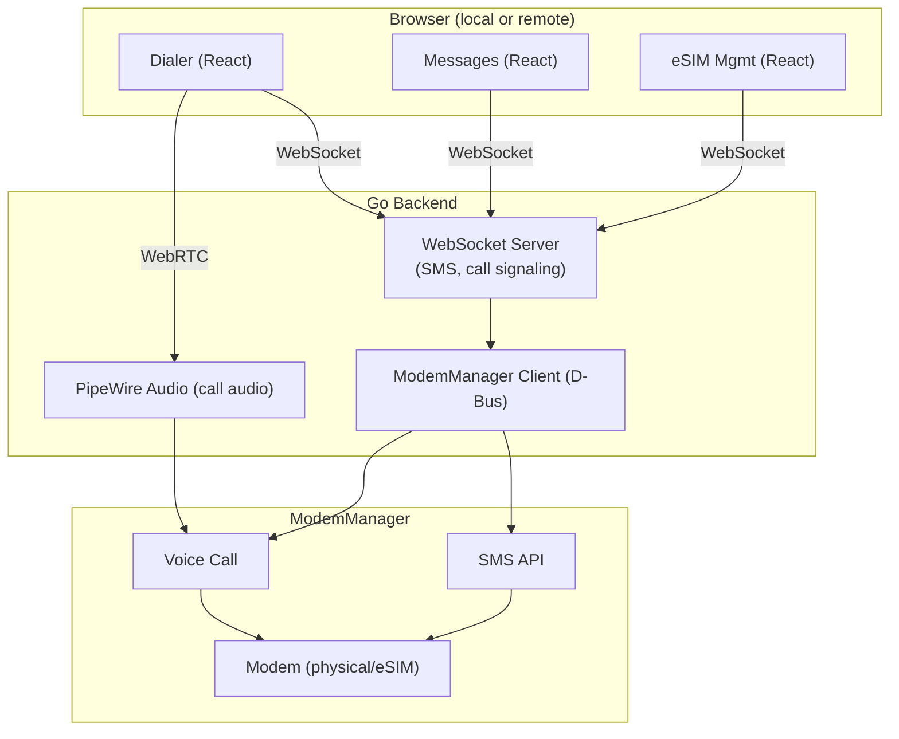

# Telephony — SMS, Calls, eSIM

Go webapp for SMS and voice calls on Linux, with remote streaming support via the existing WebRTC pipeline.

> **Goal.** Treat the modem as another OS service. ModemManager (D-Bus) for SMS + voice + signal, lpac for eSIM management, a `phone` app for Messages + Dialer. Calls hand off to the existing peering audio pipeline where possible.
> **Non-goals.** Becoming a SIP/VoIP provider. Replacing the phone app on Android.
> **Status (corrected 2026-07-23).** Earlier this said "✅ SHIPPED … SMS + voice +
> eSIM backend" — that was **aspirational**: the `phone` app UI existed but pointed
> at a `/api/telephony/*` backend that **did not exist**. Now real:
> **`backend/services/telephony/` (TELE-01)** — an mmcli-based service that is
> hardware-gated and wired into the server. **SMS is fully implemented** (list
> threads, read, send, and an inbound-SMS poll that fires a **sovereign
> notification** + a live WS event). The box's single SIM is treated as the **box
> owner's line**: the whole `/api/telephony/*` surface + the WS feed are
> owner-gated, and the inbound-SMS notification is **targeted to the owner** so it
> web-pushes (reaching a closed app) rather than being an untargeted box-level
> event. Sending quotes/escapes the message text so a crafted body can't inject
> mmcli dictionary keys, and every `mmcli` call has a 5s timeout so a wedged modem
> can't hang the box. **Voice is best-effort** (place/hangup/answer
> via mmcli `--voice-*`, which many data/SMS-only USB modems don't support; the UI
> degrades gracefully) and there is **no persistent call log** (ModemManager keeps
> none). That clause is still exact, but the outstanding list below it had gone
> stale: a **self-maintained call log DOES exist** — `telephony.recordCall` /
> `CallLog()`, with tests — but it is `clog`, an in-memory slice on the service
> struct bounded by `maxCallLog`, written to no file and no store. **It is lost on
> every restart.** So "no persistent call log" stands unchanged, and Recents shows
> calls since the box last booted and nothing older. **eSIM/lpac is NOT built.**
> The `phone` app UI is complete and now has a live backend. Outstanding: voice
> reliability, **persisting** the call log (building one is done), eSIM,
> responsive shell polish (MOBILE-06).

---

## Architecture

---

## Go Backend

Single Go binary, runs as a Vulos service on its own port (DNS-mapped like other Vulos apps).

> **This whole checklist was written before the backend existed and had gone stale in the other direction — checked as built.** Below is verified against `backend/services/telephony/` (`git log`: `a6ab6009` MOBILE-03 voice calls, `dbebd3ed` call log, `288f8f86` contacts merge, `90604a3b` second-number seam, `cfaf7cfe` active-call reporting). It also connects a mismatch the plan didn't anticipate: the checklist assumed a **D-Bus library**; what shipped talks to ModemManager over the **`mmcli` CLI** (shell-out, key-value `-K` output parsed into a flat map — `telephony.go`'s own header explains why: `mmcli -K` output is stable across ModemManager versions, the JSON shape has drifted). The mermaid diagram above still shows "ModemManager Client (D-Bus)"; read that as `mmcli`, not a Go D-Bus binding.

### ModemManager Integration (via `mmcli`, not D-Bus)
- [x] Connect to ModemManager — `mmcliPresent()` / `mmcli()`, `backend/services/telephony/telephony.go`
- [x] Enumerate available modems — `(*Service).modemIndex()`, same file
- [x] SMS: send, receive, list via `mmcli` — `backend/services/telephony/sms.go` (`Send`, `Threads`, `ThreadFor`, `allSMS`, inbound poll). **Delete: not implemented** — no delete function or endpoint exists anywhere in the package
- [x] Voice calls: dial, answer, hang up via `mmcli --voice-*` — `backend/services/telephony/calls.go` (`PlaceCall`, `Accept`, `Hangup`), best-effort per the Status note above (many data/SMS-only USB modems don't support `--voice-*`). **DTMF: not implemented** — no DTMF function, no route, no UI control
- [x] Signal strength, network registration, SIM info — `(*Service).Status()`, `telephony.go`: `signal_quality`, `state`, `operator`, `own-numbers`
- [x] Listen for incoming call/SMS events, push to WebSocket — `calls.go`'s `pollCalls()` broadcasts `call_incoming`/`call_ended`; `sms.go`'s `pollLoop()` broadcasts `sms` and additionally fires a sovereign notification (`onIncomingSMS`) — SMS gets both channels, incoming calls only get the WebSocket one (see the Remote Access correction below)

### WebSocket Server
- [x] Real-time push: incoming SMS, incoming call, call state changes — `ws.go` + the broadcasts above
- [x] Commands from UI: send SMS, dial number, answer/reject/hangup — `backend/services/telephony/handlers.go`: `POST /api/telephony/sms/send`, `/call`, `/call/hangup`, `/call/decline`, `/call/answer`. **Send DTMF: not implemented**, no route exists
- [x] Contact sync — real, and it is a merge, not a stub: `backend/services/contacts/contacts.go` + `backend/cmd/server/routes_contacts.go:48` unify the SIM phonebook (`SIMPhonebook()`, reading `mmcli` `CPBR`) with the Vulos/CardDAV address book (commit `288f8f86`, "contacts: unified address book — merge Vulos/CardDAV + phone device/SIM + box SIM")
- [x] Notification integration with Vulos notification system — inbound SMS fires a sovereign notification through the `Notifier` seam (`services/notify`), targeted to the owner so it web-pushes to a closed app (see the Status note above)

### Call Audio Streaming — NOT BUILT, and this is worse than the doc elsewhere admits
"Uses existing Vulos WebRTC streaming pipeline" below was the plan. **None of it exists.** There is no reference to PipeWire, WebRTC, or an audio codec anywhere in `backend/services/telephony/` or in the phone app's frontend (`frontend/src/builtin/phone/`). What is built is **call CONTROL only** — dial/answer/hangup/status over HTTP + WebSocket (`useCallSession.ts` polls `GET /api/telephony/call/active` and drives `InCallBar.tsx`, which has no mute, speaker, or DTMF control). The call's actual audio path is whatever the GSM modem does with it natively (its own hardware audio jack/path, if the USB stick even has one) — it is **not routed to the browser at all**. This directly contradicts the "Remote Access" section's claim below that voice-call audio is "streamed via WebRTC"; that claim is corrected there.

- [ ] Route modem audio device into PipeWire graph — not built
- [ ] Bidirectional WebRTC audio track for remote call participation — not built
- [ ] Echo cancellation via PipeWire filter node (`webrtc-audio-processing` module) — not built (depends on the above)
- [ ] Opus codec — not built (depends on the above)
- [ ] Mute/unmute, speaker/earpiece toggle from UI — not built; no such control exists in `InCallBar.tsx`

### SMS Storage
- [ ] SQLite database for conversation history — not built. `Threads()` / `ThreadFor()` read live from ModemManager's own on-modem SMS store via `mmcli` on every call; there is no local cache or database
- [x] Thread-based view (grouped by contact) — `groupThreads()` in `sms.go`, computed in-memory per request from the live `mmcli` read above (not a persisted store)
- [ ] Search across messages — not built, no search function or endpoint in `sms.go` or `frontend/src/builtin/phone/MessagesTab.tsx`
- [ ] MMS support via ModemManager (images, group messages) — not built, no MMS reference anywhere in the package
- [ ] Delivery reports — not built

---

## eSIM Management

**Confirmed still entirely unbuilt** — matches the Status note at the top of this doc ("eSIM/lpac is NOT built"). No reference to `lpac`, eSIM, or eUICC exists anywhere in `backend/services/telephony/` or `backend/cmd/server/`. All items below remain accurately unchecked.

### lpac Integration
- [ ] Integrate [lpac](https://github.com/estkme-group/lpac) — open source local profile assistant
- [ ] Profile operations: download, enable, disable, delete
- [ ] QR code scanning for eSIM activation (camera or image upload)
- [ ] Manual activation code entry
- [ ] Display installed profiles, active profile status

### ModemManager eUICC
- [ ] Use ModemManager 1.22+ eUICC API when available
- [ ] Fallback to lpac CLI for older ModemManager versions
- [ ] Carrier profile metadata display (name, icon, data plan info)

### iSIM (Future)
- [ ] Same ModemManager interface — no architectural changes needed
- [ ] Monitor adoption, add when hardware is available

---

## Web UI (React)

Runs in Chromium (via cage) like all Vulos apps. DNS-mapped: `phone.vulos → localhost:<port>`

> **Phone and Contacts merged into one surface.** `frontend/src/builtin/phone/Phone.tsx` is now a re-export of `frontend/src/builtin/contacts/Contacts.tsx`, which imports and composes `RecentsTab`, `Keypad`, and `MessagesTab` from `builtin/phone/` alongside its own `PeopleView`. The Dialer/Messages breakdown below is still accurate as a description of the components, just not as a description of two separate apps — there is one merged surface, and `Phone.tsx`'s own header notes the launcher still has two registry entries (`vulos-contacts` and `vulos-phone` in `frontend/src/core/AppRegistry.ts:307,321` and `frontend/src/shell/builtinApps.tsx:70,73`) pointing at it, called out there as reported-not-fixed rather than this doc's territory.

### Dialer
- [x] Numpad with T9-style layout — `frontend/src/builtin/phone/Keypad.tsx`, letter legends per key
- [x] Contact search / autocomplete — `Keypad.tsx` live-matches typed digits against the merged contact list as you type
- [x] Call history (recent, missed, all) — `frontend/src/builtin/phone/RecentsTab.tsx`
- [ ] In-call screen: mute, speaker, DTMF pad, hold, hangup — **partial.** `InCallBar.tsx` has answer/decline/hangup and a ringing/held state label, but mute, speaker toggle, DTMF pad, and an actual hold *action* are not implemented (no backend call, no route, no button) — `held` in the UI is a display state only
- [ ] Incoming call notification (full screen or banner depending on profile) — **partially built.** `InCallBar.tsx` shows a ringing banner while the app is open (driven by the `call_incoming` WebSocket event) — that half works. What's unchecked: unlike SMS, an incoming call does **not** fire a sovereign/web-push notification, so a closed phone app gives no signal that a call is happening at all, and there is no device-profile-specific behavior (full-screen vs banner) — a gap the Status note at the top of this doc does not currently call out

### Messages
- [x] Conversation thread list — `frontend/src/builtin/phone/MessagesTab.tsx`, grouped via `groupThreads()`
- [x] Message compose with contact picker — `composeTo` prop opens a thread from a selected contact (from the Keypad match or Recents)
- [ ] Image/media attach (MMS) — not built, no MMS anywhere in the package
- [ ] Search across conversations — not built
- [ ] Read receipts / delivery status indicators — not built
- [ ] Group messaging — not built

### eSIM Manager
- [ ] List installed eSIM profiles
- [ ] Activate / deactivate profiles
- [ ] Add new profile via QR scan or activation code
- [ ] Delete profiles
- [ ] Data usage per profile (if carrier provides)

---

## Remote Access

> **Corrected — the voice-call claim below was false.** As §"Call Audio Streaming" above establishes, there is no WebRTC (or any) audio routing anywhere in `backend/services/telephony/` or the phone app frontend. What actually works remotely is **call control** (dial/answer/hangup/status) over the same HTTP+WebSocket API used locally — nothing about it is remote-specific, it just happens to work over a network connection because it was never local-only in the first place. No call audio reaches a remote browser.

When accessing Vulos remotely via browser:

- **SMS** — real. WebSocket + the sovereign notification path, works identically local or remote, text is tiny.
- **Voice calls** — **control only, no audio.** Dial/answer/hangup/status work identically local or remote (same HTTP+WS API), but the call's audio is not streamed anywhere — see the Call Audio Streaming correction above. A user cannot actually hear or speak on a call from a remote browser today.
- **Notifications** — SMS is pushed via the sovereign-notification path and respects the owner gate; it does **not** yet vary by device profile (TV/car/watch-specific behavior below is unverified against this package — see the note under Device Profile Behavior). Incoming calls are WebSocket-only (see the Dialer checklist above) and do not reach a closed remote session at all.

---

## Device Profile Behavior

> **UNVERIFIED against this package.** `backend/services/telephony/` and `frontend/src/builtin/phone/` contain no reference to car/TV/watch profile branching (no `deviceProfile`/`device_profile` check anywhere in either). The shell has a general device-profile concept elsewhere (`frontend/src/core/useSpatialNav.ts`, `frontend/src/core/useDrivingMode.ts`), but nothing in it is wired to telephony. Treat the table below as a design target, not a status claim — it describes no code found.

| Profile | Incoming Call | Incoming SMS | Dialer |
|---------|--------------|-------------|--------|
| **PC/Tablet/Mobile** | Full-screen overlay or banner | Notification + badge on Messages | Full dialer UI |
| **TV** | Banner notification, option to answer on paired device | Banner notification | No dialer (use paired device) |
| **Car** | Voice announcement, one-tap answer | Voice readout via AI, voice reply | Voice-only dialing |
| **Watch** | Vibrate + caller ID, answer/reject | Notification + canned replies | No dialer (use voice or paired device) |

---

## Open Source SMS/Call Apps for Linux (App Store Candidates)

Best lightweight, actively maintained, open source telephony apps:

| App | What | Language | License | Stars | Notes |
|-----|------|----------|---------|-------|-------|
| [Chatty](https://gitlab.gnome.org/World/Chatty) | SMS/MMS + XMPP messaging | C | GPLv3 | GNOME project | Reference only — requires GNOME session services (Folks, gnome-online-accounts), won't run standalone |
| [Plasma Dialer](https://invent.kde.org/plasma-mobile/plasma-dialer) | Voice calls | C++/QML | GPLv2 | KDE project | ModemManager + oFono, lighter than GNOME Calls |
| [Spacebar](https://invent.kde.org/plasma-mobile/spacebar) | SMS/MMS messaging | C++/QML | GPLv2 | KDE project | KDE Plasma Mobile, ModemManager native |
| [Plasma Dialer](https://invent.kde.org/plasma-mobile/plasma-dialer) | Voice calls | C++/QML | GPLv2 | KDE project | KDE Plasma Mobile, ModemManager + oFono |
| [ModemManager](https://gitlab.freedesktop.org/mobile-broadband/ModemManager) | Modem management daemon | C | GPLv2 | freedesktop | The foundation everything above uses |

### Recommendation

**Plasma Dialer + Spacebar** are the best reference implementations:
- Qt/QML, ModemManager + oFono, no full DE required
- Can run standalone under a minimal Wayland compositor

Chatty is useful as **reference code only** — it has hard GNOME session dependencies (Folks, gnome-online-accounts) and won't run without phosh/GNOME.

These won't be installed as apps in Vulos (we're building our own Go webapp), but they serve as:
1. **Reference code** for ModemManager D-Bus API usage
2. **Upstream contributions** — any ModemManager bugs we find, contribute fixes back

---

## TODO Summary

Checked against `backend/services/telephony/` and `frontend/src/builtin/phone/` — see the checklists above for citations.

1. [x] Go backend scaffold — HTTP server, WebSocket, `mmcli` (not D-Bus) connection
2. [x] ModemManager SMS integration — send/receive/list (delete not built)
3. [x] ModemManager voice call integration — dial/answer/hangup (DTMF, hold not built)
4. [ ] SQLite message storage — not built, reads live from ModemManager on every call
5. [x] React UI — messages view
6. [x] React UI — dialer and in-call screen — dialer complete; in-call screen has hangup/answer/decline only, no mute/speaker/DTMF/hold
7. [ ] PipeWire call audio routing — not built
8. [ ] WebRTC bidirectional audio for remote calls — not built (see the Remote Access correction above)
9. [ ] Echo cancellation — not built
10. [ ] lpac eSIM profile management — not built
11. [ ] React UI — eSIM manager — not built
12. [ ] MMS support — not built
13. [x] Notification integration with Vulos notification system — SMS only; incoming calls are WebSocket-only, no sovereign notification
14. [ ] Device profile-aware behavior (car voice, TV banner, etc.) — unverified, no wiring found (see the Device Profile Behavior note above)

---

## Superseded — handset-hardware notes (Vulos-on-a-Linux-phone)

> **This section has been removed as superseded.** It previously analyzed running
> Vulos itself *as the OS on a Linux handset* (PinePhone / Librem 5): libcamera,
> on-device NFC, PinePhone battery-life tuning, on-device GPS/SUPL, Bluetooth
> codecs, biometrics, and SoC display drivers.
>
> That architecture is **ruled out.** The settled model is that the phone is a
> **thin client to the user's box** — an installable PWA first, an APK later —
> *not* a Vulos instance. Handset battery, camera, NFC, biometrics, and radios are
> the stock phone OS's concern, not Vulos's. See
> **[`clients/android/DECISIONS.md`](../clients/android/DECISIONS.md)** (MOB-01…07, phone-as-instance
> ruled out permanently) and **[`clients/android/README.md`](../clients/android/README.md)** for the
> governing decisions.
>
> The **telephony** half of this doc (above) stays valid on a *different* basis:
> the modem is a USB/onboard device on the **box**, exposing the owner's line to
> browsers over the existing pipeline — it is not a phone running Vulos.
>
> *Future ideas (not committed, decoupled from the ruled-out handset-OS framing):*
> QR-code scan-to-pay via a web camera, and a single lightweight push daemon, were
> noted as web-first-friendly directions. They survive only as generic ideas.
