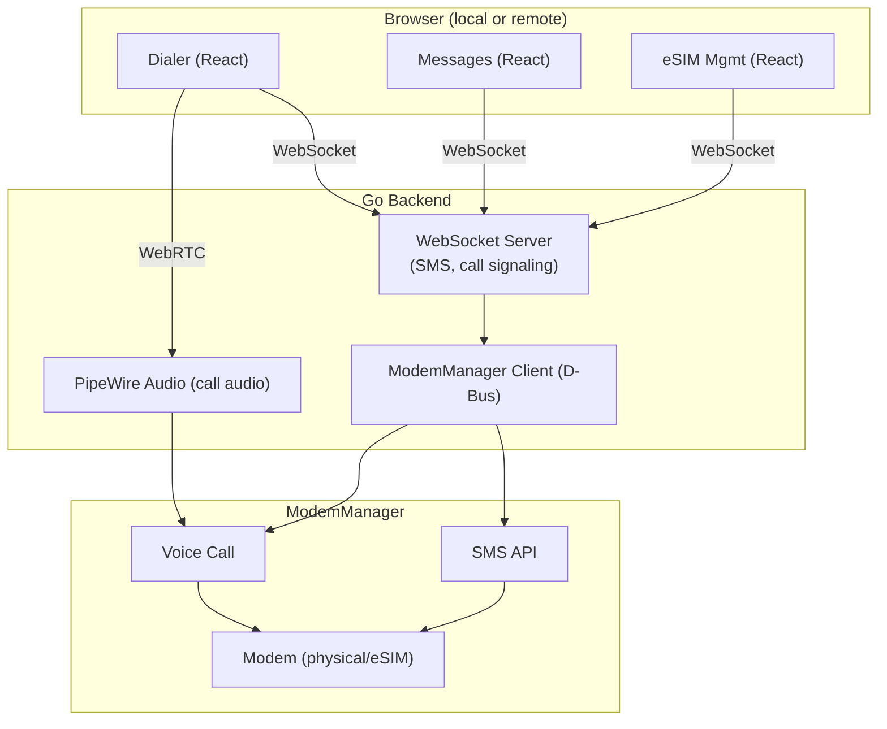

# Telephony — SMS, Calls, eSIM

Go webapp for SMS and voice calls on Linux, with remote streaming support via the existing WebRTC pipeline.

> **Goal.** Treat the modem as another OS service. ModemManager (D-Bus) for SMS + voice + signal, lpac for eSIM management, a `phone` app for Messages + Dialer. Calls hand off to the existing peering audio pipeline where possible.
> **Non-goals.** Becoming a SIP/VoIP provider. Replacing the phone app on Android.
> **Status (corrected 2026-07-23).** Earlier this said "✅ SHIPPED … SMS + voice +
> eSIM backend" — that was **aspirational**: the `phone` app UI existed but pointed
> at a `/api/telephony/*` backend that **did not exist**. Now real:
> **`backend/services/telephony/` (TELE-01)** — an mmcli-based service that is
> hardware-gated and wired into the server. **SMS is fully implemented** (list
> threads, read, send, and an inbound-SMS poll that fires a **sovereign
> notification** + a live WS event). The box's single SIM is treated as the **box
> owner's line**: the whole `/api/telephony/*` surface + the WS feed are
> owner-gated, and the inbound-SMS notification is **targeted to the owner** so it
> web-pushes (reaching a closed app) rather than being an untargeted box-level
> event. Sending quotes/escapes the message text so a crafted body can't inject
> mmcli dictionary keys, and every `mmcli` call has a 5s timeout so a wedged modem
> can't hang the box. **Voice is best-effort** (place/hangup/answer
> via mmcli `--voice-*`, which many data/SMS-only USB modems don't support; the UI
> degrades gracefully) and there is **no persistent call log** (ModemManager keeps
> none). **eSIM/lpac is NOT built.** The `phone` app UI is complete and now has a
> live backend. Outstanding: voice reliability, a self-maintained call log, eSIM,
> responsive shell polish (MOBILE-06).

---

## Architecture

---

## Go Backend

Single Go binary, runs as a Vulos service on its own port (DNS-mapped like other Vulos apps).

### ModemManager D-Bus Integration
- [ ] Connect to ModemManager over D-Bus (`org.freedesktop.ModemManager1`)
- [ ] Enumerate available modems
- [ ] SMS: send, receive, list, delete via `org.freedesktop.ModemManager1.Modem.Messaging`
- [ ] Voice calls: dial, answer, hang up, DTMF via `org.freedesktop.ModemManager1.Modem.Voice`
- [ ] Signal strength, network registration, SIM info
- [ ] Listen for incoming call/SMS events, push to WebSocket

### WebSocket Server
- [ ] Real-time push: incoming SMS, incoming call, call state changes
- [ ] Commands from UI: send SMS, dial number, answer/reject/hangup, send DTMF
- [ ] Contact sync (if contacts service exists)
- [ ] Notification integration with Vulos notification system

### Call Audio Streaming
Uses existing Vulos WebRTC streaming pipeline — no separate system.

- [ ] Route modem audio device into PipeWire graph
- [ ] Bidirectional WebRTC audio track for remote call participation
- [ ] Echo cancellation via PipeWire filter node (`webrtc-audio-processing` module)
- [ ] Opus codec (already used by WebRTC, efficient for voice)
- [ ] Mute/unmute, speaker/earpiece toggle from UI

### SMS Storage
- [ ] SQLite database for conversation history
- [ ] Thread-based view (grouped by contact)
- [ ] Search across messages
- [ ] MMS support via ModemManager (images, group messages)
- [ ] Delivery reports

---

## eSIM Management

### lpac Integration
- [ ] Integrate [lpac](https://github.com/estkme-group/lpac) — open source local profile assistant
- [ ] Profile operations: download, enable, disable, delete
- [ ] QR code scanning for eSIM activation (camera or image upload)
- [ ] Manual activation code entry
- [ ] Display installed profiles, active profile status

### ModemManager eUICC
- [ ] Use ModemManager 1.22+ eUICC API when available
- [ ] Fallback to lpac CLI for older ModemManager versions
- [ ] Carrier profile metadata display (name, icon, data plan info)

### iSIM (Future)
- [ ] Same ModemManager interface — no architectural changes needed
- [ ] Monitor adoption, add when hardware is available

---

## Web UI (React)

Runs in WPE WebKit like all Vulos apps. DNS-mapped: `phone.vulos → localhost:<port>`

### Dialer
- [ ] Numpad with T9-style layout
- [ ] Contact search / autocomplete
- [ ] Call history (recent, missed, all)
- [ ] In-call screen: mute, speaker, DTMF pad, hold, hangup
- [ ] Incoming call notification (full screen or banner depending on profile)

### Messages
- [ ] Conversation thread list
- [ ] Message compose with contact picker
- [ ] Image/media attach (MMS)
- [ ] Search across conversations
- [ ] Read receipts / delivery status indicators
- [ ] Group messaging

### eSIM Manager
- [ ] List installed eSIM profiles
- [ ] Activate / deactivate profiles
- [ ] Add new profile via QR scan or activation code
- [ ] Delete profiles
- [ ] Data usage per profile (if carrier provides)

---

## Remote Access

When accessing Vulos remotely via browser, SMS and calls work seamlessly:

- **SMS** — WebSocket, works identically local or remote, text is tiny
- **Voice calls** — audio streamed via WebRTC (same pipeline as app streaming), user can take calls from any device with a browser
- **Notifications** — incoming call/SMS pushed to remote session, respects device profile (TV shows banner, car uses voice announcement)

---

## Device Profile Behavior

| Profile | Incoming Call | Incoming SMS | Dialer |
|---------|--------------|-------------|--------|
| **PC/Tablet/Mobile** | Full-screen overlay or banner | Notification + badge on Messages | Full dialer UI |
| **TV** | Banner notification, option to answer on paired device | Banner notification | No dialer (use paired device) |
| **Car** | Voice announcement, one-tap answer | Voice readout via AI, voice reply | Voice-only dialing |
| **Watch** | Vibrate + caller ID, answer/reject | Notification + canned replies | No dialer (use voice or paired device) |

---

## Open Source SMS/Call Apps for Linux (App Store Candidates)

Best lightweight, actively maintained, open source telephony apps:

| App | What | Language | License | Stars | Notes |
|-----|------|----------|---------|-------|-------|
| [Chatty](https://gitlab.gnome.org/World/Chatty) | SMS/MMS + XMPP messaging | C | GPLv3 | GNOME project | Reference only — requires GNOME session services (Folks, gnome-online-accounts), won't run standalone |
| [Plasma Dialer](https://invent.kde.org/plasma-mobile/plasma-dialer) | Voice calls | C++/QML | GPLv2 | KDE project | ModemManager + oFono, lighter than GNOME Calls |
| [Spacebar](https://invent.kde.org/plasma-mobile/spacebar) | SMS/MMS messaging | C++/QML | GPLv2 | KDE project | KDE Plasma Mobile, ModemManager native |
| [Plasma Dialer](https://invent.kde.org/plasma-mobile/plasma-dialer) | Voice calls | C++/QML | GPLv2 | KDE project | KDE Plasma Mobile, ModemManager + oFono |
| [ModemManager](https://gitlab.freedesktop.org/mobile-broadband/ModemManager) | Modem management daemon | C | GPLv2 | freedesktop | The foundation everything above uses |

### Recommendation

**Plasma Dialer + Spacebar** are the best reference implementations:
- Qt/QML, ModemManager + oFono, no full DE required
- Can run standalone under a minimal Wayland compositor

Chatty is useful as **reference code only** — it has hard GNOME session dependencies (Folks, gnome-online-accounts) and won't run without phosh/GNOME.

These won't be installed as apps in Vulos (we're building our own Go webapp), but they serve as:
1. **Reference code** for ModemManager D-Bus API usage
2. **Upstream contributions** — any ModemManager bugs we find, contribute fixes back

---

## TODO Summary

1. [ ] Go backend scaffold — HTTP server, WebSocket, D-Bus connection
2. [ ] ModemManager SMS integration — send/receive/list
3. [ ] ModemManager voice call integration — dial/answer/hangup
4. [ ] SQLite message storage
5. [ ] React UI — messages view
6. [ ] React UI — dialer and in-call screen
7. [ ] PipeWire call audio routing
8. [ ] WebRTC bidirectional audio for remote calls
9. [ ] Echo cancellation
10. [ ] lpac eSIM profile management
11. [ ] React UI — eSIM manager
12. [ ] MMS support
13. [ ] Notification integration with Vulos notification system
14. [ ] Device profile-aware behavior (car voice, TV banner, etc.)

---

## Camera

libcamera is the modern camera stack replacing V4L2, supporting mobile SoC ISPs (Qualcomm, MediaTek, Rockchip).

**Current state:**
- Working on a handful of devices (PinePhone, Librem 5, some Qualcomm phones)
- Megapixels (GTK camera app) works but quality lags behind Android — auto-exposure, HDR immature
- WebRTC camera access from browsers works where libcamera works
- Each SoC needs specific libcamera pipeline support, most aren't upstreamed

**For Vulos:**
- Web-first approach means camera access via WebRTC/getUserMedia — works where libcamera works
- Target devices with upstream libcamera support
- Camera quality will improve as libcamera matures

---

## NFC

**Status: deprioritized.**

NFC on mobile Linux is nearly nonfunctional:
- PinePhone and Librem 5 have no NFC hardware
- Android phones running postmarketOS can't use NFC — requires proprietary firmware/HAL blobs
- libnfc and nfcd exist but device support is thin
- neard (BlueZ NFC daemon) is mostly abandoned
- Sailfish OS on Xperia 10 series is the only Linux-adjacent platform with basic NFC tag read/write

**NFC payments are gated by institutional trust, not technology:**
- EMVCo certification costs millions, takes years
- Secure element keys are provisioned by OEM for Android/iOS specifically
- No bank will trust an open-source TEE (OP-TEE) without certification
- HCE (Host Card Emulation) requires Google Play Services

**Where NFC still matters:**
- Transit cards (bus/metro tap) — big in Asia, Europe
- Access control (office badges, hotel keys, car keys)
- Identity (ePassports, national ID)
- Quick device pairing

**Where NFC is losing:**
- Payments — QR codes proved you don't need it (China, India)
- Data transfer — WiFi Direct won (AirDrop, Nearby Share)
- Smart home — BLE and WiFi won
- Ticketing — moving to QR codes

**Decision: focus on camera (QR payments/scanning) and BLE (device pairing) instead. Covers 95% of real use cases.**

---

## Payments

QR-code scan-to-pay dominates in China (Alipay, WeChat Pay) and India (UPI), proving NFC is unnecessary for mobile payments.

**QR payments require only:**
- A camera (improving via libcamera)
- A web browser
- Internet connection

No secure element, no NFC chip, no bank certification, no proprietary firmware. A web app on Vulos can integrate with QR payment systems. This is the path forward.

---

## Battery Life

Battery life is a critical gap. PinePhone gets 4-6 hours vs 1-2 days on Android.

### Strategy: aggressive suspend + app freezing

### Key optimizations

| Layer | What | Effort |
|-------|------|--------|
| Userspace | Autosuspend policy, app freezing, service stripping, push daemon | Fully in our control |
| Userspace | Display timeout, dark themes, radio power toggling | Easy |
| System | CPU governor tuning (powersave default), cgroup freezer | Moderate |
| Kernel/firmware | Proper S3 suspend, modem wake, WiFi power save | Device-specific, harder |

### Why web-first helps

Web apps can't hold wakelocks, can't run background services, can't drain battery behind our back. We control the runtime entirely — genuine advantage over Android where apps constantly fight to stay alive.

---

## GPS / Location

- Works but slow to get a fix — no SUPL (assisted GPS) since it phones home to Google
- No indoor positioning (WiFi/BLE triangulation) like Android/iOS
- Web geolocation API depends on the underlying stack
- Need an open SUPL alternative or local AGPS data cache

---

## Push Notifications

- No unified push notification system on Linux (UnifiedPush exists but barely adopted)
- Apps can't reliably wake the device or receive pushes while suspended
- Breaks messaging, email, delivery alerts — everything users expect

**Solution:** single lightweight push daemon that stays alive during suspend, receives notifications over a persistent connection, wakes device only when needed. Web-first means we control the notification pipeline end-to-end.

---

## Bluetooth

- Basic audio works (A2DP)
- BLE is functional but flaky on some devices
- No codec parity (no aptX, LDAC is partial)
- Bluetooth calling (HFP) is hit or miss
- Improvements are upstream kernel work

---

## Biometrics

- No fingerprint reader support on basically any Linux phone
- No face unlock
- Hardware dependent — low priority until device targets are chosen

---

## Display / Graphics

- GPU drivers are SoC-dependent — Qualcomm is worst (freedreno improving but slow)
- Screen rotation, scaling, touch responsiveness all worse than Android
- Compositor should use damage tracking — only redraw what changed, reduce wake-ups when static

---

## Priority Matrix

| Issue | Severity | Solvable by us? |
|-------|----------|-----------------|
| Battery life | Critical | Partially (software optimization) |
| VoLTE | Critical | Hard — carrier dependent |
| Push notifications | Critical | Yes — custom push daemon |
| App ecosystem | Critical | Yes — web-first is the answer |
| Camera | Medium | Improving via libcamera |
| GPS speed | Medium | Open SUPL alternative needed |
| Bluetooth codecs | Low | Upstream kernel work |
| NFC | Low | Deprioritized — QR/BLE instead |
| Biometrics | Low | Hardware dependent |
