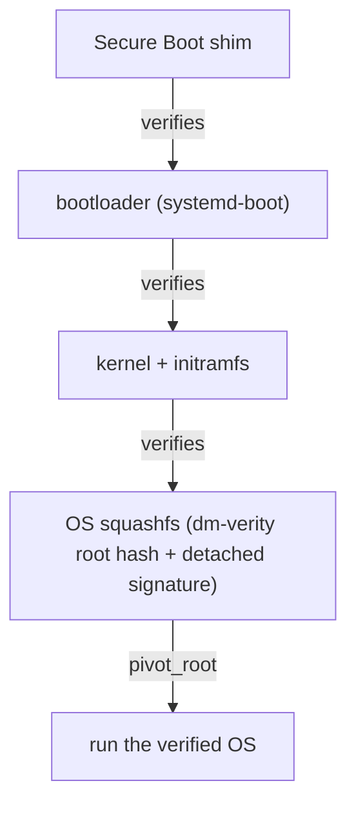
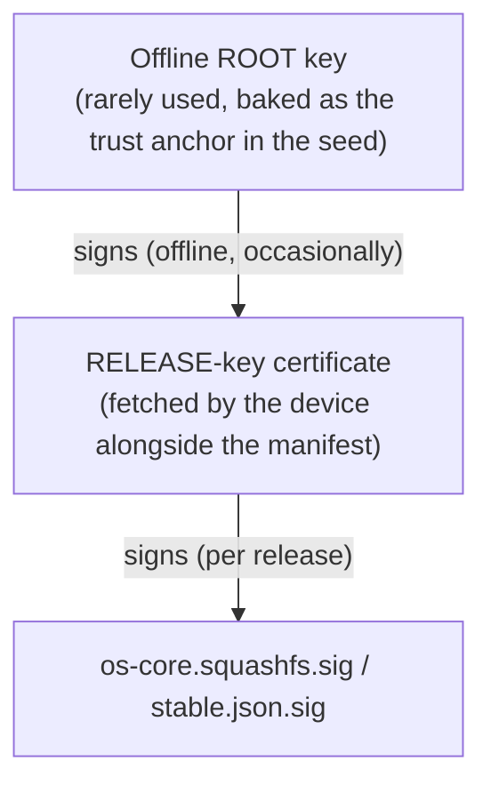

# Signing, Verity & Key Rotation

The integrity backbone for the whole image-distribution model: **dm-verity** on the OS squashfs, **signature verification at every boot stage**, **offline (air-gapped) signing** with a root-signs-intermediate PKI, and **key rotation + revocation via a single monotonic "minimum trusted epoch"** — no CRL, no clock dependence. All in **Go**.

For the public bucket + A/B updates see OS-DISTRIBUTION.md. For the baked trust anchor + forkability see SEED-TRUST.md. For the boot pipe's TLS layer see NETBOOT.md.

> **Goal.** Make it cryptographically impossible to run an OS image our (or a forker's) release key didn't sign, prove integrity continuously at runtime (verity), keep the signing key offline, and rotate/revoke keys with a single number that also gives free rollback/downgrade protection.
> **Non-goals.** Online signing services / network-reachable signing keys. Certificate Revocation Lists or OCSP (clock- and network-dependent). Any reliance on the device clock for trust decisions. Rust — the verify/boot slice stays **Go** (decisions.md J).
> **Status.** ✅ SHIPPED (signing + VERITY-02 boot verification). Ed25519 offline PKI, `imgverify` boot-stage signature check, `scripts/verity/gen-verity.sh` hash-tree generation, and the monotonic minimum-trusted-epoch rollback guard are all implemented. `scripts/initramfs/vulos-live` calls `veritysetup open` to activate the dm-verity device-mapper target before mounting the squashfs lower layer (M3). **NOTE:** runtime dm-verity device-mapper activation (the kernel actually verifying every 4 KiB block on read during normal operation) still requires the hash tree and root hash to be present on the data partition at boot — this is generated by `build.sh --live` and wired in CI but has not been end-to-end smoke-tested on bare metal. The TPM-sealed epoch counter is implemented in software-sealed mode; TPM-hardware mode remains design.

---

## Boot-Chain Verification

Every stage verifies the next before executing it — an unbroken chain rooted in the baked trust anchor (SEED-TRUST.md):

- **dm-verity** sits under the squashfs: the initramfs calls `veritysetup open <squashfs> vulos-root <hashtree> <roothash>` and mounts `/dev/mapper/vulos-root` as the overlayfs lower layer, so every 4096-byte block is verified by the kernel's dm-verity driver on read at runtime. The companion `os-core.hashtree` and `os-core.roothash` files must be present on the data partition (generated by `scripts/verity/gen-verity.sh` during the build). The verity **root hash** is the image's content identity and is what `stable.json` pins (OS-DISTRIBUTION.md).
- At each stage the **signature** over the next artifact is checked against the release key (which the root key authorizes — see PKI below). A broken signature or a verity hash mismatch halts the boot / refuses the update.

---

## Offline Signing & Root-Signs-Intermediate PKI

The signing key is **offline** — air-gapped, ideally in an HSM. To avoid ever bringing the root key online for routine releases, we use a two-level PKI:

- The **root key** is the baked anchor (SEED-TRUST.md). It is used **rarely** — only to issue/rotate a release-key certificate.
- The **release key** does the per-image signing. Its certificate is **root-signed** and fetched by the device; the device validates the cert against the baked root before trusting any image the release key signed.
- Compromise of the release key is recoverable by rotating it (issue a new root-signed cert) and bumping the epoch — without re-flashing the baked root.

A forker generates their own offline root, issues their own release cert, and signs their own images (SEED-TRUST.md).

---

## Rotation & Revocation: the Minimum Trusted Epoch

Instead of CRLs or OCSP, trust is governed by a single **monotonically increasing integer** — the **minimum trusted epoch** — carried in the **root-signed** manifest (`min_epoch` in `stable.json`, OS-DISTRIBUTION.md):

- Each device **stores the highest epoch it has ever seen** and **refuses anything with a lower epoch**.
- **Rotation / revocation:** to retire a compromised release key (or a bad release), the root signs a new manifest with a higher `min_epoch`. Once a device sees it, it will never again accept the old key/release — the old epoch is permanently below its floor.
- **Rollback / downgrade protection comes for free:** the same "never go below the highest epoch seen" rule means an attacker can't feed a device an older, vulnerable signed image.

Properties:
- **No CRL / no OCSP** — nothing to distribute, fetch, or keep fresh.
- **No clock dependence** — the decision is "is this epoch ≥ my floor", a pure monotonic comparison, not "is this cert expired".
- **Cheap and offline-safe** — one integer, root-signed.

### Where the counter lives

The highest-seen epoch must be **tamper-resistant and monotonic** on the device:

- **TPM where available** — sealed/monotonic counter in the TPM (ties into the existing devicekey/TPM keystore, AUTHENTICATION.md).
- **Sealed file otherwise** — a sealed on-disk counter when no TPM is present. Lower assurance than TPM but still enforces the monotonic floor for the common case.

---

## Language

Per decisions.md J, the entire boot/verification slice — verity hashing, signature checks, PKI tooling, epoch counter — is **Go**, consistent with the rest of the OS (CGO-free where it touches SQLite, per the modernc rule in CLUSTER.md/decisions.md D23). We do **not** introduce Rust for this slice.

## Relationship to TLS

The signature chain is the **primary** defense, not TLS. UEFI HTTP Boot is plain HTTP on most consumer hardware; signing is what makes that safe. TLS (iPXE-on-stick, server-class UEFI HTTPS Boot) is opportunistic — used where supported, never required. See roadmap/NETBOOT.md § Plain-HTTP safety model.
