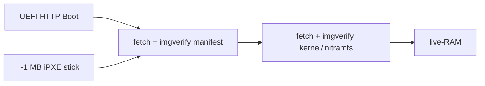

# Netboot — iPXE stick + UEFI HTTP Boot (NETB-01/NETB-02)

Two entry paths both converge on the same signed-payload boot chain: fetch
signature-verified kernel + initramfs + squashfs over the network and boot
into a live-RAM session.



See [roadmap/NETBOOT.md](../../roadmap/NETBOOT.md) for the full boot pipeline,
install flow, and plain-HTTP safety model.

For the Secure Boot shim signing path see [SHIM-SIGNING.md](./SHIM-SIGNING.md).

---

## Files

| File | Purpose |
|---|---|
| `boot.ipxe` | iPXE script — DHCP + fetch/imgverify manifest + fetch/imgverify each artifact |
| `build-ipxe-stick.sh` | Builds the ~1 MB USB stick with `IMAGE_TRUST_CMD=1` + baked trust anchor |
| `SHIM-SIGNING.md` | Secure Boot shim signing plan (Microsoft UEFI CA + self-enrolled key) |
| `README.md` | This file |

---

## Path 1: ~1 MB one-time iPXE USB stick

### What it does

1. Machine powers on, firmware finds the USB stick.
2. iPXE runs `boot.ipxe`:
   - DHCP lease
   - Tries `https://boot.vulos.org/boot.ipxe` (iPXE TLS — opportunistic)
   - Falls back to `http://boot.vulos.org/boot.ipxe` on TLS failure
3. Remote script serves the kernel + initramfs + squashfs for the live-RAM session.
4. User clicks **Install** to write the seed to local disk.
5. The stick is never needed again — steady-state boots are local.

### Build the stick image

```sh
# From the repo root — calls the build-ipxe-stick.sh helper:
./build.sh --netboot-stick

# Or directly:
scripts/netboot/build-ipxe-stick.sh [--outdir output/]
```

**Output:** `output/vulos-netboot-stick.img` (~1 MB)

### Flash

```sh
dd if=output/vulos-netboot-stick.img of=/dev/sdX bs=512 status=progress
```

### Toolchain (iPXE build dependencies)

The build script tool-guards the iPXE toolchain. When the toolchain is absent
it prints the manual `make` commands and exits without error.

Install on Debian/Ubuntu:

```sh
apt-get install make gcc binutils liblzma-dev perl mtools xz-utils
```

Manual build (equivalent to what the script does):

```sh
git clone --depth=1 https://github.com/ipxe/ipxe.git /tmp/ipxe
cd /tmp/ipxe/src

# Legacy BIOS USB stick (~1 MB) with imgverify + trust anchor:
make bin/ipxe.usb \
  EMBED=/path/to/scripts/netboot/boot.ipxe \
  IMAGE_TRUST_CMD=1 \
  DOWNLOAD_PROTO_HTTPS=1 \
  TRUST=/path/to/keys/trust-anchor.pub

# UEFI USB stick (x86_64):
make bin-x86_64-efi/ipxe.usb \
  EMBED=/path/to/scripts/netboot/boot.ipxe \
  IMAGE_TRUST_CMD=1 \
  DOWNLOAD_PROTO_HTTPS=1 \
  TRUST=/path/to/keys/trust-anchor.pub

cp bin/ipxe.usb output/vulos-netboot-stick.img
```

Set `VULOS_IPXE_SRC=/path/to/ipxe/src` to use an existing source tree instead
of letting the script clone a fresh copy.

#### iPXE make flags (NETB-02)

| Flag | Value | Purpose |
|------|-------|---------|
| `EMBED` | path to `boot.ipxe` | Embed the Vulos boot script as the built-in script |
| `IMAGE_TRUST_CMD` | `1` | Compile in the `imgverify` command |
| `DOWNLOAD_PROTO_HTTPS` | `1` | Enable HTTPS download support (opportunistic TLS) |
| `TRUST` | path to `trust-anchor.pub` | Bake the trust-anchor public key so `imgverify` can authenticate artifacts |

Without `TRUST`, `imgverify` falls back to iPXE's built-in CA bundle; production
builds **must** embed the Vulos trust anchor.

---

## Path 2: UEFI HTTP Boot (no media)

Modern UEFI firmware (UEFI 2.5+, OVMF, most Intel/AMD boards since ~2018) can
boot directly from an HTTP URL without any USB stick.

### URL to configure

```
http://boot.vulos.org/boot.ipxe
```

**Why plain HTTP?** UEFI HTTP Boot implementations vary in their HTTPS/TLS
support. Plain HTTP ensures broad compatibility. Security is not provided by
the transport — it is provided by **artifact signatures** (see below).

### How to set the UEFI HTTP Boot URL

**System firmware (BIOS setup):**

1. Enter BIOS/UEFI setup (usually F2, F10, Del, or Esc at POST).
2. Navigate to: *Boot → Add Boot Option* (name varies by vendor).
3. Select **HTTP** as the boot type.
4. Enter the URL: `http://boot.vulos.org/boot.ipxe`
5. Save and reboot.

**UEFI shell:**

```
BcfgAdd boot 0 http://boot.vulos.org/boot.ipxe "Vulos OS Netboot"
```

**EDK2 / OVMF (QEMU):**

```sh
qemu-system-x86_64 \
  -bios /usr/share/ovmf/OVMF.fd \
  -netdev user,id=net0,tftp=…,bootfile=http://boot.vulos.org/boot.ipxe \
  -device virtio-net-pci,netdev=net0
```

### What happens

1. Firmware performs DHCP.
2. Firmware fetches `http://boot.vulos.org/boot.ipxe` as a UEFI HTTP Boot
   image (EFI application or iPXE binary served with the appropriate MIME type).
3. iPXE / the boot script serves kernel + initramfs + squashfs.
4. Live-RAM session starts; user can install.

---

## Security model

Both paths share the same plain-HTTP safety design (roadmap/NETBOOT.md
§"Plain-HTTP safety model"):

| Layer | Protects | Mechanism |
|---|---|---|
| **Artifact signatures** | payload integrity (tampered images) | every fetched artifact is `imgverify`-checked against the baked trust anchor before execution |
| **TLS (opportunistic)** | transport confidentiality / MITM | iPXE TLS used when available; plain HTTP accepted when not |

Plain HTTP is acceptable **only because** every artifact is signature-verified
before execution — a compromised CDN or MITM attacker cannot cause unsigned
code to execute.

### Signed-payload verification (NETB-02)

`imgverify` is an iPXE built-in command that verifies a fetched image against
a detached signature before the image is executed or handed off to the kernel.

**How it works:**

1. `imgfetch --name <name> <url>` downloads the artifact and registers it in
   iPXE's image table under `<name>`.
2. `imgverify <name> <sig-url>` downloads the detached `.sig` file and verifies
   the signature against the trust-anchor public key **baked into the iPXE
   binary** at build time (`TRUST=keys/trust-anchor.pub`).
3. On signature mismatch the `imgverify` command returns a non-zero exit code
   and the boot script halts (`:sig_failed` label → `shell`). **Fail closed.**
4. On success the image is handed to `kernel` / `boot` normally.

**Trust anchor:**

The trust-anchor public key is compiled into the binary via the `TRUST` make
flag. This is a PEM-encoded RSA-2048 or EC key. The Vulos trust anchor is the
same key used by SIGN-01/SIGN-02 (`backend/services/signing/`); the Go side
produces `.sig` files via `signing.MarshalSig` and iPXE verifies them via
`imgverify`.

**Artifact coverage:**

| Artifact | Fetched as | Verified before |
|----------|-----------|-----------------|
| `boot-pipe.json` | `imgfetch --name manifest` | parsing the artifact list |
| `kernel` | `kernel --name vulos-kernel` | `boot` |
| `initramfs.img` | `initrd --name vulos-initramfs` | `boot` |

**What an attacker without TLS can / cannot do:**

- *Can:* observe artifact URLs (they are public), inject bytes into the
  transport stream.
- *Cannot:* cause arbitrary code execution — injected bytes fail `imgverify`
  and the boot script halts.

### Trust-anchor pubkey

The `trust-anchor.pub` file must be in the format expected by iPXE's cross-signing
mechanism (PEM-encoded RSA-2048 or EC key). This is separate from the raw
32-byte Ed25519 key format used by `backend/services/signing/` (SIGN-01).
In production, the release pipeline:

1. Generates an Ed25519 key pair for the Vulos trust anchor (offline/HSM).
2. Wraps the public key in a self-signed X.509 certificate for iPXE.
3. Provides the certificate PEM as `keys/trust-anchor.pub` (or via
   `VULOS_TRUST_ANCHOR_PUBKEY`).
4. Signs `boot-pipe.json` + each artifact with the matching private key.

The Go signing helpers (`signing.Sign`, `signing.MarshalSig`) produce the
`.sig` files; iPXE's `imgverify` consumes them.

See [SHIM-SIGNING.md](./SHIM-SIGNING.md) for the Secure Boot shim signing path.

---

## Self-hosted boot server

The boot base URL is configurable. Any server that serves the signed artifacts
works — `boot.vulos.org` is the project default, not a requirement.

```sh
# Override at boot.ipxe build time — edit boot.ipxe before embedding:
set BOOT_BASE_HTTPS https://boot.my-fork.example.com
set BOOT_BASE_HTTP  http://boot.my-fork.example.com
```

The server must serve:

| Path | Content |
|------|---------|
| `/boot-pipe.json` | Boot-pipe manifest (JSON, see `backend/services/osdist/bootpipe.go`) |
| `/boot-pipe.json.sig` | Detached Ed25519 signature over the manifest |
| `/v<N>/kernel` | Linux kernel |
| `/v<N>/kernel.sig` | Detached signature |
| `/v<N>/initramfs.img` | initramfs cpio archive |
| `/v<N>/initramfs.img.sig` | Detached signature |

The trust anchor baked into the image (SEED-01) must match the signing key
used to sign the artifacts on your server. See [roadmap/SEED-TRUST.md](../../roadmap/SEED-TRUST.md)
for the fork procedure.
